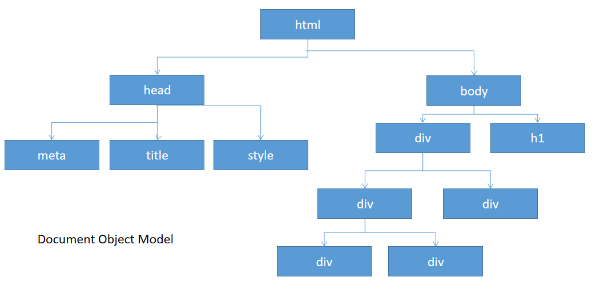
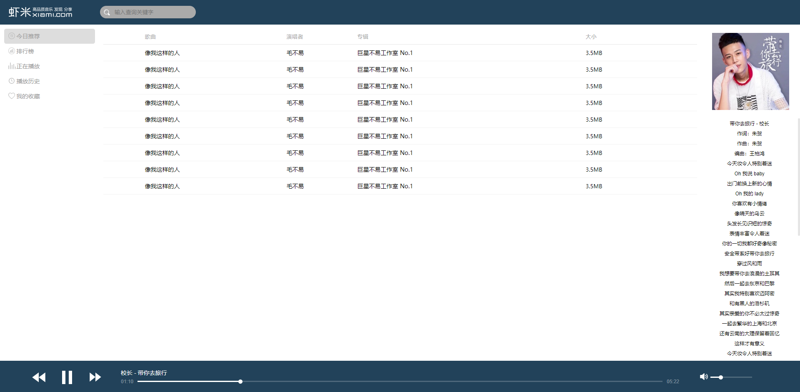

# 03 - JavaScript（三） :rosette:

[[TOC]]

## 全局函数

javascript 提供了一些常见的全局函数，大多数用实现数据转换的功能：

- parseInt():将 string 类型转换为 number 类型（只会取整数）
- parseFloat():将 string 类型转换为 number 类型（会保留小数点）
- eval():可以将字符串作为 js 代码进行执行 <kbd>永远不要使用 `eval`！</kbd>
- encodeURI():将 string 类型数据转码为 url 编码
- decodeURI():将 url 编码的字符串解码为原始字符串值
- Number():将任意类型转换为 number
- String():将任意类型转换为 string

```javascript
var s = '123456'
console.log(typeof s)

//将字符串类型转换为number
s = parseInt(s)
console.log(s, typeof s)

//将字符串类型转换为number
s = parseFloat(s)
console.log(s, typeof s)

s = '3 + 2'
console.log(s)
//eval可以将字符串转换为可执行的js代码（非常危险，避免使用）
console.log(eval(s))

//
s = 'http://www.softeem.top/query?str=白日依山尽，黄河入海流&id=100'
//将目标字符串转码为URL编码（对于特殊符号和中文进行转码）
//http://www.softeem.top/query?str=%E7%99%BD%E6%97%A5%E4%BE%9D%E5%B1%B1%E5%B0%BD%EF%BC%8C%E9%BB%84%E6%B2%B3%E5%85%A5%E6%B5%B7%E6%B5%81&id=100
s = encodeURI(s)
console.log(s)

//解码
//http://www.softeem.top/query?str=白日依山尽，黄河入海流&id=100
s = decodeURI(s)
console.log(s)

//将任意类型数据转换为number
s = Number(true) // 1
s = Number(null) // 0
s = Number(undefined) // NaN(not a number)
s = Number('123') // 123
console.log(s)

//将任意类型数据转换为String
s = String(true) // "true"
s = String(undefined) // "undefined"
console.log(typeof s) // string
```

## 常见内置对象

#### Number

JavaScript 的 **Number** 对象是经过封装的能让你处理数字值的对象。`Number` 对象的创建方式分为两种：

1. 使用 Number 构造器创建

   ```javascript
   var num = new Number('100')
   ```

2. 使用 Number 的工厂方法创建

   ```javascript
   var num = Number('100')
   ```

   > 关于工厂方法原理如下：
   >
   > ```javascript
   > function User(id, name, pwd) {
   >   var u = {
   >     id: id,
   >     name: name,
   >     pwd: pwd
   >   }
   >   return u
   > }
   > var u = User(1, 'softeem', '123')
   > ```

使用示例:

```javascript
//工厂模式
// var n2 = Number();
var n = new Number(undefined)
console.log(typeof n)
console.log(n instanceof Number)
console.log(Number.MAX_VALUE)
console.log(Number.isNaN(NaN))

var i = 3.1415926
//保留指定number类型的小数点后2位
console.log(i.toFixed(2))
//最多截取小数点后三位并转换为string
console.log(typeof i.toLocaleString(i))
```

#### String

类似 java 中 String，javascript 的 String 类型也用于表示字符串，区别在于 js 中的 String 既可以表示字符串还可以表示字符，内部包含的一些方法与 java 中 String 类的方法基本一致，String 对象的创建同 number 一样也包含两种创建方式：

1. 构造器创建
2. 工厂方法创建

```javascript
var s = new String('softeem')
console.log('字符串长度:' + s.length)
//使用指定的html标签对字符串内容包裹
console.log(s.big()) // <big>softeem</big>
console.log(s.bold()) // <b>softeem</b>
console.log(s.link('http://www.softeem.top')) //<a href="http://www.softeem.top">softeem</a>

//es6特性
s = `hasdfasdfa
sdfasdfasd
fasdfas
dfaasdf`

console.log('13267890532'.match(/1[3578]\d{9}/)) //使用字符串匹配对应的正则表达式，匹配结果为数组对象(Js中正则表达式需要需要用/包裹起来）

console.log(/1[3578]\d{9}/.test('13567089876')) //使用指定的正则表达式判断是否匹配给定的字符串(Js中正则表达式需要需要用/包裹起来）

console.log('ab,cd,ef'.split(',')) //使用给定正则表达式截取位数组

console.log('a.txt'.endsWith('.txt')) //判断是否以指定后缀结束

console.log('      abc  '.trim()) //去除前后空格
console.log('     abc     '.trimLeft()) //去除前面的空格
console.log('     abc     '.trimRight()) //去除后面的空格
```

### Array

Array 是 js 中的数组对象，创建方式包含以下：

```javascript
//构造空数组对象
var a1 = []
var a2 = new Array()
```

案例:

```javascript
var arr = [6, 7, 4, 3, 5, 2, 1, 9, 8, 10]
console.log(arr[0])

//向数组中添加元素（末尾）
arr.push(8)
//获取数组长度
console.log(arr.length) // 11

//箭头函数（lammda表达式:ES6）
arr.forEach((item, index) => {
  console.log(item, index)
})

/**
 * item: 当前遍历到的元素对象
 * index：当前元素的索引
 * array：目标数组对象
 */
arr.forEach(function (item, index, array) {
  console.log(item, index, array)
})

//排序:自己实现排序规则，等同java中集合排序中Comparator比较器
arr.sort((a, b) => b - a)
console.log(arr) // [10, 9, 8, 8, 7, 6, 5, 4, 3, 2, 1]

//数组反转
arr.reverse()
console.log(arr) //[1, 2, 3, 4, 5, 6, 7, 8, 8, 9, 10]
//弹出数组的末尾元素，并从数组中移除
console.log(arr.pop()) //10
console.log(arr) //[1, 2, 3, 4, 5, 6, 7, 8, 8, 9]

//向数组头部插入元素
arr.unshift('100')
console.log(arr) // ["100", 1, 2, 3, 4, 5, 6, 7, 8, 8, 9]

//取出数组头部的元素
console.log(arr.shift())
console.log(arr) // [1, 2, 3, 4, 5, 6, 7, 8, 8, 9]

//获取指定元素的索引
let index = arr.indexOf(7)
console.log(index) // 6

//删除指定索引的元素 参数一:索引  参数二：删除的元素个数
arr.splice(index, 1)
console.log(arr) //[1, 2, 3, 4, 5, 6, 8, 8, 9]

//使用指定的符号对数组中的元素进行拼接，转换成string
let s = arr.join(',')
console.log(s) // 1,2,3,4,5,6,8,8,9

/*
        有数组 ["jackson","rose","tom","lily","adom","bob","chrise"]
        要求按照英文字母顺序排序输出
     */

var names = ['jackson', 'rose', 'tom', 'lily', 'adom', 'bob', 'chrise']
// names.sort((a,b)=>a.localeCompare(b));
names.sort()
console.log(names)
```

#### Math

Math 对象类似 java 中 Math 类，js 中的 Math 不能通过传统的方式(构造器，工厂)创建对象，内部的所有方法可以直接通过 Math 调用，不需要实例对象调用（类似 java 中静态方法）

```javascript
//从传入的参数中返回最大的一个元素
console.log(Math.max(10, 20, 40, 50, 33, 22, 12, 9))

//返回从0.0~1.0之间的随机浮点数
console.log(Math.random())

//返回5~10之间的整数？
var n = parseInt(Math.random() * 6) + 5
console.log(n)

//四舍五入取整
console.log(Math.round(4.46))

//输出指定数的n次幂
console.log(Math.pow(3, 3))

//向下取整
console.log(Math.floor(3.999))

//向下取整
console.log(Math.ceil(3.00001))
```

#### Date

```javascript
let date = new Date()
console.log(typeof date) //object

//获取日期对象的毫秒数表示方式
let time = Date.now()
console.log(typeof time) //number

console.log(DateFormater(date))
//yyyy-MM-dd HH:mm:ss

//日期格式化函数
function DateFormater(date) {
  let y = date.getFullYear()
  let m = date.getMonth() + 1
  m = m > 10 ? m : `0${m}`
  let d = date.getDate()
  d = d > 10 ? d : `0${d}`
  let h = date.getHours()
  h = h > 10 ? h : `0${h}`
  let min = date.getMinutes()
  min = min > 10 ? min : `0${min}`
  let s = date.getSeconds()
  s = s > 10 ? s : `0${s}`
  return `${y}年${m}月${d}日 ${h}:${min}:${s}`
}
```

#### RegExp（正则表达式）

​ 正则表达式在 javascript 用途主要在表单验证，正则表达式即通过一些特殊的符号标记按照一定的规则进行组织，形成字符串可以用于对指定的文本内容（string）进行匹配，查找，替换等操作。

js 中正则表达式对象的创建方式主要包含以下三种:

1. 使用构造器创建

   ```javascript
   var regex = new RegExp('\\d{3,5}')
   ```

2. 使用正则表达式常量表示形式

   ```javascript
   var regex = /\d{3,5}/
   ```

3. 使用静态工厂创建

   ```javascript
   var regex = '\\d{3,5}'
   ```

基本使用：

```javascript
var num = '56432123123'

var regex = new RegExp('\\d{3,5}')
// regex = /\d{3,5}/;
//判断给定的字符串是否匹配给定的表达式
console.log(regex.test(num))
//执行匹配，并取出符合条件的字符串
console.log(regex.exec(num)[0])

var phone = '1adfadsf135231123987fsdfsdf12138324234234sfsdf'
var regex = /1[3578]\d{9}/g
var arr
// Matcher ->group()
while ((arr = regex.exec(phone)) !== null) {
  //取出匹配到的字符串
  console.log(arr[0])
}

var s = 'HelloWorldSofteem'
regex = /world/i
console.log(regex.test(s))
```

正则表达式使用实例：

**验证手机号格式是否正确**

```html
<!DOCTYPE html>
<html lang="en">
  <head>
    <meta charset="UTF-8" />
    <title>Title</title>
  </head>
  <body>
    手机号：<input type="tel" name="phone" onblur="checkPhone(this)" />

    <script>
      function checkPhone(input) {
        //获取输入框的值
        var tel = input.value
        //声明手机号格式正则表达式
        var regex = /^1\d{10}$/
        //验证输入的值是否匹配正则表达式
        if (!regex.test(tel)) {
          // alert('请输入正确的手机号!');
          input.style.boxShadow = '0 0 10px #f00'
          input.value = ''
        } else {
          input.style.boxShadow = '0 0 10px #0f0'
        }
      }
    </script>
  </body>
</html>
```

## DOM（文档对象模型）

### 概述

​ Javascript 支持 DOM 编程，DOM 即：Document Object Model；对于任何一个 html 网页都可以将页面中所有内容当做一颗倒置的文档树理解，可以通过 js 的 dom 操作对树中任意节点进行访问（添加，删除，修改，检索），倒置的文档树看上去，就像如下结构:



名词解释:

1. 元素（Element）：html 中任意一个标签开始到标签结束，之间的内容（包括标签本身）都称之为元素，一个元素也称之为一个节点
2. 属性（Attribute）：属性是开始标签中有属性名和属性值构成的一个键值对结构

### 获取 DOM 几种方式

1. 获取文档中的所有元素

   ```javascript
   var all = document.all // 返回一个包含了文档中所有节点的数组对象
   ```

2. 根据标签获取元素

   ```javascript
   //获取页面中的所有h1元素 (返回数组对象)
   let titles = document.getElementsByTagName('h1')
   console.log(titles)
   ```

3. 根据元素的 class 名称获取元素（存在兼容性问题，慎用）

   ```javascript
   //返回所有class名称为row的元素(返回数组对象)
   let rows = document.getElementsByClassName('row')
   console.log(rows)
   ```

4. 根据元素的 name 属性获取元素集合（一般只有表单元素才有 name 属性）

   ```javascript
   let langs = document.getElementsByName('lang') //返回数组
   ```

5. **根据元素的 id 获取元素(因为 id 在页面中具备唯一性，因此以下代码只能获取一个元素)**

   ```javascript
   let selectAll = document.getElementById('selectAll') //返回单个元素对象
   ```

以上都是一些比较常规的获取 dom 的方式，另外 javascript 还提供了两种更为全面的获取 dom 对象的方式：

1. **document.querySelector()：根据 css 的选择器获取匹配的单个元素**

2. **document.querySelectAll()：根据提供的 css 选择器获取匹配的多个元素**

   ```javascript
   //根据css的选择器获取指定选择器选中的单个元素
   var h2 = document.querySelector('h2')
   console.log(h2)

   var tds = document.querySelectorAll('td')
   console.log(tds)

   //获取所有class="row" h1 h2元素？
   var elements = document.querySelectorAll('.row,h1,h2')
   console.log(elements)
   ```

#### 综合练习

省市联动效果：

1. 数据文件

   ```json
   var data = {
       "cityCode":[
           {
               "省": "北京",
               "市": [
                   {
                       "市名": "北京",
                       "编码": "101010100"
                   },
                   {...}
                    ]
           },
          {
              "省": "北京",
                "市": [
                    {
                       "市名": "北京",
                       "编码": "101010100"
                    },
                    {...}
                    ]
          }
                    ...
      }
   ```

2. 实现过程：

   ```html
   <!DOCTYPE html>
   <html lang="en">
     <head>
       <meta charset="UTF-8" />
       <title>Title</title>
     </head>
     <body>
       <select name="province" id="province"></select
       >省
       <select name="city" id="city"></select
       >市

       <!--引入数据脚本文件-->
       <script src="data.js"></script>
       <script>
         //获取所有的省
         let provs = data.cityCode

         provs.forEach((item, index) => {
           //创建元素
           var option = document.createElement('option')
           option.value = index
           option.innerText = item.省
           //获取select节点并将创建的子节点插入进来
           document.getElementById('province').appendChild(option)
           //加载市
           loadCity(0)
         })

         //为省列表绑定内容改变事件
         document.getElementById('province').addEventListener('change', function () {
           loadCity(this.value)
         })

         function loadCity(index) {
           //获取当前被选中的元素的value属性值（索引）
           var citys = provs[index].市

           //清空原节点中的子元素
           document.getElementById('city').length = 0
           //遍历数组重新创建节点并加入到select中
           citys.forEach((e, i) => {
             let option = new Option(e.市名, e.编码)
             document.getElementById('city').appendChild(option)
           })
         }
       </script>
     </body>
   </html>
   ```

## 练习

1. 结合 Array 和 Math 对象实现一个抽奖系统？页面效果自己实现

2. 给定 json 数据，要求将数据在页面中进行绑定

   参考：

   - json 数据：

   ```json
    [
       {
           ablum: "海阔天空",
           artist: "Beyond",
           id: 1,
           name: "大地",
           path: "musics/1592373302464.mp3",
           size: 4147913,
           style: "摇滚",
           uptime: 1592373302000
       },
       {
           ablum: "xxx",
           artist: "GALA ",
           id: 2,
           name: "追梦赤子心",
           path: "musics/1592373330188.mp3",
           size: 8357216,
           style: "摇滚",
           uptime: 1592373330000
       },
        {
            ....
        }
   ]
   ```

   - 页面模板：

   

提示：innerHTML
