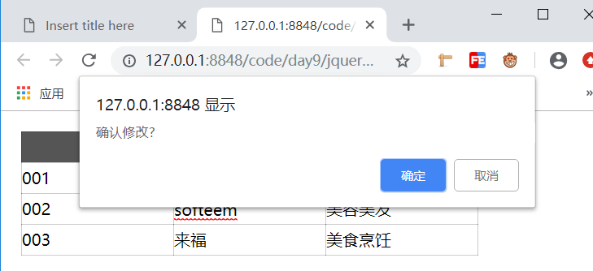
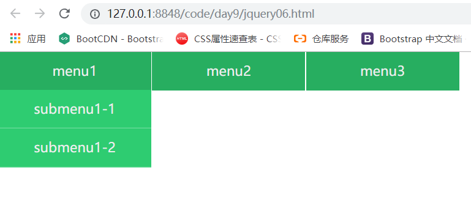
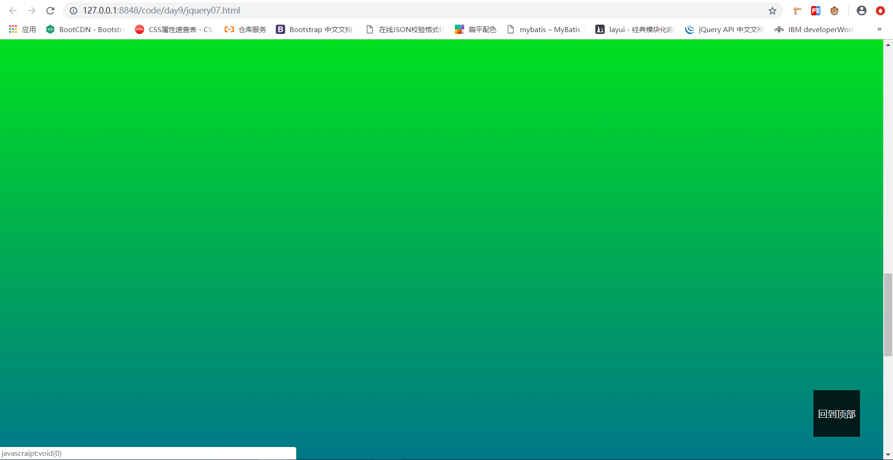
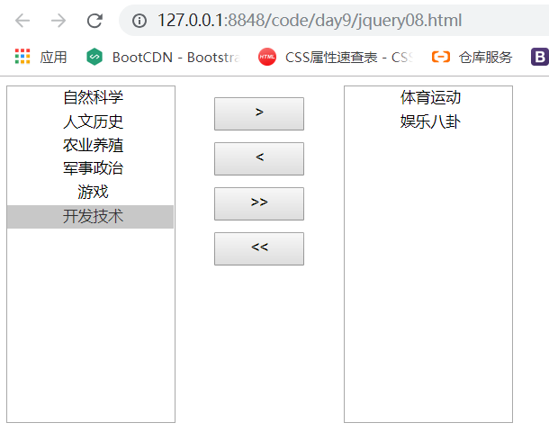
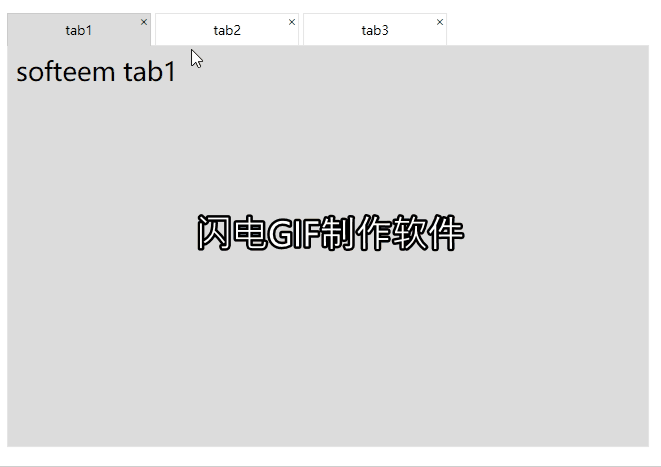

# 03 - Jquery 案例教学 :1st_place_medal:

[[TOC]]

1. 基于 jq 的全选反选

   ```html
   <!DOCTYPE html>
   <html>
     <head>
       <meta charset="utf-8" />
       <title></title>
       <!-- 引入js库 -->
       <script src="jquery/jquery-1.11.3.js"></script>
     </head>
     <body>
       <input type="checkbox" name="ck" />葵花宝典<br />
       <input type="checkbox" name="ck" />辟邪剑谱<br />
       <input type="checkbox" name="ck" />九阴真经<br />
       <input type="checkbox" name="ck" />乾坤大挪移<br />
       <input type="checkbox" name="ck" />九阳神功<br />
       <input type="checkbox" name="" id="selectAll" />全选<br />
       <input type="checkbox" name="" id="selectNone" />不选<br />
       <input type="checkbox" name="" id="selectReverse" />反选<br />
       <script>
         $(function () {
           //全选
           $('#selectAll').click(function () {
             $('input[name=ck]').prop('checked', $(this).prop('checked'))
           })

           //不选
           $('#selectNone').click(function () {
             if ($(this).prop('checked')) {
               $('input[name=ck]').attr('checked', false)
             }
           })

           //反选
           $('#selectReverse').click(function () {
             if ($(this).prop('checked')) {
               //jquery循环遍历 i表示遍历到的元素索引(从0开始),e表示当前遍历到的元素(js dom对象)
               $('input[name=ck]').each(function (i, e) {
                 $(e).prop('checked', !$(e).prop('checked'))
               })
             }
           })
         })
       </script>
     </body>
   </html>
   ```

2. 可编辑表格实现

   ```html
   <!DOCTYPE html>
   <html>
     <head>
       <meta charset="utf-8" />
       <title></title>
       <style>
         * {
           margin: 0;
           padding: 0;
           box-sizing: border-box;
         }
         #tab {
           position: relative;
           top: 20px;
           left: 20px;
           width: 450px;
           border: 1px solid rgba(0, 0, 0, 0.2);
           border-collapse: collapse;
         }
         th,
         td {
           padding: 0;
           width: 150px;
           height: 30px;
           font-size: 1em;
           font-family: '微软雅黑';
           border: 1px solid rgba(0, 0, 0, 0.2);
         }
         th {
           color: #eee;
           background: #555555;
         }
       </style>
     </head>
     <body>
       <table id="tab">
         <tr>
           <th>学号</th>
           <th>姓名</th>
           <th>专业</th>
         </tr>
         <tr>
           <td>001</td>
           <td>狗蛋</td>
           <td>挖掘机专修</td>
         </tr>
         <tr>
           <td>002</td>
           <td>翠花</td>
           <td>美容美发</td>
         </tr>
         <tr>
           <td>003</td>
           <td>来福</td>
           <td>美食烹饪</td>
         </tr>
       </table>
       <script src="jquery/jquery-1.11.3.js"></script>
       <script>
         $(function () {
           $('#tab td').click(function () {
             //缓存当前触发点击事件的单元格对象
             var td = $(this)
             //缓存单元格中的文本值
             var oldValue = td.text()
             //阻止下一次点击事件
             td.on('click', false)
             //创建一个元素并包装为jquery对象
             var input = $('<input type="text">')
             //设置输入框样式
             input.css({
               border: '0',
               font: td.css('font'),
               outline: 'none'
             })
             //设置输入框的宽高跟单元格保持一致
             input.height(td.height())
             input.width(td.width())
             //将输入框的值设置为单元格中的文本值
             input.val(oldValue)

             //将单元格的文本置空
             td.text('')
             //将后者追加到前者中
             td.append(input)
             //选中当前控件
             input.select()
             //聚焦当前控件
             //input.focus();
             //取消输入框的点击事件
             input.on('click', false)
             // input.appendTo(td); //将前者追加后者中

             //为输入框元素绑定失去焦点事件
             input.on('blur', function () {
               //获取value值
               let v = $(this).val()
               //移除输入框
               $(this).remove()
               //将单元格文本设置为输入框的值
               td.text(v)
               //允许下一次点击事件触发
               td.on('click', true)
               //判断是否有改动,若无改动则不作任何处理
               if (v === oldValue) {
                 return
               }
               if (!window.confirm('确认修改?')) {
                 //还原文本内容
                 td.text(oldValue)
                 return false
               }
             })

             //为输入框绑定一个回车按键事件
             input.on('keydown', function (e) {
               //判断是否按下的回车键(enter:13)
               if (e.keyCode == 13) {
                 //触发当前对象的失焦事件
                 $(this).blur()
               }
             })
           })
         })
       </script>
     </body>
   </html>
   ```

   > 效果图
   >
   > 

3. 事件绑定与事件委托

   ```html
   <!DOCTYPE html>
   <html>
     <head>
       <meta charset="utf-8" />
       <title></title>
       <script src="jquery/jquery-1.11.3.js"></script>
     </head>
     <body>
       <div id="app">
         <button id="btn1">默认按钮</button>
       </div>
       <script>
         /**
          * JS事件委托和事件绑定
          * 事件绑定:针对已存在元素进行绑定
          */
         $(function () {
           //事件绑定
           $('#btn1').click(function () {
             $('#app').append('<button class="btn">生成按钮</button>')
             return false
           })
           //事件委托
           $('#app').on('click', '.btn', function () {
             console.info('btn click')
           })
         })
       </script>
     </body>
   </html>
   ```

4. 动态菜单实现

   ```html
   <!DOCTYPE html>
   <html>
     <head>
       <meta charset="utf-8" />
       <title></title>
       <style>
         * {
           margin: 0;
           padding: 0;
         }
         ul {
           list-style: none;
         }
         #menu > li {
           float: left;
           margin: 0 1px 0 0;
           width: 200px;
           height: 50px;
           line-height: 50px;
           text-align: center;
           background-color: #27ae60;
         }
         a {
           display: block;
           font-size: 1.1em;
           color: #eee;
           text-decoration: none;
         }
         .submenu {
           background-color: #2ecc71;
           display: none;
         }
         .submenu > li {
           border-bottom: 1px solid rgba(255, 255, 255, 0.3);
         }
         .submenu > li:hover {
           background-color: rgba(0, 0, 0, 0.2);
         }
       </style>
       <script src="jquery/jquery-1.11.3.js"></script>
     </head>
     <body>
       <ul id="menu">
         <li>
           <a href="">menu1</a>
           <ul class="submenu">
             <li><a href="">submenu1-1</a></li>
             <li><a href="">submenu1-2</a></li>
           </ul>
         </li>
         <li>
           <a href="">menu2</a>
           <ul class="submenu">
             <li><a href="">submenu2-1</a></li>
             <li><a href="">submenu2-2</a></li>
           </ul>
         </li>
         <li>
           <a href="">menu3</a>
           <ul class="submenu">
             <li><a href="">submenu3-1</a></li>
             <li><a href="">submenu3-2</a></li>
           </ul>
         </li>
       </ul>

       <script>
         $(function () {
           $('#menu>li').hover(
             function () {
               $(this).find('.submenu:not(:animated)').slideDown()
             },
             function () {
               $(this).find('.submenu:not(:animated)').slideUp()
             }
           )
         })
       </script>
     </body>
   </html>
   ```

   > 效果图
   >
   > 

5. 回到顶部实现

   ```html
   <!DOCTYPE html>
   <html>
     <head>
       <meta charset="utf-8" />
       <title></title>
       <style>
         body {
           margin: 0;
           padding: 0;
           height: 3500px;
           width: 100%;
           background: linear-gradient(to bottom, #f00, #0f0, #00f);
         }
         .back-top {
           position: fixed;
           right: 40px;
           bottom: 40px;
           z-index: 9999;
           display: none; /*隐藏当前元素*/
           width: 80px;
           height: 80px;
           line-height: 80px;
           text-align: center;
           background-color: #2ecc71;
           transition: all 0.8s;
         }
         .back-top:hover {
           background-color: rgba(0, 0, 0, 0.8);
         }
         a {
           display: block;
           color: #eee;
           text-decoration: none;
         }
       </style>
       <script src="jquery/jquery-1.11.3.js"></script>
     </head>
     <body>
       <div class="back-top">
         <a href="javascraipt:void(0)">回到顶部</a>
       </div>
       <script>
         $(function () {
           //为窗体对象绑定滚动事件
           $(window).scroll(function () {
             var top = $(this).scrollTop()
             if (top > 100) {
               $('.back-top').stop().fadeIn(1000) //淡入
             } else {
               $('.back-top').stop().fadeOut(1000) //淡出
             }
           })
           //回到顶部
           $('.back-top>a').on('click', function () {
             $('html,body').animate(
               {
                 scrollTop: 0
               },
               1000
             )
           })
         })
       </script>
     </body>
   </html>
   ```

   > 效果图
   >
   > 

6. 列表元素移动实现

   ```html
   <!DOCTYPE html>
   <html>
     <head>
       <meta charset="utf-8" />
       <title></title>
       <style>
         #s1,
         #s2,
         .btn-group {
           float: left;
           height: 300px;
           width: 150px;
         }
         ::-webkit-scrollbar {
           width: 0;
         }
         .btn-group > button {
           display: block;
           margin: 10px 35px;
           width: 80px;
           height: 30px;
         }
         select option {
           width: 100%;
           height: 20px;
           line-height: 20px;
           text-align: center;
         }
       </style>
     </head>
     <body>
       <select name="" id="s1" multiple>
         <option value="">自然科学</option>
         <option value="">人文历史</option>
         <option value="">体育运动</option>
         <option value="">娱乐八卦</option>
         <option value="">开发技术</option>
         <option value="">农业养殖</option>
         <option value="">军事政治</option>
         <option value="">游戏</option>
       </select>
       <div class="btn-group">
         <button id="btn1">&gt;</button>
         <button id="btn2">&lt;</button>
         <button id="btn3">&gt;&gt;</button>
         <button id="btn4">&lt;&lt;</button>
       </div>
       <select name="" id="s2" multiple></select>

       <script src="jquery/jquery-1.11.3.js"></script>
       <script>
         $(function () {
           $('.btn-group button').on('click', function () {
             //获取当前元素在同辈元素的索引位置
             var i = $(this).index()
             console.info(i)
             switch (i) {
               case 0:
                 $('#s2').append($('#s1>option:checked'))
                 break
               case 1:
                 $('#s1').append($('#s2>option:checked'))
                 break
               case 2:
                 $('#s2').append($('#s1>option'))
                 break
               case 3:
                 $('#s1').append($('#s2>option'))
                 break
             }
           })
         })
       </script>
     </body>
   </html>
   ```

   > 效果图
   >
   > 

7. 选项卡效果

   ```html
   <style>
     * {
       margin: 0;
       padding: 0;
     }
     .wrap {
       position: relative;
       top: 20px;
       left: 20px;
       width: 800px;
       height: 500px;
     }
     .tab-head {
       position: absolute;
       z-index: 9999;
       list-style: none;
     }
     .tab-head > li {
       position: relative;
       float: left;
       width: 180px;
       height: 41px;
       margin: 0 10px 0 0;
       line-height: 41px;
       text-align: center;
       border: 1px solid rgba(0, 0, 0, 0.1);
       background-color: #fff;
       box-sizing: border-box;
       cursor: pointer;
     }

     .tab-head > li:hover {
       background-color: rgb(220, 220, 220);
     }
     li > a {
       position: absolute;
       top: 2px;
       right: 2px;
       line-height: 1em;
       text-decoration: none;
       color: #333;
     }
     .tab-active {
       border-bottom: 0 !important;
       background-color: rgb(220, 220, 220) !important;
     }

     .tab-content {
       position: absolute;
       top: 40px;
       left: 0;
       width: 100%;
       height: 100%;
       border: 1px solid rgba(0, 0, 0, 0.1);
     }
     .tab-item {
       position: absolute;
       left: 0;
       top: 0;
       display: none;
       padding: 10px;
       width: 100%;
       height: 100%;
       font-size: 2em;
       box-sizing: border-box;
     }
     .tab-item-active {
       display: block;
       background-color: rgb(220, 220, 220);
     }
   </style>
   <div class="wrap">
     <ul class="tab-head">
       <li>tab1<a href="">&times;</a></li>
       <li class="tab-active">tab2<a href="">&times;</a></li>
       <li>tab3<a href="">&times;</a></li>
     </ul>
     <div class="tab-content">
       <div class="tab-item">softeem tab1</div>
       <div class="tab-item tab-item-active">softeem tab2</div>
       <div class="tab-item">softeem tab3</div>
     </div>
   </div>
   <script src="jquery/jquery-1.11.3.js"></script>
   <script>
     $(function () {
       //为选项卡的标签项绑定点击事件
       $('.tab-head li').on('click', function () {
         //如果当前被触发项已经激活的选项卡,则不再执行
         if ($(this).prop('class') === 'tab-active') {
           return false
         }
         //获取被点击项的索引
         var i = $(this).index()
         //激活当前点击项,同时移除同辈li元素的激活状态
         $(this).addClass('tab-active').siblings('li').removeClass('tab-active')
         //切换选项卡内容
         $('.tab-item').eq(i).addClass('tab-item-active').siblings('div').removeClass('tab-item-active')
       })

       //将a标签失效
       $('a').prop('href', 'javascript:void(0)')

       //关闭选项卡
       $('.tab-head>li>a').on('click', function () {
         //获取被点击的a的索引
         var i = $(this).index('.tab-head>li>a')

         //如果删除的是被选中项，则显示第一个选项卡
         if ($('.tab-head>li').eq(i).prop('class') === 'tab-active') {
           console.info($('.tab-head>li').eq(i).next())
           //判断是否存在下一个相邻元素
           if ($('.tab-head>li').eq(i).next().length) {
             //如果存在则选中下一个相邻项
             $('.tab-head>li').eq(i).next().addClass('tab-active')
             $('.tab-item').eq(i).next().addClass('tab-item-active')
           } else {
             //如果不存在则选中上一个相邻项
             $('.tab-head>li').eq(i).prev().addClass('tab-active')
             $('.tab-item').eq(i).prev().addClass('tab-item-active')
           }
         }

         //移除指定索引的选项卡标签
         $('.tab-head>li').eq(i).remove()
         //移除指定索引的选项卡内容
         $('.tab-item').eq(i).remove()
       })
     })
   </script>
   ```

   > 效果图:
   >
   > 
