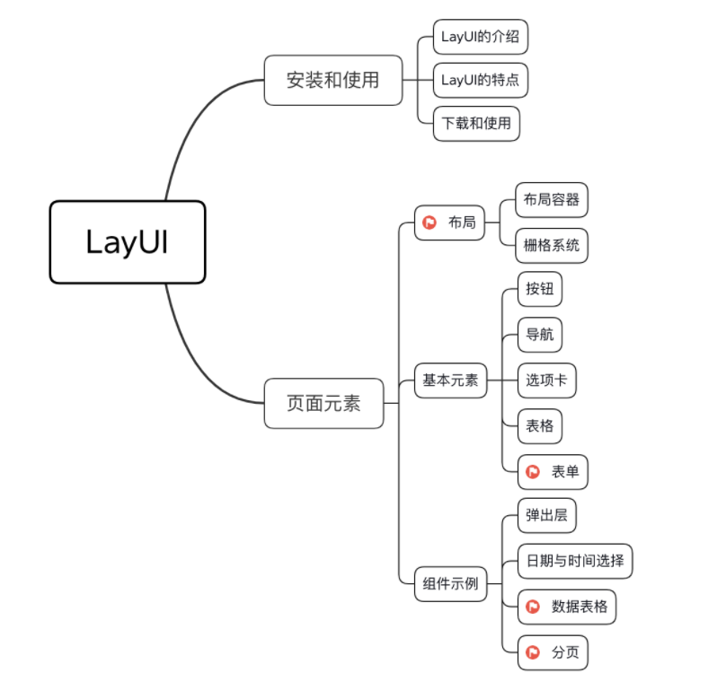
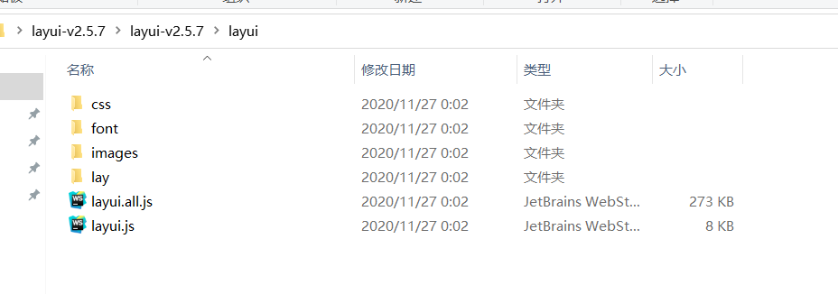
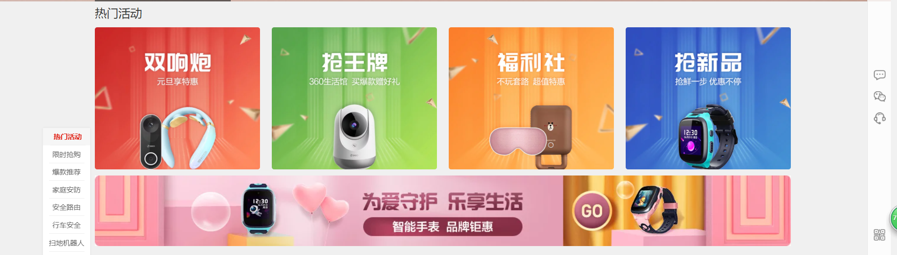

# layui 教程 :ribbon:

[[TOC]]

Layui（谐音：类 UI) 是一款采用自身模块规范编写的前端 UI 框架，遵循原生 HTML/CSS/JS 的书写与组织形式，门槛极低，**开箱即用**。

layui 兼容人类正在使用的全部浏览器（IE6/7 除外），可作为 PC 端后台系统与前台界面的速成开发方案。



#### 第三方支持：

Layui**部分模块**依赖*jQuery*（比如 layer），但是你并不用去额外加载 jQuery。Layui 已经将 jQuery 最稳定的一个版本改为 Layui 的内部模块，当你去使用 layer 之类的模块时，它会首先判断你的页面是否已经引入了 jQuery，如果没有，则加载内部的 jQuery 模块，如果有，则不会加载。

layui 的模块是基于 layui.js 内部实现的异步模块加载方式，它并不遵循于 AMD，而是自己定义了一套更轻量的模块规范

另外，我们的图标取材于阿里巴巴矢量图标库（_iconfont_），构建工具采用 _Gulp_ 。除此之外，不依赖于任何第三方工具。

在官网：https://www.layui.com/

下载对应版本 layui 的包，解压后得到的如下内容：



将解压后的文件直接 copy 到项目中，并且在页面中引用：

```html
<link rel="stylesheet" href="./plugins/layui/css/layui.css" type="text/css" />

<!-- 可加自己的jquery -->
<script type="text/javascript" src="./js/jquery-3.3.1.min.js"></script>
<script type="text/javascript" src="./plugins/layui/layui.js"></script>
```

#### 快速上手：

```html
<!DOCTYPE html>
<html>
  <head>
    <meta charset="utf-8" />
    <meta name="renderer" content="webkit" />
    <!--
                content的取值为webkit,ie-comp,ie-stand之一，区分大小写，分别代表用webkit内核，IE兼容内核，IE标准内核。 
        若页面需默认用极速核，增加标签：<meta name="renderer" content="webkit"> 
        若页面需默认用ie兼容内核，增加标签：<meta name="renderer" content="ie-comp"> 
        若页面需默认用ie标准内核，增加标签：<meta name="renderer" content="ie-stand">
	-->
    <meta http-equiv="X-UA-Compatible" content="IE=edge,chrome=1" />
    <!--这是个是IE8的专用标记,用来指定IE8浏览器去模拟某个特定版本的IE浏览器的渲染方式（比如人见人烦的IE6），以此来解决部分兼容问题-->

    <meta name="viewport" content="width=device-width, initial-scale=1, maximum-scale=1" />
    <!--让viewport的宽度等于物理设备上的真实分辨率，不允许用户缩放。一都主流的web app都是这么设置的，它的作用其实是故意舍弃viewport，不缩放页面，这样dpi肯定和设备上的真实分辨率是一样的，不做任何缩放，网页会因此显得更高细腻。-->
    <!--width=device-width ：表示bai宽度是设备du屏幕的宽度 initial-scale=1.0：表示初始的缩放比例-->

    <title></title>
  </head>
  <link rel="stylesheet" href="layui/css/layui.css" />
  <body>
    <script src="layui/layui.all.js"></script>
    <script>
      layui.use(['layer'], function () {
        var layer = layui.layer //加载layer模块
        layer.msg('欢迎使用layUI')
      })
    </script>
  </body>
</html>
// 其中使用layui的模块时，要先进行引用加载 // 不同的模块有不同的作用，模块介绍有：layer、layDate、layPage、laytpl、table、form、upload、element、tree、layeditor、rate、carousel、flow、util、code等。
```

#### 栅格布局：

在 layui 2.0 的版本中，我们加入了强劲的栅格系统和后台布局方案，这意味着你终于可以着手采用 layui 排版你的响应式网站和后台系统了。

layui 的栅格系统采用业界比较常见的 12 等分规则，内置移动设备、平板、桌面中等和大型屏幕的多终端适配处理，最低能支持到 ie8。而你应当更欣喜的是，layui 终于开放了它经典的后台布局方案，快速搭建一个属于你的后台系统将变得十分轻松自如。

```html
<html>
  <head>
    <meta http-equiv="Content-Type" content="text/html; charset=UTF-8" />
    <title>layui-demo</title>
    <link rel="stylesheet" href="layui/css/layui.css" />
  </head>
  <body>
    <!-- <div class="layui-fluid"> : 铺满   -->
    <div class="layui-container">
      常规布局（以中型屏幕桌面为例）：
      <div class="layui-row">
        <div class="layui-col-md9 layui-col-lg6 layui-bg-blue">你的内容 9/12</div>
        <div class="layui-col-md3 layui-col-lg6 layui-bg-red">你的内容 3/12</div>
      </div>
    </div>
  </body>
</html>
```

- 采用 _layui-row_ 来定义行，如：`<div class="layui-row"></div>`
- 列可以同时出现最多四种不同的组合，分别是：_xs_（超小屏幕，如手机）、_sm_（小屏幕，如平板）、_md_（桌面中等屏幕）、_lg_（桌面大型屏幕），以呈现更加动态灵活的布局。
- 案例：
- 

制作网站类似这样的例子

#### 图标

layui 的所有图标全部采用字体形式，取材于阿里巴巴矢量图标库（iconfont）。因此你可以把一个 icon 看作是一个普通的文字，这意味着你直接用 css 控制文字属性，如 color、font-size，就可以改变图标的颜色和大小。你可以通过 _font-class_ 或 _unicode_ 来定义不同的图标。

通过对一个内联元素（一般推荐用 *i*标签）设定 _class=“layui-icon”_，来定义一个图标，然后对元素加上图标对应的 _font-class_（注意：layui 2.3.0 之前只支持采用 _unicode 字符_)，即可显示出你想要的图标，譬如：

```html
<i class="layui-icon layui-icon-face-smile"></i>
或者
<i class="layui-icon">&#xe69c;</i>
甚至还可以对你的图标设置颜色和尺寸
<i class="layui-icon" style="color:red;font-size=50px;"></i>
```

#### 按钮

向任意 HTML 元素设定*class=“layui-btn”*，建立一个基础按钮。

通过追加格式为*layui-btn-{type}*的 class 来定义其它按钮风格。内置的按钮 class 可以进行任意组合，从而形成更多种按钮风格

```html
<button type="button" class="layui-btn">一个标准的按钮</button>
<a href="http://www.bailiban.com" class="layui-btn">一个可跳转的按钮</a>

按钮的主题
<button type="button" class="layui-btn  layui-btn-primary">原始按钮</button>
<button type="button" class="layui-btn  ">默认按钮</button>
<button type="button" class="layui-btn  layui-btn-normal">百搭按钮</button>
<button type="button" class="layui-btn  layui-btn-warm">暖色按钮</button>
<button type="button" class="layui-btn  layui-btn-danger">警告按钮</button>
<button type="button" class="layui-btn  layui-btn-disabled">禁用按钮</button>

不同尺寸的按钮
<button type="button" class="layui-btn  layui-btn-lg">大型按钮</button>
<button type="button" class="layui-btn  ">默认按钮</button>
<button type="button" class="layui-btn  layui-btn-sm">小型按钮</button>
<button type="button" class="layui-btn  layui-btn-xs">迷你按钮</button>
<button type="button" class="layui-btn layui-btn-fluid">流体按钮（最大化适应）</button>

有圆角的按钮
<button type="button" class="layui-btn  layui-btn-radius layui-btn-primary">原始按钮</button>
<button type="button" class="layui-btn  layui-btn-radius ">默认按钮</button>
<button type="button" class="layui-btn  layui-btn-radius layui-btn-normal">百搭按钮</button>
<button type="button" class="layui-btn  layui-btn-radius layui-btn-warm">暖色按钮</button>
<button type="button" class="layui-btn  layui-btn-radius layui-btn-danger">警告按钮</button>
<button type="button" class="layui-btn  layui-btn-radius layui-btn-disabled">禁用按钮</button>

图标按钮
<button type="button" class="layui-btn"><i class="layui-icon">&#xe608;</i> 添加</button>
<button type="button" class="layui-btn layui-btn-sm layui-btn-primary">
  <i class="layui-icon">&#xe605;</i>
</button>

按钮组
<div class="layui-btn-group">
  <button type="button" class="layui-btn">增加</button>
  <button type="button" class="layui-btn">编辑</button>
  <button type="button" class="layui-btn">删除</button>
</div>

<div class="layui-btn-group">
  <button type="button" class="layui-btn layui-btn-sm">
    <i class="layui-icon">&#xe654;</i>
  </button>
  <button type="button" class="layui-btn layui-btn-sm">
    <i class="layui-icon">&#xe642;</i>
  </button>
  <button type="button" class="layui-btn layui-btn-sm">
    <i class="layui-icon">&#xe640;</i>
  </button>
  <button type="button" class="layui-btn layui-btn-sm">
    <i class="layui-icon">&#xe602;</i>
  </button>
</div>

<div class="layui-btn-group">
  <button type="button" class="layui-btn layui-btn-primary layui-btn-sm">
    <i class="layui-icon">&#xe654;</i>
  </button>
  <button type="button" class="layui-btn layui-btn-primary layui-btn-sm">
    <i class="layui-icon">&#xe642;</i>
  </button>
  <button type="button" class="layui-btn layui-btn-primary layui-btn-sm">
    <i class="layui-icon">&#xe640;</i>
  </button>
</div>
```

#### 后台布局

```html
<!DOCTYPE html PUBLIC "-//W3C//DTD HTML 4.01 Transitional//EN" "http://www.w3.org/TR/html4/loose.dtd">
<html>
  <head>
    <meta http-equiv="Content-Type" content="text/html; charset=UTF-8" />
    <title>layui-demo</title>
    <link rel="stylesheet" href="layui/css/layui.css" />
  </head>
  <body class="layui-layout-body">
    <div class="layui-layout layui-layout-admin">
      <div class="layui-header">
        <div class="layui-logo">layui 后台布局</div>
        <!-- 头部区域（可配合layui已有的水平导航） -->
        <ul class="layui-nav layui-layout-left">
          <li class="layui-nav-item"><a href="">控制台</a></li>
          <li class="layui-nav-item"><a href="">商品管理</a></li>
          <li class="layui-nav-item"><a href="">用户</a></li>
          <li class="layui-nav-item">
            <a href="javascript:;">其它系统</a>
            <dl class="layui-nav-child">
              <dd><a href="">邮件管理</a></dd>
              <dd><a href="">消息管理</a></dd>
              <dd><a href="">授权管理</a></dd>
            </dl>
          </li>
        </ul>
        <ul class="layui-nav layui-layout-right">
          <li class="layui-nav-item">
            <a href="javascript:;">
              
              贤心
            </a>
            <dl class="layui-nav-child">
              <dd><a href="">基本资料</a></dd>
              <dd><a href="">安全设置</a></dd>
            </dl>
          </li>
          <li class="layui-nav-item"><a href="">退了</a></li>
        </ul>
      </div>

      <div class="layui-side layui-bg-black">
        <div class="layui-side-scroll">
          <ul class="layui-nav layui-nav-tree" lay-filter="test">
            <li class="layui-nav-item layui-nav-itemed">
              <a class="" href="javascript:;">系统管理</a>
              <dl class="layui-nav-child">
                <!-- data-url 定义点击后要显示的页面 -->
                <dd><a href="javascript:;" data-url="user.jsp">用户管理</a></dd>
                <dd><a href="javascript:;" data-url="good.jsp">商品管理</a></dd>
              </dl>
            </li>
          </ul>
        </div>
      </div>

      <div class="layui-body">
        <!-- 内容主体区域 -->
        <div style="padding: 15px;" class="pagenav">内容主体区域</div>
      </div>

      <div class="layui-footer">
        <!-- 底部固定区域 -->
        © layui.com - 底部固定区域
      </div>
    </div>
    <script src="layui/layui.js"></script>
    <script>
      //JavaScript代码区域
      layui.use('element', function () {
        /* 使用layui内置的jquery */
        var $ = layui.$
        /* 给菜单添加点击事件 */
        $('dl.layui-nav-child>dd').click(function () {
          /* 获取点击后的跳转页面url */
          var url = $(this).find('a').attr('data-url')
          /* 将URL部分内容显示在主体区域  */
          $('.pagenav').load(url)
        })
      })
    </script>
  </body>
</html>
```

#### 数据表格

```html
<!DOCTYPE html>
<html lang="en">
  <head>
    <meta charset="utf-8" />
    <title>Layui</title>
    <meta name="renderer" content="webkit" />
    <meta http-equiv="X-UA-Compatible" content="IE=edge,chrome=1" />
    <!--让viewport的宽度等于物理设备上的真实分辨率，不允许用户缩放。一都主流的web app都是这么设置的，它的作用其实是故意舍弃viewport，不缩放页面，这样dpi肯定和设备上的真实分辨率是一样的，不做任何缩放，网页会因此显得更高细腻。-->
    <!--width=device-width ：表示bai宽度是设备du屏幕的宽度 initial-scale=1.0：表示初始的缩放比例 minimum-scale=0.5：-->
    <meta name="viewport" content="width=device-width, initial-scale=1, maximum-scale=1" />
    <link rel="stylesheet" href="layui/css/layui.css" media="all" />
    <style>
      .layui-container {
        width: 100%;
      }
    </style>
  </head>
  <body>
    <div class="layui-container">
      <table class="layui-hide" id="test"></table>
    </div>
    <script src="jquery-3.4.1.min.js"></script>
    <script src="layui/layui.all.js"></script>
    <script>
      //注意：导航 依赖 element 模块，否则无法进行功能性操作
      layui.use(['element', 'table'], function () {
        var element = layui.element
        var table = layui.table

        //展示已知数据
        table.render({
          elem: '#test',
          cols: [
            [
              //标题栏
              { field: 'id', title: 'ID', width: 80, sort: true },
              { field: 'username', title: '用户名', width: 120 },
              { field: 'email', title: '邮箱', minWidth: 150 },
              { field: 'sign', title: '签名', minWidth: 160 },
              { field: 'sex', title: '性别', width: 80 },
              { field: 'city', title: '城市', width: 100 },
              { field: 'experience', title: '积分', width: 80, sort: true }
            ]
          ],
          url: './testServlet',
          /*,data: [{
                "id": "10001"
                ,"username": "杜甫"
                ,"email": "xianxin@layui.com"
                ,"sex": "男"
                ,"city": "浙江杭州"
                ,"sign": "人生恰似一场修行"
                ,"experience": "116"
                ,"ip": "192.168.0.8"
                ,"logins": "108"
                ,"joinTime": "2016-10-14"
            }, {
                "id": "10002"
                ,"username": "李白"
                ,"email": "xianxin@layui.com"
                ,"sex": "男"
                ,"city": "浙江杭州"
                ,"sign": "人生恰似一场修行"
                ,"experience": "12"
                ,"ip": "192.168.0.8"
                ,"logins": "106"
                ,"joinTime": "2016-10-14"
                ,"LAY_CHECKED": true
            }, {
                "id": "10003"
                ,"username": "王勃"
                ,"email": "xianxin@layui.com"
                ,"sex": "男"
                ,"city": "浙江杭州"
                ,"sign": "人生恰似一场修行"
                ,"experience": "65"
                ,"ip": "192.168.0.8"
                ,"logins": "106"
                ,"joinTime": "2016-10-14"
            }, {
                "id": "10004"
                ,"username": "贤心"
                ,"email": "xianxin@layui.com"
                ,"sex": "男"
                ,"city": "浙江杭州"
                ,"sign": "人生恰似一场修行"
                ,"experience": "666"
                ,"ip": "192.168.0.8"
                ,"logins": "106"
                ,"joinTime": "2016-10-14"
            }, {
                "id": "10005"
                ,"username": "贤心"
                ,"email": "xianxin@layui.com"
                ,"sex": "男"
                ,"city": "浙江杭州"
                ,"sign": "人生恰似一场修行"
                ,"experience": "86"
                ,"ip": "192.168.0.8"
                ,"logins": "106"
                ,"joinTime": "2016-10-14"
            }, {
                "id": "10006"
                ,"username": "贤心"
                ,"email": "xianxin@layui.com"
                ,"sex": "男"
                ,"city": "浙江杭州"
                ,"sign": "人生恰似一场修行"
                ,"experience": "12"
                ,"ip": "192.168.0.8"
                ,"logins": "106"
                ,"joinTime": "2016-10-14"
            }, {
                "id": "10007"
                ,"username": "贤心"
                ,"email": "xianxin@layui.com"
                ,"sex": "男"
                ,"city": "浙江杭州"
                ,"sign": "人生恰似一场修行"
                ,"experience": "16"
                ,"ip": "192.168.0.8"
                ,"logins": "106"
                ,"joinTime": "2016-10-14"
            }, {
                "id": "10008"
                ,"username": "贤心"
                ,"email": "xianxin@layui.com"
                ,"sex": "男"
                ,"city": "浙江杭州"
                ,"sign": "人生恰似一场修行"
                ,"experience": "106"
                ,"ip": "192.168.0.8"
                ,"logins": "106"
                ,"joinTime": "2016-10-14"
            }]*/
          skin: 'line', //表格风格
          even: true,
          page: true, //是否显示分页
          limits: [5, 7, 10],
          limit: 5 //每页默认显示的数量
        })
      })
    </script>
  </body>
</html>
```

注意：后台数据格式必须是 json 格式，layui 才会正常解析并自动分页展示

#### 弹出层

layer 至今仍作为 layui 的代表作，她的受众广泛并非偶然，而是这数年来的坚持、不弃的执念，将那些不屑的眼光转化为应得的尊重，不断完善和维护、不断建设和提升社区服务，在 Web 开发者的圈子里口口相传，乃至于成为今天的 layui 最强劲的源动力。目前，_layer 已成为国内最多人使用的 Web 弹层组件_

> layer 作为独立组件使用，你可以去 layer 独立版本官网下载组件包。你需要在你的页面引入*jQuery*1.8 以上的任意版本，并引入*layer.js*。且 jquery 的引入位置必须放到 layer 引入之前，否则无效。

- layer 的独立版本：https://layer.layui.com/

- 使用方式

  ```javascript
  <script src="https://cdn.bootcss.com/jquery/3.3.1/jquery.min.js"></script>
  <script src="layer/layer.js"></script>

  <script type="text/javascript">
  	layer.msg('hello');
  </script>

  ```

> layer 作为 layui 模块化使用，那么你直接在官网下载 layui 框架即可，无需引入 jQuery 和 layer.js，但需要引入*layui.css*和*layui.js*。

使用方式：

- type

  layer 提供了 5 种层类型。可传入的值有：_0_（信息框，默认）_1_（页面层）_2_（iframe 层）_3_（加载层）_4_（tips 层）。 若你采用*layer.open({type: 1})*方式调用，则 type 为必填项（信息框除外）

- title

  title 支持三种类型的值，若你传入的是普通的字符串，如*title :‘我是标题’*，那么只会改变标题文本；若你还需要自定义标题区域样式，那么你可以*title: [‘文本’, ‘font-size:18px;’]*，数组第二项可以写任意 css 样式；如果你不想显示标题栏，你可以*title: false*

- content

  content 可传入的值是灵活多变的，不仅可以传入普通的 html 内容，还可以指定 DOM，更可以随着 type 的不同而不同。

- area

  在默认状态下，layer 是宽高都自适应的，但当你只想定义宽度时，你可以*area: ‘500px’*，高度仍然是自适应的。当你宽高都要定义时，你可以*area: [‘500px’, ‘300px’]*

- btn

  信息框模式时，btn 默认是一个确认按钮，其它层类型则默认不显示，加载层和 tips 层则无效。当您只想自定义一个按钮时，你可以*btn: ‘我知道了’*，当你要定义两个按钮时，你可以*btn: [‘yes’, ‘no’]*。当然，你也可以定义更多按钮，比如：_btn: [‘按钮 1’, ‘按钮 2’, ‘按钮 3’, …]_，按钮 1 的回调是 yes，而从按钮 2 开始，则回调为 btn2: function(){}，以此类推。

- closeBtn

  layer 提供了两种风格的关闭按钮，可通过配置*1*和*2*来展示，如果不显示，则*closeBtn: 0*

- shade

  即弹层外区域。默认是 0.3 透明度的黑色背景（’#000’）。如果你想定义别的颜色，可以*shade: [0.8, ‘#393D49’]*；如果你不想显示遮罩，可以*shade: 0*

- shadeClose

  如果你的 shade 是存在的，那么你可以设定 shadeClose 来控制点击弹层外区域关闭。

- time

  默认不会自动关闭。当你想自动关闭时，可以*time: 5000*，即代表 5 秒后自动关闭，注意单位是毫秒（1 秒=1000 毫秒）

- layer.open(options)

  基本上是露脸率最高的方法，不管是使用哪种方式创建层，都是走*layer.open()*，创建任何类型的弹层都会返回一个当前层索引，上述的*options 即是基础参数*

- layer.alert(content, options, yes) - 普通信息框

  它的弹出似乎显得有些高调，一般用于对用户造成比较强烈的关注，类似系统 alert，但却比 alert 更灵便。它的参数是自动向左补齐的。通过第二个参数，可以设定各种你所需要的基础参数，但如果你不需要的话，直接写回调即可。

- layer.confirm(content, options, yes, cancel) - 询问框

  类似系统 confirm，但却远胜 confirm，另外它*不是和系统的 confirm 一样阻塞*你需要把交互的语句放在回调体中。同样的，它的参数也是自动补齐的。

- layer.msg(content, options, end) - 提示框

  我们在源码中用了相对较大的篇幅来定制了这个 msg，目的是想将其打造成露脸率最高的提示框。而事实上我的确也在大量地使用它。因为它简单，而且足够得自觉，它不仅占据很少的面积，而且默认还会 3 秒后*自动消失*所有这一切都决定了我对 msg 的爱。因此*我赋予了它许多可能*在外形方面，它坚持简陋的变化，在作用方面，它坚持零用户操作。而且它的参数也是自动补齐的。

- layer.load(icon, options) - 加载层

  type:3 的深度定制。load 并不需要你传太多的参数，但如果你不喜欢默认的加载风格，你还有选择空间。icon 支持传入*0-2*如果是 0，无需传。另外特别注意一点：_load 默认是不会自动关闭的_，因为你一般会在 ajax 回调体中关闭它。

- layer.close(index) - 关闭特定层

  关于它似乎没有太多介绍的必要，唯一让你疑惑的，可能就是这个*index*了吧。事实上它非常容易得到。

  ```js
  //当你在iframe页面关闭自身时
  var index = parent.layer.getFrameIndex(window.name) //先得到当前iframe层的索引
  parent.layer.close(index) //再执行关闭
  //如果你想关闭最新弹出的层，直接获取layer.index即可
  layer.close(layer.index) //它获取的始终是最新弹出的某个层，值是由layer内部动态递增计算的
  ```

#### 表单

```html
<!DOCTYPE html>
<html>
  <head>
    <meta charset="utf-8" />
    <title>layui.form小例子</title>
    <link rel="stylesheet" href="layui.css" media="all" />
  </head>
  <body>
    <form class="layui-form">
      <!-- 提示：如果你不想用form，你可以换成div等任何一个普通元素 -->
      <div class="layui-form-item">
        <label class="layui-form-label">输入框</label>
        <div class="layui-input-block">
          <input type="text" name="" placeholder="请输入" autocomplete="off" class="layui-input" />
        </div>
      </div>
      <div class="layui-form-item">
        <label class="layui-form-label">下拉选择框</label>
        <div class="layui-input-block">
          <select name="interest" lay-filter="aihao">
            <option value="0">写作</option>
            <option value="1">阅读</option>
          </select>
        </div>
      </div>
      <div class="layui-form-item">
        <label class="layui-form-label">复选框</label>
        <div class="layui-input-block">
          <input type="checkbox" name="like[write]" title="写作" />
          <input type="checkbox" name="like[read]" title="阅读" />
        </div>
      </div>
      <div class="layui-form-item">
        <label class="layui-form-label">开关关</label>
        <div class="layui-input-block">
          <input type="checkbox" lay-skin="switch" />
        </div>
      </div>
      <div class="layui-form-item">
        <label class="layui-form-label">开关开</label>
        <div class="layui-input-block">
          <input type="checkbox" checked lay-skin="switch" />
        </div>
      </div>
      <div class="layui-form-item">
        <label class="layui-form-label">单选框</label>
        <div class="layui-input-block">
          <input type="radio" name="sex" value="0" title="男" />
          <input type="radio" name="sex" value="1" title="女" checked />
        </div>
      </div>
      <div class="layui-form-item layui-form-text">
        <label class="layui-form-label">请填写描述</label>
        <div class="layui-input-block">
          <textarea placeholder="请输入内容" class="layui-textarea"></textarea>
        </div>
      </div>
      <div class="layui-form-item">
        <div class="layui-input-block">
          <button class="layui-btn" lay-submit lay-filter="*">立即提交</button>
          <button type="reset" class="layui-btn layui-btn-primary">重置</button>
        </div>
      </div>
      <!-- 更多表单结构排版请移步文档左侧【页面元素-表单】一项阅览 -->
    </form>
    <script src="layui.js"></script>
    <script>
      layui.use('form', function () {
        var form = layui.form
        //各种基于事件的操作，下面会有进一步介绍
      })
    </script>
  </body>
</html>
```

> 事件监听

```
语法：form.on('event(过滤器值)', callback);
1
```

| event    | 描述                         |
| -------- | ---------------------------- |
| select   | 监听 select 下拉选择事件     |
| checkbox | 监听 checkbox 复选框勾选事件 |
| switch   | 监听 checkbox 复选框开关事件 |
| radio    | 监听 radio 单选框事件        |
| submit   | 监听表单提交事件             |

比如：

- 监听 select

  ```js
  form.on('select(test)', function (data) {
    console.log(data)
  })
  // 其中关于各个表单元素的验证都可以在此基础上进入实现
  ```

- 监听 checkbox 复选

  ```js
  form.on('checkbox(filter)', function(data){
    console.log(data.elem); //得到checkbox原始DOM对象
    console.log(data.elem.checked); //是否被选中，true或者false
    console.log(data.value); //复选框value值，也可以通过data.elem.value得到
    console.log(data.othis); //得到美化后的DOM对象
  });

  监听submit提交

  按钮点击或者表单被执行提交时触发，其中回调函数只有在验证全部通过后才会进入，回调返回三个成员：

  form.on('submit(*)', function(data){
    console.log(data.elem) //被执行事件的元素DOM对象，一般为button对象
    console.log(data.form) //被执行提交的form对象，一般在存在form标签时才会返回
    console.log(data.field) //当前容器的全部表单字段，名值对形式：{name: value}
    return false; //阻止表单跳转。如果需要表单跳转，去掉这段即可。
  });
  ```

  > 表单赋值 / 取值

  语法：_form.val(‘filter’, object);_

  用于给指定表单集合的元素赋值和取值。如果 object 参数存在，则为赋值；如果 object 参数不存在，则为取值。

  ```js
  //给表单赋值
  form.val('formTest', {
    //formTest 即 class="layui-form" 所在元素属性 lay-filter="" 对应的值
    username: '贤心', // "name": "value"
    sex: '女',
    auth: 3,
    'check[write]': true,
    open: false,
    desc: '我爱layui'
  })

  //获取表单区域所有值
  var data1 = form.val('formTest')
  ```

  第二个参数中的键值是表单元素对应的 _name_ 和 _value_。

#### 新增页面

```html
新增 打开新增页面

<div><button class="layui-btn" id="add_btn">新增</button></div>
<script>
  $('#add_btn').on('click', function () {
    layer.msg(' add ')
    layer.open({
      type: 2,
      title: '用户新增',
      area: ['700px', '600px'],
      maxmin: true,
      shadeClose: false,
      content: 'add.jsp'
    })
  })
</script>

显示新增页面 <%@ page contentType="text/html;charset=UTF-8" language="java" %>
<html>
  <head>
    <title>layui</title>
    <link rel="stylesheet" href="static/layui/css/layui.css" />
  </head>
  <body>
    <form class="layui-form">
      <div class="layui-form-item">
        <label class="layui-form-label">用户名</label>
        <div class="layui-input-block">
          <input type="text" name="userName" placeholder="请输入用户名" autocomplete="off" class="layui-input" />
        </div>
      </div>

      <div class="layui-form-item">
        <label class="layui-form-label">密码</label>
        <div class="layui-input-block">
          <input type="text" name="userPwd" placeholder="请输入用户密码" autocomplete="off" class="layui-input" />
        </div>
      </div>

      <input id="img" type="hidden" name="imgName" />
      <div class="layui-upload">
        <button type="button" class="layui-btn" id="test1">上传图片</button>
        <div class="layui-upload-list">
          
        </div>
      </div>

      <div class="layui-form-item">
        <div class="layui-input-block">
          <button class="layui-btn" lay-submit lay-filter="*">立即提交</button>
          <button type="reset" class="layui-btn layui-btn-primary">重置</button>
        </div>
      </div>
    </form>
    <script src="static/layui/layui.js"></script>
    <script>
      layui.use(['form', 'upload'], function () {
        var upload = layui.upload
        var form = layui.form
        var $ = layui.$

        //图片上传
        var uploadInst = upload.render({
          elem: '#test1', //绑定元素
          url: 'UploadServlet', //上传接口
          before: function (obj) {
            //预读本地文件示例
            obj.preview(function (index, file, result) {
              $('#demo1').attr('src', result) //图片链接
            })
          },
          done: function (res) {
            //res 获取返回的json结果
            $('#img').val(res.data.imgName)
          }
        })

        form.on('submit(*)', function (data) {
          //1,数据提交到后台，2，关闭当前页面，3刷新父页面的table

          $.post('InsertServlet', data.field, function () {
            // 提交后刷新父页面的表格，demo为父表格的id
            parent.layui.table.reload('demo')
            // 通过父页面关闭当前页面
            var index = parent.layer.getFrameIndex(window.name) //先得到当前iframe层的索引
            parent.layer.close(index)
            return true // 返回true表示提交数据，返回false表示不提交
          })
        })
      })
    </script>
  </body>
</html>
```

#### 删除跟修改功能

上面基于后台布局的 demo 有了表格列表数据的显示功能，还有了添加功能，现将删除跟修改功能也补全完整。

上面已经把修改跟删除的界面显示定义出来，我们这里只需要通过`table.on`将点击事件进行绑定即可。

```javascript
table.on('tool(demo)', function (obj) {
  var layEvent = obj.event //获得 lay-event 对应的值

  var data = obj.data //获得当前行数据
  var userName = data.name // 表单中的name字段
  var userId = data.id // 表单中的id字段
  var $ = layui.$

  if (layEvent === 'del_event') {
    layer.confirm('你确定真的要删除' + userName + '的数据吗?', { icon: 2 }, function (index) {
      // 异步请求去后台删除数据
      $.post('DeleteServlet', { user_id: userId }, function (data) {
        // 删除成功给出提示
        if (data.flag) {
          // 操作成功的提示
          layer.msg('删除成功！', { icon: 1 })
          // 关闭最新的层
          layer.close(layer.index)
          // 刷新id为demo的table数据
          layui.table.reload('demo')
        }
      })
    })
  } else if (layEvent === 'update_event') {
    // 修改操作
    // 打开修改页面
    layer.open({
      type: 2,
      title: '用户修改',
      area: ['700px', '600px'],
      maxmin: true,
      shadeClose: false,
      // 修改页面需要先访问Servlet获取修改的用户信息
      content: 'UpdatePageServlet?user_id=' + userId
    })
  }
})
```

- `table.on('tool(demo)'`中的 demo 是去找`lay-filter="demo"`的 table。

删除的后台功能

```java
@WebServlet("/DeleteServlet")
public class DeleteServlet extends HttpServlet {

    @Override
    protected void doGet(HttpServletRequest req, HttpServletResponse resp) throws ServletException, IOException {
            req.setCharacterEncoding("utf-8");
            resp.setCharacterEncoding("utf-8");

        String deleteId = req.getParameter("deleteId");

        for(int i = 0; i< UserData.userList.size(); i++){
            String id =  UserData.userList.get(i).getId() ;
            if(id.equals(deleteId)){
                UserData.userList.remove(i);
                break;
            }
        }

        resp.setContentType("text/json;charset=utf-8");
        resp.getWriter().write("{\"flag\":true}");
    }

    @Override
    protected void doPost(HttpServletRequest req, HttpServletResponse resp) throws ServletException, IOException {
        doGet(req, resp);
    }
}
123456789101112131415161718192021222324252627
```

进入修改页面时需要先到后台获取要修改的用户信息

```java
@WebServlet("/UpdatePageServlet")
public class UpdatePageServlet extends HttpServlet {

    @Override
    protected void doGet(HttpServletRequest req, HttpServletResponse resp) throws ServletException, IOException {
        req.setCharacterEncoding("utf-8");
        resp.setCharacterEncoding("utf-8");

        String userId = req.getParameter("userId");


        for(int i = 0; i< UserData.userList.size(); i++){
            String id = UserData.userList.get(i).getId() ;
            if(id.equals(userId)){
                req.setAttribute("updateUser", UserData.userList.get(i));
                break;
            }
        }

        req.getRequestDispatcher("update.jsp").forward(req, resp);

    }

    @Override
    protected void doPost(HttpServletRequest req, HttpServletResponse resp) throws ServletException, IOException {
        doGet(req, resp);
    }
}
```

然后才能打开修改页面

```javascript
<%@ page contentType="text/html;charset=UTF-8" language="java" %>
<html>
<head>
    <title>layui</title>
    <link rel="stylesheet" href="static/layui/css/layui.css">
    <style>
        #demo1{
            width: 300px;
        }

    </style>
</head>
<body>

<form  class="layui-form">

    <input type="hidden" name="userId" value="${updateUser.id}" />

    <div class="layui-form-item">
        <label class="layui-form-label">用户名</label>
        <div class="layui-input-block">
            <input type="text" name="userName" value="${updateUser.name}" placeholder="请输入用户名" autocomplete="off" class="layui-input" >
        </div>
    </div>

    <div class="layui-form-item">
        <label class="layui-form-label">密码</label>
        <div class="layui-input-block">
            <input type="text" name="userPwd" value="${updateUser.password}" placeholder="请输入用户密码" autocomplete="off" class="layui-input" >
        </div>
    </div>

    <input id="img" type="hidden" name="imgName" value="${updateUser.img}"  />
    <div class="layui-upload">
        <button type="button" class="layui-btn" id="test1">上传图片</button>
        <div class="layui-upload-list">
            
        </div>
    </div>

    <div class="layui-form-item">
        <div class="layui-input-block">
            <button class="layui-btn" lay-submit lay-filter="*">立即提交</button>
            <button type="reset" class="layui-btn layui-btn-primary">重置</button>
        </div>
    </div>

    <script src="static/layui/layui.js"></script>
    <script>
        layui.use(['form','upload'], function(){
            var upload = layui.upload;
            var form = layui.form;
            var $ = layui.$;

            //执行实例
            var uploadInst = upload.render({
                elem: '#test1' //绑定元素
                ,url: 'UploadServlet' //上传接口
                ,before: function(obj){
                //预读本地文件示例
                    obj.preview(function(index, file, result){

                        $('#demo1').attr('src', result); //图片链接（base64）

                    });
                 }
             ,done: function(res){
                    $('#img').val(res.data.imgName);
                }
                ,error: function(){
                }
            });

            form.on('submit(*)', function(data){
                //1,数据提交到后台，2，关闭当前页面，3刷新父页面的table

                $.post("UpdateServlet",data.field,function () {
                    // 提交后刷新父页面的表格，demo为父表格的id
                    parent.layui.table.reload('demo');
                    // 通过父页面关闭当前页面
                    var index = parent.layer.getFrameIndex(window.name); //先得到当前iframe层的索引
                    parent.layer.close(index);
                });
                // 通过父页面关闭当前页面
                var index = parent.layer.getFrameIndex(window.name); //先得到当前iframe层的索引
                parent.layer.close(index);
                // 提交后刷新父页面的表格，demo为父表格的id
                parent.layui.table.reload('demo');
                return true ;// 返回true表示提交数据，返回false表示不提交
            });
        });
    </script>
</form>
</body>
</html>
```

修改操作要提交到后台完成

```java
@WebServlet("/UpdateServlet")
public class UpdateServlet extends HttpServlet {

    @Override
    protected void doGet(HttpServletRequest req, HttpServletResponse resp) throws ServletException, IOException {
        req.setCharacterEncoding("utf-8");
        resp.setCharacterEncoding("utf-8");

        String userId = req.getParameter("userId");
        String userName = req.getParameter("userName");
        String userPwd = req.getParameter("userPwd");
        String imgName = req.getParameter("imgName");

        for(int i = 0; i< UserData.userList.size(); i++){
            String id = UserData.userList.get(i).getId() ;
            if(id.equals(userId)){
                UserData.userList.get(i).setName(userName);
                UserData.userList.get(i).setPassword(userPwd);
                UserData.userList.get(i).setImg(imgName);
                break;
            }
        }


    }

    @Override
    protected void doPost(HttpServletRequest req, HttpServletResponse resp) throws ServletException, IOException {
        doGet(req, resp);
    }
}
```
