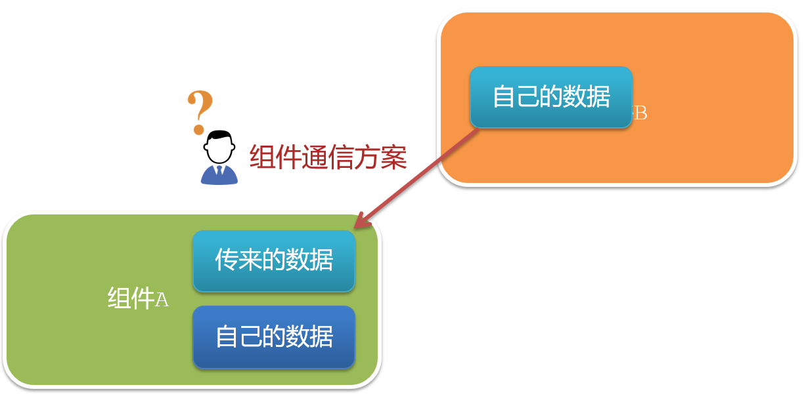
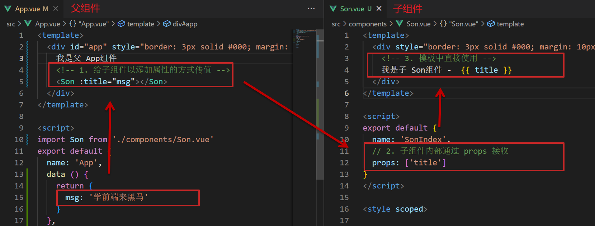
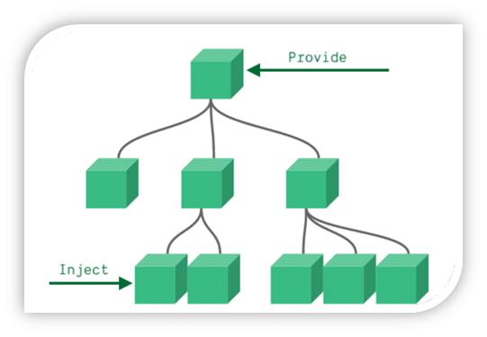

# 🍉day04

<hr/>

[[toc]]

## 一、学习目标

### 1.组件的三大组成部分（结构/样式/逻辑）

​    scoped解决样式冲突/data是一个函数

###  2.组件通信

1.  组件通信语法
2. 父传子
3. 子传父
4. 非父子通信（扩展）

### 3.综合案例：小黑记事本（组件版）

1. 拆分组件
2. 列表渲染
3. 数据添加
4. 数据删除
5. 列表统计
6. 清空
7. 持久化

### 4.进阶语法

1. v-model原理
2. v-model应用于组件
3. sync修饰符
4. ref和$refs
5. $nextTick


## 二、scoped解决样式冲突

### **1.默认情况**：

写在组件中的样式会 **全局生效** →  因此很容易造成多个组件之间的样式冲突问题。

1. **全局样式**: 默认组件中的样式会作用到全局，任何一个组件中都会受到此样式的影响


2. **局部样式**: 可以给组件加上**scoped** 属性,可以**让样式只作用于当前组件**

### 2.代码演示

BaseOne.vue

```vue
<template>
  <div class="base-one">
    BaseOne
  </div>
</template>

<script>
export default {

}
</script>
<style scoped>
</style>
```

BaseTwo.vue

```vue
<template>
  <div class="base-one">
    BaseTwo
  </div>
</template>

<script>
export default {

}
</script>

<style scoped>
</style>
```

App.vue

```vue
<template>
  <div id="app">
    <BaseOne></BaseOne>
    <BaseTwo></BaseTwo>
  </div>
</template>

<script>
import BaseOne from './components/BaseOne'
import BaseTwo from './components/BaseTwo'
export default {
  name: 'App',
  components: {
    BaseOne,
    BaseTwo
  }
}
</script>
```

### 3.scoped原理

1. 当前组件内标签都被添加**data-v-hash值** 的属性 
2. css选择器都被添加 [**data-v-hash值**] 的属性选择器

最终效果: **必须是当前组件的元素**, 才会有这个自定义属性, 才会被这个样式作用到 


### 4.总结

1. style的默认样式是作用到哪里的？
2. scoped的作用是什么？
3. style中推不推荐加scoped？


## 三、data必须是一个函数

### 1、data为什么要写成函数

一个组件的 **data** 选项必须**是一个函数**。目的是为了：保证每个组件实例，维护**独立**的一份**数据**对象。

每次创建新的组件实例，都会新**执行一次data 函数**，得到一个新对象。


### 2.代码演示

BaseCount.vue

```vue
<template>
  <div class="base-count">
    <button @click="count--">-</button>
    <span>{{ count }}</span>
    <button @click="count++">+</button>
  </div>
</template>

<script>
export default {
  data: function () {
    return {
      count: 100,
    }
  },
}
</script>

<style>
.base-count {
  margin: 20px;
}
</style>
```

App.vue

```vue
<template>
  <div class="app">
    <BaseCount></BaseCount>
  </div>
</template>

<script>
import BaseCount from './components/BaseCount'
export default {
  components: {
    BaseCount,
  },
}
</script>

<style>
</style>
```

### 3.总结

data写成函数的目的是什么？


## 四、组件通信

### 1.什么是组件通信？

组件通信，就是指**组件与组件**之间的**数据传递**

- 组件的数据是独立的，无法直接访问其他组件的数据。
- 想使用其他组件的数据，就需要组件通信

### 2.组件之间如何通信



思考：

1. 组件之间有哪些关系？
2. 对应的组件通信方案有哪几类？

### 3.组件关系分类

1. 父子关系
2. 非父子关系


### 4.通信解决方案


### 5.父子通信流程

1. 父组件通过 **props** 将数据传递给子组件
2. 子组件利用 **$emit** 通知父组件修改更新


### 6.父向子通信代码示例

父组件通过**props**将数据传递给子组件

父组件App.vue

```vue
<template>
  <div class="app" style="border: 3px solid #000; margin: 10px">
    我是APP组件 
    <Son></Son>
  </div>
</template>

<script>
import Son from './components/Son.vue'
export default {
  name: 'App',
  data() {
    return {
      myTitle: '学前端，就来黑马程序员',
    }
  },
  components: {
    Son,
  },
}
</script>

<style>
</style>
```


子组件Son.vue

```vue
<template>
  <div class="son" style="border:3px solid #000;margin:10px">
    我是Son组件
  </div>
</template>

<script>
export default {
  name: 'Son-Child',
}
</script>

<style>

</style>
```



父向子传值步骤

1. 给子组件以添加属性的方式传值
2. 子组件内部通过props接收
3. 模板中直接使用 props接收的值


### 7.子向父通信代码示例

子组件利用 **$emit** 通知父组件，进行修改更新


子向父传值步骤

1. $emit触发事件，给父组件发送消息通知
2. 父组件监听$emit触发的事件
3. 提供处理函数，在函数的性参中获取传过来的参数

### 8.总结

1. 组件关系分类有哪两种
2. 父子组件通信的流程是什么？
   1. 父向子
   2. 子向父


## 五、什么是props

### 1.Props 定义

组件上 注册的一些  自定义属性

### 2.Props 作用

向子组件传递数据

### 3.特点

1. 可以 传递 **任意数量** 的prop
2. 可以 传递 **任意类型** 的prop


### 4.代码演示

父组件App.vue

```vue
<template>
  <div class="app">
    <UserInfo
      :username="username"
      :age="age"
      :isSingle="isSingle"
      :car="car"
      :hobby="hobby"
    ></UserInfo>
  </div>
</template>

<script>
import UserInfo from './components/UserInfo.vue'
export default {
  data() {
    return {
      username: '小帅',
      age: 28,
      isSingle: true,
      car: {
        brand: '宝马',
      },
      hobby: ['篮球', '足球', '羽毛球'],
    }
  },
  components: {
    UserInfo,
  },
}
</script>

<style>
</style>
```

子组件UserInfo.vue

```vue
<template>
  <div class="userinfo">
    <h3>我是个人信息组件</h3>
    <div>姓名：</div>
    <div>年龄：</div>
    <div>是否单身：</div>
    <div>座驾：</div>
    <div>兴趣爱好：</div>
  </div>
</template>

<script>
export default {
  
}
</script>

<style>
.userinfo {
  width: 300px;
  border: 3px solid #000;
  padding: 20px;
}
.userinfo > div {
  margin: 20px 10px;
}
</style>
```


## 六、props校验

### 1.思考

组件的props可以乱传吗

### 2.作用

为组件的 prop 指定**验证要求**，不符合要求，控制台就会有**错误提示**  → 帮助开发者，快速发现错误

### 3.语法

- **类型校验**
- 非空校验
- 默认值
- 自定义校验


### 4.代码演示

App.vue

```vue
<template>
  <div class="app">
    <BaseProgress :w="width"></BaseProgress>
  </div>
</template>

<script>
import BaseProgress from './components/BaseProgress.vue'
export default {
  data() {
    return {
      width: 30,
    }
  },
  components: {
    BaseProgress,
  },
}
</script>

<style>
</style>
```

BaseProgress.vue

```vue
<template>
  <div class="base-progress">
    <div class="inner" :style="{ width: w + '%' }">
      <span>{{ w }}%</span>
    </div>
  </div>
</template>

<script>
export default {
  props: ['w'],
}
</script>

<style scoped>
.base-progress {
  height: 26px;
  width: 400px;
  border-radius: 15px;
  background-color: #272425;
  border: 3px solid #272425;
  box-sizing: border-box;
  margin-bottom: 30px;
}
.inner {
  position: relative;
  background: #379bff;
  border-radius: 15px;
  height: 25px;
  box-sizing: border-box;
  left: -3px;
  top: -2px;
}
.inner span {
  position: absolute;
  right: 0;
  top: 26px;
}
</style>
```


## 七、props校验完整写法

### 1.语法

```vue
props: {
  校验的属性名: {
    type: 类型,  // Number String Boolean ...
    required: true, // 是否必填
    default: 默认值, // 默认值
    validator (value) {
      // 自定义校验逻辑
      return 是否通过校验
    }
  }
},
```

### 2.代码实例

```vue
<script>
export default {
  // 完整写法（类型、默认值、非空、自定义校验）
  props: {
    w: {
      type: Number,
      //required: true,
      default: 0,
      validator(val) {
        // console.log(val)
        if (val >= 100 || val <= 0) {
          console.error('传入的范围必须是0-100之间')
          return false
        } else {
          return true
        }
      },
    },
  },
}
</script>
```

### 3.注意

1.default和required一般不同时写（因为当时必填项时，肯定是有值的）

2.default后面如果是简单类型的值，可以直接写默认。如果是复杂类型的值，则需要以函数的形式return一个默认值


## 八、props&data、单向数据流

### 1.共同点

都可以给组件提供数据

### 2.区别

- data 的数据是**自己**的  →   随便改  
- prop 的数据是**外部**的  →   不能直接改，要遵循 **单向数据流**

### 3.单向数据流：

父级props 的数据更新，会向下流动，影响子组件。这个数据流动是单向的

### 4.代码演示

App.vue

```vue
<template>
  <div class="app">
    <BaseCount></BaseCount>
  </div>
</template>

<script>
import BaseCount from './components/BaseCount.vue'
export default {
  components:{
    BaseCount
  },
  data(){
  },
}
</script>

<style>

</style>
```

BaseCount.vue

```vue
<template>
  <div class="base-count">
    <button @click="count--">-</button>
    <span>{{ count }}</span>
    <button @click="count++">+</button>
  </div>
</template>

<script>
export default {
  // 1.自己的数据随便修改  （谁的数据 谁负责）
   data () {
     return {
       count: 100,
     }
   },
  // 2.外部传过来的数据 不能随便修改
  //props: {
  //  count: {
  //    type: Number,
  //  }, 
  //}
}
</script>

<style>
.base-count {
  margin: 20px;
}
</style>
```


### 5.口诀

**谁的数据谁负责**


## 九、综合案例-组件拆分

### 1.需求说明

- 拆分基础组件
- 渲染待办任务
- 添加任务
-  删除任务
-  底部合计 和 清空功能
-  持久化存储


### 2.拆分基础组件

咱们可以把小黑记事本原有的结构拆成三部分内容：头部（TodoHeader）、列表(TodoMain)、底部(TodoFooter)


## 十、综合案例-列表渲染

思路分析：

1. 提供数据：提供在公共的父组件 App.vue
2. 通过父传子，将数据传递给TodoMain
3. 利用v-for进行渲染


## 十一、综合案例-添加功能

思路分析：

1. 收集表单数据  v-model
2. 监听时间 （回车+点击 都要进行添加）
3. 子传父，将任务名称传递给父组件App.vue
4. 父组件接受到数据后 进行添加 **unshift**(自己的数据自己负责)


## 十二、综合案例-删除功能

思路分析：

1. 监听时间（监听删除的点击）携带id
2. 子传父，将删除的id传递给父组件App.vue
3. 进行删除 **filter**  (自己的数据自己负责)


## 十三、综合案例-底部功能及持久化存储

思路分析：

1. 底部合计：父组件传递list到底部组件  —>展示合计
2. 清空功能：监听事件 —> **子组件**通知父组件 —>父组件清空
3. 持久化存储：watch监听数据变化，持久化到本地


## 十四、非父子通信-event bus 事件总线

### 1.作用

非父子组件之间，进行简易消息传递。(复杂场景→ Vuex)

### 2.步骤

1. 创建一个都能访问的事件总线 （空Vue实例）

   ```js
   import Vue from 'vue'
   const Bus = new Vue()
   export default Bus
   ```

2. A组件（接受方），监听Bus的 $on事件

   ```vue
   created () {
     Bus.$on('sendMsg', (msg) => {
       this.msg = msg
     })
   }
   ```

3. B组件（发送方），触发Bus的$emit事件

   ```vue
   Bus.$emit('sendMsg', '这是一个消息')
   ```

   

### 3.代码示例

EventBus.js

```js
import Vue from 'vue'
const Bus  =  new Vue()
export default Bus
```

BaseA.vue(接受方)

```vue
<template>
  <div class="base-a">
    我是A组件（接收方）
    <p>{{msg}}</p>  
  </div>
</template>

<script>
import Bus from '../utils/EventBus'
export default {
  data() {
    return {
      msg: '',
    }
  },
}
</script>

<style scoped>
.base-a {
  width: 200px;
  height: 200px;
  border: 3px solid #000;
  border-radius: 3px;
  margin: 10px;
}
</style>
```

BaseB.vue(发送方)

```vue
<template>
  <div class="base-b">
    <div>我是B组件（发布方）</div>
    <button>发送消息</button>
  </div>
</template>

<script>
import Bus from '../utils/EventBus'
export default {
}
</script>

<style scoped>
.base-b {
  width: 200px;
  height: 200px;
  border: 3px solid #000;
  border-radius: 3px;
  margin: 10px;
}
</style>
```

App.vue

```vue
<template>
  <div class="app">
    <BaseA></BaseA>
    <BaseB></BaseB> 
  </div>
</template>

<script>
import BaseA from './components/BaseA.vue'
import BaseB from './components/BaseB.vue' 
export default {
  components:{
    BaseA,
    BaseB
  }
}
</script>

<style>

</style>
```

### 4.总结

1.非父子组件传值借助什么？

2.什么是事件总线

3.发送方应该调用事件总线的哪个方法

4.接收方应该调用事件总线的哪个方法

5.一个组件发送数据，可不可以被多个组件接收


## 十五、非父子通信-provide&inject

### 1.作用

跨层级共享数据

### 2.场景



### 3.语法

1. 父组件 provide提供数据

```js
export default {
  provide () {
    return {
       // 普通类型【非响应式】
       color: this.color, 
       // 复杂类型【响应式】
       userInfo: this.userInfo, 
    }
  }
}
```

2.子/孙组件 inject获取数据

```js
export default {
  inject: ['color','userInfo'],
  created () {
    console.log(this.color, this.userInfo)
  }
}
```

### 4.注意

- provide提供的简单类型的数据不是响应式的，复杂类型数据是响应式。（推荐提供复杂类型数据）
- 子/孙组件通过inject获取的数据，不能在自身组件内修改


## 十六、v-model原理

### 1.原理：

v-model本质上是一个语法糖。例如应用在输入框上，就是value属性 和 input事件 的合写

```vue
<template>
  <div id="app" >
    <input v-model="msg" type="text">

    <input :value="msg" @input="msg = $event.target.value" type="text">
  </div>
</template>

```

### 2.作用：

提供数据的双向绑定

- 数据变，视图跟着变 :value
- 视图变，数据跟着变 @input

### 3.注意

**$event** 用于在模板中，获取事件的形参

### 4.代码示例

```vue
<template>
  <div class="app">
    <input type="text"  />
    <br /> 
    <input type="text" />
  </div>
</template>

<script>
export default {
  data() {
    return {
      msg1: '',
      msg2: '',
    }
  },
}
</script> 
<style>
</style>
```

### 5.v-model使用在其他表单元素上的原理

不同的表单元素， v-model在底层的处理机制是不一样的。比如给checkbox使用v-model

底层处理的是 checked属性和change事件。

**不过咱们只需要掌握应用在文本框上的原理即可**


## 十七、表单类组件封装

### 1.需求目标

实现子组件和父组件数据的双向绑定 （实现App.vue中的selectId和子组件选中的数据进行双向绑定）

### 2.代码演示

App.vue

```vue
<template>
  <div class="app">
    <BaseSelect></BaseSelect>
  </div>
</template>

<script>
import BaseSelect from './components/BaseSelect.vue'
export default {
  data() {
    return {
      selectId: '102',
    }
  },
  components: {
    BaseSelect,
  },
}
</script>

<style>
</style>
```

BaseSelect.vue

```vue
<template>
  <div>
    <select>
      <option value="101">北京</option>
      <option value="102">上海</option>
      <option value="103">武汉</option>
      <option value="104">广州</option>
      <option value="105">深圳</option>
    </select>
  </div>
</template>

<script>
export default {
}
</script>

<style>
</style>
```


## 十八、v-model简化代码

### 1.目标：

父组件通过v-model **简化代码**，实现子组件和父组件数据 **双向绑定**

### 2.如何简化：

v-model其实就是 :value和@input事件的简写

- 子组件：props通过value接收数据，事件触发 input
- 父组件：v-model直接绑定数据

### 3.代码示例

子组件

```vue
<select :value="value" @change="handleChange">...</select>
props: {
  value: String
},
methods: {
  handleChange (e) {
    this.$emit('input', e.target.value)
  }
}
```

父组件

```vue
<BaseSelect v-model="selectId"></BaseSelect>
```


## 十九、.sync修饰符

### 1.作用

可以实现 **子组件** 与 **父组件数据** 的 **双向绑定**，简化代码

简单理解：**子组件可以修改父组件传过来的props值**

### 2.场景

封装弹框类的基础组件， visible属性 true显示 false隐藏

### 3.本质

.sync修饰符 就是 **:属性名** 和 **@update:属性名** 合写

### 4.语法

父组件

```vue
//.sync写法
<BaseDialog :visible.sync="isShow" />
--------------------------------------
//完整写法
<BaseDialog 
  :visible="isShow" 
  @update:visible="isShow = $event" 
/>
```

子组件

```vue
props: {
  visible: Boolean
},

this.$emit('update:visible', false)
```

### 5.代码示例

App.vue

```vue
<template>
  <div class="app">
    <button @click="openDialog">退出按钮</button>
    <BaseDialog :isShow="isShow"></BaseDialog>
  </div>
</template>

<script>
import BaseDialog from './components/BaseDialog.vue'
export default {
  data() {
    return {
      isShow: false,
    }
  },
  components: {
    BaseDialog,
  },
}
</script>

<style>
</style>
```

BaseDialog.vue

```vue
<template>
  <div class="base-dialog-wrap" v-show="isShow">
    <div class="base-dialog">
      <div class="title">
        <h3>温馨提示：</h3>
        <button class="close">x</button>
      </div>
      <div class="content">
        <p>你确认要退出本系统么？</p>
      </div>
      <div class="footer">
        <button>确认</button>
        <button>取消</button>
      </div>
    </div>
  </div>
</template>

<script>
export default {
  props: {
    isShow: Boolean,
  }
}
</script>

<style scoped>
.base-dialog-wrap {
  width: 300px;
  height: 200px;
  box-shadow: 2px 2px 2px 2px #ccc;
  position: fixed;
  left: 50%;
  top: 50%;
  transform: translate(-50%, -50%);
  padding: 0 10px;
}
.base-dialog .title {
  display: flex;
  justify-content: space-between;
  align-items: center;
  border-bottom: 2px solid #000;
}
.base-dialog .content {
  margin-top: 38px;
}
.base-dialog .title .close {
  width: 20px;
  height: 20px;
  cursor: pointer;
  line-height: 10px;
}
.footer {
  display: flex;
  justify-content: flex-end;
  margin-top: 26px;
}
.footer button {
  width: 80px;
  height: 40px;
}
.footer button:nth-child(1) {
  margin-right: 10px;
  cursor: pointer;
}
</style>
```


### 6.总结

1.父组件如果想让子组件修改传过去的值 必须加什么修饰符？

2.子组件要修改父组件的props值 必须使用什么语法？


## 二十、ref和$refs

### 1.作用

利用ref 和 $refs 可以用于 获取 dom 元素 或 组件实例

### 2.特点：

查找范围 →  当前组件内(更精确稳定)

### 3.语法

1.给要获取的盒子添加ref属性

```html
<div ref="chartRef">我是渲染图表的容器</div>
```

2.获取时通过 $refs获取  this.\$refs.chartRef 获取

```html
mounted () {
  console.log(this.$refs.chartRef)
}
```

### 4.注意

之前只用document.querySelect('.box') 获取的是整个页面中的盒子


### 5.代码示例

App.vue

```vue
<template>
  <div class="app">
    <BaseChart></BaseChart>
  </div>
</template>

<script>
import BaseChart from './components/BaseChart.vue'
export default {
  components:{
    BaseChart
  }
}
</script>

<style>
</style>
```

BaseChart.vue

```vue
<template>
  <div class="base-chart-box" ref="baseChartBox">子组件</div>
</template>

<script>
// yarn add echarts 或者 npm i echarts
import * as echarts from 'echarts'

export default {
  mounted() {
    // 基于准备好的dom，初始化echarts实例
    var myChart = echarts.init(document.querySelect('.base-chart-box'))
    // 绘制图表
    myChart.setOption({
      title: {
        text: 'ECharts 入门示例',
      },
      tooltip: {},
      xAxis: {
        data: ['衬衫', '羊毛衫', '雪纺衫', '裤子', '高跟鞋', '袜子'],
      },
      yAxis: {},
      series: [
        {
          name: '销量',
          type: 'bar',
          data: [5, 20, 36, 10, 10, 20],
        },
      ],
    })
  },
}
</script>

<style scoped>
.base-chart-box {
  width: 400px;
  height: 300px;
  border: 3px solid #000;
  border-radius: 6px;
}
</style>
```


## 二十一、异步更新 & $nextTick

### 1.需求

编辑标题,  编辑框自动聚焦

1. 点击编辑，显示编辑框
2. 让编辑框，立刻获取焦点


### 2.代码实现

```vue
<template>
  <div class="app">
    <div v-if="isShowEdit">
      <input type="text" v-model="editValue" ref="inp" />
      <button>确认</button>
    </div>
    <div v-else>
      <span>{{ title }}</span>
      <button @click="editFn">编辑</button>
    </div>
  </div>
</template>

<script>
export default {
  data() {
    return {
      title: '大标题',
      isShowEdit: false,
      editValue: '',
    }
  },
  methods: {
    editFn() {
        // 显示输入框
        this.isShowEdit = true  
        // 获取焦点
        this.$refs.inp.focus() 
    }  },
}
</script> 
```


### 3.问题

"显示之后"，立刻获取焦点是不能成功的！

原因：Vue 是异步更新DOM  (提升性能)


### 4.解决方案

$nextTick：**等 DOM更新后**,才会触发执行此方法里的函数体

**语法:** this.$nextTick(函数体)

```js
this.$nextTick(() => {
  this.$refs.inp.focus()
})
```

**注意：**$nextTick 内的函数体 一定是**箭头函数**，这样才能让函数内部的this指向Vue实例


