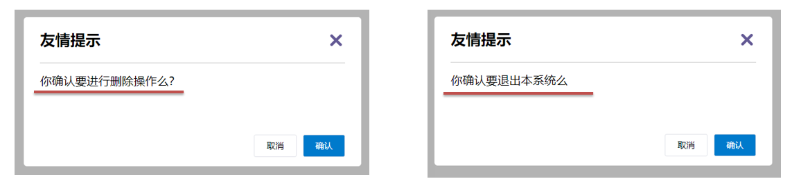
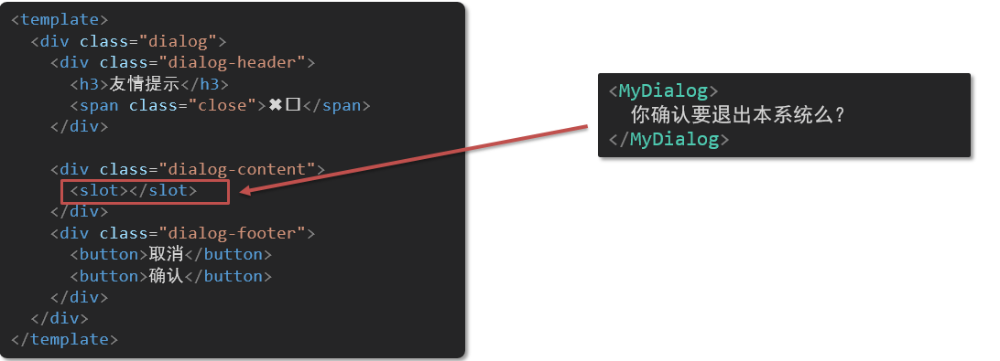
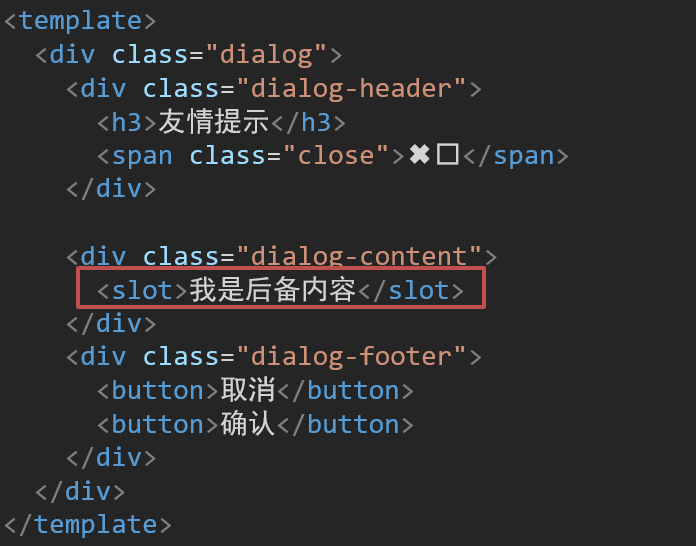
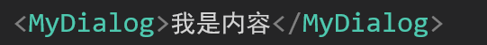
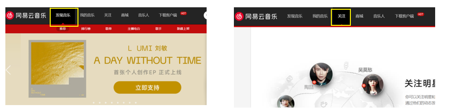

# 🍍day05

<hr/>

[[toc]]

## 一、学习目标

### 1.自定义指令

- 基本语法（全局、局部注册）
- 指令的值
- v-loading的指令封装

### 2.插槽

- 默认插槽
- 具名插槽
- 作用域插槽

### 3.综合案例：商品列表

- MyTag组件封装
- MyTable组件封装

### 4.路由入门

- 单页应用程序
- 路由
- VueRouter的基本使用

## 二、自定义指令

### 1.指令介绍

- 内置指令：**v-html、v-if、v-bind、v-on**... 这都是Vue给咱们内置的一些指令，可以直接使用

- 自定义指令：同时Vue也支持让开发者，自己注册一些指令。这些指令被称为**自定义指令**

  每个指令都有自己各自独立的功能

### 2.自定义指令

概念：自己定义的指令，可以**封装一些DOM操作**，扩展额外的功能

### 3.自定义指令语法

- 全局注册

  ```js
  //在main.js中
  Vue.directive('指令名', {
    "inserted" (el) {
      // 可以对 el 标签，扩展额外功能
      el.focus()
    }
  })
  ```

- 局部注册

  ```vue
  //在Vue组件的配置项中
  directives: {
    "指令名": {
      inserted () {
        // 可以对 el 标签，扩展额外功能
        el.focus()
      }
    }
  }
  ```

- 使用指令

  注意：在使用指令的时候，一定要**先注册**，**再使用**，否则会报错
  使用指令语法： v-指令名。如：`<input type="text"  v-focus/>`

  **注册**指令时**不用**加**v-前缀**，但**使用时**一定要**加v-前缀**

### 4.指令中的配置项介绍

inserted:被绑定元素插入父节点时调用的钩子函数

el：使用指令的那个DOM元素

### 5.代码示例

需求：当页面加载时，让元素获取焦点（**autofocus在safari浏览器有兼容性**）

App.vue

```vue

<div>
  <h1>自定义指令</h1>
  <input v-focus ref="inp" type="text">
</div>
```

### 6.总结

1.自定义指令的作用是什么？

2.使用自定义指令的步骤是哪两步？

## 三、自定义指令-指令的值

### 1.需求

实现一个 color 指令 - 传入不同的颜色, 给标签设置文字颜色

### 2.语法

1.在绑定指令时，可以通过“等号”的形式为指令 绑定 具体的参数值

```html

<div v-color="color">我是内容</div>
```

2.通过 binding.value 可以拿到指令值，**指令值修改会 触发 update 函数**

```js
directives: {
    color: {
        inserted(el, binding)
        {
            el.style.color = binding.value
        }
    ,
        update(el, binding)
        {
            el.style.color = binding.value
        }
    }
}
```

### 3.代码示例

App.vue

```vue

<template>
  <div>
    <!--显示红色-->
    <h2 v-color="color1">指令的值1测试</h2>
    <!--显示蓝色-->
    <h2 v-color="color2">指令的值2测试</h2>
    <button>
      改变第一个h1的颜色
    </button>
  </div>
</template>

<script>
  export default {
    data() {
      return {
        color1: 'red',
        color2: 'blue'
      }
    }
  }
</script>

<style>

</style>
```

## 四、自定义指令-v-loading指令的封装

### 1.场景

实际开发过程中，发送请求需要时间，在请求的数据未回来时，页面会处于**空白状态**  =>  用户体验不好

### 2.需求

封装一个 v-loading 指令，实现加载中的效果

### 3.分析

1.本质 loading效果就是一个蒙层，盖在了盒子上

2.数据请求中，开启loading状态，添加蒙层

3.数据请求完毕，关闭loading状态，移除蒙层

### 4.实现

1.准备一个 loading类，通过伪元素定位，设置宽高，实现蒙层

2.开启关闭 loading状态（添加移除蒙层），本质只需要添加移除类即可

3.结合自定义指令的语法进行封装复用

```css
.loading:before {
      content: "";
      position: absolute;
      left: 0;
      top: 0;
      width: 100%;
      height: 100%;
      background: #fff url("./loading.gif") no-repeat center;
}
```

### 5.准备代码

```html

<template>
    <div class="main">
        <div class="box">
            <ul>
                <li v-for="item in list" :key="item.id" class="news">
                    <div class="left">
                        <div class="title">{{ item.title }}</div>
                        <div class="info">
                            <span>{{ item.source }}</span>
                            <span>{{ item.time }}</span>
                        </div>
                    </div>
                    <div class="right">
                        
                    </div>
                </li>
            </ul>
        </div>
    </div>
</template>

<script>
    // 安装axios =>  yarn add axios || npm i axios
    import axios from 'axios'

    // 接口地址：http://hmajax.itheima.net/api/news
    // 请求方式：get
    export default {
        data() {
            return {
                list: [],
                isLoading: false,
                isLoading2: false
            }
        },
        async created() {
            // 1. 发送请求获取数据
            const res = await axios.get('http://hmajax.itheima.net/api/news')

            setTimeout(() => {
                // 2. 更新到 list 中，用于页面渲染 v-for
                this.list = res.data.data
            }, 2000)
        }
    }
</script>

<style>
    .loading:before {
        content: '';
        position: absolute;
        left: 0;
        top: 0;
        width: 100%;
        height: 100%;
        background: #fff url('./loading.gif') no-repeat center;
    }

    .box2 {
        width: 400px;
        height: 400px;
        border: 2px solid #000;
        position: relative;
    }


    .box {
        width: 800px;
        min-height: 500px;
        border: 3px solid orange;
        border-radius: 5px;
        position: relative;
    }

    .news {
        display: flex;
        height: 120px;
        width: 600px;
        margin: 0 auto;
        padding: 20px 0;
        cursor: pointer;
    }

    .news .left {
        flex: 1;
        display: flex;
        flex-direction: column;
        justify-content: space-between;
        padding-right: 10px;
    }

    .news .left .title {
        font-size: 20px;
    }

    .news .left .info {
        color: #999999;
    }

    .news .left .info span {
        margin-right: 20px;
    }

    .news .right {
        width: 160px;
        height: 120px;
    }

    .news .right img {
        width: 100%;
        height: 100%;
        object-fit: cover;
    }
</style>
```

## 五、插槽-默认插槽

### 1.作用

让组件内部的一些 **结构** 支持 **自定义**



### 2.需求

将需要多次显示的对话框,封装成一个组件

### 3.问题

组件的内容部分，**不希望写死**，希望能使用的时候**自定义**。怎么办

### 4.插槽的基本语法

1. 组件内需要定制的结构部分，改用**<slot></slot>**占位
2. 使用组件时, **<MyDialog></MyDialog>**标签内部, 传入结构替换slot
3. 给插槽传入内容时，可以传入**纯文本、html标签、组件**



### 5.代码示例

MyDialog.vue

```vue

<template>
  <div class="dialog">
    <div class="dialog-header">
      <h3>友情提示</h3>
      <span class="close">✖️</span>
    </div>

    <div class="dialog-content">
      您确定要进行删除操作吗？
    </div>
    <div class="dialog-footer">
      <button>取消</button>
      <button>确认</button>
    </div>
  </div>
</template>

<script>
  export default {
    data() {
      return {}
    }
  }
</script>

<style scoped>
  * {
    margin: 0;
    padding: 0;
  }

  .dialog {
    width: 470px;
    height: 230px;
    padding: 0 25px;
    background-color: #ffffff;
    margin: 40px auto;
    border-radius: 5px;
  }

  .dialog-header {
    height: 70px;
    line-height: 70px;
    font-size: 20px;
    border-bottom: 1px solid #ccc;
    position: relative;
  }

  .dialog-header .close {
    position: absolute;
    right: 0px;
    top: 0px;
    cursor: pointer;
  }

  .dialog-content {
    height: 80px;
    font-size: 18px;
    padding: 15px 0;
  }

  .dialog-footer {
    display: flex;
    justify-content: flex-end;
  }

  .dialog-footer button {
    width: 65px;
    height: 35px;
    background-color: #ffffff;
    border: 1px solid #e1e3e9;
    cursor: pointer;
    outline: none;
    margin-left: 10px;
    border-radius: 3px;
  }

  .dialog-footer button:last-child {
    background-color: #007acc;
    color: #fff;
  }
</style>
```

App.vue

```vue

<template>
  <div>
    <MyDialog>
    </MyDialog>
  </div>
</template>

<script>
  import MyDialog from './components/MyDialog.vue'

  export default {
    data() {
      return {}
    },
    components: {
      MyDialog
    }
  }
</script>

<style>
  body {
    background-color: #b3b3b3;
  }
</style>
```

### 6.总结

场景：组件内某一部分结构不确定，想要自定义怎么办

使用：插槽的步骤分为哪几步？

## 六、插槽-后备内容（默认值）

### 1.问题

通过插槽完成了内容的定制，传什么显示什么, 但是如果不传，则是空白


能否给插槽设置 默认显示内容 呢？

### 2.插槽的后备内容

封装组件时，可以为预留的 `<slot>` 插槽提供后备内容（默认内容）。

### 3.语法

在 `<slot>` 标签内，放置内容, 作为默认显示内容



### 4.效果

- 外部使用组件时，不传东西，则slot会显示后备内容

  

- 外部使用组件时，传东西了，则slot整体会被换掉

  

### 5.代码示例

App.vue

```vue

<template>
  <div>
    <MyDialog></MyDialog>
    <MyDialog>
      你确认要退出么
    </MyDialog>
  </div>
</template>

<script>
  import MyDialog from './components/MyDialog.vue'

  export default {
    data() {
      return {}
    },
    components: {
      MyDialog
    }
  }
</script>

<style>
  body {
    background-color: #b3b3b3;
  }
</style>
```

## 七、插槽-具名插槽

### 1.需求

一个组件内有多处结构，需要外部传入标签，进行定制 

上面的弹框中有**三处不同**，但是**默认插槽**只能**定制一个位置**，这时候怎么办呢?

### 2.具名插槽语法

- 多个slot使用name属性区分名字

  

- template配合v-slot:名字来分发对应标签

  

### 3.v-slot的简写

v-slot写起来太长，vue给我们提供一个简单写法 **v-slot —> #**

### 4.总结

- 组件内 有多处不确定的结构 怎么办?
- 具名插槽的语法是什么？
- v-slot:插槽名可以简化成什么?

## 八、作用域插槽

### 1.插槽分类

- 默认插槽

- 具名插槽

  插槽只有两种，作用域插槽不属于插槽的一种分类

### 2.作用

定义slot 插槽的同时, 是可以**传值**的。给 **插槽** 上可以 **绑定数据**，将来 **使用组件时可以用**

### 3.场景

封装表格组件


### 4.使用步骤

1. 给 slot 标签, 以 添加属性的方式传值

   ```vue
   <slot :id="item.id" msg="测试文本"></slot>
   ```

2. 所有添加的属性, 都会被收集到一个对象中

   ```vue
   { id: 3, msg: '测试文本' }
   ```

3. 在template中, 通过  ` #插槽名= "obj"` 接收，默认插槽名为 default

   ```vue
   <MyTable :list="list">
     <template #default="obj">
       <button @click="del(obj.id)">删除</button>
     </template>
   </MyTable>
   ```

### 5.代码示例

MyTable.vue

```vue

<template>
  <table class="my-table">
    <thead>
    <tr>
      <th>序号</th>
      <th>姓名</th>
      <th>年纪</th>
      <th>操作</th>
    </tr>
    </thead>
    <tbody>
    <tr>
      <td>1</td>
      <td>赵小云</td>
      <td>19</td>
      <td>
        <button>
          查看
        </button>
      </td>
    </tr>
    <tr>
      <td>1</td>
      <td>张小花</td>
      <td>19</td>
      <td>
        <button>
          查看
        </button>
      </td>
    </tr>
    <tr>
      <td>1</td>
      <td>孙大明</td>
      <td>19</td>
      <td>
        <button>
          查看
        </button>
      </td>
    </tr>
    </tbody>
  </table>
</template>

<script>
  export default {
    props: {
      data: Array
    }
  }
</script>

<style scoped>
  .my-table {
    width: 450px;
    text-align: center;
    border: 1px solid #ccc;
    font-size: 24px;
    margin: 30px auto;
  }

  .my-table thead {
    background-color: #1f74ff;
    color: #fff;
  }

  .my-table thead th {
    font-weight: normal;
  }

  .my-table thead tr {
    line-height: 40px;
  }

  .my-table th,
  .my-table td {
    border-bottom: 1px solid #ccc;
    border-right: 1px solid #ccc;
  }

  .my-table td:last-child {
    border-right: none;
  }

  .my-table tr:last-child td {
    border-bottom: none;
  }

  .my-table button {
    width: 65px;
    height: 35px;
    font-size: 18px;
    border: 1px solid #ccc;
    outline: none;
    border-radius: 3px;
    cursor: pointer;
    background-color: #ffffff;
    margin-left: 5px;
  }
</style>
```

App.vue

```vue

<template>
  <div>
    <MyTable :data="list"></MyTable>
    <MyTable :data="list2"></MyTable>
  </div>
</template>

<script>
  import MyTable from './components/MyTable.vue'

  export default {
    data() {
      return {
        list: [
          {id: 1, name: '张小花', age: 18},
          {id: 2, name: '孙大明', age: 19},
          {id: 3, name: '刘德忠', age: 17},
        ],
        list2: [
          {id: 1, name: '赵小云', age: 18},
          {id: 2, name: '刘蓓蓓', age: 19},
          {id: 3, name: '姜肖泰', age: 17},
        ]
      }
    },
    components: {
      MyTable
    }
  }
</script>
```

### 6.总结

1.作用域插槽的作用是什么？

2.作用域插槽的使用步骤是什么？

## 九、综合案例 - 商品列表-MyTag组件抽离


### 1.需求说明

1. **my-tag 标签组件封装**

​    (1) 双击显示输入框，输入框获取焦点

​    (2) 失去焦点，隐藏输入框

​    (3) 回显标签信息

​    (4) 内容修改，回车 → 修改标签信息

2. **my-table 表格组件封装**

​    (1) 动态传递表格数据渲染

​    (2) 表头支持用户自定义

​    (3) 主体支持用户自定义

### 2.代码准备

```vue

<template>
  <div class="table-case">
    <table class="my-table">
      <thead>
      <tr>
        <th>编号</th>
        <th>名称</th>
        <th>图片</th>
        <th width="100px">标签</th>
      </tr>
      </thead>
      <tbody>
      <tr>
        <td>1</td>
        <td>梨皮朱泥三绝清代小品壶经典款紫砂壶</td>
        <td>
          
        </td>
        <td>
          <div class="my-tag">
            <!-- <input 
              class="input"
              type="text"
              placeholder="输入标签"
            /> -->
            <div class="text">
              茶具
            </div>
          </div>
        </td>
      </tr>
      <tr>
        <td>1</td>
        <td>梨皮朱泥三绝清代小品壶经典款紫砂壶</td>
        <td>
          
        </td>
        <td>
          <div class="my-tag">
            <!-- <input
              ref="inp"
              class="input"
              type="text"
              placeholder="输入标签"
            /> -->
            <div class="text">
              男靴
            </div>
          </div>
        </td>
      </tr>
      </tbody>
    </table>
  </div>
</template>

<script>
  export default {
    name: 'TableCase',
    components: {},
    data() {
      return {
        goods: [
          {
            id: 101,
            picture:
                'https://yanxuan-item.nosdn.127.net/f8c37ffa41ab1eb84bff499e1f6acfc7.jpg',
            name: '梨皮朱泥三绝清代小品壶经典款紫砂壶',
            tag: '茶具',
          },
          {
            id: 102,
            picture:
                'https://yanxuan-item.nosdn.127.net/221317c85274a188174352474b859d7b.jpg',
            name: '全防水HABU旋钮牛皮户外徒步鞋山宁泰抗菌',
            tag: '男鞋',
          },
          {
            id: 103,
            picture:
                'https://yanxuan-item.nosdn.127.net/cd4b840751ef4f7505c85004f0bebcb5.png',
            name: '毛茸茸小熊出没，儿童羊羔绒背心73-90cm',
            tag: '儿童服饰',
          },
          {
            id: 104,
            picture:
                'https://yanxuan-item.nosdn.127.net/56eb25a38d7a630e76a608a9360eec6b.jpg',
            name: '基础百搭，儿童套头针织毛衣1-9岁',
            tag: '儿童服饰',
          },
        ],
      }
    },
  }
</script>

<style lang="less" scoped>
  .table-case {
    width: 1000px;
    margin: 50px auto;

    img {
      width: 100px;
      height: 100px;
      object-fit: contain;
      vertical-align: middle;
    }

    .my-table {
      width: 100%;
      border-spacing: 0;

      img {
        width: 100px;
        height: 100px;
        object-fit: contain;
        vertical-align: middle;
      }

      th {
        background: #f5f5f5;
        border-bottom: 2px solid #069;
      }

      td {
        border-bottom: 1px dashed #ccc;
      }

      td,
      th {
        text-align: center;
        padding: 10px;
        transition: all 0.5s;

        &.red {
          color: red;
        }
      }

      .none {
        height: 100px;
        line-height: 100px;
        color: #999;
      }
    }

    .my-tag {
      cursor: pointer;

      .input {
        appearance: none;
        outline: none;
        border: 1px solid #ccc;
        width: 100px;
        height: 40px;
        box-sizing: border-box;
        padding: 10px;
        color: #666;

        &::placeholder {
          color: #666;
        }
      }
    }
  }
</style>
```

### 3.my-tag组件封装-创建组件

MyTag.vue

```vue

<template>
  <div class="my-tag">
    <!--  <input
        class="input"
        type="text"
        placeholder="输入标签" 
      /> -->
    <div
        class="text">
      茶具
    </div>
  </div>
</template>

<script>
  export default {}
</script>

<style lang="less" scoped>
  .my-tag {
    cursor: pointer;

    .input {
      appearance: none;
      outline: none;
      border: 1px solid #ccc;
      width: 100px;
      height: 40px;
      box-sizing: border-box;
      padding: 10px;
      color: #666;

      &::placeholder {
        color: #666;
      }
    }
  }
</style>
```

App.vue

```vue

<template>
  ...
  <tbody>
  <tr>
    ....
    <td>
      <MyTag></MyTag>
    </td>
  </tr>
  </tbody>
  ...
</template>
<script>
  import MyTag from './components/MyTag.vue'

  export default {
    name: 'TableCase',
    components: {
      MyTag,
    },
    ....
</script>
```

## 十、综合案例-MyTag组件控制显示隐藏

MyTag.vue

```vue

<template>
  <div class="my-tag">
    <input
        v-if="isEdit"
        v-focus
        ref="inp"
        class="input"
        type="text"
        placeholder="输入标签"
        @blur="isEdit = false"
    />
    <div
        v-else
        @dblclick="handleClick"
        class="text">
      茶具
    </div>
  </div>
</template>

<script>
  export default {
    data() {
      return {
        isEdit: false
      }
    },
    methods: {
      handleClick() {
        this.isEdit = true
      }
    }
  }
</script> 
```

main.js

```js
// 封装全局指令 focus
Vue.directive('focus', {
    // 指令所在的dom元素，被插入到页面中时触发
    inserted(el) {
        el.focus()
    }
})
```

## 十一、综合案例-MyTag组件进行v-model绑定

App.vue

```vue

<MyTag v-model="tempText"></MyTag>
<script>
  export default {
    data() {
      tempText:'水杯'
    }
  }
</script>
```

MyTag.vue

```
<template>
  <div class="my-tag">
    <input
      v-if="isEdit"
      v-focus
      ref="inp"
      class="input"
      type="text"
      placeholder="输入标签"
      :value="value"
      @blur="isEdit = false"
      @keyup.enter="handleEnter"
    />
    <div 
      v-else
      @dblclick="handleClick"
      class="text">
      {{ value }}
    </div>
  </div>
</template>

<script>
export default {
  props: {
    value: String
  },
  data () {
    return {
      isEdit: false
    }
  },
  methods: {
    handleClick () {
      this.isEdit = true
    },
    handleEnter (e) {
      // 非空处理
      if (e.target.value.trim() === '') return alert('标签内容不能为空')
      this.$emit('input', e.target.value)
      // 提交完成，关闭输入状态
      this.isEdit = false
    }
  }
}
</script> 
```

## 十二、综合案例-封装MyTable组件-动态渲染数据

App.vue

```vue

<template>
  <div class="table-case">
    <MyTable :data="goods"></MyTable>
  </div>
</template>

<script>
  import MyTable from './components/MyTable.vue'

  export default {
    name: 'TableCase',
    components: {
      MyTable
    },
    data() {
      return {
        ....
      }
    },
  }
</script> 
```

MyTable.vue

```vue

<template>
  <table class="my-table">
    <thead>
    <tr>
      <th>编号</th>
      <th>名称</th>
      <th>图片</th>
      <th width="100px">标签</th>
    </tr>
    </thead>
    <tbody>
    <tr v-for="(item, index) in data" :key="item.id">
      <td>{{ index + 1 }}</td>
      <td>{{ item.name }}</td>
      <td>
        
      </td>
      <td>
        标签内容
        <!-- <MyTag v-model="item.tag"></MyTag> -->
      </td>
    </tr>
    </tbody>
  </table>
</template>

<script>
  export default {
    props: {
      data: {
        type: Array,
        required: true
      }
    }
  };
</script>

<style lang="less" scoped>

  .my-table {
    width: 100%;
    border-spacing: 0;

    img {
      width: 100px;
      height: 100px;
      object-fit: contain;
      vertical-align: middle;
    }

    th {
      background: #f5f5f5;
      border-bottom: 2px solid #069;
    }

    td {
      border-bottom: 1px dashed #ccc;
    }

    td,
    th {
      text-align: center;
      padding: 10px;
      transition: all .5s;

      &.red {
        color: red;
      }
    }

    .none {
      height: 100px;
      line-height: 100px;
      color: #999;
    }
  }

</style>
```

## 十三、综合案例-封装MyTable组件-自定义结构

App.vue

```vue

<template>
  <div class="table-case">
    <MyTable :data="goods">
      <template #head>
        <th>编号</th>
        <th>名称</th>
        <th>图片</th>
        <th width="100px">标签</th>
      </template>

      <template #body="{ item, index }">
        <td>{{ index + 1 }}</td>
        <td>{{ item.name }}</td>
        <td>
          
        </td>
        <td>
          <MyTag v-model="item.tag"></MyTag>
        </td>
      </template>
    </MyTable>
  </div>
</template>

<script>
  import MyTag from './components/MyTag.vue'
  import MyTable from './components/MyTable.vue'

  export default {
    name: 'TableCase',
    components: {
      MyTag,
      MyTable
    },
    data() {
      return {
        ....
      }
    }
</script>

```

MyTable.vue

```vue

<template>
  <table class="my-table">
    <thead>
    <tr>
      <slot name="head"></slot>
    </tr>
    </thead>
    <tbody>
    <tr v-for="(item, index) in data" :key="item.id">
      <slot name="body" :item="item" :index="index"></slot>
    </tr>
    </tbody>
  </table>
</template>

<script>
  export default {
    props: {
      data: {
        type: Array,
        required: true
      }
    }
  };
</script>
```

## 十四、单页应用程序介绍

### 1.概念

单页应用程序：SPA【Single Page Application】是指所有的功能都在**一个html页面**上实现

### 2.具体示例

单页应用网站： 网易云音乐  <https://music.163.com/>

多页应用网站：京东  https://jd.com/

### 3.单页应用 VS 多页面应用


单页应用类网站：系统类网站 / 内部网站 / 文档类网站 / 移动端站点

多页应用类网站：公司官网 / 电商类网站

### 4.总结

1.什么是单页面应用程序?

2.单页面应用优缺点?

3.单页应用场景？

## 十五、路由介绍

### 1.思考

单页面应用程序，之所以开发效率高，性能好，用户体验好

最大的原因就是：**页面按需更新**



比如当点击【发现音乐】和【关注】时，**只是更新下面部分内容**，对于头部是不更新的

要按需更新，首先就需要明确：**访问路径**和 **组件**的对应关系！

访问路径 和 组件的对应关系如何确定呢？ **路由**

### 2.路由的介绍

生活中的路由：设备和ip的映射关系


Vue中的路由：**路径和组件**的**映射**关系


### 3.总结

- 什么是路由
- Vue中的路由是什么

## 十六、路由的基本使用

### 1.目标

认识插件 VueRouter，掌握 VueRouter 的基本使用步骤

### 2.作用

**修改**地址栏路径时，**切换显示**匹配的**组件**

### 3.说明

Vue 官方的一个路由插件，是一个第三方包

### 4.官网

<https://v3.router.vuejs.org/zh/>

### 5.VueRouter的使用（5+2）

固定5个固定的步骤（不用死背，熟能生巧）

1. 下载 VueRouter 模块到当前工程，版本3.6.5

   ```bash
   yarn add vue-router@3.6.5
   ```

2. main.js中引入VueRouter

   ```vue
   import VueRouter from 'vue-router'
   ```

3. 安装注册

   ```vue
   Vue.use(VueRouter)
   ```

4. 创建路由对象

   ```vue
   const router = new VueRouter()
   ```

5. 注入，将路由对象注入到new Vue实例中，建立关联

   ```vue
   new Vue({
     render: h => h(App),
     router:router
   }).$mount('#app')
   
   ```

当我们配置完以上5步之后 就可以看到浏览器地址栏中的路由 变成了 /#/的形式。表示项目的路由已经被Vue-Router管理了


### 6.代码示例

main.js

```vue
// 路由的使用步骤 5 + 2
// 5个基础步骤
// 1. 下载 v3.6.5
// yarn add vue-router@3.6.5
// 2. 引入
// 3. 安装注册 Vue.use(Vue插件)
// 4. 创建路由对象
// 5. 注入到new Vue中，建立关联


import VueRouter from 'vue-router'
Vue.use(VueRouter) // VueRouter插件初始化

const router = new VueRouter()

new Vue({
render: h => h(App),
router
}).$mount('#app')
```

### 7.两个核心步骤

1. 创建需要的组件 (views目录)，配置路由规则

   

2. 配置导航，配置路由出口(路径匹配的组件显示的位置)

App.vue

```vue
<div class="footer_wrap">
  <a href="#/find">发现音乐</a>
  <a href="#/my">我的音乐</a>
  <a href="#/friend">朋友</a>
</div>
<div class="top">
  <router-view></router-view>
</div>
```

### 8.总结

1. 如何实现 路径改变，对应组件 切换,应该使用哪个插件?
2. Vue-Router的使用步骤是什么(5+2)?

## 十七、组件的存放目录问题

注意： **.vue文件** 本质无区别

### 1.组件分类

.vue文件分为2类，都是 **.vue文件（本质无区别）**

- 页面组件 （配置路由规则时使用的组件）
- 复用组件（多个组件中都使用到的组件）


### 2.存放目录

分类开来的目的就是为了 **更易维护**

1. src/views文件夹

   页面组件 - 页面展示 - 配合路由用

2. src/components文件夹

   复用组件 - 展示数据 - 常用于复用

### 3.总结

- 组件分类有哪两类？分类的目的？
- 不同分类的组件应该放在什么文件夹？作用分别是什么？

## 十八、路由的封装抽离

问题：所有的路由配置都在main.js中合适吗？

目标：将路由模块抽离出来。 好处：**拆分模块，利于维护**


路径简写：

**脚手架环境下** @指代src目录，可以用于快速引入组件

总结：

- 路由模块的封装抽离的好处是什么？
- 以后如何快速引入组件？