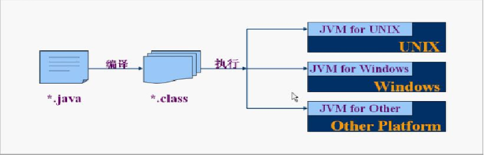
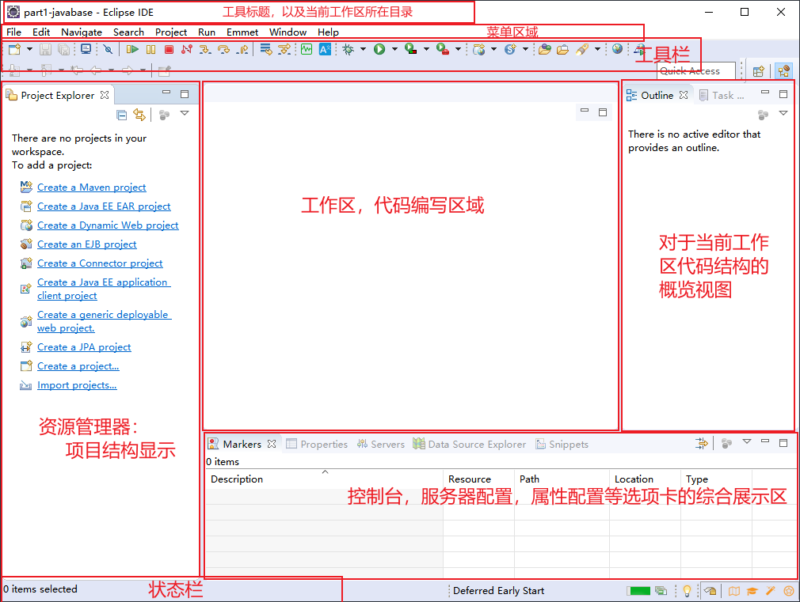
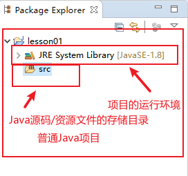
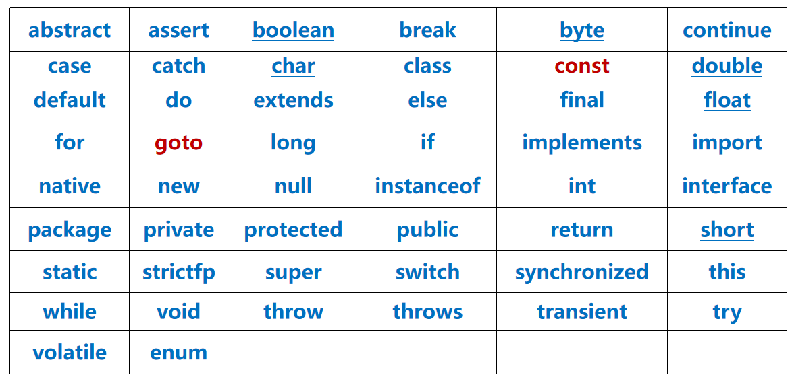
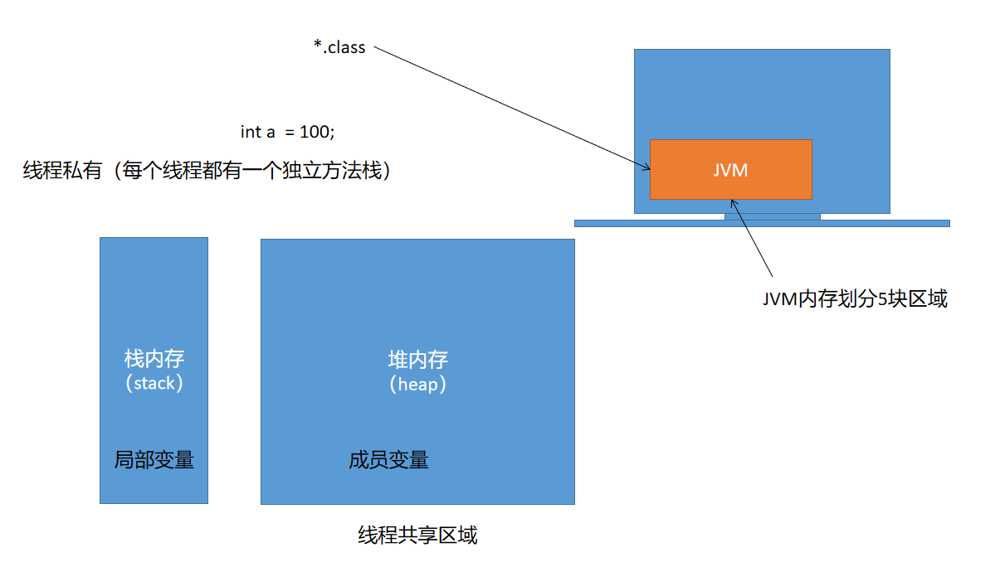

# 01 - 进入 Java 的世界 :tada:

[[toc]]

## Java 概述

### Java 是什么？

语言：与人(或者其他对象)交流

编程语言:跟计算机交流

从机器语言-->汇编语言--->C 语言(面向过程)-->C++(半面对象语言)-->Java(纯面向对象)

桑子明来教室学习

面向过程：

所在地->出门->坐上交通工具->到楼下-->上楼->进教室

面向对象:

赵元坤.学习(交通工具)

### Java 可以做什么？

- 游戏开发
- 桌面软件
- **网站开发**
- **手机软件开发(Android)**
- **大型软件服务端开发(抖音，头条，支付宝，健康码)**
- **大数据开发**
- **嵌入式系统开发**

### Java 的发展史？

1990 初期，Green 计划成立

1995 年，Java 正式发布，免费开源

1998 年 12 月，Jdk1.2 发布，同时发布 JSP/Servlet，将 java 分为三个版本：**J2SE（java 标准版本）**、J2ME（java 微系统版本）、**J2EE（java 企业级版本）**

2004 年 10 月，JDK1.5 发布，将三个版本重新命名:JavaSE、JavaME、JavaEE.

> 版本发布：
>
> 长期支持版(LTS)：java8、java11 每三年发布一个长期支持版
>
> 非长期支持: 每六个月一次更新

### Java 的学习路线？

1. **java 基础语法**
2. 面向对象编程
3. 常用类和集合框架
4. java 高级
5. 数据库与数据库编程
6. web 前端技术
7. Javaweb 基础(服务器，servlet 与动态网页技术)
8. 框架技术(SSM、SpringBoot)
9. 微服务与分布式（SpringCloud）

## 开发环境配置

### 安装 JDK&JRE

- JDK：java 开发工具集，包含一系列用于操作 java 程序，字节码文件的工具，比如编译工具，文档工具，打包工具等
- JRE：java 运行环境，主要包含的用于支持 java 程序运行的类库，Java 虚拟机(JVM)

### 环境变量配置

环境变量，为了告诉其他需要基于 java 环境运行的软件，jdk 所在的路径；以及可以快捷的通过 cmd 操作 java 相关的工具

环境变量配置分为两步:

1. 配置 JAVA_HOME:JDK 所在的安装路径（默认位置:C:\Program Files\Java\jdk1.8.0_101）
2. 配置 Path：JDK 所在的安装路径的 bin 目录(默认位置:%JAVA_HOME%\bin)
3. 配置 Classpath：配置字节码文件所在地址（**JDK5 之后，会自动寻找当前目录下的字节码文件，因此不再需要配置**）

## Java 程序编写与执行

### HelloWorld

```java
//创建一个类，类名称是HelloWorld
public class HelloWorld {
    //程序的入口，main函数，main方法
    public static void main(String[] args) {
        //系统输出，在命令窗口(控制台)打印一行文本
        System.out.println("不积小流无以成江海，不积跬步无以至千里");
    }
}
```

语法：

```
类的定义{

    入口的声明(){
        //执行体
    }

}
```

### Java 程序运行原理

java 是一门高级语言；是一门跨平台的语言(一次编写，运行在任何支持 JVM 的操作系统中：windows,mac,linux)，集编译和解释为一体，任何一个 java 文件在执行前都需要经过一个编译的过程，然后再通过 JVM 执行.



1. 先将 Java 源文件（\*.java）编译为字节码文件（\*.class）

   ```bash
   javac HelloWorld.java
   ```

2. 通过 jvm 运行字节码文件（\*.class）

   ```java
   java HelloWorld
   ```

> 常见的 windows 命令
>
> 1.  进入指定盘符（进入 d 盘）
>
> ```bash
> d:
> ```
>
> 2.  进入当前盘符的根目录
>
> ```bash
> cd \
> ```
>
> 3.  列出当前目录下所有资源
>
> ```bash
> dir
> ```
>
> 4.  进入指定目录
>
> ```bash
> cd 目录名
> ```
>
> > `.`表示当前目录
> >
> > `..`表示上一级目录

### 代码编写基本规范

1. Java 程序的最基本单元是 class
2. 一个 java 文件中只能存在一个 public class
3. 文件名称必须和公共的类名称保持一致(包括大小写)
4. 括号成对出现
5. 开始花括号之前保留一个空格
6. 左大括号开始之后的代码，保持缩进(一般 4 个空格)
7. 一行语句结束之后使用`;`(**英文半角**)

## Java 基础语法

### 注释

注释即对代码的解释，Java 中的注释一共包含三种方式:

1. 单行注释

   ```java
   //单行注释，改行代码用于对以下语句解释，不会被编译器编译
   System.out.println("helloWorld");
   ```

2. 多行注释

   ```java
   /*
   	多行注释，当一行注释编写不下时，
   	换行继续进行代码解释
   */
   System.out.println(a > b ? a : b);
   ```

3. 文档注释

   ```java
   /**
   * 比较两个数的大小，返回较大的一个
   * @param a 第一个整数
   * @param b 第二个整数
   * return 返回两数中较大的一个
   */
   public int max(int a,int b){
       return a > b ? a : b;
   }

   ```

   文档注释可以基于`javadoc`命令生成 API 文档，用于提供对代码的文档解释，常见于公司内部的工具项目，或者开源项目,使用命令如下:

   ```bash
   javadoc -d api HelloWorld.java
   ```

   > `javadoc` 表示生成文档
   >
   > `-d api` 表示在当前目录下创建 api 目录
   >
   > `HelloWorld.java` 需要生成文档的源代码文件

### 集成开发环境

java 程序开发的工具选择，分为两种类别：1.文本编辑器，2.集成开发环境

#### 文本编辑器

- 记事本
- editplus
- notepad++
- sublimeText
- VSCode

#### 集成开发环境(IDE - All in one)

- **Eclipse**
  - 安装版
  - **解压缩版**
- MyEclipse
- Netbeans
- JCreator
- JBuilder
- **InteillJ IDEA**
  - 社区版(免费)
  - **旗舰版(收费)**

##### Eclipse 基本使用





### 关键字&标识符

#### 关键字（keyword）

​ Java 中包含一系列用作于特殊用途的英文单词，比如，定义一个类使用：`class`;声明一个方法没有返回值类型使用：`void`；定义一个软件包使用：`package`；**所有的英文单词都是小写的**；以上这些在 Java 中都称之为关键字。Java 中包含的所有关键字如下:



> **null**,**true**,**false**:严格意义上属于值，不包含在关键字范畴
>
> **goto**和**const**在 Java 中作为保留关键字，不允许使用

#### 标识符（identifier）

Java 中除关键字以外，凡是由程序自己命名的元素都称之为标识符;java 中可以由程序自己命名的元素包含以下：

1. 包名称
2. 类名称
3. 变量名
4. 方法名

##### 标识符命名规范

1. 标识符命名必须遵循见名知义
2. 尽量使用英文单词(拼音)作为标识符名称
3. 标识符严格区分大小写
4. **包名称建议全部使用小写英文单词**
5. **类名称使用驼峰式(大驼峰)写法，首字符大写，如果是多个单词组合而成，每个单词的首字符都大写，中间不能留空格**
6. **变量名和方法名使用驼峰式(小驼峰)写法，首字符小写，如果由多个单词组合而成，除第一个单词外，其余的每个单词首字符大写**

##### 注意事项

1. 标识符中不能出现除\_和“\$” 之外的其他任何特殊符号 ("$","\_"可以出现在标识符的任意位置)
2. 数字只能出现在中间和末尾,不能在开头.
3. 空格不能出现在标识符之间
4. 关键字不能作为标识符名称
5. 不要使用 JDK 中内置的类名称作为标识符名称，可能会导致不可预料的后果
6. 不要使用中文作为标识符名称

### 变量入门（variables）

java 中数据的呈现方式分为两种形式：

1. 常量（不可改变的数据值）

   常量在 Java 中一般用于表示某一个特定值，而且该值一旦使用则无法改变，因此称之为**常量**

   1. 直接量

      ```java
      System.out.println("helloworld"); //字符串直接量
      System.out.println(100); //整型直接量
      System.out.println(3.14); //浮点型直接量
      System.out.println('中'); //字符直接量
      System.out.println(true); //布尔类型直接量
      //		System.out.println(null); //null对象直接量
      ```

   2. 自定义常量

      ```java
      public static final String GAME_NAME = "CXK 打篮球？or 打飞机？";
      ```

2. 变量（可以更改的数据）

   编程语言中用于描述数据的最基本的单元称之为变量；变量的定义实际就是在向 JVM 申请内存空间；变量的定义语法：

   ```
   数据类型 变量名称 [= 初始值]
   ```

   例如:

   ```java
   int i = 10;
   String s = "helloworld";
   double d = 3.14;
   boolean b = false;
   ```

   #### 变量的使用位置

   变量的定义可以在一个 Java 程序的多个位置出现：

   1. 类结构中直接定义
   2. 方法的参数中定义
   3. 方法结构体中定义
   4. 其他语句块(分支，循环，游离块，构造器)

   根据变量的定义位置不同，称呼也存在区别，Java 中的变量分为两种：

   1. 全局变量

      **类结构中直接定义的变量称之为全局变量**

   2. 局部变量

      **除类结构之外，其他任何地方定义的变量都称之为局部变量**

   > Java 中局部变量和成员变量分别存储在哪个区域？
   >
   > 
