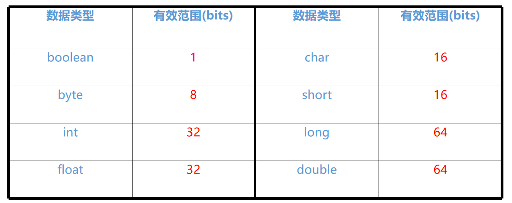
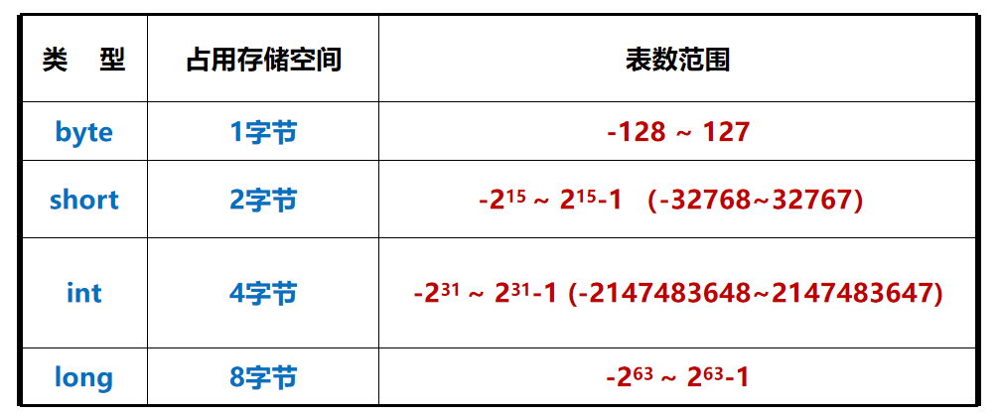
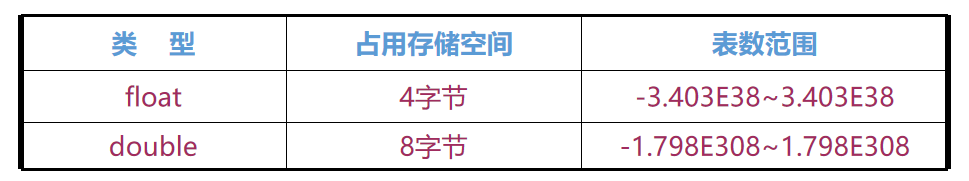
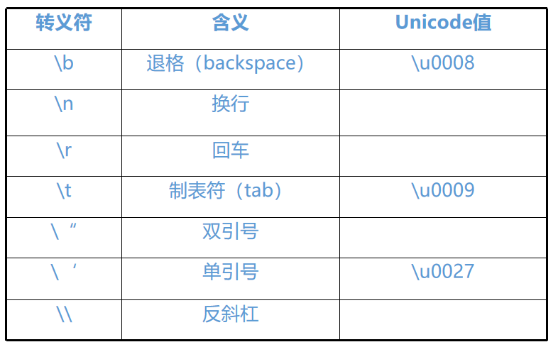
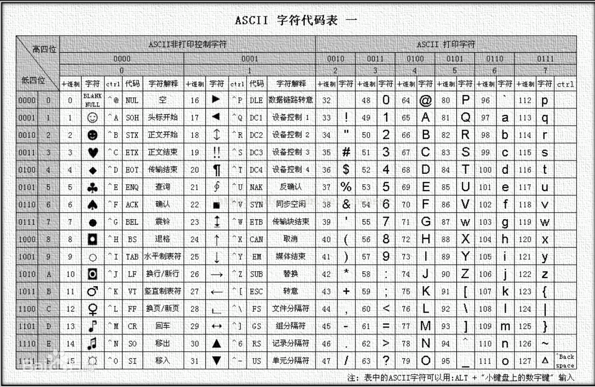
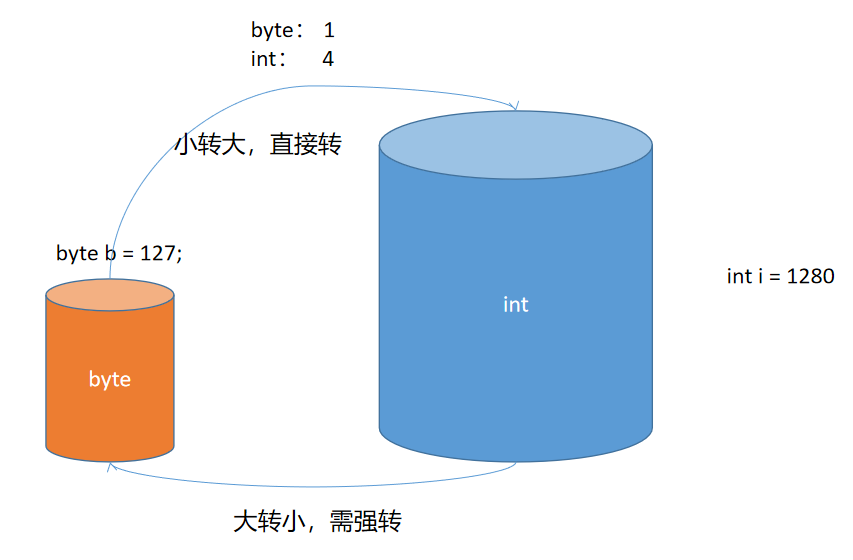
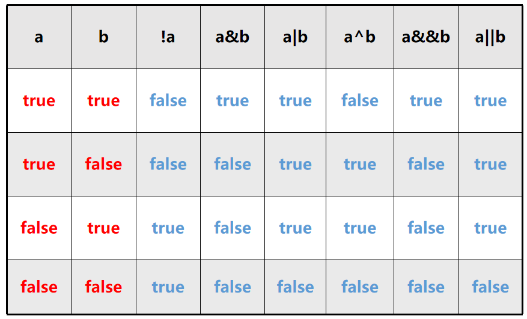
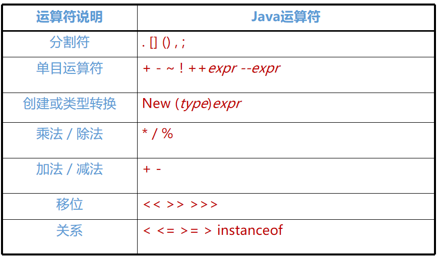
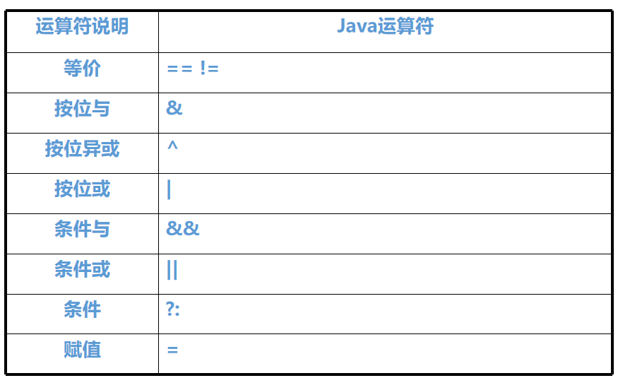

# 02 - Java 基础语法 :sunglasses:

[[toc]]

## 数据类型

​ 在 java 开发中，大多数时间都是在对数据进行操作，比如:登录，注册，搜索商品，下订单，转账等。既然是数据，就有类型之分；不同的数据类型也不同。

java 是一门强类型(弱类型：JavaScript、python)语言，任何的变量在声明之前都必须显式的指定其数据类型，并且，在使用过程中数据类型不能够改变。Java 中的数据类型分为两个大类：第一类称之为**基本数据类型**；第二类称之**引用数据类型**（面向对象）。

### 基本数据类型

基本类型数据也称之为简单类型，通常用于描述一个基本值，比如说：一个整数，一个字符，一个小数，一个 true、false 值等；java 中的基本类型数据分为以下四类八种：

- 整数类型（byte short int long）

- 浮点类型（float double）

- 字符类型（char）

- 布尔类型（boolean）

  

#### 整数类型

整数类型一般用于表示一个整数（包含正负数），整数类型主要包含 4 个：

- **byte**（文件操作时常用）
- **short**
- **int**（推荐）
- **long**（时间毫秒数，文件字节数）



```java

//0000 1111    15? 二进制表示  逢二进一
//1*2^3+1*2^+1*2^1+1
// 0000 0101
byte b = -128;

long lon = 12345678901L;

//Jdk1.7新增
lon = 1_232_347_979_793_423_424L;

System.out.println(Integer.toBinaryString(b));
```

注意事项:

1. java 中默认的整数类型是 int
2. 任何整数类型的运算结果都会转换为 int 类型
3. 声明 long 类型变量时，数据值必须在末尾跟上“L”

> 计算机基础知识:
>
> 1 字节(byte) = 8 位(bits) 计算机底层能够识别的只能是 0 和 1
>
> 0000 0000 ~ 1111 1111
>
> 十进制和二进制之间转换
>
> 1024 字节=1KB
>
> 1024KB=1MB
>
> 1024MB=1GB
>
> 1024GB=1TB

#### 浮点类型

java 中对于小数类型的表示称之为浮点类型，浮点类型包含两种：

1. float

2. double

   

   ```java
   float f = 3.1415926F;
   double d = 3.1415926;

   double d1 = 0.1;
   double d2 = 0.2;
   System.out.println(d1 + d2);
   //以上输出预期结果是：0.3
   //实际结果：0.30000000000000004 (精度丢失问题)
   //java.util.BigDecimal 引用类型
   ```

注意事项；

1. java 中默认的浮点数类型为 double
2. 表示一个 float 类型的数据必须在数值末尾追加“f”或“F”
3. 浮点类型一般用于对精度要求不高的运算中 0

> 浮点类型的概念源之于科学计数法，比如表示一个大数值(**10045.6**)可以按如下方式表示:
>
> 1.00456 \* 10^4
>
> 10.0456 \* 10^3
>
> 0.100456 \* 10^5

#### 字符类型

Java 中对于单个字符提供了一个 char 类型表述，区别于 String 类型（String 用于表示一个字符串）

```java
String s = "hello";
char c = 'c';
```

通过以上观察得知 String 类型用于表示一个字符串，值必须包含在双引号之间；而 char 类型用于表示一个字符，并且字符包含在单引号之间。char 类型除了可以表示单个英文字符外，还能表示中文字符，特殊符号等：

```java
char c1 = '中';
```

关于转义符号“\”，java 中对于特殊的符号可以使用“\”转义：

```
\b  \t  \n  \f  \r  \"  \'  \\
```



```java
//char类型占据存储空间是两个字节
char c1 = 'a';
char c2 = 'A';
char c3 = '中';
//java中 "\"表示一个转义符号
//比如: \n 换行  \t表示制表符
char c4 = '\n';
//16进制  0-9 A-F    Unicode码
char c5 = '\u0009'; //表示制表符(tab) \t

System.out.println("hello"+c5+"world");
//打印购物小票
System.out.println("=======软帝超市 消费单========");
System.out.println("序号\t商品名\t数量\t价格");
System.out.println("1\t旺仔牛奶\t5\t25.0");
System.out.println("2\t牛肉面\t2\t10.0");
System.out.println("3\t雷碧\t5\t15.0");
System.out.println("==============================");
//补全总价
System.out.println("总价\t\t\t￥50.0");

//如何在控制台输出 " ?
System.out.println('"');
//输出 name="admin"
System.out.println("name=\"admin\"");
// 输出一个文件的地址： d:\java\test\HelloWorld.java

System.out.println("d:\\java\\test\\HelloWorld.java");
```



> String 不是基本类型数据，是 JDK 中提供一个引用类型数据
>
> char 类型一般用于字符转码(编码转换)；String 的内部实现原理基于 char 类型(String 本质上就是一个 char 数组)

#### 布尔类型

​ 布尔类型通常用于表示 true 或者 false 值，**只占一个二进制位**；因此布尔的取值只能是 0 和 1(这是 c 语言的用法)；但是 Java 中只允许用 true 和 false 表示 boolean 的值。布尔类型一般用于一些逻辑判断中，比如条件分支，循环的判断。

```java
//True  False
boolean b = true;
boolean b2 = false;
System.out.println(b);
```

### 数据类型转换

​ 在实际的项目经常会涉及到许多不同的基本类型数据的交替使用，因此，不同的基本数据类型之间会涉及到一些转换需求；java 中基本类型数据的转换遵循以下原则：

- 小转大，直接转
- 大转小，需强转



实现语法:

```java
//初始化
byte byt = 120;
//赋值
int i = byt;
System.out.println(i);

i = 128;
//强制类型转换(在需要被转换的变量或者值之前使用小括号，括号中写入需要转换成为的目标数据类型的类型名称)
byt = (byte)i;

long log = 1234567890123L;
i = (int)log;
System.out.println(i);
```

> 思考题:
>
> 观察代码：short s = 10; s = s + 10；请问 s=?
>
> ```java
> short s = 10;
> s = s + 10;//编译错误
> /*
> java中任何的整数类型运算都会被转换为int结果，
> 因此上述代码 s + 10的结果是int类型数据，不能直接
> 赋值给short类型的s，所以需要强制类型转换
> */
> s = (short)(s + 10);
> ```

### 引用数据类型

​ 之前所有的基本类型数据都是用于表示一个简单的值，比如:一个整数，一个字符，一个小数，一个 true、false 值；如果需要表示一个人，一只狗或者一条订单信息；对于以上复杂的数据来说，单纯使用一个基本类型的数据无法全面表示；

​ 所以，对于以上的需求无法通过一个基本类型数据来表示，因此，java 中针对一些复杂的数据还提供了一种特殊的数据类型-----**引用数据类型**

​ 引用类型的呈现方式通常以一个类的形式存在，这里就涉及到了 java 中面向对象程序设计。java 中的引用类型包含以下三类:

1. **类的引用**
2. **数组的引用**
3. **接口的引用**

```java
//类
class People{

}

//接口
interface flyable{

}

//数组
String[] args
```

## 运算符

Java 中提供了大量的用于操作数据的运算符号，这些运算符号分为以下几类:

- 算术运算符
- 关系运算
- 布尔逻辑运算
- 位运算符
- 三目运算
- 其他(扩展赋值，字符串拼接，赋值，造型)

### 算术运算

算术运算符主要用于对基本类型的数据（整数，小数）进行类似加减乘除等算术运算；二元运算符

| 符号  | 说明                                                                           |
| ----- | ------------------------------------------------------------------------------ |
| +     | 对两个运算数进行相加运算                                                       |
| -     | 对两个运算数进行相减运算                                                       |
| \*    | 对两个运算数进行相乘运算                                                       |
| /     | 对两个运算数进行相除运算                                                       |
| %     | 对两个运算数进行取余数，获取两个数相除之后除不尽结果，比如 10 % 3 = 1 余数为 1 |
| ++/-- | 自增自减，对变量进行自增自减操作；符号可以出现在运算数的左右两侧               |

```java
int i = 10;
double j = 4.0;

j = i / j;
System.out.println(j);

int a = 16;
int b = 3;
System.out.println(a % b);

// 0~4;
b = 5;
System.out.println(a % b);

/*
 自增自减运算符在运算数的前后结果是存在区别的
 如果符号在运算数之前，则先运算再使用
 如果符号在运算数之后，则先使用再运算
*/
System.out.println(b++); //5
System.out.println(b); //6

System.out.println(j++);
System.out.println(j);
```

> 算术运算注意事项:
>
> 1.  任何整数类型进行算术运算都会将结果转换为 int 类型
> 2.  任何数值类型跟浮点进行算术运算都会转换为 double 类型

### 关系运算符

关系运算一般用于对于基本类型数据的大小比较，等于比较，另外也可以对两个引用类型对象的地址进行比较，java 中的关系运算包含以下符号:

| 符号 | 说明     |
| ---- | -------- |
| >    | 大于     |
| <    | 小于     |
| \>=  | 大于等于 |
| <=   | 小于等于 |
| ==   | 等于     |
| !=   | 不等于   |

```java
int a = 10;
int b = 10;

boolean f = a >= b;

System.out.println(a > b);
System.out.println(a < b);
System.out.println(a == b);
System.out.println(a <= b);
System.out.println(a != b);
System.out.println(f);

String s1 = "hello";
String s2 = "hello";
//==在对引用类型数据比较时，比较的是两个类型的地址
System.out.println(s1 == s2); //true
System.out.println(s1 != s2); //false
```

> 关系运算注意事项:
>
> 1.  关系运算符运算之后的结果是布尔类型
> 2.  ==和!=可以用于对引用类型对象的地址比较

### 布尔逻辑运算

java 后期主要应用于一些商业化的服务端业务逻辑操作，因此会包含很多有关业务逻辑判断等，运算符也因此包含了布尔逻辑运算等符号，如：与，或，非

| 符号 | 说明                                                    |
| ---- | ------------------------------------------------------- |
| &    | 逻辑与                                                  |
| \|   | 逻辑或                                                  |
| !    | 非                                                      |
| &&   | 短路与                                                  |
| \|\| | 短路或                                                  |
| ^    | 亦或(如果两个都一样则为 false 如果两个不一样 则为 true) |



```java
Scanner sc = new Scanner(System.in);
System.out.println("请输入三个整数");
int a = sc.nextInt();
int b = sc.nextInt();
int c = sc.nextInt();

System.out.println(a > b && a > c++);

System.out.println(c);
```

> 注意事项:
>
> 1.  布尔逻辑运算的操作数都是 boolean 类型变量
>
> **&和&&区别？**
>
> &:逻辑与，在进行运算时不论运算符左侧的表达式结果是否为 true，右侧的表达式始终会执行；
>
> &&:短路与，在进行运算时一旦运算符左侧的表达式结果为 false，则右侧表达式不再执行

### 位运算

计算机底层最终只能够识别 0 和 1，不论多么复杂的表达式，到计算机底层都会进行二进制加法运算，java 中对于位运算包含以下运算符号:

| 符号 | 说明       |
| ---- | ---------- |
| ~    | 取反       |
| &    | 按位与     |
| \|   | 按位或     |
| ^    | 按位异或   |
| \>>  | 右移       |
| <<   | 左移       |
| \>>> | 无符号右移 |

**引入:如何以最快的速度将 8 变为 2**

```java
int i = 8;
//上述的变量表示为二进制如下
// 0000 0000 0000 0000 0000 0000 0000 1000
i = i >> 2; //结果：2

//如何将上面的变量i变为16
i = i << 3;
```

### 三目运算

三目运算符也称之三元运算，运算符具备逻辑判断的功能，语法：

```
布尔类型表达式 ? 结果1 : 结果2
```

基本案例:

```java
Scanner sc = new Scanner(System.in);
int a = sc.nextInt();
int b = sc.nextInt();

int r = a > b ? a : b;
System.out.println(r);
```

复杂的三目运算使用:

```java
//输入一个分数(0~100)，根据该分数所在的区间显示分数对应的等级（ABCDE）
// <60 E
// <70 D
// <80 C
// <90 B
// >=90 A
public static void main(String[] args) {

    Scanner sc = new Scanner(System.in);
    int s = sc.nextInt();

    char c = s < 60 ? 'E' :
    			s < 70 ? 'D' :
    				s < 80 ? 'C' :
    					s < 90 ? 'B' : 'A';

    System.out.println(c);
}
```

### 其他运算符

- 扩展赋值运算（+= -= \*= /=）
- 字符串拼接运算（+）
- 造型运算（(type)）

```java
byte a = 10;

//		a = a + 10;
//具备类型转功能
a += 10; //a = a + 10;
System.out.println(a);
//任何的数据类型跟字符串相加都会转换为字符串类型
System.out.println(10 + 20 + 30 + "40");
System.out.println("10" + 20 + 30 + 40);
//int:4  char:2   0~9  48~57
System.out.println(10 + 20 + 30 + '4');

// ascii码
System.out.println((int)'4');

int i = 10;
int j;
int k;
//从右往左赋值
k = j = i;

System.out.println(k + "/" + j);
```

### 运算符的优先级

不同的运算符计算顺序也不同，比如数学中：先乘除出后加减；Java 中的运算符优先级如下:





实际开发中一切以可读性为主，所以对于运算的优先级问题可以通过（）解决。不需要记忆符号的优先级。

## 标准输入和随机数

### Scanner 基本使用

Scanner 是 JDK 中内置的一个类，可以用于对系统输入内容扫描，读取控制台输入的数据，具体使用方式如下：

```java
public static void main(String[] args){

    Scanner sc = new Scanner(System.in);
    //获取控制台输入的整数
    int i = sc.nextInt();

}
```

> 注意：
>
> 在使用 Scanner 类时需要将 Scanner 所在的包导入到当前类中，在类定义之前添加以下代码:
>
> ```java
> import java.util.Scanner;
> ```

### Math 类与随机数使用

​ java 中提供了一个 Math 类，是一个工具类，内部主要包含的是一些工具方法，比如，求两数的最大值，最小值，绝对值，四舍五入，随机数；这些所有的方法都可以直接通过类名称调用。

```java
//随机获取从0.0~1.0(不包含)之间浮点数
//0.000000~0.999999
//0~9.999999  + 1
double d = Math.random();
System.out.println(d);

//随机1~10之间的整数？
int i = (int)(Math.random() * 10) + 1;
System.out.println(i);

//随机从[0,10]之间的整数   开闭区间   0.99 * 11
i = (int)(Math.random() * 11);
System.out.println(i);

//随机获取从[5,10]之间的值？
i = (int)(Math.random() * 6) + 5;
System.out.println(i);
```
