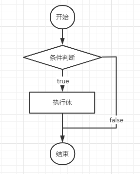
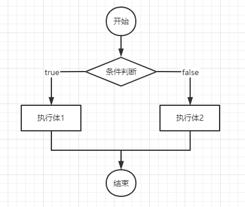
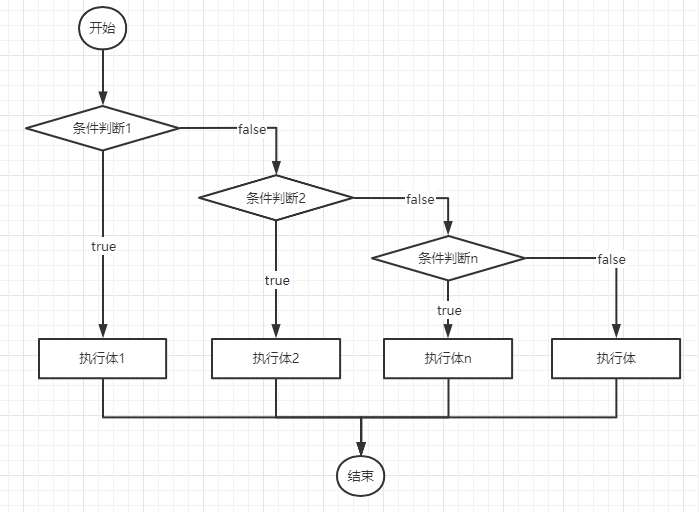
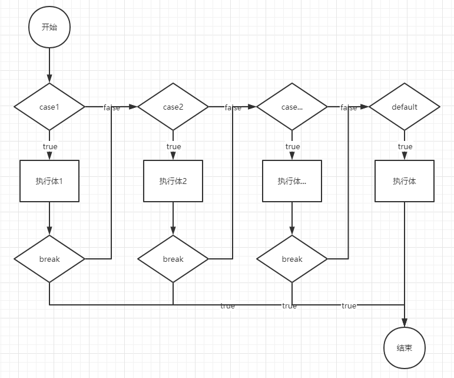
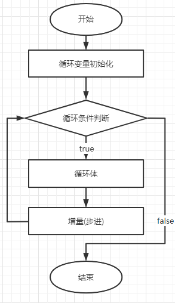
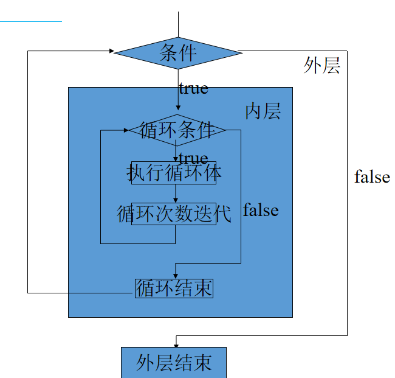

# 03 - 基础语法（流程控制）:robot:

[[tOC]]

​ 到目前为止，所有 Java 程序的执行从 main 方法开始，从上向下顺序执行，是一种典型的顺序结构；但是由于后续业务需求的变化，程序的执行不一定顺序执行，比如有多个分支，根据不同条件分支执行；有一些重复的动作需要反复执行，因此除了顺序结构，Java 中还提供了另外两种执行结构：

1. 分支结构
2. 循环结构

## 分支语句

Java 中的分支语句分为两种常见结构：

- if...else...
- switch

### if 语句

基本语法结构

```
if(布尔条件表达) {
    //条件成立时执行
}else {
    //条件不成立时执行
}
```

> 程序员买西瓜：
>
> 一天程序员老婆对程序员说:你去买个西瓜，路上如果看到买包子的就买两个回来！

#### if 结构分类

if 的结构分为三种：



```java
//根据输入的一个年份，如果该年份是闰年，则输出”闰年“ 否则不做任何操作
Scanner sc = new Scanner(System.in);
int y = sc.nextInt();
if((y % 4 == 0 && y % 100 != 0)  || y % 400 == 0) {
    System.out.println(y+"是闰年");
}
```



```java
int i = 1234;

if(i == 123) {
    System.out.println("登录成功");
} else {
    System.out.println("登录失败");
}
```



```java
// 输入一个商品（康帅傅牛肉面）的单价，以及购买数量，根据购买数量的不同
// 给予客户不同的折扣，具体折扣如下:
// 小于3件 原价
// [3,5) 95折
// [5,10) 9折
// [10,20) 8折
// >=20 7折
// 求总价格？
public static void main(String[] args) {

    Scanner sc = new Scanner(System.in);
    System.out.println("请输入商品的单价:");
    int price = sc.nextInt();
    System.out.println("请输入购买数量:");
    int count = sc.nextInt();

    double offset = 0.0;
    if (count < 3) {
        offset = 1.0;
    } else if (count < 5) {
        offset = 0.95;
    } else if (count < 10) {
        offset = 0.9;
    } else if (count < 20) {
        offset = 0.8;
    } else {
        offset = 0.7;
    }
    System.out.println("购买了" + count + "件商品，单价:" + price + ",折扣:" + offset);
    double total = price * count * offset;
    System.out.println("总价："+total);
}

```

> 对于 if...else...语句如果执行体中只有一行语句需要执行，则可以省略“{}”
>
> if...else...分支语句主要对于布尔逻辑结果判断，以及区间值的判断；

### switch 语句

对于一些固定数据值的判断，Java 中提供的 switch 更加实用



#### 语法

```java
switch(变量){
    case 值1：
        //执行体
        break;
    case 值2:
        //执行体
        break;
        ....
            default:
        //以上所有的值都不满足的情况下执行 类似 else
        break;
}
```

```java
Scanner sc = new Scanner(System.in);
int i = sc.nextInt();
switch(i) {
    case 1:
        System.out.println("释放Q技能");
        break;
    case 2:
        System.out.println("释放W技能");
        break;
    case 3:
        System.out.println("释放E技能");
        break;
    case 4:
        System.out.println("释放R技能");
        break;
    default:
        System.out.println("骚年，请输入正确的数字");
        break;
}
```

**switch 支持的数据类型包含以下：**

1. **byte short int**
2. **char**
3. **String （JDK1.7+）**
4. **enum（枚举，JDK1.5+）**

> if 和 switch 区别：
>
> if 主要对布尔结果判断，多数时候用于区间值的分支判断
>
> switch 一般用于对于确定值的判断

### 枚举类型入门

枚举即将有限的固定值列举出来，比如：性别只有：男，女；季节只有春夏秋冬等；

语法：

```java
//声明枚举类型 Season
public enum Season {
    //枚举值
	SPRING,
	SUMMER,
	AUTUMN,
	WINTER
}
```

使用:

```java
public static void main(String[] args) {

    Season s = Season.WINTER;

    switch(s) {
        case SPRING:
            System.out.println("春暖花开，野狗撒欢");
            break;
        case SUMMER:
            System.out.println("小荷才露尖尖角，早有蜻蜓立上头");
            break;
        case AUTUMN:
            System.out.println("停车坐爱枫林晚，霜叶红于二月花");
            break;
        case WINTER:
            System.out.println("北国风光，万里飘雪");
            break;
    }

}
```

## 循环语句

在以上对于条件分支的案例中，发现，有些程序在执行过程中如果不满足条件需要重复执行，而分支语句没法做到反复执行的能力，因此，Java 中提供对于循环操作相关的解决方案；

循环可以用于反复执行某一个代码片段，必须循环打印输出，对某些结果集的遍历操作；Java 中的循环方分为以下几类:

1. **for 循环**
2. **while 循环**
3. **do...while 循环**
4. \*forEach
5. \*递归

### for 循环

**for 循环流程图**



**语法：**

```
for(初始变量;条件判断;更改变量) {
    //循环体
}
```

```java
for(int i = 1; i <= 100; i++) {
    System.out.println(i);
}
```

### while 循环

java 中 while 循环包含两种呈现方式：

1. while
2. do...while

#### while 语法

```java
while(条件判断){
    //循环体
}
```

```java
int i = 1;
while(i <= 100) {
    System.out.println(i);
    i++;
}
```

#### do...while 语法

```
do{
    //循环体
}while(条件判断)
```

```java
int j = 1;
do {
    System.out.println(j);
    j++;
}while(j <= 100);
```

> while 循环执行 0 次或多次
>
> do...while 执行 1 次或多次
>
> for 循环一般用于对循环次数确定的需求
>
> while 循环一般用于对循环次数不确定的需求

### 嵌套循环

嵌套循环，即在循环语句中包含另一个循环：



嵌套循环的执行流程：从外向内，内层执行完毕再返回外层执行。

```java
//行
for(int i = 1;i <= 9;i++) {
    //列
    for(int j = 1;j <= i;j++) {
        System.out.print(j + "*" + i + "=" + (i * j) + " ");
    }
    System.out.println();
}
```

```
1*1=1
1*2=2 2*2=4
1*3=3 2*3=6 3*3=9
1*4=4 2*4=8 3*4=12 4*4=16
1*5=5 2*5=10 3*5=15 4*5=20 5*5=25
1*6=6 2*6=12 3*6=18 4*6=24 5*6=30 6*6=36
1*7=7 2*7=14 3*7=21 4*7=28 5*7=35 6*7=42 7*7=49
1*8=8 2*8=16 3*8=24 4*8=32 5*8=40 6*8=48 7*8=56 8*8=64
1*9=9 2*9=18 3*9=27 4*9=36 5*9=45 6*9=54 7*9=63 8*9=72 9*9=81
```

### 循环中断

通常情况下，循环语句只有在满足循环结束条件时才会结束，对于某些特殊需要，比如数到 7 的倍数跳过等需求；java 中也提供用于跳出循环的关键字：

- **continue**

  continue 用于跳出循环结构中的某一次循环，后续次数的循环不受影响

  ```java
  for(int i = 1; i < 1000; i++) {
      if(i % 7 == 0) {
          //一旦i是7的倍数时，本次循环结束（不影响下一次）
          continue;
      }
      System.out.println(i);
  }
  ```

- **break**

  break 在 case 语句中用于结束 case；在循环中用于结束一层循环，如果有多层循环嵌套，也只会结束其中一层循环（**循环标签除外**）

  ```java
  for (int n = 0; n < 10; n++) {
      for(int i = 1; i < 1000; i++) {
          if(i % 7 == 0) {
              //内层循环结束（外层循环不受影响）
              break;
          }
          System.out.println(i);
      }
  }
  ```

- **return**

  return 用于结束方法，并可以根据方法的定义返回类型，为方法返回结果；在循环中也会结束整个方法

  ```java
  for (int n = 0; n < 10; n++) {
      for(int i = 1; i < 1000; i++) {
          if(i % 7 == 0) {
              //方法结束
              break ;
          }
          System.out.println(i);
      }
  }

  ```

## 练习

1. 设计一个 ATM 机的程序，当对方正确的输入卡号(int)和密码(int)时，显示 come in，错误时要求重新输入（3 次机会），如果第三次还输入错误，则提示 today is more，please next！（控制台）

2. 模拟地下城与勇士(DNF)的装备强化过程：

   提示 1:

- DNF 装备强化在+1 ～+3 不会失败；
- +4 ～+7，失败后物品原有强化等级降低 1 级；
- +8 ～+10，失败后掉 3 级；
- 10 上 11 或以上就爆了。

提示 2：

- DNF 装备强化 1 ～ 3 级，成功率 100%
- DNF 装备强化 3 ～ 4 级，成功率 95%
- DNF 装备强化 4 ～ 5 级，成功率 90%
- DNF 装备强化 5 ～ 6 级，成功率 80%
- DNF 装备强化 6 ～ 7 级，成功率 75%
- DNF 装备强化 7 ～ 8 级，成功率 62.1%
- DNF 装备强化 8 ～ 9 级，成功率 53.7%
- DNF 装备强化 9 ～ 10 级，成功率 41.4%
- DNF 装备强化 10~11 级，成功率 33.9%
- DNF 装备强化 11 ～ 12 级，成功率 28%
- DNF 装备强化 12 ～ 13 级，成功率 20.7%
- DNF 装备强化 13 ～ 14 级，成功率 17.3%
- DNF 装备强化 14 ～ 15 级，成功率 13.6%
- DNF 装备强化 15 ～ 16 级，成功率 10.1%

实现流程:

要求输入装备的原始等级，输入 1 执行强化，根据原始等级以及强化的成功率，显示装备的强化结果

Math.random()
