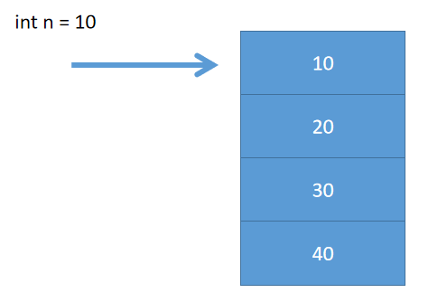

# 04 - Java 基础语法(数组) :fried_shrimp:

[[toc]]

## 数组入门

### 概述

​ 数组即一组用于存储相同数据类型的**数据结构**；数组是一种典型的线性结构(连续)。比如将一些商品数据呈现到页面中，此时可以将所有商品存储到数组中进行传递。**数组是一种引用数据类型**。数组中的每一个值都称之为元素

### 数组的声明和初始化

#### 数组声明

java 中对数组的声明语法如下:

```
数据类型[] 数组名;
数据类型 数组名[];
```

```java
//推荐
int[] i;
//不推荐
int j[];

double[] d;
boolean[] b;
char[] c;
String[] s;
```

#### 数组初始化

数组的初始化（为变量赋初始值）包含两种方式：

1. 静态初始化
2. 动态初始化

```java
//静态初始化
int[] arr = {10,20,30,40};

//动态初始化(创建一个长度为5的数组)
int[] arr2 = new int[5];
int[] arr3 = new int[] {11,12,13,14};
```

**动态初始化**

动态初始化即，在声明数组时只指定数组的容量，不为数组中指定位置赋值

```java
//声明一个长度(容量)为5的数组
int[] arr = new int[5];
arr[0] = 10;
arr[1] = 20;
arr[2] = 30;
arr[3] = 40;
arr[4] = 50;

arr[4] = 60;

System.out.println(arr[4]);
```

### 操作数组

​ 数组中每一个元素都有一个独一无二的索引(下标)，通过语法`数组名[索引]`可以获取数组中指定位置的元素；**数组的索引从 0 开始**；比如一个数组中有 10 个元素则索引从 0~9；**任何一个数组都包含一个 length 属性用于获取数组中元素的个数**;

```java
int[] arr = {10,20,30,40};
//获取数组中第4个元素
int i = arr[3];
```

> 注意事项:
>
> 在对数组操作时如果下标(索引)使用不当，则会导致一个异常出现:
>
> ```java
> java.lang.ArrayIndexOutOfBoundsException
> ```
>
> **数组索引越界**

#### JDK1.5 增强 for 循环-forEach



语法:

```
for(数据类型 变量名:数组名){
    //循环体
}
```

> 以上循环中的数据类型表示的是数组中每个元素对应的数据类型

```java
int[] arr = {1,4,5,7,9,11,13,19};
//增强for循环（forEach:迭代器-Iterator）
for(int n:arr) {
    System.out.println(n);
}


String[] names = {"德玛西亚","瑞兹","易大师","墨菲特"};
for(String name:names) {
    System.out.println(name);
}
```

### 多维数组(二维数组)

​ **多维数组即数组中的数组**。在实际的应用中多维数组的使用也很常见（比如二维数组），电影院座位布局，教室座位布局，游戏开发中游戏元素的坐标。

#### 声明语法

```
数据类型[][] 数组名
数据类型 数组名[][]
```

```java
int[][] i;
//不推荐
int i[][];
```

```java
// 二维数组
int[][] i = {
    { 1, 2, 3 },
    { 4, 5, 6 },
    { 7, 8, 9 },
    { 10, 11, 12 }
};

// 数组长度一旦定义则无法改变（动态数组）
// i = {};

System.out.println(i.length);

System.out.println(i[3][2]);

for (int n = 0; n < i.length; n++) {

    for (int m = 0; m < i[n].length; m++) {
        System.out.print(i[n][m] + " ");
    }
    System.out.println();
}
```
