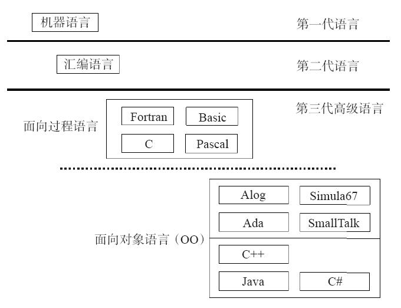
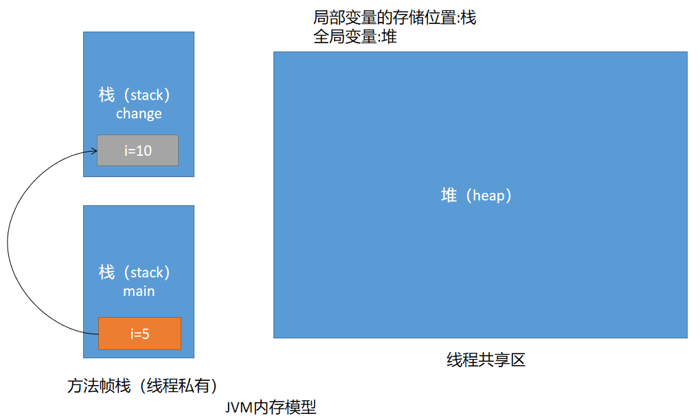
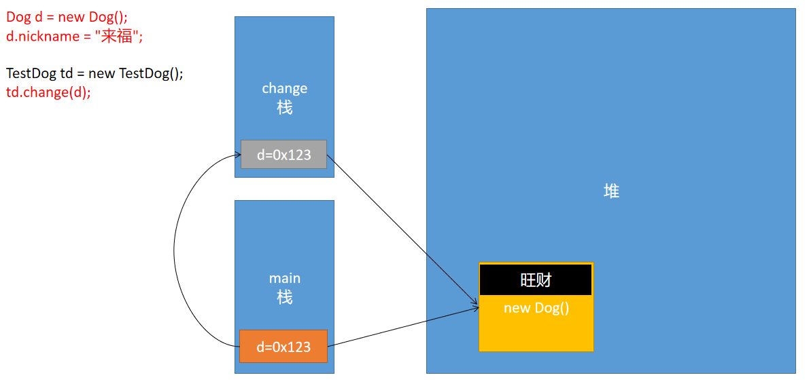

# 01 - 面向对象入门 :beers:

[[toc]]

## 面向对象程序设计概述

### 程序设计语言发展史



### 面向对象程序设计

Java 中万事万物皆对象，面向对象编程即：将现实生活的事物以计算机的语言进行描述

## 类和对象

面向对象中的两个核心概念：

1. 类：对一类具备相同特征（**属性**，**行为**）事物的抽象描述;例如:学生类

2. 对象：类的一个实例；例如:学号是 123 的学生

### 类的成分

由于类中包含一类事物的属性和行为，因此类的成主要由属性和行为构成，对于以上两个特征 Java 中以如下的方式呈现:

- 属性-->变量
- 行为-->方法(函数)

**类的声明语法:**

```
[<修饰符>] class 类名称 {
    //属性的定义
    //行为的定义
}
```

例如:

```java
public class Student {

	//属性：成员变量、全局变量、实例(对象)变量
	String sno;
	String sname;
	int age;
	char sex;
	/**学分*/
	double score;
	/**学校*/
	String school = "软帝大学";
	/**专业*/
	String major;

	//行为：方法（函数 function）  f(x)
	public void study() {
		System.out.println("good good study,day day up!!!");
	}

	public void play() {
		System.out.println("一起来玩有游戏吧！！");
	}

}
```

#### 属性

属性用于描述类的静态信息，表示类的数据；语法

```
[<修饰符>] 数据类型 变量名 = [<默认值>]
```

例如:

```java
String sno;
String sname;
int age;
char sex;
/**学分*/
double score;
/**学校*/
String school = "软帝大学";
```

#### 方法

类中另一个组成部分称之为行为，行为在 java 中的呈现方式以方法(函数)的形式存在，语法:

```
[<修饰符>] 返回值类型 方法名([<参数列表>]) {
    //执行体
}
```

例如:

```java
public void study(String kecheng,int hours) {
    System.out.println("good good study,day day up!!!");
}

public void play() {
    System.out.println("一起来玩有游戏吧！！");
}
```

### 对象创建与使用

对象即对类的具象化，即类的一个实例

```java
//对象创建（实例化对象）
Student stu = new Student();
```

## 方法详解

​ 方法(Method)是由一些表达式组成的代码片段，通常用于完成某些特定的功能，实际开发中可以将一些反复需要使用到的代码编写到方法中，只需要对方法进行调用，即可执行这些代码片段，从而提高的代码的可复用性。

### 方法的分类

根据方法的声明语法：

```
[<修饰符>] 返回值类型 方法名([<参数列表>]) {

}
```

由于方法结构中包**含返回值类型**和**参数**成分，根据这两个成分的组合，方法可以分为 4 中类别：

- 无参数无返回值
- 无参数有返回值
- 有参数无返回值
- 有参数有返回值

```java
public class Tools {

    /**
	 * 有参有返回值
	 * @param a  数值1
	 * @param b  数值2
	 * @return 返回两个数值中较大的一个
	 */
    public int max(int a,int b) {
        return a > b ? a : b;
    }

    /**
	 * 无参有返回值
	 * 返回字符串时间
	 * @return
	 */
    public String nowTime() {
        return  "2020年11月3日 10:46:22";
    }

    /**
	 * 有参无返回值
	 * 打印输出参数内容
	 * @param msg
	 */
    public void log(String msg) {
        System.out.println(msg);
    }

    /**
	 * 无参无返回值
	 */
    public void tips() {
        System.out.println("天气冷了，多穿衣服，多喝开水!");
    }

    public static voi	d main(String[] args) {
        Tools t = new Tools();
        //调用包含返回值的方法，并且使用对应的数据类型变量接收返回值
        int i = t.max(10, 15);
        System.out.println(i);

        String time = t.nowTime();
        System.out.println(time);

        t.log("helloworld，你好，世界");

        t.tips();

        // 创建一个方法，要求提供一个年份，返回该年份是否是闰年
    }
}
```

> **参数(Parameter):**在执行方法时需要传递到方法中使用的一些数据，参数的类型可以是任意的，数量可以是任意多个，参数顺序也可以任意的，在声明方法时定义的参数，称之**形式参数（形参）**；在对象方法进行调用时传入的参数称之**实际参数(实参)**。
>
> **返回值(returns):**在方法执行完毕之后，传递到方法之外的数据；返回值的类型可以是任意，返回的具体值(或者变量)必须要跟方法定义的返回类型匹配。

### 方法调用

java 中方法的调用需要通过对象完成，语法如下:

```
引用对象.方法名(实参)
```

```java
//对象创建（实例化对象）
Student stu = new Student();
//调用方法
stu.play();
```

### 值传递问题

#### 基本类型传递问题

观察以下代码，给出程序运行结果:

```java
public class Test {

	public void change(int i) {
		i = 10;
		System.out.println("change--->" + i); // 10;
	}


	public static void main(String[] args) {

		int a = 5;
		System.out.println("change前：" + a); //5
		Test t = new Test();
		t.change(a);
		System.out.println("change后：" + a); // ?
	}
}
```

结果：

```
change前：5
change--->10
change后：5
```

> 分析以上程序，可以看出 java 中参数的传递为值传递，不存在引用传递的问题，change 方法中改变的只是内部定义的局部变量 i，不会影响 main 方法中的局部变量，内存模型如下：
>
> 
>
> 注意事项:
>
> **java 中局部变量的存储位置位于方法帧栈中**，**成员变量的存储位于堆内存中**

#### 引用类型参数传递问题

以上实例修改之后，观察执行结果

```java
public class TestDog {

	public void change(Dog d) {
		System.out.println("change:"+d);
		d.nickname = "旺财";
	}

	public static void main(String[] args) {

		Dog d = new Dog();
		System.out.println(d);
		d.nickname = "来福";
		System.out.println("change前：" + d.nickname);
		TestDog td = new TestDog();
		td.change(d);
		System.out.println("change后：" + d.nickname);

	}
}

class Dog{
    String nickname;
}
```

> 以上程序执行的内存模型:
>
> 

### 递归（Recursion）

​ 递归即在一个方法内部对方法自身调用，递归可以以简单的代码解决复杂的算法问题，对文件夹的遍历，树形菜单遍历等等；递归操作不当将会导致栈溢出错误`StackOverflowError`

递归实例:

```java
//5！
public int m(int n) {
    if(n == 1) {
        return 1;
    }else {
        return n * m(n - 1);
    }
}

//1+2+...+100
public int add(int n) {
    if(n == 1) {
        return 1;
    }else {
        return n + add(n - 1);
    }
}

//斐波拉契数列
public int fib(int n) {
    if(n == 1 || n == 2) {
        return 1;
    }else {
        return fib(n - 1) + fib(n - 2);
    }
}
```

## 作业

1. 要求递归解决问题：设计一个 ATM 机的程序，当对方正确的输入卡号(int)和密码(int)时，显示 come in，错误时要求重新输入（3 次机会），如果第三次还输入错误，则提示 today is more，please next！（控制台）
