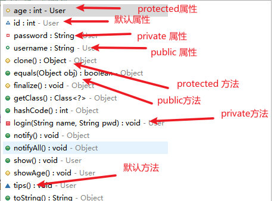
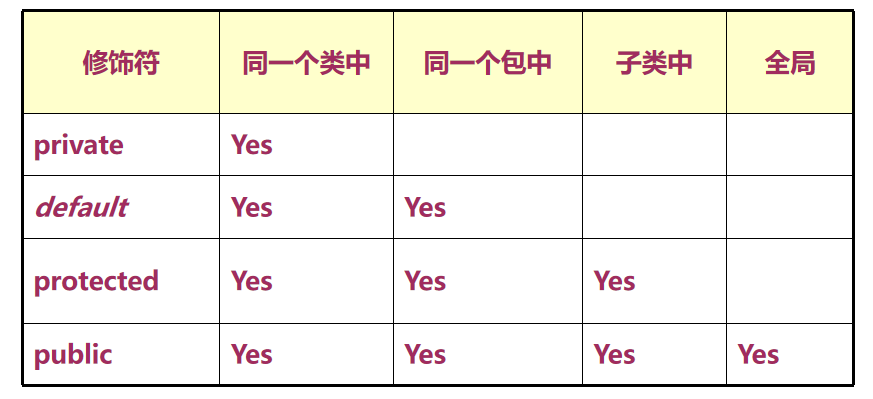
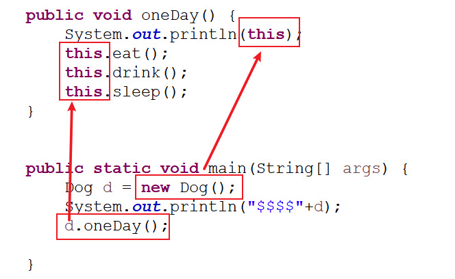

# 02 - 面向对象程序设计 :cake:

[[toc]]

## 类的成分

一个类由属性和行为构成：

属性：描述指定类型的数据（名词）

行为：描述指定类型的一种动作（动词）

### 属性详解（Field）

属性用于描述类的一些静态信息(数据)，属性在代码中的呈现方式为变量，java 中的变量根据出现的位置不同，又分为两种：

- **全局变量（global variable）**

  也称之成员变量、实例(对象)变量；直接在类结构中定义与方法同一级别，成员变量可以出现在类中的任意**非静态**方法中，成员变量在类加载时编译器会自动为期设置初始值（即便不手动赋值都存在默认值）

  案例:

  ```java
  public class People {

  	// 成员变量
  	String name;
  	int age;
  	String sex;
  	double height;

  }
  ```

  各种类型成员变量的默认值

  ```
  byte     0
  short    0
  int      0
  long     0
  float    0.0
  double   0.0
  char     <空格>
  boolean  false

  引用类型   null
  ```

- **局部变量（local variable）**

  也称之为临时变量;局部变量一般位于方法内部声明，方法的参数也是局部变量，局部变量的作用范围仅限于声明的区域；**局部变量没有初始化前不能使用**

  案例:

  ```java
  public void speak(String s) {
      int i = 10;
      System.out.println(name + "说:" + s);
  }

  if(true){
      int i = 10;
  }
  //游离块
  {
      int i = 10;
  }
  //静态游离块
  static{
      int i = 10;
  }
  ```

### 构造器详解

​ 构造器也称之为构造方法，构造函数，构建器；作用于对象创建时完成对于对象的相关属性初始化操作，减少方法对于参数依赖，可以直接在方法中使用由构造器赋值的成员变量；构造器是一种特殊的方法，语法规范：

```
[<修饰符>] 类名称([<参数列表>]){
   //执行体
}
```

案例

```java
public Goods(){

}

public People(){

}
```

#### 构造器的定义规范

1. 构造器的名称必须跟类名称一致
2. 构造器不能包含任何类型的返回值(包括 void)

#### 构造器注意事项

1. 任何一个 Java 类都存在一个默认的无参构造器(编译器自动添加)
2. 如果一旦定义自定义的构造器，则默认无参构造器会被覆盖
3. 一个类可以存在多个构造器，但是构造器中的参数个数，类型，顺序任意有一项不一致（方法的重载）

#### 构造器使用

构造器的调用一般通过`new`关键字进行调用，一旦执行，就完成了对象的创建以及初始化。

```
new 构造器();
```

案例

```java
People p = new People();
Goods g = new Goods();
```

## package & import

在声明一个类时，在类结构的上方可以包含另外两种语句：

- 包定义
- 导包

### pacakge（包）

包的作用，在开发中用于对不同模块的 java 文件进行分门别类的存储，主要用于模块区分。在文件系统中的表现方式就是目录的不同层级组合，包的定义语法：

```
package 包名称
```

> 包名称的命名一般为小写的英文单词，采用域名倒置的写法,比如:
>
> ```java
> package com.softeem.b2c.service;
>
> package cn.sina.xxx;
>
> package net.csdn.XXX;
>
> package edu.softeem.xxx;
> ```

### import（导包）

​ 在实际的应用中，一个软件项目通常会由很多包构成，在对于类的使用过程中大概率会涉及到跨包之间类相互调用，因此，在一个类中使用另一个包中的类时，就需要将目标类所在的完整类路径(完全限定名)导入到当前类中，这个过程就称之导包。

语法：

```
import 指定类(或接口，枚举)的完全限定名
```

例如:

```java
import java.util.Scanner;
import com.softeem.entity.User;
import com.softeem.service.UserService;
```

> 注意事项:
>
> **一个类只能存在于一个 package**
>
> **一个类可以 import 多个其他的类**
>
> **完全限定名使用方式：**
>
> ```java
> import com.softeem.lesson07.oop.User;
>
> public class TestUser {
>
> 	public static void main(String[] args) {
>
> 		User u = new User("softeem","123");
> 		u.username = "admin";
> 		u.login("admin", "123456");
>
>
> 		/**
> 		 * 如果对于一个类中需要使用两个位于不同包中的同名类时，
> 		 * 此时只能够显式的import其中一个类，对于另一个类的
> 		 * 使用必须使用完全限定名的声明方式，如下：
> 		 */
> 		com.softeem.lesson07.entity.User u2 = new com.softeem.lesson07.entity.User();
> 		u2.show();
>
> 	}
>
> }
>
> ```

## 访问修饰符

Java 中的访问修饰符分为 4 个

- _defualt_（空白）

  不使用任何访问修饰符时，目标元素只能在同一个类或者同一个包的其他类被访问

- **private**

  被 private 修饰的元素，只能够在当前类中被访问

- protected

  被 protected 修饰的元素，只能在同一个包中，或者跨包的子类中被访问

- **public**

  被 public 修饰的元素可以在同一个项目中的任意包被访问



**各种访问修饰符的访问范围图**



> 使用原则：
>
> - **类一般使用 public 修饰**（普通的类无法使用 private 和 protected 修饰）
> - 属性一般使用 private 修饰
> - 方法一般使用 public

## 封装

面向对象语言包含三大核心特征：

- 封装
- 继承
- 多态

### 信息隐藏

​ 信息隐藏是 java 中对类的一种保护机制，将一个类的具体实现细节隐藏起来，隐藏通常指的是使用 private 修饰符对属性或者方法修饰，使得外界无法随意访问该类中的成分。

​ 对于一些属性来说，如果对外公开，则外界一旦获取到该类的实例(对象)，即可对该公开的属性进行随意访问甚至修改，从而会造成一些不要的安全问题。

### Setter&Getter 方法

​ 将类中的属性设置为 private 之后，外界无法访问，但是可以通过提供公开的方法对这些私有的属性进行访问。让外界访问方法的可控性要远远高于直接让外界访问属性；对于上述的操作，Java 中提供了两种用于对属性操作的方法：

- setter
- getter

```java
public class People {

	private String idCard;
	private String name;
	private int age;
	private String sex;
	private boolean marry;

	public String getIdCard() {
		return idCard;
	}
	public void setIdCard(String idCard) {
		this.idCard = idCard;
	}
	public String getName() {
		return name;
	}
	public void setName(String name) {
		this.name = name;
	}
	public int getAge() {
		if(age > 18) {
			age = 18;
		}
		return age;
	}
	public void setAge(int age) {
		this.age = age;
	}
	public String getSex() {
		return sex;
	}
	public void setSex(String sex) {
		this.sex = sex;
	}
	/**
	 * boolean类型属性的get方法叫isXXX
	 * @return
	 */
	public boolean isMarry() {
		return marry;
	}
	public void setMarry(boolean marry) {
		this.marry = marry;
	}

}
```

### this 关键字

this 关键字在一个类中用于表示"当前对象”；this 一般用于一个类的成员方法、构造器或者游离块中，作用于**调用当前类的构造器，属性和其他方法**

```java
public class Dog {

    private int id;
    private String name;

    public Dog() {
        //		构造器中如果调用了其他构造器，则调用代码必须位于最前端
        //		System.out.println("---");
        //调用包含String类型参数的构造器
        this("来福");
    }

    public Dog(String name) {
        System.out.println("执行带参数构造器。。。。");
        this.name = name;
    }

    public int getId() {
        return id;
    }
    public void setId(int id) {
        this.id = id;
    }
    public String getName() {
        return name;
    }
    public void setName(String name) {
        this.name = name;
    }

    public void eat() {
        System.out.println(name+"吃肉肉");
    }

    public void drink() {
        System.out.println(name+"和奶茶");
    }

    public void sleep() {
        System.out.println(name+"碎觉觉");
    }

    public void oneDay() {
        System.out.println(this);
        this.eat();
        this.drink();
        this.sleep();
    }


    public static void main(String[] args) {
        Dog d = new Dog();
        System.out.println("$$$$"+d);
        d.oneDay();

    }
}
```



## 练习

1. 根据 LOL，创建一个英雄类（Hero）,包含以下属性：

   - 编号(int)
   - 昵称（String）
   - 名称（String）
   - 类型（法师，射手，战士，坦克，辅助，打野）
   - 攻击力（int）
   - 防御力(int)
   - 血量（int）
   - 魔法值(int)

   英雄包含两个构造方法

   1. 无参数
   2. 所有参数

   英雄包含三个方法：

   1. 攻击`attack(Hero h)`
   2. 死亡
   3. 重生
   4. 移动

   要求完成如下功能:

   1. 分别创建两个不同类型的英雄

   2. 实现攻击的功能(轮流攻击)

   3. 血量先归零的英雄死亡

2. 基于面向对象实现：猫抓老鼠小游戏有一只猫和一只老鼠，当猫的体重是小老鼠体重的 5 倍时，猫可以抓到老鼠，猫每吃掉一只老鼠，体重增加老鼠的体重的 0.5 倍，但是当猫的体重超过了老鼠体重的 5 倍，猫无法抓到老鼠，老鼠逃脱并对猫发出嘲讽

   ```java
   class Mouse{
       private String name;
       private double weight;

       public void run(){
           //todo
       }

       public void haha(){
           //todo
       }
   }

   class Cat{
       private String name;
       private double weight;

       public void catch(Mouse m){
           //
       }
   }
   ```

3. 基于数组+面向对象完成一个学生信息管理系统，初始化一个长度为 100 的学生数组，学生信息包含如下：

   - 学号（int）
   - 姓名（String）
   - 性别（String）
   - 年龄（int）
   - 专业（String）
   - 学分（double）

   要求实现以下功能

   1. 完成学生添加的功能
   2. 根据指定的学号，删除学生
   3. 根据学号，修改指定学生的学分
   4. 显示所有学生的信息
   5. 查询所有学分超过 80 的学生信息

   > 创建两个类：
   >
   > 1. 学生类（属性，setter/getter，构造器）
   > 2. 学生管理类（对学生操作的所有方法）

4. 基于面向对象，模拟 ArrayList 的实现,类名叫`MyArrayList`，要求包含以下功能：

   1. 数组中只能存储 int 类型数据
   2. 提供一个初始数组长度为 10 的构造器`MyArrayList(int capacity)`，以及一个默认无参构造器`MyArrayList()`
   3. 提供一个能够向数组中添加元素的方法 `add(int i)`
   4. 当数组容量超出时要求能自动扩容，扩充为元素组的 1.5 倍
   5. 提供一个能够返回数组真实长度的方法 `size()`
   6. 提供一个能够返回指定位置元素的方法 `get(int index)`
