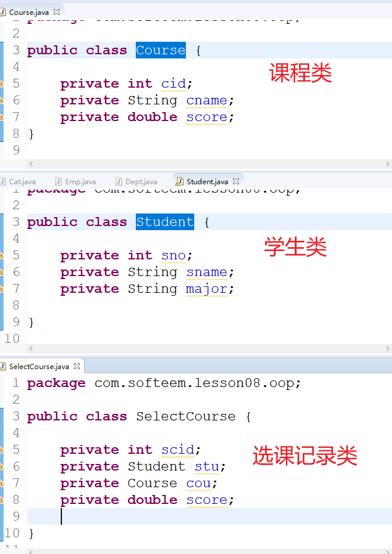

# 03 - 面向对象程序设计-继承 :doughnut:

[[toc]]

## 类之间关系(软件工程与统一建模语言 UML)

面向对象设计语言中，类和类之间是存在一定关系的，从关系角度考虑，分为两种：

- 横向关系（平级）
- 纵向关系（上下级）

### 横向关系

横向关系一般表示为多个类之间是同一级别，横向关系又分为以下几类

1. **依赖关系**

   依赖关系表示为一个类的方法中需要另一个类型对象作为参数

   ```java
   public class Cat{

       //依赖关系的代码表现方式
       public boolean catchMouse(Mouse m) {

          return false;
       }
   }
   ```

2. **关联关系**

3. **聚合关系**

4. **组合关系**

   关联，聚合，组合三种关系在代码的表现形式上是相同，只是存在语义上的区别，主要区别为类和类之间的紧密程度；代码层面的表现方式是在一个类中将另一个类型对象作为属性定义。

   ```java
   public class Dept{

       private int dno;
       private String dname;
       private String tel;

       //setter/getter ...
   }
   ```

   ```java
   public class Emp{

       private int eno;
       private String ename;
       private double sal;
       //员工关联部门
       private Dept dept;

       //setter/getter ...
   }
   ```

   **典型的关联关系实例:**

   - 学生选课系统类设计

   

### 纵向关系

纵向关系是一种上下级的关系，表现方式在 java 中通常以以下两种形式呈现：

1. **继承（extends）**
2. 实现（implements）

## 继承（extends）

​ 继承是面向对象程序设计中另一个重要的特征，继承即由一个类从另一个通过 extends 关键字继承，被继承的类称之为父类(也叫超类)，继承的类称之为子类（扩展类）；继承可以使得类的**扩展性提高**，**减少重复代码**的编写。

语法：

```
[<修饰符>] class 子类 extends 父类 {

}
```

实例:

**父类 Father：**

```java
public class Father {

	public String name ;
	public int age;

	public void coding() {
		System.out.println(name + "超级会写代码");
	}

	public void love(){
		System.out.println("情场高手!!!!");
	}

}
```

**子类 Son:**

```java
public class Son extends Father{


	//通过代码表现：动物 猫 老鼠之间的关系
	public static void main(String[] args) {
		Son s = new Son();
		s.name = "刘德华";
		s.coding();
		s.love();
	}
}
```

### 继承优点

1. 子类可以直接通过对象调用父类中的非私有元素
2. 子类还可以在父类的基础上扩展新的功能

### 继承注意事项

- 子类只能继承父类的属性和方法，不能继承构造器
- 子类对象构造之前会先执行父类的构造器（`如果存在多重继承，则从最顶层父类构造器开始执行`）
- 一个父类可以存在多个子类，但是一个子类只能存在一个父类
- Java 不允许多继承，但是支持多重继承
- 被 protected 修饰的元素可以在子类中被访问（即便父类和子类不在同一个包）

## super 关键字

super 关键字用于在子类中调用父类的元素:

- 构造器
- 属性
- 方法

使用案例:

```java
public class Animal {

    String name = "旺财";
    double weight = 10 ;

    public Animal(String name) {
        //		this.name = name;
    }

    public void eat() {
        System.out.println("动物进食");
    }

    public void bark() {
        System.out.println("咆哮");
    }
}

```

```java
public class Dog extends Animal{

    public Dog(String name) {
        //调用父类构造器
        super(name);
    }

    public void play() {
        //调用父类方法
        super.eat();
        super.bark();
		//调用父类属性
        System.out.println("我叫：" + super.name);
    }

    public static void main(String[] args) {
        Dog d = new Dog("来福");
        d.play();
    }

}

```

## 练习

```
/*
* 完成一个电商系统的商品库存管理，包含两个类：
* 1. 商品类（编号，名称，类别，单价，库存量，生产地）
* 2. 商品管理类
*  要求在管理类中完成如下功能:
*  1. 商品添加
*  2. 查询指定价格范围的商品并显示
*  3. 根据编号查询商品信息并显示
*  4. 根据编号修改商品的单价和库存
*  5. 显示所有商品信息
*  6. 查询所有库存量低于指定数的商品信息
*  7. 将指定id商品删除
*  8. 删除所有库存为0的商品
*/
```
