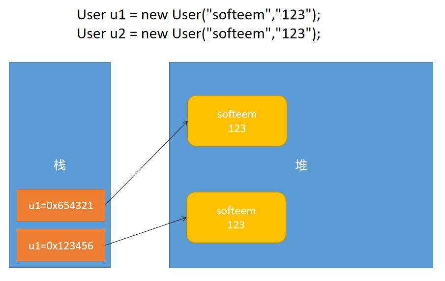

# 04 - 面向对象程序设计 - 继承 2 :honey_pot:

[[toc]]

## 继承知识点汇总

- 继承使用 extends 关键字
- 子类继承父类之后，子类可以直接使用父类中非私有的元素，并且子类中也能定义自己的元素
- 一个类只能继承一个父类
- 一个类可以存在多个子类
- 继承关系的构造中，创建子类对象时先调用父类的构造器
- Java 中允许多重继承

## 模拟 ArrayList 实现（动态数组）

Java 中 ArrayList 的实现是基于数组+数组拷贝完成

```java
public class MyArrayList {

	/**用于存储数据的真实数组*/
	private Goods[] arr;
	/**数组中元素目前的索引位置*/
	private int index;

	/**
	 * 构造一个初始容量为5的数组
	 */
	public MyArrayList() {
		arr = new Goods[5];
	}

	/**
	 * 构造一个指定长度的数组
	 * @param capacity
	 */
	public MyArrayList(int capacity) {
		arr = new Goods[capacity];
	}

	/**
	 * 添加元素
	 * @param g
	 */
	public void add(Goods g) {
		//检测容量是否足够
		ensureCapacity();
		arr[index++] = g;
	}

	/**
	 * 确认容量是否足够
	 */
	private void ensureCapacity() {
		if(index >= arr.length) {
			//容量超出
			grow();
		}
	}

	/**
	 * 容量增长
	 */

	private void grow() {
		//获取原数组的长度
		int len = arr.length;
		//创建临时的数长度为原始数组的1.5倍
		Goods[] temp = new Goods[len + (len >> 1)];
		//数组拷贝
		System.arraycopy(arr, 0, temp, 0, len);
		//将原数组的指针指向新数组地址
		arr = temp;
	}


	/**
	 * 获取指定位置的元素
	 * @param i
	 * @return
	 */
	public Goods get(int i) {
		return arr[i];
	}

	/**
	 * 返回元素的总个数
	 * @return
	 */
	public int size() {
		return index;
	}

	/**
	 * 移除元素
	 * @param i
	 */
	public void remove(int i) {
		System.arraycopy(arr, i+1, arr, i, arr.length - (i + 1));
		index--;
	}

}

```

## 重写(override)与重载(overload)

Java 中允许方法的重写和重载，重写和重载是**多态**的一种实现策略：

- 重载（overload）：一个类中存在多个同名的方法
- 重写（override）：一个子类对父类的方法覆盖

### 重写

​ 当父类中的方法实现满足不了子类需求时，此时子类中可以编写一个与父类方法一模一样的方法，对父类的方法进行覆盖，该过程称之为方法的重写（Override）.

案例：

**Animal 类**

```java
public class Animal {

	private String name;

	public String getName() {
		return name;
	}

	public void setName(String name) {
		this.name = name;
	}

    //动物咆哮（不同的动物发出的叫声一样，因此无法一概而论）
	public void bark() {
		System.out.println(name + "哇哇哇哇啊啊...");
	}

}
```

**Dog 类**

```java
public class Dog extends Animal{
	//对bark方法重写
	public void bark() {
		System.out.println(getName() + "汪汪汪。。。");
	}
}

```

**Cat 类**

```java
public class Cat extends Animal{
	//对bark方法重写
	public void bark() {
		System.out.println(getName() + "喵喵喵。。。");
	}
}
```

> 方法重写注意事项：
>
> 1.  重写必须存在继承关系，一般是由子类重写父类方法
> 2.  被重写的方法名称，返回值类型，参数列表必须跟父类方法一模一样
> 3.  子类重写的方法访问权限不能低于父类

### 重载

​ 重载指的是在同一个类中，或者存在继承关系的多个类中，存在同名的方法，这些方法的名称一模一样，但是方法的参数个数 ，类型，顺序任意有一项不一致，具备以上特点的方法统一称之为重载方法。

**重载的条件:**

1. 方法名称必须一致
2. 参数的个数、顺序和类型任意有一项不一致
3. 重载与返回值无关

案例：

```java
System.out.println("helloworld");
System.out.println(10);
System.out.println(true);
System.out.println('a');
System.out.println(3.14);
```

自定义重载方法：

```java
public class Driver {

	public void driven(Car c) {

	}

	public void driven(Bus b) {

	}

	public void driven(Bike b) {

	}

	public void driven(Plane p) {

	}
}
```

> **关于方法的重载和重写的区别？**
>
> 1.  重写必须存在继承关系，由子类重写父类的方法，重载无要求
> 2.  重写的方法名称，参数类型必须和父类一致；重载必须要保证方法的参数列表任意有一项不一致
> 3.  重载与返回值无关

#### Object 类(祖宗类)

##### Object 类

Object 类在 Java 中作为所有类的顶层父类，Java 中的继承允许多重继承，即一个类可以存在多个间接的父类，最终会从 java.lang.Object 继承

#### toString

toString 是 Object 类中的一个方法，默认的实现如下:

```java
public String toString() {
    return getClass().getName() + "@" + Integer.toHexString(hashCode());
}
```

通过对 toString 的重写可以实现对象的不同输出信息:

```java
@Override
public String toString() {
    return "User [name=" + name + ", pwd=" + pwd + "]";
}
```

#### == & equals

==在 Java 中一般用于对基本类型数据进行值的比较，如果两个值一致的结果为 true，反之为 false;但是，==在比较引用类型数据时比较的是对象的内存地址（不是对象中的具体数据），如下图:



通过以上的图形展示，明显能够发现，new 的两个对象地址是不一样的，因此使用`==`判断结果必然是 false;

另外 Java 中的 Object 类提供一个用于进行对象比较的方法`equals`，但是 equals 的默认实现是直接使用的`==`判断；不过可以通过对 equals 方法进行重写，达到对象数据比较的目的，比如：

```java
public boolean equals(Object obj) {
    if(this == obj) {
        return true;
    }
    if(obj instanceof User) {
        User u = (User)obj;
        if(!this.name.equals(u.getName())) {
            return false;
        }
        if(!this.pwd.equals(u.getPwd())) {
            return false;
        }
        return true;
    }else {
        return false;
    }
}
```

以上程序是对 equals 方法的重写，通过比较对象中的属性值来确定是否为同一个对象。

> 关于重写 equals 的注意事项：
>
> 通常在 **重写 equals 的时候也要求必须对 hashcode 重写**；如果只是重写 equals 只能从逻辑上认为对象一致，实际上在内存中对象的地址依然是不同的，因此在后续比如集合排序，对象比较的时候可能造成错误结果。

#### instanceof 运算符

instanceof 运算符用于对目标对象判断，判断是否为指定的类型，用法如下：

```
引用变量 instanceof 引用数据类型
```

案例

```java
//判断obj 是否是一个User类型
if(obj instanceof User) {

}
```

instanceof 运算符的运算结果为 boolean 类型
