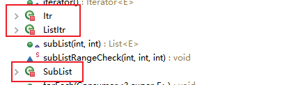
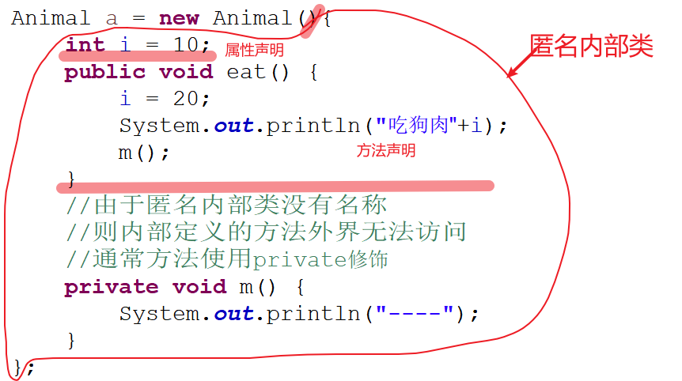

# 08 - 面向对象程序设计(内部类):birthday:

[[TOC]]

## 内部类

通常一个 java 文件中只能包含一个 public class，但是可以在一个 java 类的内部中嵌套其他的 java 类，这种类称之为内部类，也叫嵌套类，或者类属类，比如：

```java
public class People {

    public void m(){

    }

	public static void main(String[] args) {

	}

	//内部类
	class Body{

	}
}

//它不是内部类，它和People是平级的关系
//class Head{
//}
```

> 以上就是一个典型的内部类,生成的字节码文件如下:
>
> ```
> People$Body.class
> People.class
> ```

java 中的内部类包含以下几种定义方式：

1. 成员内部类
2. 局部内部类
3. 静态内部类
4. 匿名内部类

### 内部类的好处

- 提供了比方法更好的封装性
- 提高类多继承的可能性

### 成员内部类

成员内部类即在类结构中直接定义的与属性，方法，构造器同一级别的类。

```java
public class People extends JFrame{

	public void m1() {
		System.out.println("外部类方法");
//		new Body().m3();
	}

	//内部类
	private class Body extends ArrayList{

		String name;

		public void m2() {
			System.out.println("内部类方法");
		}

		public void m3() {

		}
	}

}
```

成员内部类的使用场景：在 JDK 中有很多类使用到了成员内部类，例如: ArrayList：



> 成员内部类注意事项:
>
> 成员内部类类似成员方法，允许被任意的访问修饰符修饰（_default_,public,private,protected）

### 局部内部类

所谓局部内部类即在一个类的方法或者其他成员的(构造器，游离块)语句块中定义，不太常见：

```java
public class User {

    int n;

	public void login() {
		//jdk1.8之后无需显式定义final（编译器自动添加）
		final int i = 10;
		class Validate{
			public void t() {
                //成员变量在局部内部类中允许修改
                n = 100;
                //变量i在局部内部类只能使用不能修改
				System.out.println("======="+i);
			}
		}
		Validate v = new Validate();
		v.t();
	}

	public void reg() {
		//编译错误：找不到类
//		Validate v = new Validate();
//		v.t();
	}

	public static void main(String[] args) {
		User u = new User();
		u.login();
	}
}
```

> 局部内部类注意事项:
>
> 1.  不能使用任何的访问修饰符(除了 default 外)修饰，原理参考局部变量的定义
> 2.  局部内部类中不能对方法中的局部变量进行修改，如果局部内部类中需要使用为外部方法的局部变量时，该变量必须定义为 final（**java8 无需显式定义 final，编译器默认添加**）
> 3.  使用 final 修饰局部变量的作用在于延长局部变量的生命周期，避免因为方法的结束而被清理（可能局部内部类在使用该变量）

### 静态内部类

静态内部类即使用 static 修饰的成员内部类；静态内部类与外部类的对象无关，一般用于数据缓存，比如 Integer 中的静态内部类：`IntegerCache`

```java
/**
     * Cache to support the object identity semantics of autoboxing for values between
     * -128 and 127 (inclusive) as required by JLS.
     *
     * The cache is initialized on first usage.  The size of the cache
     * may be controlled by the {@code -XX:AutoBoxCacheMax=<size>} option.
     * During VM initialization, java.lang.Integer.IntegerCache.high property
     * may be set and saved in the private system properties in the
     * sun.misc.VM class.
     */

private static class IntegerCache {
    static final int low = -128;
    static final int high;
    static final Integer cache[];

    static {
        // high value may be configured by property
        int h = 127;
        String integerCacheHighPropValue =
            sun.misc.VM.getSavedProperty("java.lang.Integer.IntegerCache.high");
        if (integerCacheHighPropValue != null) {
            try {
                int i = parseInt(integerCacheHighPropValue);
                i = Math.max(i, 127);
                // Maximum array size is Integer.MAX_VALUE
                h = Math.min(i, Integer.MAX_VALUE - (-low) -1);
            } catch( NumberFormatException nfe) {
                // If the property cannot be parsed into an int, ignore it.
            }
        }
        high = h;

        cache = new Integer[(high - low) + 1];
        int j = low;
        for(int k = 0; k < cache.length; k++)
            cache[k] = new Integer(j++);

        // range [-128, 127] must be interned (JLS7 5.1.7)
        assert IntegerCache.high >= 127;
    }

    private IntegerCache() {}
}
```

自定义静态内部类:

```java
public class StaticClass {

	public void m() {
		System.out.println("外部类方法");
	}

	public static class MyCache{

		static String msg = "天干物燥，小心火烛";

		public static void t() {
			System.out.println("静态内部类的方法");
		}

		public void m2() {
			System.out.println("静态内部类的普通方法");
		}

	}
}
```

静态内部类的对象创建与方法调用:

```java
//创建静态内部类的对象
StaticClass.MyCache cache = new StaticClass.MyCache();
//调用静态内部类的静态方法
StaticClass.MyCache.t();
//调用静态内部类的成员方法
cache.m2();
```

### 匿名内部类

匿名内部类即没有名字的内部类，通常用于事件监听机制，回调机制中

```java
public abstract class Animal {

	public abstract void eat();

}
```

匿名内部类实例:

```java
public static void main(String[] args) {
    //匿名内部类
    Animal a = new Animal(){
        int i = 10;
        public void eat() {
            i = 20;
            System.out.println("吃狗肉"+i);
            m();
        }
        //由于匿名内部类没有名称
        //则内部定义的方法外界无法访问
        //通常方法使用private修饰
        private void m() {
            System.out.println("----");
        }
    };
    a.eat();
}
```



### 接口的匿名内部类使用

接口的声明:

```java
public interface Flyable {

	void fly();

}
```

接口匿名内部类使用:

```java
Flyable f = new Flyable() {
    public void fly() {
        System.out.println("fly。。。。");
    }
};
f.fly();
```

## Timer&TimerTask

Timer 类是 JDK 中，java.util 包中提供的用于执行定时任务的定时器类；Timer 通常与 TimerTask 结合使用，以达到定时任务执行的功能，比如定时消息推送，闹钟应用的实现等。

TimerTask 是一个抽象类，内部的 run 方法是一个抽象方法，因此通过对 TimerTask 扩展可以创建自定义的定时任务，只需要实现 run 方法即可：

**定时任务类:**

```java
public class MyTask extends TimerTask{

	@Override
	public void run() {
		System.out.println("任务执行。。。");
	}

}
```

**测试类：**

```java
public class TestTimer {

	public static void main(String[] args) {

		//1秒 = 1000毫秒
		//创建一个定时器
		Timer t = new Timer();
        //多态
		t.schedule(new MyTask(), 5000,1000);
	}

}
```

另外如果定时任务只在某个固定的位置使用，可以无需创建具体类进行继承；此时可以考虑使用**匿名内部类**实现：

```java
Timer t = new Timer();

t.schedule(new TimerTask() {
    public void run() {
        System.out.println(LocalDateTime.now());
    }
}, 3000, 500);
```

> 以上代码表示等待 3 秒执行任务，之后每隔 0.5 秒执行一次
