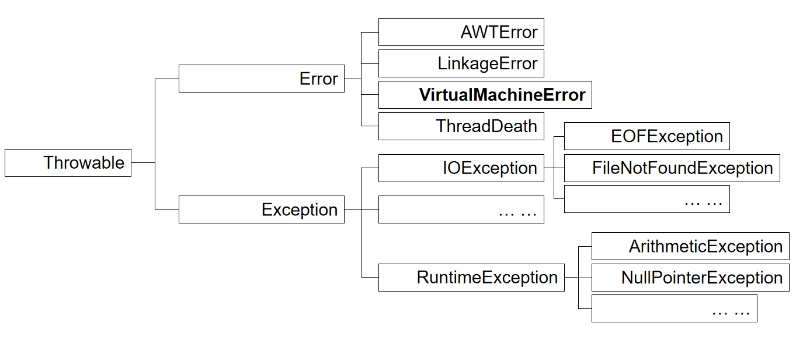
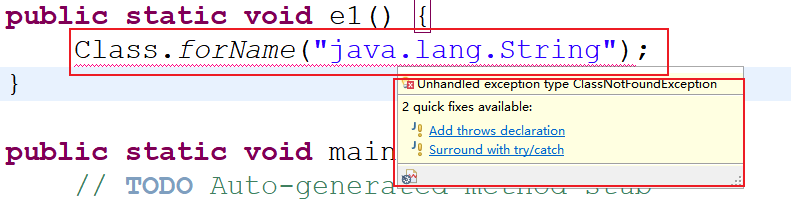
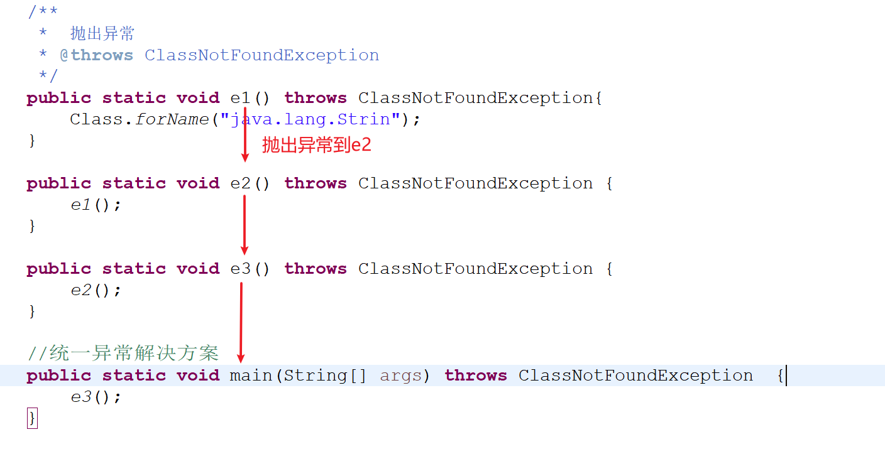
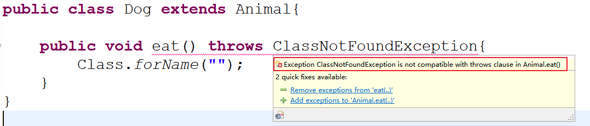
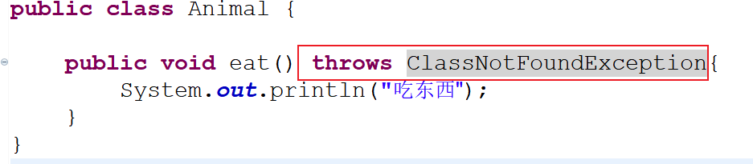
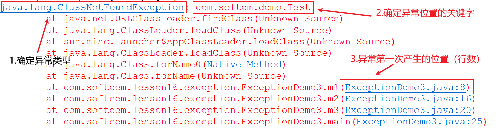

# 01 - 异常 :astonished:

[[TOC]]

## 错误与异常

java 中对于程序出现的异常情况分为两种类别：

1. 错误（Error）
2. 异常（Exception）

`Error`错误通常是系统级别的问题，比如说 JVM 内存溢出(StackOverflowError),JVM 系统错误等，这些问题是程序员无法修复的问题，程序运行时出现的无法被程序员从业务上解决的问题，这些问题一般是系统级别的。错误不是我们关注的范畴

`Exception`异常通常是程序再运行期间，或者编译期间由编译器抛出的一些，可以被程序员处理的代码上的问题，比如（NullPointerExcepotion/ArrayIndexOutOfBoundsException），异常是程序员开发中需要解决的问题

### Throwable

Throwable 是 Java 中错误和异常的顶级父类，以下是 Throwable 和 Error,Exception 之间的关系



> Java 中的所有错误从 Error 类继承，并且绝大多数类名称后缀以 Error 结尾
>
> Java 中的所有异常从 Exception 类继承，都是以 Exception 作为后缀结尾

## 异常概述

Exception：异常，一般在程序运行期间，或者编译期间由编译器抛出的异常信息，这些异常情况可以由程序员进行处理（抛出，捕获）；java 中的异常根据类型划分又分为两种类型：

- 运行时异常（RuntimeException）
- 检查异常（一般异常）

### 运行时异常

运行时异常一般在程序运行期间，出现了对应异常情况之后由 JVM 抛出，并且将异常的堆栈信息输出到控制台（或日志文件），java 中的所有运行时异常都是从`java.lang.RuntimeException`继承而来。常见的运行时异常：

| 异常类型                                 | 说明                                       |
| ---------------------------------------- | ------------------------------------------ |
| java.lang.ArithmeticException            | 算术异常（比如被零除）                     |
| java.lang.NullPointerException           | 空指针异常(调用方法，属性的对象为 null 时) |
| java.lang.ArrayIndexOutOfBoundsException | 数组索引越界                               |
| java.lang.ClassCastException             | 类型转换异常                               |
| java.util.InputMismatchException         | 输入的数据类型不匹配读取的类型             |

> 运行时异常即程序运行时才会产生的异常

### 检查异常

检查异常也称之为一般异常，或者编译期异常，这种类型异常通常在编译期间由编译器提示需要进行显式的处理：



常见的检查异常：

| 异常类型                         | 说明                    |
| -------------------------------- | ----------------------- |
| java.lang.ClassNotFoundException | 类未找到异常            |
| java.io.FileNotFoundException    | 文件未找到异常          |
| java.io.IOException              | IO 异常（输入输出异常） |
| java.sql.SQLException            | 访问数据库的异常        |
| java.text.ParseException         | 解析异常                |

> 检查异常是在程序编译时产生的

## 异常处理

异常既然产生则有必要进行合理的处理，Java 中对于异常的处理分为两种方式：

1. 异常抛出（throw/throws）
2. 异常捕获（try/catch/finally）

**Java 程序中一旦出现异常，则出现异常问题的所在代码行之后的代码无法再执行**

### 异常抛出

异常的抛出指的是将有可能出现的异常通过方法的结构向外抛出，交给下一级的调用者处理

```java
/**
	 * 	抛出异常
	 * @throws ClassNotFoundException
	 */
public static void e1() throws ClassNotFoundException{
    Class.forName("java.lang.Strin");
}
```

抛出异常常见的关键字：

- **throws**：用于方法的声明中，抛出**有可能**出现的异常
- **throw**：用于语句块中，抛出指定类型的异常对象，throw 一旦执行，则**一定会**出现该类型异常

语法区别：

- throws

  ```
  【修饰符】 返回值类型 方法名(【参数列表】) throws 异常类型名称{
      //方法体
  }
  ```

  ```java
  public static void e1() throws ClassNotFoundException{
  	Class.forName("java.lang.String");
  }
  ```

- throw

  ```
  方法体{
      throw  异常类型对象
  }
  ```

  ```java
  public static void main(String[] args) throws IOException  {
      int i = 0;
      if(i == 0) {
          //抛出异常对象
          throw new IOException();
      }
      System.out.println("hello");
  }
  ```



#### 对于存在继承关系的异常抛出问题

父类的结构:

```java
public class Animal {

	public void eat(){
		System.out.println("吃东西");
	}
}
```

子类结构：

```java
public class Dog extends Animal{

    //编译错误
	public void eat() throws ClassNotFoundException{
		Class.forName("");
	}
}
```

> 对于以上程序:
>
> 子类`Dog`对父类`Animal`中的方法`eat()`方法进行了重写，但是由于父类方法没有抛出任何的异常，此时子类无法进行任何检查的抛出，否则会不兼容父类方法定义，因此以上程序在子类中会出现编译错误
>
> 
>
> 解决方案有两种：
>
> 1.  子类方法中对异常捕获
>
> 2.  在父类方法的声明上加上对应的异常类型抛出定义:`throws ClassNotFoundException`
>
> 
>
> > 父类方法可以抛出比子类方法抛出的范围更大的异常，比如直接`throws Exception`
>
> 注意事项:
>
> **父类方法未抛出任何异常情况下，子类只能抛出运行时异常。**
>
> **游离块和静态语句块中不能抛出任何异常，因为外界无法直接调用这两种语句块**

### 异常捕获

异常的捕获即，将有可能出现异常的代码片段使用`try`语句块进行包裹，然后使用`catch`语句块将有可能产生的异常类型进行捕获，并作出处理。

异常捕获常见的关键字：

- **try**
- **catch**
- **finally**

语法结构:

```
try{
    //有可能出现异常的代码片段
}catch(异常类型 变量名){
    //处理异常
}finally{
    //不论是否出现异常，始终执行
}
```

```java
try {
    m1();
    PrintStream ps = new PrintStream("a/test/details.log");
} catch (ClassNotFoundException e) {
    e.printStackTrace();
} catch (FileNotFoundException e) {
    System.out.println("fileNotFound");
    e.printStackTrace();
} catch (IOException e) {
    System.out.println("IO");
    e.printStackTrace();
}
```

> 程序执行到 try 语句块，在执行期间如果出现了对应 catch 的异常类型，则直接进入 catch 语句块，如果 catch 语句块中没有合适的异常解决方案，则由 JVM 进行统一处理(打印异常的堆栈信息)

#### finally

finally 一般用于异常捕获之后执行最终的处理工作，比如，清理资源，关闭流，关闭连接；finally 中的代码无论是否出现异常，始终会执行。

```java
try {
    //打开资源
    System.out.println("打开文件");
    System.out.println(10/2);
}catch(Exception e) {
    e.printStackTrace();
}finally {
    //无论是否异常始终执行
    System.out.println("关闭文件");
}
```

try，catch，finally 的组织方式可以有多种：

```java
//方法一：
try {

}finally {

}

//方法二：
try {

}catch(Exception e) {

}

//方法三：
try {

}catch(RuntimeException re) {

}catch(Exception e) {

}

//方法四：
try {

}catch(Exception e) {

}finally {

}
```

> **关于异常的常见面试题**
>
> 1.  **请你说出 final、finalize 和 finally 的区别？**
>
> final 是一个关键字用于修饰类，属性，方法
>
> finalize 是 Object 类中提供的一个方法，用于在 jvm 对对象清理时，对于当前对象执行一些最终的处理工作的
>
> finally 是异常中的语句块
>
> 2.  **java 中是否会存在内存溢出的问题？**（指针）
>
> 理论上 java 不会存在内存泄漏问题，因为 jvm 提供了 GC(垃圾回收：garbage collection)机制，会在适当的时候自动回收内存空间，不需要由程序员手动处理；但是如果使用第三方资源（比如：打开一个文件，打开了网络通道，打开数据库连接等【比如我们打开了某个文件了 没有关闭，就会删不掉该文件 或者转移不了该文件】）并且未及时的清理以及回收，将会导致内存泄漏。
>
> 3.  **异常处理中 finally 和 return 的结合使用？**
>
> 如果 try 语句块中有使用 return，并且 try 语句块中没有任何异常时，程序首先会执行 finally 然后再执行 return;但是对于基本类型的数据，finally 的赋值是不会生效的，但是 finally 中操作引用类型的属性可以生效
>
> 注意：如果 try 语句块发生异常,则异常以下的代码都不会执行 直接进到 finally 了
>
> ```java
> //程序正常执行，返回 20；finally中的赋值无效
> public static int m2() {
>     int i = 10;
>     try {
>         i = 20;
>         return i;
>     }catch(Exception e){
>         e.printStackTrace();
>     }finally {
>         i = 30;
>         System.out.println("finally");
>     }
>     return i;
> }
>
> //程序正常执行，返回对象中的name属性值被修改为“李四”；finally中的赋值生效
> public static User m3() {
>     User u = new User();
>     try {
>         u.name = "张三";
>         return u;
>     }catch(Exception e) {
>         e.printStackTrace();
>     } finally {
>         u.name = "李四";
>     }
>     return u;
> }
> ```

### 异常定位



## 自定义异常

### 概述

​ 以上我们已经熟悉了 java 中的异常分类以及处理方式，其中异常分类主要包含检查异常和运行时异常，但是以上所有异常都是有 JDK 预定义好的异常类型，比如：空指针，索引越界，类型转换失败等代码语法方面的异常，并没有与实际项目相关一些业务方面的异常，比如：订单创建失败，用户权限不足，余额不足等异常情况；

​ 因此，针对以上的需求，当预定的异常无法满足所有需要时，我们可以通过对 JDK 的异常进行扩展，**自定义异常**，以满足实际项目的需求。

### 自定义异常的使用

​ java 中创建自定义异常十分简单，只需要对现有的异常类型，扩展即可，比如常见的方式为：继承 Exception，声明一个无参的以及一个包含字符串类型参数的构造器即可。**异常的定义通常用于标记程序运行时的异常情况，并不需要在异常中进行任何的业务逻辑处理，因此自定义异常中也无需定义任何的方法。**

**案例:**

```java
public class MyException extends Exception{

	public MyException() {
		super();
	}

	public MyException(String msg) {
		super(msg);
	}
}
```

**自定义异常综合案例:**

> 一有个银行账户 A 和账户 B，现在需要从账户 A 转账到账户 B，转账需要检查账户的余额是否足够,如果余额不足，则抛出一个 MoneyLessException，请实现！

**账户类(Account.java)**

```java
public class Account {

	private int id;
	private String name;
	private double money;

    //构造器（略）
	//setter/getter（略）
    //toString（略）
}
```

**账户管理类(AccountManager.java)**

```java
public class AccountManager {

	/**
	 * 	将指定账户中的余额转移指定数目到另一个账户中
	 * @param a1  	账户A
	 * @param a2 	账户B
	 * @param money 需要转账的金额
	 * @throws MoneyLessException
	 */
	public void transfer(Account a1,Account a2,double money) throws MoneyLessException {

		if(a1.getMoney() < money) {
			//余额不足
			throw new MoneyLessException("余额不足："+(a1.getMoney() - money));
		}
		a1.setMoney(a1.getMoney() - money);
		a2.setMoney(a2.getMoney() + money);

		System.out.println(a1);
		System.out.println(a2);
	}
}
```

**自定义异常类(MoneyLessException.java)**

```java
/**
 * 	余额不足异常
 * @author mrchai
 *
 */
public class MoneyLessException extends Exception {

	public MoneyLessException() {
		super();
	}

	public MoneyLessException(String msg) {
		super(msg);
	}
}
```

**测试类（Test.java）**

```java
public class Test {

	public static void main(String[] args) throws MoneyLessException {

		Account a1 = new Account(1, "A", 500);
		Account a2 = new Account(2, "B", 100);

		AccountManager am = new AccountManager();
		am.transfer(a1, a2, 100);
	}

}
```

## 常用类之 BigDecimal 与 DecimalFormat

### BigDecimal

java.math.BigDecimal 类从 java.math.Number 类继承而来，用于表示精度较高的数值类型的封装类型，一般用于精度要求较高的程序中，比如银行账户的金额属性,

**常见构造器：**

- java.math.BigDecimal(String s)
- java.math.BigDecimal(double d)
- java.math.BigDecimal(long l)
- java.math.BigDecimal(int i)

**常见方法：**

- add(BigDecimal b)：与另一个 BigDecimal 执行相加运算
- subtract(BigDecimal b)：与另一个 BigDecimal 执行相减运算
- multiply(BigDecimal b)：与另一个 BigDecimal 执行相乘运算
- divide(BigDecimal b)：与另一个 BigDecimal 执行相除运算

```java
double d1 = 0.1;
double d2 = 0.2;
//		System.out.println(d1 + d2);
//在涉及到一些敏感的浮点数运算时，不适合直接使用float和double，精度丢失

BigDecimal b1 = new BigDecimal("0.1");
BigDecimal b2 = new BigDecimal("0.2");

//相加 a + b =>  a.add(b)
System.out.println(b1.add(b2));
System.out.println(b1.add(b2,MathContext.DECIMAL128));

//相减 a - b => a.subtract(b)
System.out.println(b1.subtract(b2));

//相乘 a * b => a.multiply(b)
System.out.println(b1.multiply(b2));

//相除 a / b => a.divide(b)
System.out.println(b1.divide(b2));
```

对于相除运算的使用：

```java
BigDecimal d1 = new BigDecimal("10");
BigDecimal d2 = new BigDecimal("3");
//当两个数值相除为无限循环数时会出现算术异常
//向上取整
System.out.println(d1.divide(d2,RoundingMode.CEILING));
//向下取整
System.out.println(d1.divide(d2,RoundingMode.FLOOR));

//向上保留指定位小数点
System.out.println(d1.divide(d2, 2, BigDecimal.ROUND_CEILING));
//向下保留指定位小数点
System.out.println(d1.divide(d2, 2, BigDecimal.ROUND_FLOOR));
```

### NumberFormat & DecimalFormat

`java.text.NumberFormat` 和`java.text.DecimalFormat`是用于进行数值格式化的类，可以对数值的显示位数进行格式化处理，以及对浮点数进行金额或者百分比的格式表现；DecimalFormat 是 NumberFormat 的子类。

`java.text.NumberFormat`是一个抽象类，内部提供了几个静态方法用于直接获取 NumberFormat 对象，而这些静态方法的实现通过`java.text.DecimalFormat`实现。

NumberFormat 常见方法：

- **format(double d)**：将一个 double 值按指定的格式转换为 String
- **parse(String s)**：将一个 String 类型的数值解析为 double 类型

```java
double d = 150500.491987;
//获取用于进行货币格式化（本地环境）的数值格式化对象
NumberFormat fmt = NumberFormat.getCurrencyInstance();
//将浮点数转换为字符串类型的固定格式
String s = fmt.format(d);
System.out.println(s);//￥150,500.49

//获取整数类型的格式化对象
fmt = NumberFormat.getIntegerInstance();
System.out.println(fmt.format(d));//150,500

//获取标准的数值类型格式化对象（对于小数点最大保留后三位）
fmt = NumberFormat.getNumberInstance();
System.out.println(fmt.format(d));//150,500.492

//获取进行百分比格式化的对象
fmt = NumberFormat.getPercentInstance();
System.out.println(fmt.format(0.456789));//46%
```

​

由于 NumberFormat 提供的方法可能无法满足一些个性化的格式需求，比如需要将 double 值转换为百分比，并保留小数点后两位，NumberFormat 中提供的格式化方法 getPersentInstence()只能保留整数位；因此，我们需要能够自定格式的工具，所以 java 中提供的 java.text.DecimalFormat 就能够满足需求了：

```java
//创建一个数值格式化对象
DecimalFormat fmt = new DecimalFormat("##.##%");
System.out.println(fmt.format(0.456789)); // 45.68%

fmt = new DecimalFormat("\u00A4##,###,###.#");
System.out.println(fmt.format(5423423467890.345)); //￥5,423,423,467,890.3

//NumberFormat&DecimalFormat不仅能够将double值按指定的格式格式化为String，
//同时，也能将String类型表示的数字解析为需要的数值类型
String s = "50.67%";
//将以上字符串转换为double值   0.5067
fmt = new DecimalFormat("##.##%");
Number num = fmt.parse(s);
System.out.println(num.doubleValue());
```

## 练习

​ 基于 BigDecimal 类实现微信红包算法的功能，比如设置红包总金额，然后设置需要生成的红包个数，为每个红包随机指定金额，最低不能低于 0.01 元,要求：

1. 每个红包金额随机指定
2. 每个红包金额不能低于 0.01 元
3. 要求每个红包的金额之和恰好等于总金额
4. 如果平均每个红包的金额不足 0.01 元时抛出一个 RedPacketException，提示每个红包金额不能少于 0.01 元

提示：

```java
/*
* @String total  总金额
* @int    count  红包个数
* @return 返回生成的所有红包金额集合
*/
public ArrayList<BigDecimal> genRedPacket(String total,int count){

}
```
