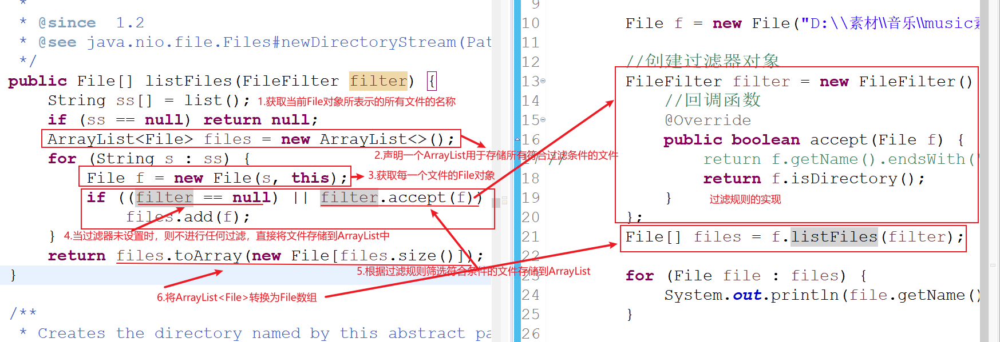

# 02 - 常用类 :surfer:

[[TOC]]

## Objects 类

Object 类是所有 java 类的顶层父类（祖宗类），但是 Objects 是从 Java7 开始新增的一个对于 java 对象进行空指针安全操作的工具类

- Objects 类是一个工具类
- Objects 对外不提供构造器，因此无法创建对象
- Objects 类中的所有方法都是 static
- 提供的是对于对象的空指针安全操作的方法

```java
User u1 = new User(1, "softeem", "123456");
User u2 = null;

//		if(u2 != null) {
//			System.out.println(u2.equals(u1));
//		}
//空指针安全的对象比较
System.out.println(Objects.equals(u1, u2));
//空指针安全的toString
System.out.println(Objects.toString(u2)); // 对象若为null则输出“null”字符串
System.out.println(Objects.toString(u2,"0")); //对象若为null则输出“0”

//空指针安全的hashCode
System.out.println(Objects.hashCode(u2));
//为空判断
System.out.println(Objects.isNull(u2));
//不为空判断
System.out.println(Objects.nonNull(u2));
//检查对象不为空，若为空则抛出NullPointerException
System.out.println(Objects.requireNonNull(u2));
```

## Random 类

​ Math 类中提供了一个`random()`的方法,用于随机一个从 0.0~1.0 之间的浮点数，当实际需求有个性化的要求时，只能通过计算获取其他类型的随机数，实际操作相对比较麻烦；因此，Java 中还提供了另一个专门用于生成各种需求的随机数类型,比如，随机整数，随机浮点数，随机布尔值。

**构造器：**

- Random()

**常见方法：**

- nextBoolean()：随机一个布尔值
- nextDouble()：随机一个 0.0~1.0 之间的 double 值
- nextInt()：随机一个 int 范围内的整数值
- **nextInt(int bounds)：随机一个从 0~bounds-1 位的整数值**

```java
public class RandomDemo {

    private static final class RandomGeneratorHolder{
        static final Random randomNumberGenerator = new Random();
    }

    private static final String SOURCE = "0123456789abcdefghijklmnopqrstuvwxyzABCDEFGHIJKLMNOPQRSTUVWXYZ";

    //随机指定长度位验证码
    public static String genCode(int count) {
        String code = "";
        for(int i = 0;i < count;i++) {
            int index = RandomGeneratorHolder.randomNumberGenerator.nextInt(SOURCE.length());
            code += SOURCE.charAt(index);
        }
        return code;
    }

    public static void main(String[] args) {

        Random r = new Random();
        //随机布尔值
        boolean f = r.nextBoolean();
        System.out.println(f);

        //随机一个从0.0~1.0之间的浮点数
        double d = r.nextDouble();
        System.out.println(d);

        int i = r.nextInt();
        System.out.println(i);

        //随机一个5以内的整数
        i = r.nextInt(5);
        System.out.println(i);

        //随机一个5(含)~10(含)之间的整数
        i = r.nextInt(6) + 5;
        System.out.println(i);

        //随机生成指定长度的验证码，包含0-9A-Za-z之间的字符
        String code = genCode(6);
        System.out.println(code);
    }
}

```

## File 类

​ File 类是来自于`java.io`包中的一个用于处理本机操作系统中的文件，文件可以是**目录**也可以是一个**标准文件**；File 类是用于在 Java 中实现跟本机文件系统进行关联的操作类。其中包含一些常见的文件操作：创建文件/目录，查看文件的状态，删除文件等。

### 常见属性

| 常量          | 解释                                                                |
| ------------- | ------------------------------------------------------------------- |
| pathSeparator | 获取与本机系统相关的路径分隔符（windows 是";"符号,Linux 是”:“符号） |
| separator     | 获取与本机系统相关的目录分隔符（windows 是”\“，Linux 是”/“）        |

### 构造器

| `File(File parent, String child)` 使用父目录所表示的 File 对象，结合子文件名构建新的 File 对象 |
| ---------------------------------------------------------------------------------------------- |
| `File(String pathname)` 根据提供的文件路径构建一个 File 对象                                   |
| `File(String parent,  String child)` 从父路径名字符串和子路径名字符串创建新的 `File`实例。     |
| `File(URI uri)` 通过将给定的 `file:` URI 转换为抽象路径名来创建新的 `File`实例。               |

### 常用方法

- createNewFile() 创建新文件（标准文件）
- exists() 判断 File 对象是否存在
- delete() 删除 File 对象所表示的文件或者目录(空目录)
- deleteOnExit() 当 JVM 结束时删除
- getName() 获取 File 对象所表示的文件名称
- getParent() 获取 File 所指的文件或者目录的父路径
- isFile() 判断当前 File 所指的是否是标准文件
- isDirectory() 判断当前 File 所指的是否是目录
- isHidden() 判断当前 File 对象是否是隐藏目录
- lastModified() 获取最后修改时间
- length() 获取 File 所表示文件大小(目录为 4096)
- list() 获取 File 所表示目录下所有子文件的名称数组
- listFiles() 获取 File 对象所表示目录下的所有子 File 数组
- listFiles(FileFilter filter) 通过文件过滤器将 File 所表示目录中符合条件的 File 对象过滤出来
- listRoots() 获取当前电脑可用的磁盘根
- mkdir() 创建当前 File 所表示的目录(一级)
- mkdirs() 创建当前 File 所表示的目录(多级)
- renameTo(File file) 重命名文件

**测试一：**

```java
public class FileDemo1 {

	public static void main(String[] args) throws IOException {

		//获取与本机系统相关的路径分割符
		System.out.println(File.pathSeparator); // windows是;		linux是:

		//获取与本机系统相关的名称（目录）分割符
		System.out.println(File.separator); //windows是 \ 			linux是 /
//		System.out.println(File.separatorChar);

		//通过java程序操作本地文件，在java中就必须存在文件对象(逻辑)

		//根据提供的文件的绝对路径（abstract path）获取文件对象
		File file = new File("D:/music_db.sql");
		//根据提供的文件相对路径（relative path）获取文件对象
		File file2 = new File("test/a.txt");

		//输出File对象所表示文件的绝对路径
		System.out.println(file.getAbsolutePath());
		System.out.println(file2.getAbsolutePath());

		//输出File对象所有表示文件的相对路径
		System.out.println(file.getPath());
		System.out.println(file2.getPath());

		//判断文件的可用性：可执行，可读，可写
		System.out.println(file2.canExecute());
		System.out.println(file2.canRead());
		System.out.println(file2.canWrite());

		//判断文件是否存在
		System.out.println("文件（或目录）是否存在-->"+file2.exists());

		file2 = new File("test/com");
		//创建新文件（标准文件）前提：父目录必须存在，否则IO异常
		boolean b = file2.createNewFile();
		System.out.println("文件创建结果--->"+b);

		file2 = new File("D:\\带班资料\\2020\\j2009\\code\\part1-javabase\\lesson17\\test\\org\\softeem\\demo");
		//创建目录(创建一级目录)
		System.out.println("一级目录创建结果--->"+file2.mkdir());
		System.out.println("创建多级目录--->"+file2.mkdirs());

//		Random r = new Random();
//		for (int i = 0; i < 1000; i++) {
//			File f3 = new File(file2, r.nextInt(10000)+""+i);
//			if(f3.mkdirs()) {
//				System.out.println(f3.getAbsolutePath()+"创建成功!");
//			}
//		}
	}

}
```

**测试二：**

```java
public class FileDemo2 {

	public static void main(String[] args) throws IOException, InterruptedException {

		// 创建临时文件
//		File f = File.createTempFile("softeem", ".log",new File("test"));
//		System.out.println(f.getAbsolutePath());

//		if(f.exists()) {
//			立即删除文件
//			boolean b = f.delete();
//			System.out.println("删除结果："+b);
//		}

		File f2 = new File("test/a.txt");
		// 删除目录的前提是目录下没有任何子文件或者子目录
//		System.out.println("删除目录-->"+f2.delete());
//		当jvm结束才删除
//		f2.deleteOnExit();

//		System.out.println(5/0);

		// 休眠5秒
//		Thread.sleep(10000);
		// 返回当前文件所在磁盘的剩余空间(字节)
		long size = f2.getFreeSpace();
		System.out.println(size / (1024 * 1024 * 1024) + "GB");

		//获取当前文件所在磁盘的总空间大小
		size = f2.getTotalSpace();
		System.out.println(size / (1024 * 1024 * 1024) + "GB");

		//获取file对象所表示的文件名称
		System.out.println(f2.getName());
		//获取File对象所表示文件所在的父目录名称（String）
		System.out.println(f2.getParent());
		//获取File对象所表示文件所在的父目录File对象(File)
		System.out.println(f2.getParentFile());


		// 实现一个程序：要求能清理指定目录下的所有字节码文件（清理缓存）包括多余的空目录
		// 1. 如何获取一个目录下的所有子文件或者子目录（递归）
		// 2. 如何获取所有的字节码文件（以 .class 结尾的文件，String类）
	}

}
```

### 文件过滤

File 类中提供了几个用于列出指定目录下所有子文件的方法：

- list()
- listFiles()

以上两个方法不会对文件进行任何的限制和过滤，直接全部遍历，但是以上两个方法还提供了对应的重载方法

- list(FilenameFilter filter)
- listFiles(FileFilter filter)
- listFiles(FilenameFilter filter)

#### 过滤方式一

以`listFiles(FileFilter filter)`为例，使用方法如下：

```java
File f = new File("D:\\素材\\音乐\\music素材");

//创建过滤器对象
FileFilter filter = new FileFilter() {
    //回调函数
    @Override
    public boolean accept(File f) {
        return f.getName().endsWith(".mp3");
    }
};
File[] files = f.listFiles(filter);

for (File file : files) {
    System.out.println(file.getName());
}
```

以上程序执行之后会获取所有的 mp3 文件，实现原理如下：



以上程序的实现，使用了匿名内部类，回调机制

#### 过滤方式二：

创建文件过滤器：

```java
/**
 * 	文件过滤器
 * @author mrchai
 */
public class MyFileFilter implements FileFilter {

	private String suffix;

	public MyFileFilter(String suffix) {
		this.suffix = suffix;
	}

	/**
	 * 	实现过滤规则
	 */
	@Override
	public boolean accept(File f) {
		return f.getName().endsWith(suffix);
	}

}
```

测试类：

```java
public class FileDemo5 {

	public static void main(String[] args) {

		File f = new File("D:\\素材\\音乐\\music素材");
		//创建过滤器对象
		FileFilter filter = new MyFileFilter(".jpg");
        //使用过滤器进行文件过滤
		File[] files = f.listFiles(filter);

		for (File file : files) {
			System.out.println(file.getName());
		}

	}

}

```

### 文件递归遍历

在对系统文件加遍历时往往会遇到一种情况：需要将一个目录下的所有子文件全部获取，但是该目录下可能还存在子目录，以及多个子目录嵌套的情况；而具体的嵌套层次是未知的，因此无法使用传统的循环语句进行遍历，此时，最好的方式可以通过递归实现遍历：

```java
public class FileDemo6 {

    /**
	 * 	读取指定目录中的所有子文件
	 * @param dir 源目录
	 */
    public static void readDir(File dir) {
        //获取目录下所有的文件对象（数组）
        File[] files = dir.listFiles();
        //判断数组对象是否为null
        if(Objects.nonNull(files)) {
            //遍历所有的File对象
            for(File file:files) {
                //判断当前File对象所表示的是否一个目录
                if(file.isDirectory()) {
                    //如果是目录，则递归遍历
                    readDir(file);
                }
                //输出文件（或者目录）名称
                System.out.println(file.getName());

            }
        }
    }


    public static void main(String[] args) {
        //源目录
        File dir = new File("D:\\java");
        //读取
        readDir(dir);
    }

}
```
