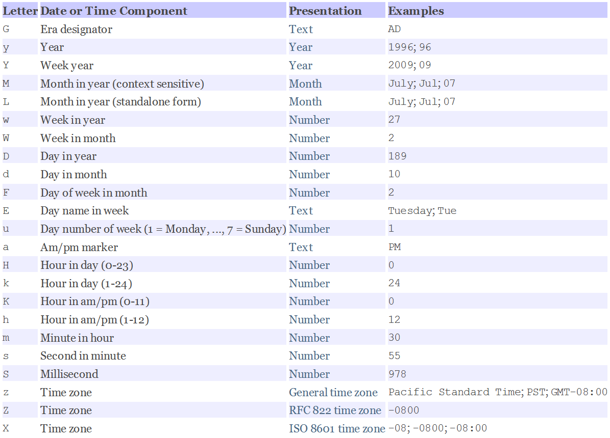
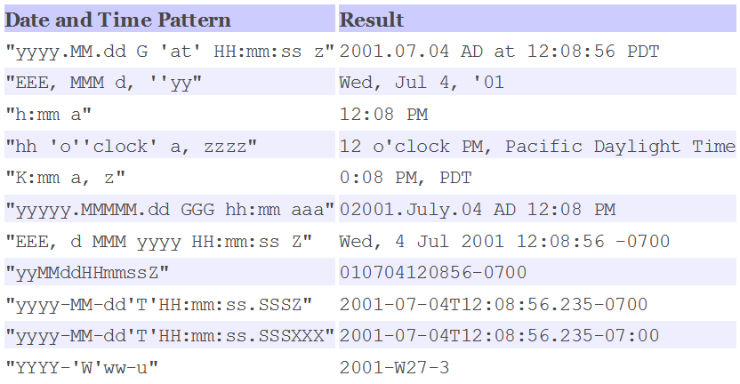
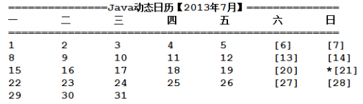

# 04 - 常用类(日期类&正则表达式) :tomato:

[[TOC]]

## 日期处理类

在程序开发中日期的处理十分常见，比如：订单的创建时间，用户注册时间，某项具体操作的触发时间等；因此 java 中也提供了丰富用于日期时间处理的工具类：

- **java.util.Date**(jdk1.0)
- **java.util.Calendar**(jdk1.1)
- java.time.LocalDate(jdk8)
- java.time.LocalTime(jdk8)
- java.time.LocalDateTime(jdk8)

### Date 类

`java.util.Date`是一个传统的 java 用于处理日期时间的类，由于版本更新，内部有很多构造器包括方法均已标记为过时，取而代之的是 java.util.Calendar 类；

#### 常用构造器

- Date()：获取当前系统时间所表示的日期对象
- Date(long time)：根据提供的时间毫秒数，构建一个日期对象（从 1970 年 1 月 1 日 00:00:00 开始）

```java
Date d = new Date();

//		d = new Date(120,11,1);

d = new Date(System.currentTimeMillis());
System.out.println(d);

//获取十分钟之后的日期对象  1sec = 1000
d = new Date(System.currentTimeMillis() + 600000);
System.out.println(d);
```

#### 常用方法

- after(Date d)
- before(Date d)
- compareTo(Date d)
- getTime()

```java
//判断当前日期对象是否是参数日期对象之后的日期
System.out.println(d1.after(d2));

System.out.println(d1.before(d2));


//实现一个小程序，判断两个学生的年龄，输出较大学生的信息？
//学生：学号，姓名，生日（1999/11/11）

Date d3 = new Date();
System.out.println(d3.equals(d1));
//获取当前日期对象所表示的时间毫秒数
System.out.println(d3.getTime());
System.out.println(d1.getTime());

//		System.out.println(d3.getYear());
```

### 日期格式化（DateFormat & SimpleDateFormat）

DateFormat 类来自`java.text`包下的用于进行日期时间格式化处理的类，是一个抽象类，内部提供了一系列用于获取格式化对象的静态方法：

- getDateInstance()
- getTimeInstance()
- getDateTimeInstance()
- getInstance()

用法如下：

```java
Date d = new Date();
// 获取一个用于进行日期格式化的对象
DateFormat fmt = DateFormat.getDateInstance();
String f = fmt.format(d);
System.out.println(f);// 2022-5-3

// 获取一个用于进行日期时间格式化的对象
fmt = DateFormat.getDateTimeInstance();
f = fmt.format(d);
System.out.println(f);// 2022-5-3 16:16:19

// 获取一个用于进行时间格式化的对象
fmt = DateFormat.getTimeInstance();
f = fmt.format(d);// 16:18:12
System.out.println(f);
```

#### SimpleDateFormat

DateFormat 中提供的静态方法可以用户获取各种丰富的格式化对象，但是针对一些需求 DateFormat 并不能完全满足，比如需要如下格式日期：

- 20201120
- 2020 年 11 月 20 日 09 时 48 分 50 秒
- 10:11:35

通过观察 DateFormat 中 getInstance()源码得知，内部使用了一个子类`SimpleDateFormat`实现，SimpleDateFormat 可以通过定制化的匹配模式来匹配不同的日期时间输出格式：



实例参考：



##### 使用方式

```java
Date d = new Date();

//20201120
DateFormat fmt = new SimpleDateFormat("yyyyMMdd");
time = fmt.format(d);
System.out.println(time);

//2020年11月20日 09时48分50秒
fmt = new SimpleDateFormat("yyyy年MM月dd日 HH时mm分ss秒 SSS毫秒");
time = fmt.format(d);
System.out.println(time);

//[10:05:55]
fmt = new SimpleDateFormat("[HH:mm:ss]");
System.out.println(fmt.format(d));

/********将String类型的日期时间转换为Date类型对象********/
String dateTime = "1999/11/11 09:10:11";
fmt = new SimpleDateFormat("yyyy/MM/dd HH:mm:ss");
//将字符串类型的时间根据指定的格式解析为Date对象
Date date = fmt.parse(dateTime);
System.out.println(date);
```

### Calendar

从 JDK1.1 开始`java.util.Date`中的很多方法和构造器标记为过时，同时 jdk 新增了对应的替代方案：`java.util.Calendar`，是一个抽象类，有一个直接子类:`java.util.GregorianCalendar`对其继承，并且实现其中的抽象方法，常见的 Calendar 实例获取方式为直接使用内部提供的静态方法`getInstance()`

具体使用如下：

```java
//以当前系统时间为基础获取日历实例  +8
Calendar c = Calendar.getInstance();
System.out.println(c);
```

#### 常见字段

- YEAR
- MONTH
- DAY_OF_MONTH
- HOUR
- MINITE
- SECOND
- DAY_OF_WEEK
- ..

#### 常见方法

- get(int field)
- set(int field,int value)
- getActualMaximum(int field)

#### 具体用法

```java
//以当前系统时间为基础获取日历实例  +8
Calendar c = Calendar.getInstance();
System.out.println(c);

//设置日历到2019年11月20日？
//		c.set(2019, 10, 20);
//设置日历对象中指定字段的值
c.set(Calendar.YEAR, 2019);

System.out.println("获取日历表示的年份:"+c.get(Calendar.YEAR));
System.out.println("获取日历表示的月份(月份从0开始):"+c.get(Calendar.MONTH));
System.out.println("获取日历表示的日期"+c.get(Calendar.DAY_OF_MONTH));
System.out.println("获取日历表示的小时"+c.get(Calendar.HOUR_OF_DAY));
System.out.println("获取日历表示的分钟"+c.get(Calendar.MINUTE));
System.out.println("获取日历表示的秒钟"+c.get(Calendar.SECOND));
System.out.println("获取日历表示的毫秒"+c.get(Calendar.MILLISECOND));

System.out.println("获取当前日历表示的日期是今年的第多少天:"+c.get(Calendar.DAY_OF_YEAR));

System.out.println("获取日历所有表示的时间毫秒数"+c.getTimeInMillis());

//设置月份为12月
c.set(Calendar.MONTH, 11);
//获取当前日期所表示字段的可能最大值
int maxDay = c.getActualMaximum(Calendar.DAY_OF_MONTH);
System.out.println(maxDay); //31

int maxMonth = c.getActualMaximum(Calendar.MONTH);
System.out.println(maxMonth);//11  (0~11)
//获取小时（24小时制）的最大值
int maxHour = c.getActualMaximum(Calendar.HOUR_OF_DAY);
System.out.println(maxHour); //23	(0~23)
//获取小时（12小时制）的最大值
maxHour = c.getActualMaximum(Calendar.HOUR);
System.out.println(maxHour);

//计算从你出生到现在一共生活了多少天？（生命倒计时）  1000 * 60 * 60 * 24
c.set(1999, 10, 11);
long start = c.getTimeInMillis();
long now = System.currentTimeMillis();

long days = (now - start) / (1000 * 60 * 60 * 24);
System.out.println(days);

//将日历的日期设置为1号（设置为这个月的第一天）
c.set(Calendar.DAY_OF_MONTH, 1);

System.out.println(c.get(Calendar.DAY_OF_WEEK));

GregorianCalendar gc = (GregorianCalendar)c;
//判断指定年份是否是闰年（该方法为GregorianCalendar特有，因此需要将Calendar强制转换）
boolean leapYear = gc.isLeapYear(2020);
System.out.println(leapYear);

//将Calendar转换为java.util.Date
Date date = c.getTime();
System.out.println(date);
```

## 正则表达式

正则表达式（ Regular expression）是一组由字母和符号组成的特殊文本, 它可以用来从文本中找出满足你想要的格式的句子。正则表达式最早源自于 perl 语言（脚本语言）；正则表达式的功能十分强大，可以用于进行文本的匹配，检索，替换；常见于一些网络爬虫。

java 中对于正则表达式的处理主要由一下三个类实现：

- **java.lang.String**
- **java.util.regex.Pattern**
- **java.util.regex.Macher**

简单案例：

```java
String a = "13567845635";
//判断两个字符串是否完全一致
System.out.println(a.equals("13567845634"));
//判断当前String对象是否匹配给定的正则表达式（ 匹配手机号格式字符串）
System.out.println(a.matches("^1\\d{10}$"));
```

### 匹配元字符

| 元字符 |             说明             |
| :----: | :--------------------------: |
|   .    |  匹配除换行符以外的任意字符  |
|   \w   | 匹配字母或数字或下划线或汉字 |
|   \s   |       匹配任意的空白符       |
|   \d   |           匹配数字           |
|   \b   |     匹配单词的开始或结束     |
|   ^    |       匹配字符串的开始       |
|   $    |       匹配字符串的结束       |

```java
//.用于匹配出回车换行之外的其他任意单个字符（数字，字母，符号）
System.out.println("!".matches("."));  //true

//匹配所有的数字，字母，不支持符号
System.out.println("a".matches("\\w")); //true

//匹配除了数字，字母外的其他符号
System.out.println("\t".matches("\\W"));//true

//匹配空格
System.out.println(" ".matches("\\s"));//true

//匹配非空格
System.out.println(" ".matches("\\S"));//false

//匹配数字
System.out.println("0".matches("\\d"));//true
//匹配非数字
System.out.println("a".matches("\\D"));//true

//边界匹配，匹配是否以指定字符开头
System.out.println("abc".matches("\\babc")); //true
System.out.println("a".matches("^a")); //true

//边界匹配，匹配是否以指定的字符结尾
System.out.println("d".matches("d$")); //false
```

### 匹配长度

| 语法  |       说明        |
| :---: | :---------------: |
|  \*   | 重复零次或更多次  |
|   +   | 重复一次或更多次  |
|  ？   |  重复零次或一次   |
|  {n}  |     重复 n 次     |
| {n,}  | 重复 n 次或更多次 |
| {n,m} |  重复 n 到 m 次   |

```java
//匹配输入长度为4的数字要求必须以1开头

System.out.println("1234".matches("^1\\d{3}"));

//验证输入的是否是qq号  5-11位长度数字，不能以0开始
System.out.println("12334352324".matches("^[1-9]\\d{4,10}"));

// \\w
System.out.println("a".matches("[0-9a-zA-Z]"));

//匹配不能少于5位长度的数字
System.out.println("12387912".matches("\\d{5,}"));

//匹配不能超过6位长度的数字
System.out.println("12346".matches("\\d{0,6}"));

//匹配字母0个或多个
System.out.println("".matches("[a-zA-Z]*"));

//匹配字母1个或多个
System.out.println("a".matches("[a-zA-Z]+"));

//匹配字母0个或1个
System.out.println("ac".matches("[a-zA-Z]?"));

// 编写一个正则 实现对ip地址的匹配
// 由四段数值构成 每段数字长度为1-3
// 192.168.0.104
String regex = "\\d{1,3}\\.\\d{1,3}\\.\\d{1,3}\\.\\d{1,3}";
System.out.println("192.168.0.104".matches(regex));

```

### 分区

```java
// 匹配至少一个小写字符串
System.out.println("abc".matches("[a-z]+"));
// 匹配只能允许出现amx字符内容
System.out.println("aaaaaamxxxxxmxxmxmxmmxma".matches("[mxa]+"));
//匹配手机号
System.out.println("18671107627".matches("^1[358]\\d{9}"));
//匹配非零开始的数字长度任意
System.out.println("20012358723".matches("[^0]\\d+"));
//匹配不能以13579开头的字符 不能包含符号
System.out.println("2468asdasdva".matches("[^13579]\\w+"));
```

### 分组

```java
// 匹配指定运营商号的手机号
System.out.println("13012345671".matches("^(130|131|132|155|156|185|186|145|176)\\d{8}$"));

// 匹配输入的内容是否是一个网站 http://|https://
System.out.println("http://www.ZyKun.com".matches("^(http://|https://)\\w.+"));
```

### Pattern&Matcher

```java

String content = "adfasdffdiu1353457839417812341023u901223423418712312317823sdfsd";
//手机号正则表达式
String regex = "1\\d{10}";
//编译正则表达式获取匹配模式对象
Pattern p = Pattern.compile(regex);
//对指定的输入内容进行匹配并且获取匹配器
Matcher m = p.matcher(content);
//直接匹配
//System.out.println(m.matches());
//搜索是否存在匹配的组
while(m.find()) {
    //取出当前匹配到的组
    String s = m.group();
    System.out.println(s);
}
```

### 正则表达式在线测试

- https://regexr.com/
- https://regex101.com/

## 作业

1. 要求用户输入年份月份，显示当月的日历布局，并且周末日期使用【】包裹，当前日期前使用“\*”标记，效果如下：

   

2. 从一个提供的网页地址中搜索并提取所有的超链接地址（http://||https://）

3. 统计从第一天开始到目前为止，Eclipse 工作空间总所有代码总行数，另外统计有多少空行，多少注释行,以及多少有效代码行。
