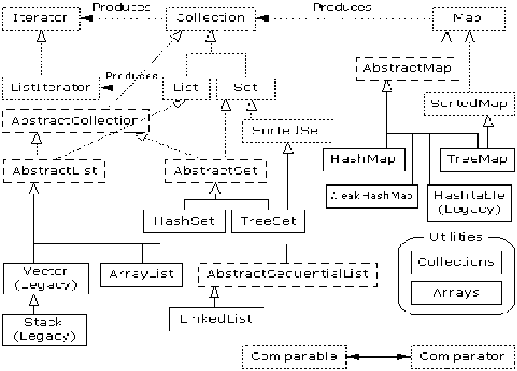
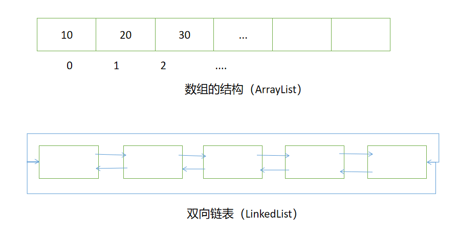
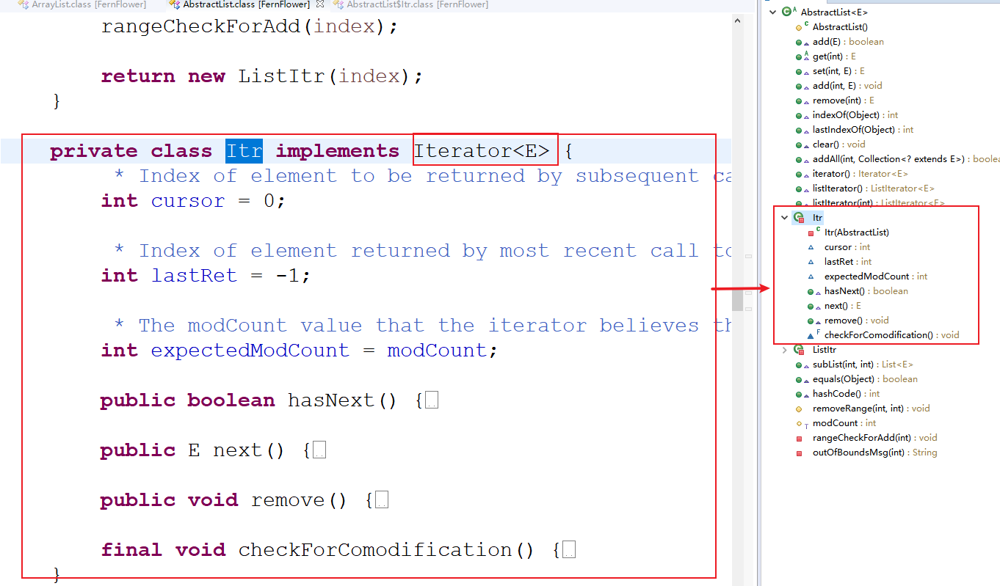
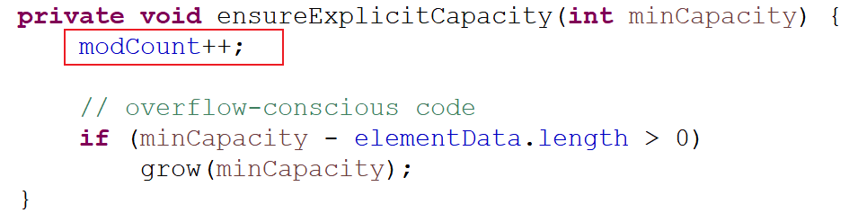
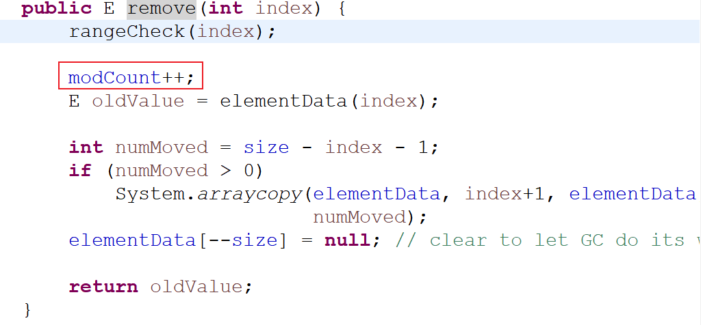
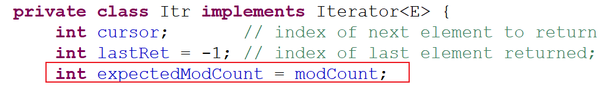
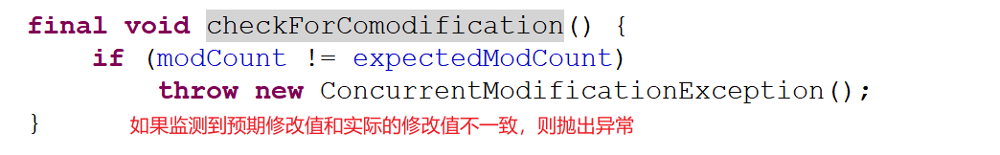

# 05 - 正则表达式补充&集合框架入门 :fries:

[[TOC]]

## 正则表达式补充

### group

捕获组通过从左到右计算其开始括号进行编号。 例如，在表达式`((A)(B(C)))`中，存在四个这样的组：

1.  `((A)(B(C)))`
2.  `(A)`
3.  `(B(C))`
4.  `(C)`

使用方式：

```java
String score = "109:95";

String regex = "((\\d{1,3}):(\\d{1,3}))";

Pattern p = Pattern.compile(regex);
Matcher m = p.matcher(score);
//搜索整个字符串序列
m.find();

System.out.println(m.group());  //109:95
System.out.println(m.group(0)); //109:95
System.out.println(m.group(1)); //109:95
System.out.println(m.group(2)); //109
System.out.println(m.group(3)); //95
```

扩展：

//火箭队:湖人队/勇士队:骑士队/热火队:凯尔特人队
score = "95:98/97:99/95:88";
//分别获取三组比分，以及每一个队伍的得分

```java
//火箭队:湖人队/勇士队:骑士队/热火队:凯尔特人队
String score = "95:98/97:99/95:88";
//分别获取三组比分，以及每一个队伍的得分
String regex = "((\\d{1,3}):(\\d{1,3}))";

Pattern p = Pattern.compile(regex);
Matcher m = p.matcher(score);
while(m.find()) {
    System.out.println(m.group(1));
    System.out.println(m.group(2));
    System.out.println(m.group(3));
    System.out.println("==========");
}
```

运行结果：

```
95:98
95
98
==========
97:99
97
99
==========
95:88
95
88
==========
```

### 正则表达式三种模式

#### 贪婪模式（greedy）

贪婪模式即从匹配到的位置开始一直往后依次搜索，并且会回溯

```java
String html = "href=\"//cloud.video.taobao.com/video/1098/aaabbc.swf\" href=\"http://www.softeem.com/video/aaa.swf\"";
Pattern pMp4 = Pattern.compile("//cloud.video.taobao.com.+.swf");
Matcher mMp4 = pMp4.matcher(html);
while(mMp4.find()) {
    System.out.println(mMp4.group());
}
```

> 结果：
>
> ```
> //cloud.video.taobao.com/video/1098/aaabbc.swf" href="http://www.softeem.com/video/aaa.swf
> ```

#### 懒惰模式（reluctant）

通过贪婪模式能够发现，表达式会一直往后搜索，以最后一个匹配到的结尾为终止条件，获取的结果跟预期的存在差距，只需要将正则表达式做如下修改即可匹配到我们需要的资源:

```java
//cloud.video.taobao.com.+?.swf
```

以上的匹配模式称之为懒惰匹配（勉强模式），寻找最短的匹配

> 结果：
>
> ```java
> //cloud.video.taobao.com/video/1098/aaabbc.swf
> //cloud.video.taobao.com/video/aaa.swf
> ```

#### 独占模式（possessive）

独占模式跟贪婪模式的区别在于，不会回溯，即一直往后搜索会将后续的所有字符串进行匹配

```java
String s = "aabbbccddcaabbbdd";
String regex = "aa.*+dd";
Pattern p = Pattern.compile(regex);
Matcher m = p.matcher(s);
m.find();
System.out.println(m.group());
```

> 结果:
>
> ```java
> Exception in thread "main" java.lang.IllegalStateException: No match found
> 	at java.util.regex.Matcher.group(Unknown Source)
> 	at java.util.regex.Matcher.group(Unknown Source)
> 	at com.softeem.lesson20.regex.ReluctantDemo.main(ReluctantDemo.java:27)
> ```

## 集合入门

在 java 基础阶段，能存储大量相同数据的容器只有数组，但是是数组存在一个弊端，必须指定数组的容量，而且容量无法改变（即数组的长度一旦定义则无法修改），因此我们学习了 ArrayList。在 jdk1.2 之前 java 官方就提供了一些集合的结局方案:

- **Enumeration（枚举：对集合迭代接口）**
- **Vector（向量）**
- **Stack（栈）**
- **Hashtable（哈希表）**
- **Dictionary（字典）**
- **Properties（属性表）**

以上集合工具在 jdk1.2 之前就已经存在，但是由于没有一个统一的标准，因此组织混乱，而且也存在部分 bug.

从 JDK1.2 开始 java 中新增了集合 API，用于将所有集合进行统一归纳，形成了两种集合的解决方案：

- 单列集合
- 双列集合

单列集合有一个顶层的接口：**Collection**

双列集合有一个顶层接口：**Map**



以上结构图为 java 集合框架组织结构图，所有虚线表示的都是接口或抽象类，实线表示的为针对接口的实现类。java 中所有的集合接口以及类都位于`java.util`包中

## Collection

Collection 是所有单列集合的顶层接口，在 java 中存在的有序集合（List）和无序集合（Set）接口都从 Collection 接口继承，Collection 中的常用方法有：

- `public boolean add(E e)`： 把给定的对象添加到当前集合中 。
- `public boolean addAll(Collection e)`： 把给定的集合对象添加到当前集合中 。
- `public void clear()` :清空集合中所有的元素。
- `public boolean remove(E e)`: 把给定的对象在当前集合中删除。
- `public boolean contains(E e)`: 判断当前集合中是否包含给定的对象。
- `public boolean isEmpty()`: 判断当前集合是否为空。
- `public int size()`: 返回集合中元素的个数。
- `public Object[] toArray()`: 把集合中的元素，存储到数组中。
- `public Iterator iterator()`：获取当前集合的迭代器对象
- `default Stream stream()`：获取用于进行流式处理的 Stream 对象（JDK8 新增）

由于 Collection 是一顶层集合接口，因此对于不同类型的集合也存在两个子接口分别进行处理：

- **List：是一个有序的集合，并且允许重复的元素出现**
- **Set：是一个无序集合，并且不允许重复元素出现**

> 面试题：
>
> Collection、Collections、Connection 什么区别？
>
> Collection 是所有单列集合的顶层接口；Collections 是针对集合进行处理的工具类，比如排序，查找，洗牌，逆序等操作；Connection 是 java 访问数据库技术(JDBC)中的数据库连对象的顶层接口

## List 集合

List 接口是一个有序的集合，内部允许重复(e1.equals(e2))的元素出现,并且元素的存储顺序是按照添加顺序存储，因此可以通过元素的索引位置快捷的搜索到目标元素；List 接口除了包含 Collection 中的方法之外，还新增了以下常见方法：

- `public E get(int index)`：根据元素的索引获取指定位置的元素并返回
- `public ListIterator listIterator()`: 获取此集合对应的列表(有序)迭代器
- `public E remove(int index)`：移除指定位置的元素
- `public List subList(int fromIndex,int toIndex)`：将集合从指定位置进行截取，截取到目标位置，并将返回的数据形成新子 List(假分页)

List 接口有几个常见的实现类：

- **ArrayList**
- **LinkedList**
- **Vector**

### ArrayList

其中最常用的是`java.util.ArrayList`;ArrayList 内部基于数组+数据拷贝的实现，初始容量是 10，当添加的元素位置超出容量时，会在原数组的容量基础上扩充为 1.5 倍；由于 ArrayList 是基于数组的实现，因此在进行数据检索时的效率很高，只需要获取到元素的索引就能快速定位到元素的位置，但是由于数组的长度一旦定义，则无法修改，因此在对 ArrayList 进行元素的添加和删除的时候会导致数组的容量发生变化，需要频繁的创建新数组的对象，因此在进行添加，删除时效率很低；**ArrayList 适合做查询不适合做修改（查快改慢）**

ArrayList 基本使用：

```java
List list = new ArrayList();
list.add(new String("hello"));
list.add(true);
list.add(100);
list.add('h');

//向指定的位置插入元素
list.add(1,"world");

System.out.println("集合中是否包含指定元素："+list.contains("hello"));

//替换指定位置的元素
list.set(1, "softeem");

//截取一个子集合(前包后不包)
list= list.subList(2, 5);

System.out.println(list.toString());
//将集合转换为对象数组
Object[] objs = list.toArray();
System.out.println(objs.length);

//清空集合
list.clear();
System.out.println("集合是否为空:"+list.isEmpty());
```

```java
public static void main(String[] args) {

    List list = new ArrayList();
    list.add("helloworld");
    list.add("jack");
    list.add("rose");
    list.add("lily");
    list.add("lucy");

    //listiterator  获取当前集合的列表迭代器 可以判断是否有上一个 或者下一个元素
    ListIterator it = list.listIterator();
    while (it.hasNext()) {
        System.out.println(it.next());
        //			it.add("kobe");   添加操作
    }

    System.out.println("=======");

    while (it.hasPrevious()) {
        System.out.println("索引："+it.previousIndex()+"元素："+it.previous());
    }

}
```

### LinkedList

​ 前面已经了解了 ArrayList 的实现原理是基于数组结合数组拷贝，但是由于数组的先天性问题：长度一旦定义无法修改，因此 ArryList 不适合进行频繁的修改（增加，删除）操作；如果需要频繁对容器进行修改操作时，List 接口还提供了另一个实现类：LinkedList；

​ LinkedList 是基于双向链表的实现（链表的结构如下），在元素进行增删操作时，只需要修改链表的首尾指针的指向即可轻松实现，因此 LinkedList 适合用于频繁的修改操作中;但是在进行元素的检索时，只能从链表头，或链表尾部依次搜索，查询效率相对较低。（**LinkedList 改快查慢**）



**常用方法：**

实际开发中对一个集合元素的添加与删除经常涉及到首尾操作，而 LinkedList 提供了大量首尾操作的方法。这些方法我们作为了解即可：

- `public void addFirst(E e)`:将指定元素插入此列表的开头。
- `public void addLast(E e)`:将指定元素添加到此列表的结尾。
- `public E getFirst()`:返回此列表的第一个元素。
- `public E getLast()`:返回此列表的最后一个元素。
- `public E removeFirst()`:移除并返回此列表的第一个元素。
- `public E removeLast()`:移除并返回此列表的最后一个元素。
- `public E pop()`:从此列表所表示的堆栈处弹出一个元素。
- `public void push(E e)`:将元素推入此列表所表示的堆栈。(此方法相当于 addFirst(E).)
- `public boolean isEmpty()`：如果列表不包含元素，则返回 true。

LinkedList 是 List 的子类，List 中的方法 LinkedList 都是可以使用，这里就不做详细介绍，我们只需要了解 LinkedList 的特有方法即可。在开发时，LinkedList 集合也可以作为堆栈，队列的结构使用。（了解即可）

**使用参考：**

```java
LinkedList list = new LinkedList();
list.add("rose");
list.add("jack");
list.add("bob");
list.add("tom");
list.add("jarry");
list.add("bob");
list.add(null);

//这里的数值不是索引，表示的链表需要进行节点搜索的次数
System.out.println(list.get(5));

for (Object obj : list) {
    System.out.println("--->"+obj);
}
System.out.println(list.size());

//向集合的头部插入元素
list.addFirst("123");
//向集合的尾部插入元素
list.addLast("789");
System.out.println(list.getFirst()+"获取头部元素");
System.out.println(list.getLast()+"获取尾部元素");

//从头部弹出元素（将元素从集合中删除）
System.out.println(list.pop());
//向集合中加入元素(等同addFirst)
list.push("456");
System.out.println(list);
```

### Vector

​ Vector 是在 JDK1.0 就已经存在的基于动态数组（数组+数组拷贝）的集合实现，Vector 是一个线程安全（关键方法上都使用了 synchronized 修饰）的集合实现，Vector 在容量扩充时，增长为原来的 2 倍（ArrayList 是 1.5 倍）；在 jdk1.2 之后新的集合 API 出现，Vector 被改造为从 List 集合实现，因此 Vector，ArrayList，LinkedList 都是源自于 List 接口

> **Vector,LinkedList,ArrayList 区别？**
>
> - Vector 是老式的集合类，内部基于动态数组实现，容量扩充为原来的 2 倍，Vector 是线程安全的实现
> - ArrayList 是 JDK1.2 之后新增的 List 集合的实现，内部也是基于动态数组实现，容量扩展为原来的 1.5 倍，ArrayList 是线程不安全的实现(效率高)，数据查询较快，修改较慢
> - LinkeadList 是 JDK1.2 之后新增的 List 集合的实现，内部是基于双向链表实现，也是线程不安全的实现，在进行数据修改方面比较快，数据查询较慢

## Iterator(迭代器)

Iterator 接口从 jdk1.5 之后新增的对集合进行快速遍历的接口，内部实现通常是由集合是类自身通过内部类的形式来完成，比如 ArrayList：



### 常用方法

- `public boolean hashNext()`：判断迭代器是否存在下一个可以迭代的元素
- `public E next()`：获取下一个迭代到的元素
- `public void remove()`：删除当前迭代到的元素

基本使用方式：

```java
List list = new ArrayList();
list.add("lilei");
list.add("lily");
list.add("lucy");
list.add("rose");
list.add("jack");
//获取集合自身的迭代器对象
Iterator it = list.iterator();
while(it.hasNext()) {
    Object obj = it.next();
    it.remove();
}
```

由于以上语法相对比较复杂，因此迭代器的出现同时也新增一种语法糖技术：forEach

```java
for(Object obj:list){
    System.out.println(obj);
}
```

### ListIterator

ListIterator 从 Iterator 实现而来，在 Iterator 的基础上扩充了一些方法：

- `public boolean hasPreviouse()`：是否存在上一个可迭代元素
- `public E previouse()`：获取上一个迭代到的元素
- `public void add(E e)`:通过迭代器向元素中添加一个元素
- `public void set(E e)`:通过迭代器，修改当前位置的元素

```java
List list = new ArrayList();
list.add("helloworld");
list.add("jack");
list.add("rose");
list.add("lily");
list.add("lucy");

//获取当前集合的列表迭代器（可以反向迭代，添加，替换元素）
ListIterator it = list.listIterator();
//循环判断是否有下一个可迭代元素
while(it.hasNext()) {
    //取出下一个元素
    System.out.println(it.next());
}
//添加元素
it.add("kobe");
System.out.println("=========");
//循环判断是否有上一个可迭代元素
while(it.hasPrevious()) {
    //取出上一个元素
    System.out.println(it.previous());
}
```

> 面试问题：
>
> 在对集合元素遍历的同时进行删除或者添加操作时会导致一个异常出现：`ConcurrentModifactionException`，导致原因是因为在集合内部的每一个更新方法中都包含一行代码`modCount++`
>
> 
>
> 
>
> 在获取迭代器时会首先将该值缓存到 Iterator 对象的成员变量中
>
> 
>
> 接下来在对集合使用内部的更新方法发操作元素时每次都会重新修改`modCount`值，但是迭代器中只会缓存第一次赋予的值（除非调用了迭代器自己的 remove）；因此一旦使用集合方法更新了元素，都将导致迭代器中检查两个值是否一致，如果不一致则抛出异常（ConcurrentModifactionException）
>
> 
>
> 解决方案:
>
> 1.  使用迭代器自身的 remover
>
> ```java
> Iterator it = list.iterator();
> while(it.hasNext()) {
>     Object obj = it.next();
>     it.remove();
> }
> ```
>
> 2.  在找到满足条件的元素进行操作之后，立马结束循环
>
> ```java
> for (Object obj : list) {
>     if("lucy".equals(obj)) {
>         list.remove(obj);
>         //结束循环
>         break;
>     }
> }
> ```
>
> 3.  当需要更改的元素不止一个时可以，使用如下方式:
>
> ```java
> //声明临时数组
> List temp = new ArrayList();
> for (Object obj : list) {
>     if("lucy".equals(obj) || "lily".equals(obj)) {
>         //将符合条件的元素存储到临时集合中
>         temp.add(obj);
>     }
> }
> //在循环结束后统一处理
> list.removeAll(temp);
> ```

## 练习题

1. 现有若干条数据，每页显示 n 条，要求提供一个方法；根据传入的页码数和每页数据条数，输出该页的所有数据

   ```
   //Student类(sno,sname,sex,birth,major,score)

   public ArrayList<Student> findByPage(int pageNow,int pageSize){
       //todo
   }
   ```

2. 完成一个通讯录，需求:

   （1）添加联系人(联系人:编号,姓名,手机号,QQ,邮箱地址)`添加时需要检查手机号和邮箱地址格式是否正确，若不正确，不允许添加`

   （2）联系人查询(输入姓名或电话查询)

   （3）显示联系人列表

   （4）根据编号删除指定编号的联系人

3. 扩展题：

   ​ 完成一个车管所，汽车车牌随机生成系统，要求可以随机产生不同的车牌，由车主进行选择，车主若选择了合适的车牌，则将该车牌记录到集合中，下一次不能再随机到该重复的车牌号。
