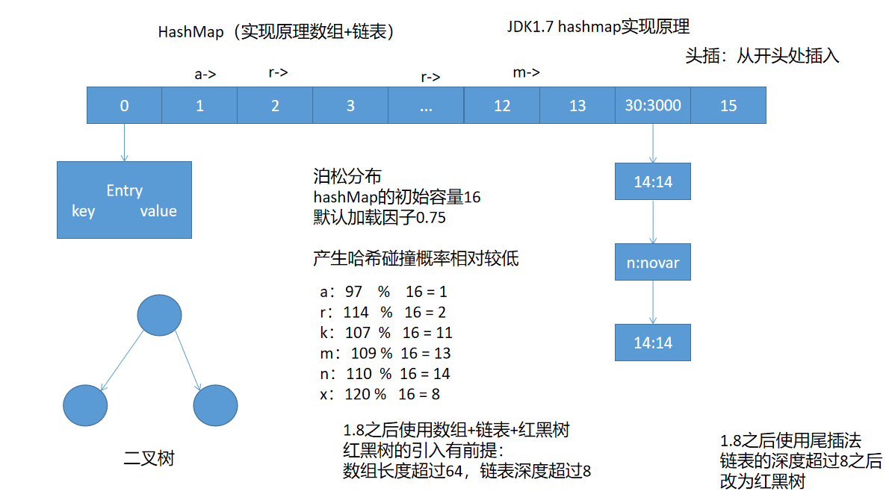
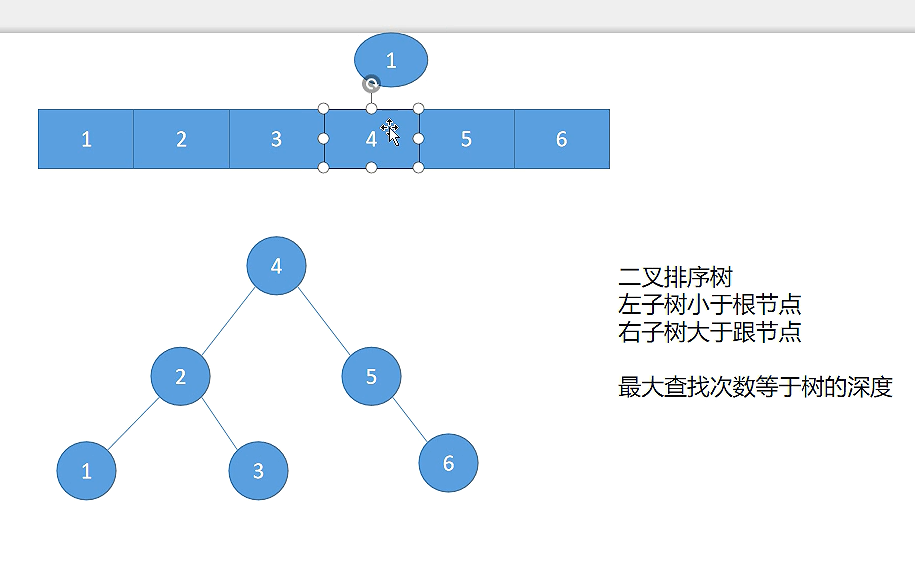

# 07 - 集合框架（2）:honey_pot:

[[TOC]]

## Set 集合

之前我们已经学习过了 List 集合，List 具备以下特点：

- 有序（存储顺序跟添加顺序一致）
- 允许重复（可以添加重复数据 e1.equals(e2)）
- 允许空元素

虽然对于大多数应用场景下 List 集合都非常实用，但是对于一些特殊需求，List 集合会暴露明显的问题，比如对集合中的元素去除重复，对于 List 集合必然就会需要涉及到集合遍历，影响到程序的运行效率；因此对于这种需求 Collection 接口还提供了另一种子接口：Set

**Set**也是从 jdk1.2 开始出现，对比 List 集合，Set 集合特点如下：

- 元素的存储顺序与添加顺序无关(无序)
- 内部不允许重复元素

Set 由于是一个接口，因此对于该接口，集合框架内部提供了一些常见的实现类：

- **HashSet**
- **LinkedHashSet**
- **TreeSet**

> 注意事项:
>
> 由于 Set 集合的实现中没有针对数组结构的实现，因此内部的元素也不存在索引,所以没有 get 方法 不过可以通过 iterator 来取

### 常用方法

- add(Object obj) 向集合中添加元素
- addAll(Collection c) 将一个集合添加到当前集合中
- clear() 清除集合中所有元素
- isEmpty() 判断集合是否为空集合（size = 0）
- remove(Object obj) 删除指定元素
- iterator() 获取当前集合的迭代器对象
- size() 获取集合中元素个数

### HashSet

HashSet 是基于哈希表[^ 所谓的 Hash 表就是在内存中根据内存对象信息计算出来的地址生成的一个表格 从这个表格里面我们可以通过地址快速的结合到这个对象 就比如教室里面的位置（每个位置都是一个独一无二的标记，根据标记可以找到每个学生所在的位置） ]的实现（内部实际就是一个 HashMap）,内部的元素存储根据调用元素的 hashCode 方法实现，由于对象的存储基于 hashCode 算法，因此如果多个对象的的 hashCode 值是一致的，则集合中只会存储一个（**在重写 hashCode 方法时也必须要同时重写 equals**）

User 类：

```java
public class User {

    private int id;
    private String name;
    private String pwd;

    //构造器
    //setter/getter
    //toString

    @Override
    public int hashCode() {
        final int prime = 31;
        int result = 1;
        result = prime * result + id;
        result = prime * result + ((name == null) ? 0 : name.hashCode());
        result = prime * result + ((pwd == null) ? 0 : pwd.hashCode());
        return result;
    }

    @Override
    public boolean equals(Object obj) {
        if (this == obj)
            return true;
        if (obj == null)
            return false;
        if (getClass() != obj.getClass())
            return false;
        User other = (User) obj;
        if (id != other.id)
            return false;
        if (name == null) {
            if (other.name != null)
                return false;
        } else if (!name.equals(other.name))
            return false;
        if (pwd == null) {
            if (other.pwd != null)
                return false;
        } else if (!pwd.equals(other.pwd))
            return false;
        return true;
    }
}
```

测试类:

```java
Set set = new HashSet();
set.add(10);
set.add(7);
set.add(9);
set.add(8);
set.add(3);
set.add(5);
set.add(10);
set.add(new User(1,"softeem","123"));
set.add(new User(1,"softeem","123"));
```

输出结果：

```
[3, 5, 7, 8, 9, 10, User [id=1, name=softeem, pwd=123]]
```

### TreeSet

在前面 HashSet 中，元素虽然不允许重复，但是由于存储顺序是无序的，在对于一些需要排序的需求场景下，HashSet 也暴露了功能不足的问题，因此 ，Set 集合中针对该需求，还提供了另一种能够实现排序的 Set 实现：TreeSet；TreeSet 内部实现原理是基于二叉树中的红黑树实现，使用 TreeSet 的前提：

- 元素必须是同一种数据类型 `无法对不同类型的数据进行排序`
- 元素必须实现过 Comparable 接口 `(因为排序)`

```java
Set set = new TreeSet();
set.add(18);
set.add(27);
set.add(45);
set.add(8);
set.add(32);
set.add(50);
set.add(10);

System.out.println(set);
```

结果:

```
[8, 10, 18, 27, 32, 45, 50]
```

> 注意事项：
>
> TreeSet 内部对于元素的去除重复根据重写的 comparaTo 方法来决定，如果多个对象的 comparaTo 方法返回值是一致的，则集合中只会存储一个：
>
> ```java
> public class User implements Comparable<User>{
>
> 	private int id;
> 	private String name;
> 	private String pwd;
>
>
> 	//构造器
>     //getter/setter
>     //toString
>
>     /**
>     * 实现排序比较规则
>     */
> 	@Override
> 	public int compareTo(User o) {
> 		return name.compareTo(o.name);
> 	}
>
> }
> ```
>
> 测试
>
> ```java
> Set set = new TreeSet();
> set.add(new User(1,"softeem","123"));
> set.add(new User(2,"softeem","456"));
> System.out.println(set);
> ```
>
> 输出结果:
>
> ```
> [User [id=1, name=softeem, pwd=123]]
> ```
>
> **TreeSet 中的元素对应的类如果未实现 Comparable 接口，则会抛出运行时异常：**
>
> ```
> java.lang.ClassCastException
> ```
>
> **因为内部会将元素强制转换为 Copparable 对象**

### LinkedHashSet

HashSet 是基于 hash 算法实现的元素的存储，但是由于不同的对象 hash 值存在差异，因此元素的存储顺序不一定按添加顺序来；在实际开发中如果需要按元素的添加顺序存储，并且要保证元素不重复，因此可以使用由 Set 集合提供的另一个实现：LinkedHashSet；LinkedHashSet 是从 HashSet 继承而来，内部的实现原理实际是基于 LinkedHashMap.

```java
Set set = new LinkedHashSet();
set.add("hello");
set.add(true);
set.add(3.14);
set.add(100);
set.add(new User());

Iterator it = set.iterator();
while(it.hasNext()) {
    System.out.println(it.next());
}
```

结果：

```
hello
true
3.14
100
User [id=0, name=null, pwd=null]
```

> 面试题：
>
> HashSet，TreeSet 和 LinkedHashSet 区别？
>
> HashSet 是 Set 集合基于 hash 表(散列表)的实现元素存储，内部的元素存储顺序跟 hash 值有关，如果多个对象的 hash 一致(equals 也一致)则集合会认为是重复元素，因此不会加入集合中;HashSet 内部实现原理是基于 HashMap 的。
>
> TreeSet 是 Set 集合基于红黑树（二叉排序树中的特殊平衡二叉树），内部元素的存储顺序是根据元素对应类实现的 Comparable 接口中 compareTo 方法进行存储，如果多个对象的 comparaTo 方法返回值一致，则 TreeSet 会认为是重复元素，因而不会重复存储;TreeSet 实际就是基于 TreeMap 的实现
>
> LinkedHashSet 是 HashSet 的子类，内部基于单链表的实现，元素的存储顺序按照添加顺序来存储，是一个有序的 set 集合；内部实现原理使用了 LinkedHashMap。

## Map 集合

之前所学习到的 List 集合以及 Set 集合都是直接从 Collection 继承而来的单列子集合，另外，java 的集合框架中也提供了另一种特殊的集合接口：双列集合：Map；

Map 集合是由键值对结构组成，通常由一个(唯一)键对应一个值，集合中存储的**元素键不允许重复，但是值可以重复**，Map 集合是一个键值对集合的顶层接口，常见的实现类主要有以下：

- **HashMap**
- **TreeMap**
- **LinkeHashMap**
- **ConcurrentHashMap**

虽然 Map 集合是一个键值对结构，但是实际内部存储的每一个元素都是一个 Entry 对象，而 Entry 内部包含两个属性，一个是 Key，另一个是 Value

### Map 常见方法

- clear() 清除 Map 集合中的所有元素
- containsKey(Object key) 判断集合中是否包含指定的键
- containsValue(Object value) 判断集合中是否包含指定的值
- entrySet() 返回当前 Map 集合中 Entry 的 Set 集合
- get(Object key) 根据键获取值
- put(Object k,Object v) 向集合中添加元素（键值对）
- keySet() 获取键的 Set 集合
- remove(Object key) 根据键删除指定的元素
- size() 返回该 Map 集合中元素的个数
- values() 返回 Map 集合中所有的值集合（Collection）

### HashMap

HashMap 是 Map 中最常用的一个实现类，**内部实现是基于数组+链表（JDK1.8 之前；JDK1.8 之后改为使用数组+链表+红黑树实现）**；元素的存储按照键值对的方式，存储顺序根据键的 hashCode(包括 equals)计算之后存储

HashMap 的初始容量是 16，默认的加载因子是 0.75（降低 hash 碰撞的概率），HashMap 的扩容方式为原来的 2 倍；实现原理：

- 在 1.8 之前使用的是数组和链表实现，默认情况下通过计算元素的 hash 值，然后和 16 取余（实际: hashCode & (length-1)）,再根据计算结果将元素(Map.Entry)存储对应的数组中，如果该位置已经存在元素，则此时引入链表，采用头插法将最新的元素插入到链表头部。
- 在 JDK1.8 之后使用数组+链表+红黑树（平衡排序二叉树）实现，红黑树的加入有特定前提
  - 数组的长度必须超过 64
  - 链表深度必须大于 8



#### 补充内容：二叉树



HashMap 的使用：

```java
//创建一个基于HashMap的Map接口实现对象
Map map = new HashMap();
map.put("a", "admin");
map.put("r", "rose");
map.put("k", "kaven");
map.put("m", "mulan");
map.put("n", "novar");
map.put("x", "xiaoming");
//集合中存储重复的键时会覆盖之前存储的元素
map.put("a", "rose");
map.put("y", "rose");
map.put(14, "14");
map.put(30,"300000");
map.put(46,"46");

System.out.println(map);
//根据键获取值
System.out.println(map.get("k"));
System.out.println("a".hashCode() % 16);
System.out.println("r".hashCode() % 16);
System.out.println("k".hashCode() % 16);
System.out.println(("m".hashCode() & 15) + "--" +("m".hashCode() % 16));
System.out.println("n".hashCode() % 16);
System.out.println("x".hashCode() % 16);
System.out.println(new Integer(14).hashCode() % 16);
System.out.println(new Integer(30).hashCode() % 16);
System.out.println(new Integer(46).hashCode() % 16);
//判断map集合中是否包含指定的键
System.out.println(map.containsKey("a"));

//
//判断map集合中是否包含指定的值
System.out.println(map.containsValue("rose"));

//获取Map集合中所有的Entry元素的Set集合
Set<Map.Entry> set = map.entrySet();
for (Entry e : set) {
    System.out.println(e.getKey()+"/"+e.getValue());
}

Map map2 = new HashMap();
map2.put("100", "hellowrold");
map2.put(true, "true");
map2.put(3.14, "314");
map2.put('c', "cccaaa");
map2.put(50, "hellowrold");

//
//获取Map的键集
Set set = map2.keySet();
System.out.println(set);
//根据键移除指定元素
Object obj = map.remove('c');
System.out.println(obj);

System.out.println(map2);

//获取Map的值集
System.out.println(map2.values());
```

### TreeMap

Map 集合另外针对于排序的需求还有一个 TreeMap 的实现类，该类内部基于红黑树（平衡排序二叉树）实现；内部的元素存储顺序，**由键对应的类型实现 Comparable 接口后，通过重写 comparaTo 方法实现**；TreeMap 的使用需要满足以下两个条件：

- key 的类型必须一致
- key 对应的类必须实现 Comparable 接口

**TreeMap 不允许空键出现**[^因为 TreeMap 的键调用了 compareTo 如果为空 则抛空指针]

```java
Map map = new TreeMap();
map.put("hello", "helloworld");
map.put("rose", "helloworld");
map.put("jack", "helloworld");
map.put("softeem", "helloworld");
map.put("admin", "helloworld");

System.out.println(map);
```

对于以上代码，TreeMap 会使用键对应的类型中的 comparaTo 方法来完成对于元素的排序存储

**对于复杂类型的 key，使用方式：**

```java
public class Student implements Comparable<Student>{

	private int sno;
	private String sname;
	private Date birth;
	private double score;

    //构造器
    //setter/getter
    //toString

	@Override
	public int compareTo(Student s) {
		return (int)(this.score - s.score);
	}

}
```

测试：

```java
Map map = new TreeMap();
map.put(new Student(104,"孙悟空",new Date(),65), "helloworld");
map.put(new Student(103,"猪八戒",new Date(),75), "helloworld");
map.put(new Student(101,"沙和尚",new Date(),55), "helloworld");
map.put(new Student(105,"唐僧",new Date(),45), "helloworld");
map.put(new Student(106,"小白龙",new Date(),55), "helloworld");
map.put(new Student(109,"白骨精",new Date(),77), "123");

Set set = map.keySet();
for (Object obj : set) {
    System.out.println(obj);
}
```

结果:

```java
Student [sno=105, sname=唐僧, birth=Wed Nov 25 15:46:24 CST 2020, score=45.0]
Student [sno=101, sname=沙和尚, birth=Wed Nov 25 15:46:24 CST 2020, score=55.0]
Student [sno=104, sname=孙悟空, birth=Wed Nov 25 15:46:24 CST 2020, score=65.0]
Student [sno=103, sname=猪八戒, birth=Wed Nov 25 15:46:24 CST 2020, score=75.0]
Student [sno=109, sname=白骨精, birth=Wed Nov 25 15:46:24 CST 2020, score=77.0]
```

> 根据以上结果得知，TreeMap 中去除重复的原则是根据 key 类型中实现的 comparaTo 方法来实现，如果该方法返回值为 0，则认为比较的两个对象重复，则将参数对象舍弃

### Hashtable

Hashtable 也是键值对结构的集合解决方案，从 jdk1.0 之后就已经存在，从老式的集合类 java.util.Dictionary 继承而来，初始长度是 11（HashMap 是 16），Hashtable 是线程安全实现（HashMap 是线程不安全的实现）；Hashtable 键和值 都不允许为空（HashMap 允许）

### LinkedHashMap

LinkedHashMap 是基于链表的 HashMap 实现,本身也是从 HashMap 继承而来，通过链表实现内部元素的存储顺序保持与添加顺序一致。

## 集合框架总结

- Iteratable:迭代器

- Collection：所有单列集合的顶层接口

  - List：有序允许重复元素的集合
    - ArrayList：基于数组的实现
    - LinkeList：基于链表(双向)实现
    - CopyOnWriterArrayList(并发安全的动态数组)
    - <del>Vector</del>：基于数组的实现
  - Set：不允许重复元素，无序的集合
    - HashSet：基于 HashMap 实现
      - LinkedHashSet：基于 LinkedHashMap 实现
    - TreeSet：基于 TreeMap 的实现
    - CopyOnWriterArraySet

- Map：键值对的结构，内部的元素为 Entry 对象（Entry 由 key 和 value 组成）

  - HashMap：1.8 之前使用数组+链表(单链表)；1.8 之后使用数组+链表+红黑树实现
    - LinkedHashMap：按照添加顺序有序存储（数组+链表）
  - TreeMap：基于红黑树的实现
  - <del>Hashtable</del>

- Comparable：由需要进行排序的类实现

- Comparator：独立的比较器

- Collections：对于集合操作的工具类型（内部很多实现是基于 Arrays 的）

- Arrays：对于数组操作的工具类型
