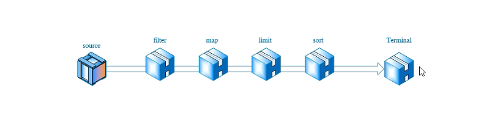

# 08 - 泛型&JDK8 新特性 :mountain_snow:

[[TOC]]

## 泛型

在了解泛型前，JDK1.5 之前对于集合中元素的存储可以是任意的数据类型，在实际开发中就可能遇到类似以下问题：

```java
List list = new ArrayList();
list.add("hello");
list.add(10);
list.add(true);

for (Object obj : list) {
    String s = (String)obj;
    System.out.println(s.length()); //程序运行出现 java.lang.ClassCastException
}
```

> 对于以上代码**运行期间**会出现类型转换异常，解决方案修改为如下代码
>
> ```java
> for (Object obj : list) {
>    if(obj instanceof String){
>        String s = (String)obj;
>        System.out.println(s.length());
>    }
> }
> ```
>
> 在 JDK1.5 之前只能使用以上解决方案，但是这样一来会增加时间的开销。

从 JDK1.5 之后，Java 开始引入了泛型机制，通过使用泛型可以将原本在程序运行时才能检测的异常，提前到编译期；从而减少一些不必要程序运行时间开销：

```java

List<String> list = new ArrayList<String>();
list.add("hello");
list.add(10); // 编译错误 类型不支持
list.add(true); //编译错误 类型不支持

for (String s : list) {
    System.out.println(s.length());
}

```

泛型即**参数化类型**，将一种数据类型作为参数传递到指定的位置，作用在于**可以将原本在运行时才能提示的异常（ClassCastException），提前到编译期间**；语法为使用一对`<>`内部包裹具体的**引用类型**

定义泛型时可以使用一些特殊的类型符号表示，常见：

- T：Type
- E：Element
- K：Key
- V：Value
- ...

案例：

```java
List<E>
Comparable<T>
Map<K，V>
```

使用案例：

```java
List<Integer> list;
Map<String,Object> map;
Comparable<User>
```

java 中的泛型分为三种使用方式：

- **泛型类**
- **泛型接口**
- **泛型方法**

### 泛型类

泛型类即在一个普通的类中使用泛型表达式设定泛型参数，在类中可以将泛型作为参数以及返回值

```java
//泛型类
public class Service<T> {

	public void showInfo(T obj) {
		Student s = (Student)obj;
		System.out.println(s.getName());
	}

	public void del(T t) {
		System.out.println("删除。。。");
	}

	public T getByName(String name) {
        //反射
		return null;
	}

	public static void main(String[] args) {

		Teacher t = new Teacher();
		t.setName("仓老师");

		Student stu = new Student();
		stu.setName("孙悟空");

		Service<Student> s = new Service<Student>();
		s.showInfo(stu);
		s.del(stu);
	}
}
```

泛型的使用可以同时传递多种参数类型，如下:

```java
public class Service2<U,S,T> {

	public void showUser(U u) {
		User user = (User)u;
		System.out.println("用户名："+user.getName());
	}

	public void showStu(S s) {
		Student stu = (Student)s;
		System.out.println("学生名："+stu.getName());
	}

	public void showTeacher(T t) {
		Teacher teacher = (Teacher)t;
		System.out.println("老师名："+teacher.getName());
	}

	public static void main(String[] args) {

		Teacher t = new Teacher();
		t.setName("仓老师");

		Student stu = new Student();
		stu.setName("孙悟空");

		User user = new User();
		user.setName("红孩儿");
		//jdk1.7之后泛型的定义只需要在声明时指定即可
		Service2<User,Student,Teacher> s = new Service2<>();
		s.showStu(stu);
		s.showTeacher(t);
		s.showUser(user);
	}
}
```

> 常见的泛型类:
>
> java.util.ArrayList/java.util.LinkedList
>
> java.util.HashSet/java.util.TreeSet
>
> ...

### 泛型接口

泛型接口即在声明接口时，指定泛型参数，当实现类对接口实现时，只需要在实现的接口之后指定具体类型，在方法中即可将参数(返回值)类型确定为目标类型，从而避免了强制转换操作。

**接口定义:**

```java
//泛型接口
public interface IManager<T> {

	public boolean add(T o);

	public List<T> findAll();

	public boolean delete(int id);

	public boolean update(T o);
}
```

**实现类 1:**

```java
public class UserManager implements IManager<User>{

	@Override
	public boolean add(User o) {
		// TODO Auto-generated method stub
		return false;
	}

	@Override
	public List<User> findAll() {
		// TODO Auto-generated method stub
		return null;
	}

	@Override
	public boolean delete(int id) {
		// TODO Auto-generated method stub
		return false;
	}

	@Override
	public boolean update(User o) {
		// TODO Auto-generated method stub
		return false;
	}

}

```

**实现类 2：**

```java
public class OfficeManager implements IManager<Office>{

	@Override
	public boolean add(Office o) {
		// TODO Auto-generated method stub
		return false;
	}

	@Override
	public List<Office> findAll() {
		// TODO Auto-generated method stub
		return null;
	}

	@Override
	public boolean delete(int id) {
		// TODO Auto-generated method stub
		return false;
	}

	@Override
	public boolean update(Office o) {
		// TODO Auto-generated method stub
		return false;
	}

}
```

> 常见接口泛型：
>
> java.util.Collection
>
> java.util.List
>
> java.util.Set
>
> java.util.Map

### 泛型方法

泛型方法指的是单独定义一个方法，在方法声明时指定泛型参数，此时该泛型参数可用作于当前方法的返回值类型或者参数类型。

```java
public class Test {

	//泛型方法
	public static <T> T get(T t) {
		//反射实现具体操作
		System.out.println(t);
		return t;
	}

	public static void main(String[] args) {
		Teacher t = new Teacher();
		t.setName("仓老师");

		Student stu = new Student();
		stu.setName("孙悟空");

		User user = new User();
		user.setName("红孩儿");

		Admin admin = new Admin();

		Teacher tea = get(t);
		Student s = get(stu);
		User u = get(user);
		Admin a = get(admin);
	}

}
```

> 泛型方法在一些开源项目中比较常见:
>
> fastJSON

### 泛型通配符

在对泛型类型不确定时可以使用通配符的方式表示，泛型通配符包含以下几种：

- **<?>**
- **<? extends T>**
- **<？ super T>**

#### 上界限定（extends）

上界限定即：规定传入集合中的元素必须是目标元素对象或者其子类对象，并且上界限定后，集合中的元素只出不进（不能调用 add），一般用于方法的参数接收定义和返回值类型定义。

```java
public class Test {

	//上界限定：只出不进（只能获取元素，不能进行修改）规定传入的集合元素只能是People或者People子类对象集合
	public static void test(List<? extends People> list) {
		for (People p : list) {
			System.out.println(p);
		}
		list.remove(0);
		//不允许新增（任何类型）
//		list.add(new User());
	}

	public static void main(String[] args) {

		People p = new User();

		//java编译器中存在类型擦除机制(编译器不理解泛型)
//		List<People> list = new ArrayList<User>(); // 编译错误

		//如果直接为泛型指定<?>即表示为<? extends Object>
		List<?> list = new ArrayList<String>();

		//上界限定:规定集中能够存储的元素只能是Object或者Object的子类对象
		List<? extends Object> list2 = new ArrayList<String>();

		List<User> users = new ArrayList<User>();
		users.add(new User());
		users.add(new User());
		users.add(new User());
		test(users);

	}
}
```

> 如果直接为泛型指定`<?>`即表示为`<? extends Object>`

#### 下界限定（super）

下界限定即:限定元素的下边界，存入的元素只能是当前类的对象或者存在继承关系的子类对象

```java
//下界限定:限定传入元素的下边界，存入的元素只能是当前类的对象或者存在继承关系的子类对象
List<? super User> list = new ArrayList<People>();
list.add(new User());
list.add(new Student());
//		list.add(new People());
//		list.add(new Object());
//只进不出(出来的任何元素都只能是Object)
Object obj = list.get(0);
list.remove(0);
```

> PECS：Product Extends Consumer Super

## JDK8 新特性

### 接口默认方法&静态方法

#### 接口默认方法

在 JDK8 之前，接口中只能有常量以及未实现方法的定义，不允许出现成员变量，和已实现方法；从 JDK8 之后，Java 中新增接口默认方法的定义，即可以在接口中添加已实现的方法；

语法：

```
default 返回值类型 方法名（【参数列表】）{
    //实现体
}
```

案例:

```java
public interface Fightable {

	void fight();

	//兼容解决方案
	default void holder() {
		System.out.println("蓄力");
	}
}
```

> 接口默认方法实际是一种兼容性解决方案：
>
> ​ 如果项目已经处于一个运维期，后续如果需要新增功能，比如在接口中新增方法，这将会导致该接口的实现类也必须新增对接口方法的实现，带来的影响较大，维护起来困难；因此 Java 新增了接口默认方法，直接在接口对方法进行实现，实现类可以选择性是否对接口方法重写，而不要所有的实现类都必须对方法实现。

#### 静态方法

Java8 的接口中除了新增默认方法外，另外还新增了静态方法，即直接在接口使用 static 关键字修饰一个已实现的方法，语法

```
static 返回值类型 方法名（【参数列表】）{
    //实现体
}
```

案例:

```java
//静态方法
static void showPower() {
    System.out.println("攻击力10000");
}
-------------------------------------------
    调用则是用接口名去调用
    /**
    * 调用静态方法
    */
    Fightable.showPower();
```

### 函数式接口

函数式编程：所谓**函数式编程**即链式编程思维，类似以下操作:

```java
StringBuffer sb = new StringBuffer();
sb.append(true).append(false).insert(0, "123").append(3.14);
```

函数式接口即一个接口中只存在一个未实现的方法时，该接口就认为是函数式接口；一般函数式接口可以通过在接口上添加一个特殊的注解来进行函数式接口标记:`@FunctionalInterface`

```java
//函数式接口声明
@FunctionalInterface
public interface Fightable {

    void fight();

    // 函数式接口只能存在一个未实现的方法
    //	void a();

    //兼容解决方案
    default void holder() {
        System.out.println("蓄力");
    }

    //静态方法
    static void showPower() {
        System.out.println("攻击力10000");
    }

}
```

> 注意事项，如果一个接口上使用了**@FuncationalInterface**声明，则该接口中只能存在一个未实现的方法，否则会出现编译错误。

### Lambda 表达式

在了解 lambda 表达式之前，先回顾之前所学习到匿名内部类，如果需要创建一个匿名内部类对象，语法如下:

```java
Fightable f = new Fightable() {
    @Override
    public void fight() {
        System.out.println("战斗--匿名内部类");
    }
};
```

> 观察以上代码，可以看出，除了方法内部的实现之外，其余的代码都是固定的模板代码

针对以上的匿名内部类写法，java8 新增了 lambda 表达式，以简化匿名内部类的写法:

```java
Fightable f2 = ()->{
    System.out.println("战斗--拉姆达(lambda:λ)表达式");
};
```

> 注意事项：
>
> **lambda 表达式只适用于函数式接口，不适用于类或者抽象类**

#### lambda 表达式语法(javascript 箭头函数)

```
(【参数列表】)->{
    //实现体
}
```

#### lambda 表达式的各种使用方式

1. 对于包含参数的接口方法

   ```java
   Animal a = (String food)->{
       System.out.println("动物吃"+food);
   };
   a.eat("肉");
   ```

2. 由于 lambda 表达式会对需要实现的方法进行**参数类型自动推断**，因此，在使用时无需指定参数类型，以上程序可以简化为:

   ```java
   Animal a = (f) -> {
       System.out.println("动物吃" + f);
   };
   a.eat("肉");
   ```

   > 若方法中只存在一个参数，则可以省略`()`
   >
   > ```java
   > Animal a = f -> {
   >    System.out.println("动物吃" + f);
   > };
   > ```

3. 对于包含多个参数的 lambda 表达式，可以如下表示

   ```java
   Animal a = (n, f) -> {
       System.out.println(n + "吃" + f);
   };
   a.eat("旺财", "肉");
   ```

4. 如果方法的实现体中只有一行代码需要编写，上述代码可以简化为:

   ```java
   Animal a = (n, f) -> System.out.println(n + "吃" + f);
   a.eat("旺财", "肉");
   ```

   > 如果被实现的方法有返回类型，则编译器会自动将箭头之后的语句执行之后的结果作为返回值返回，而不需要使用 return 关键字

### StreamAPI

#### StreamAPI 概述

流式编程作为 Java 8 的亮点之一，是继`Java 5`之后对集合的再一次升级，可以说`Java 8`几大特性中，`Streams API` 是作为 Java 函数式的主角来设计的,夸张的说，有了`Streams API`之后，万物皆可一行代码。

#### 什么是 Stream

`Stream`被翻译为流，它的工作过程像将一瓶水导入有很多过滤阀的管道一样，水每经过一个过滤阀，便被操作一次，比如过滤，转换等，最后管道的另外一头有一个容器负责接收剩下的水。

示意图如下：



首先通过`source`产生流，然后依次通过一些中间操作，比如过滤，转换，限制等，最后结束对流的操作。

`Stream`也可以理解为一个更加高级的迭代器，主要的作用便是遍历其中每一个元素。

#### 为什么需要 Stream

`Stream`作为 Java 8 的一大亮点，它专门针对集合的各种操作提供各种非常便利，简单，高效的 API,`Stream API`主要是通过`Lambda`表达式完成，极大的提高了程序的效率和可读性，同时`Stram API`中自带的并行流使得并发处理集合的门槛再次降低，使用`Stream API`编程无需多写一行多线程的大门就可以非常方便的写出高性能的并发程序。使用`Stream API`能够使你的代码更加优雅。

流的另一特点是可无限性，使用`Stream`，你的数据源可以是无限大的。

没有 StreamAPI 时集合的处理操作：

```java
public static void main(String[] args) {

		List<String> list = new ArrayList<>();
		list.add("jackson");
		list.add("tompson");
		list.add("curry");
		list.add("colleson");
		list.add("wade");
		list.add("kobe");
		list.add("kole");

		//需求：从集合中将所有以“son”结尾的字符串筛选前5个出来并存储到新集合中
        // 同时需要对新集合实现排序
		//传统写法:
		List<String> list2 = new ArrayList<String>();
    	int count = 0;
		for (String name : list) {
			if(name.endsWith("son")) {
				System.out.println(name);
				list2.add(name);
                count++;
                if(count == 5){
                    break;
                }
			}
		}
        Collections.sort(list2);
}
```

通过观察以上代码会发现，需要对集合循环遍历，并根据业务需求进行逻辑处理；我们再来看看使用 StreamAPI 的实现方式:

```java
public static void main(String[] args) {

    List<String> list = new ArrayList<>();
    list.add("jackson");
    list.add("tompson");
    list.add("curry");
    list.add("colleson");
    list.add("wade");
    list.add("kobe");
    list.add("kole");

    //StreamAPI
    List<String> subList = list.stream()
        .filter(u->u.endsWith("son"))
        .limit(5)
        .collect(Collectors.toList());
}
```

#### StreamAPI 使用

**流式 API 使用通常分为三个步骤：**

1. 获取 Stream
2. 中间处理
3. 结尾处理

##### 获取 Stream

可以用如下方法打开一个 `Stream`：

1. 使用 `Collection` 实现类(或子接口)的 `stream()`（串行流）或 `parallelStream()`
2. 使用 `Arrays.stream()` 方法为数组创建一个流
3. 使用 `Stream.of()` 方法创建流
4. 使用 `Stream.iterate()` 方法创建流
5. 使用 `Stream.generate()` 方法创建流

##### 中间处理

中间处理即对获取的流进行，筛选，排序，截断，去重等常规处理工作，判断是否为中间处理的方式很简单，只要观察方法返回值是否还是 Stream 对象即可判断是否为中间处理，另外，中间处理可叠加操作。

- **filter**
- **distinct**
- **skip**
- **limit**
- **map**
- **flatmap**
- **sorted**

##### 结尾处理

结尾处理即意味着中间处理已完成，等待最终操作，比如收集，统计，迭代等操作。

- **anyMatch**
- **noneMatch**
- **allMatch**
- **findAny**
- **findFirst**
- **forEach**
- **collect**
- **reduce**
- **count**
- **max**
- **min**

#### 使用详解

##### 使用 IntStream

```java
public class StreamDemo {

	public static void main(String[] args) {

		//1.获取流
		OptionalInt max = Arrays.stream(new int[] {9,8,11,5,6,3,2,0,9,6})

		//2.中间处理(所有的中间处理返回值都是流本身)
		.filter(i -> i >= 5 && i <= 10) //过滤
		.sorted()	//排序
		.distinct() //去除重复
		.skip(1)  //跳过指定行 参数指的是位置
		.limit(2) //限定显示行数

		//3.结尾处理
//		.forEach(i->System.out.println(i));  //输出
//		.count();	//统计
//		.sum();	    //求和
//		.average(); //求平均值
		.max();    //求最大值

//		System.out.println(od.getAsDouble());
		System.out.println(max.getAsInt());
	}

}
```

##### 使用 Stream

- **实体类：**

  ```java
  public class Student {

  	/**学号*/
  	private int sno;
  	/**姓名*/
  	private String name;
  	/**生日*/
  	private LocalDate birth;
  	/**专业*/
  	private String major;
  	/**学分*/
  	private double score;
  	/**性别*/
  	private String sex;

      //无参构造器、满属性构造器
      //setter、getter方法
      //hashcode&equals
      //toString
  }
  ```

- **准备数据**

  ```java
  static List<Student> list = new ArrayList<Student>() {
      {
          add(new Student(10086, "colleos", LocalDate.of(1998, 8, 11), "软件工程", 89.5, "男"));
          add(new Student(10010, "curry", LocalDate.of(1999, 9, 11), "计算机科学", 58.5, "女"));
          add(new Student(10011, "tom", LocalDate.of(1996, 10, 11), "软件工程", 49.5, "男"));
          add(new Student(10011, "tom", LocalDate.of(1996, 10, 11), "软件工程", 49.5, "男"));
          add(new Student(10032, "james", LocalDate.of(1995, 11, 17), "计算机科学", 79.5, "男"));
          add(new Student(10055, "rose", LocalDate.of(1994, 7, 13), "计算机科学", 89, "女"));
          add(new Student(10076, "jack", LocalDate.of(1998, 5, 21), "计算机科学", 55.5, "男"));
          add(new Student(10098, "tompson", LocalDate.of(1999, 6, 19), "网络工程", 69, "女"));
          add(new Student(10012, "garnett", LocalDate.of(1997, 8, 17), "网络工程", 89.5, "男"));
          add(new Student(10018, "akli", LocalDate.of(1998, 6, 11), "软件工程", 89.5, "女"));
          add(new Student(10015, "lulu", LocalDate.of(1996, 1, 20), "软件工程", 87, "男"));
          add(new Student(10099, "zark", LocalDate.of(1999, 2, 22), "软件工程", 77.5, "男"));
      }
  };

  ```

  > 创建集合并向集合中添加若干条数据

###### 1. 获取流

使用流式 API 首先需要获取 stream 对象，Collection 集合提供了 stream 方法可用于直接获取 Stream 对象。

```java
Stream<Student> stream = list.stream();
```

###### 2.中间处理

中间处理即对获取的流进行，筛选，排序，截断，去重等常规处理工作，判断是否为中间处理的方式很简单，只要观察方法返回值是否还是 Stream 对象即可判断是否为中间处理，另外，中间处理可叠加操作。

- **过滤(filter)**

  ```java
  stream = stream.filter(s -> Objects.equals(s.getSex(), "男"));
  ```

  > 以上操作表示过滤出所有性别为”男“的学生；
  >
  > 上述代码等效于：
  >
  > ```java
  > stream = stream.filter(new Predicate(){
  >     public boolean test(Student s){
  >         return Objects.equals(s.getSex,"男");
  >     }
  > });
  > ```
  >
  > 注意事项：
  >
  > 过滤处理可根据需求多次执行

- **去除重复(distinct)**

  ```java
  stream = stream.distinct();
  ```

  > 去除重复元素：依据集合中元素的 equals 方法和 hashcode 方法

- **排序（sorted）**

  ```java
  stream = stream.sorted((s1,s2) -> (int)(s1.getScore()-s2.getScore()))
  ```

  > 以上操作根据学生的学分从低到高排序
  >
  > 代码等效于：
  >
  > ```java
  > stream = stream.sorted(new Comparator<Student>(){
  >     public int compare(Student s1,Student s2){
  >         return (int)(s1.getScore()-s2.getScore());
  >     }
  > });
  > ```
  >
  > 若集合中元素有实现过`comparable`接口，则可直接使用以下方法时完成排序:
  >
  > ```java
  > stream = stream.sorted()
  > ```

- **跳过(skip)**

  ```java
  stream = stream.skip(2);	//跳过的数据行数
  ```

- **限制数据行数（limit）**

  ```java
  stream = stream.limit(5);
  ```

###### 3. 结尾处理

结尾处理即意味着中间处理已完成，等待最终操作，比如收集，统计，迭代等操作。由于结果为最终执行项，因此不可重复调用不同的结尾处理方式，否则会出现异常：

- **迭代**

  ```java
  stream.forEach(System.out::println);
  ```

  > 以上代码可以使用如下写法:
  >
  > ```java
  > stream.forEach(s->System.out.println(s));
  > ```

- **统计**

  ```java
  long count = stream.count();
  ```

- **收集**

  收集指的是将中间处理之后满足条件的结果存放到集合并返回

  ```java
  List<Student> listStu = stream.collect(Collectors.toList());
  ```

###### 链式编程

对以上 Stream 的使用可以通过一行代码实现，具体如下:

```java
List<String> names = list.stream()	//1.获取流
    .filter(s -> Objects.equals(s.getSex(), "男"))  //2.中间处理  过滤
    .filter(s -> s.getScore() >= 60) //2.中间处理 过滤
    .distinct() //2.中间处理 去除重复
    .sorted((s1,s2) -> (int)(s1.getScore()-s2.getScore())) //2.中间处理 排序
    .skip(2) //2.中间处理  跳过
    .limit(5) //2.中间处理  限制结果行数
    .map(s->s.getName()) //2.中间处理  映射(获取属性子集)
    .collect(Collectors.toList());  //3.结尾处理
```

### 代码案例

```java

```
