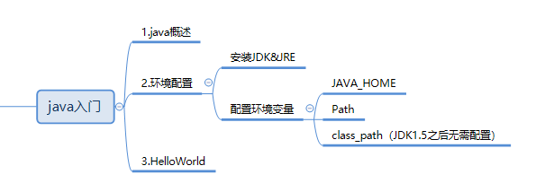
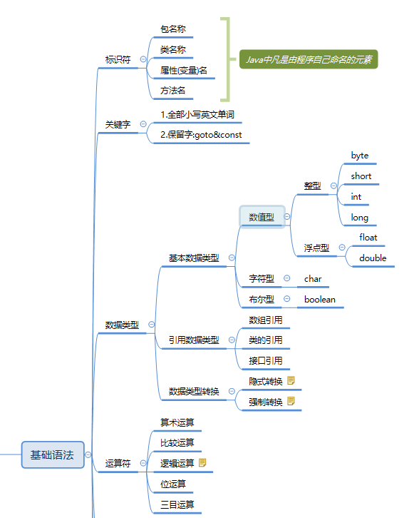
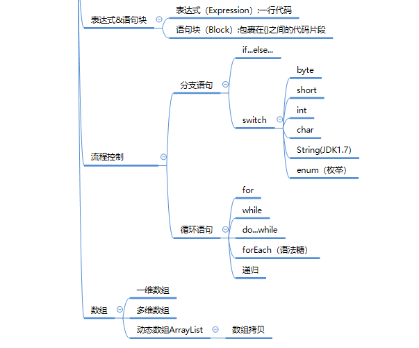
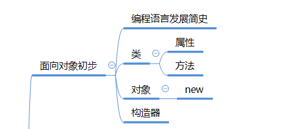
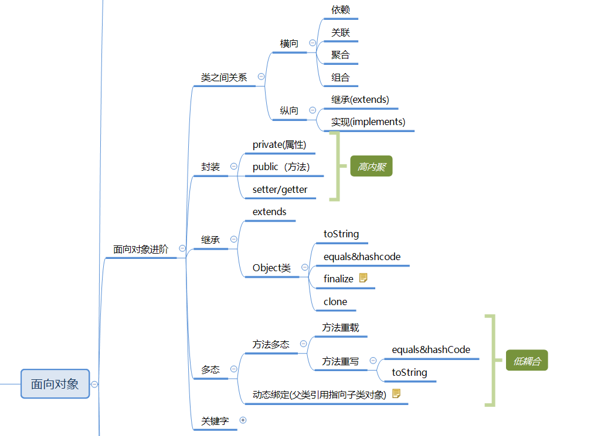
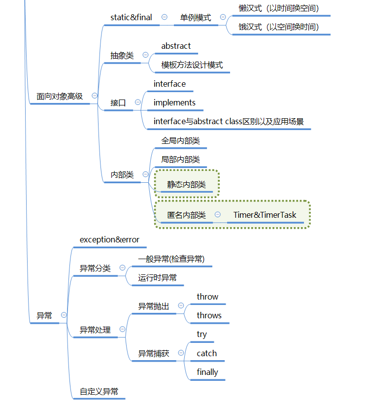
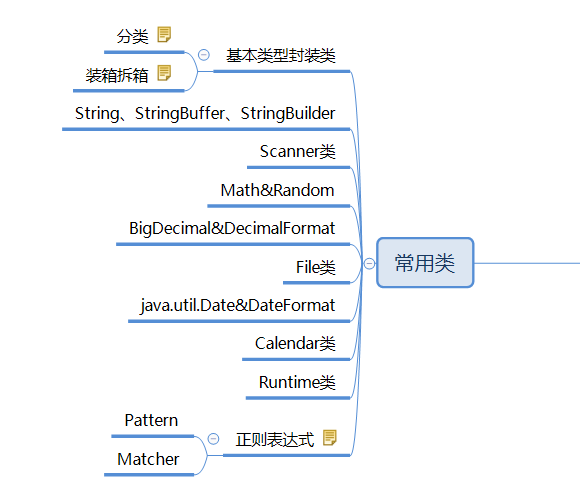
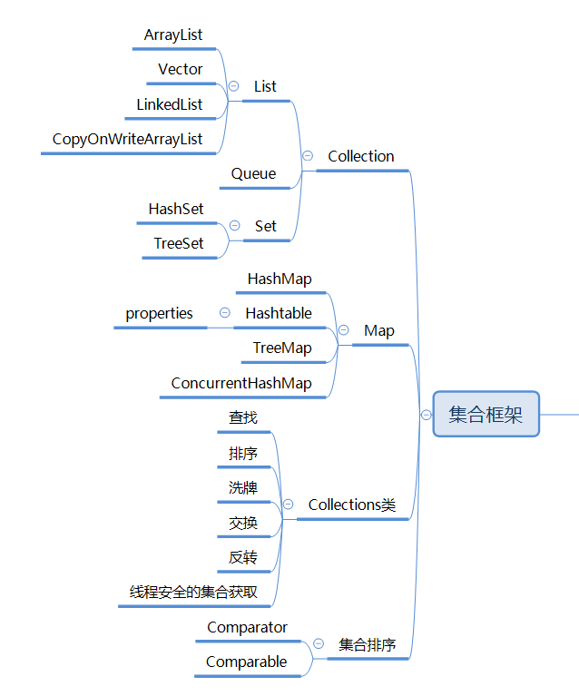
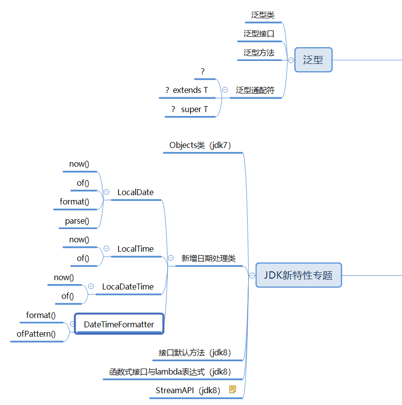

# 09 - JDK8 新特性(二)&总结 :roller_coaster:

[[TOC]]

## StreamAPI 补充

### Set 集合 StreamAPI 使用

set 集合和 List 集合都是从 Collection 继承而来的单例集合，因此 StreamAPI 使用方式是一致的：

```java
Set<String> set = new HashSet<>();
set.add("html");
set.add("css");
set.add("javascript");
set.add("Spring");
set.add("summerSpring");
set.add("springMVC");
set.add("SpringBoot");
set.add("ajax");
set.add("mybatis");
set.add("mybatis");

set.stream()											//1.获取流
    .filter(s->s.toLowerCase().contains("spring"))		//2.中间处理   过滤所有包含"spring"单词的数据（不区分大小写）
    .filter(s->s.length()>6)							//3.中间处理	过滤所有长度超过6位的
    .sorted()											//4.中间处理	使用元素的自然顺序（comparable）排序
    .forEach(System.out::println);						//5.结尾处理	迭代
```

### Map 集合的 StreamAPI 使用

```java
public static void main(String[] args) {

    Map<String,Object> map = new HashMap<>();

    map.put("html", "HyperText Markup Language");
    map.put("css", "Cascading Style Sheets");
    map.put("js", "JavaScript");
    map.put("bs","Bootstrap");
    map.put("ssh","Spring Struts2 Hibernate");
    map.put("ssm", "Spring SpringMVC Mybatis");
    map.put("xml","Extension markup Language");

    //map.forEach((k,v)->System.out.println(k+"-->"+v));

    //stream 不能对双链集合 进行处理 所以 可以把map转换成set集合
    Set<Entry<String,Object>> entrySet = map.entrySet();
    //将map集合转化成 装有entry对象的set集合  利用stream进行流式处理
    Stream<Entry<String, Object>> stream = entrySet.stream();
    //不区分大小写 取出包含s的Key
    stream.filter(e->e.getKey().toLowerCase().contains("s"))
        //根据Value的长度来进行排序
        .sorted((s1,s2)->s1.getValue().toString().length()-s2.getValue().toString().length())
        //过滤出key长度大于等于三的
        .filter(e->e.getKey().length()>=3)
        //跳过两条数据
        .skip(1)
        //截取两条数据
        .limit(2)
        //映射 取出所有值 形成为新的Stream
        .map(e->e.getValue())
        //收集将新的stream中的元素转换成新的list集合
        .collect(Collectors.toList())
        //foreach打印entry对象 因为这个set流本身存的就是entry对象
        .forEach(f->System.out.println(f));
}

```

## 新增日期类(LocalDate/LocalTime/LocalDateTime)

之前常用类中，已经对于一些常见的日期处理类有所了解：

- java.util.Date
  - java.sql.Date
  - java.sql.Time
  - java.sql.Timestamp
- java.util.Calendar
- java.text.DateFormat/java.text.SimpleDateFormat

以上的日期处理存在一些缺陷，比如月份从 0 开始，可读性不好，以及日期格式化处理 DateFormat 是一个线程不安全的工具类,因此在多线程并发操作时需要为每一个线程单独创建实例，否则可能出现共享导致结果不一致的情况。

从 java8 开始，JDK 引进了新的日期类，用于对于日期时间提供更为简洁，以及更为安全操作，新的日期处理类位于`java.time`包下；主要包含以下类：

- java.time.LocalDate(日期)
- java.time.LocalTime(时间)
- java.time.LocalDateTime(日期时间)
- java.time.format.DateTimeFormatter(对日期时间格式化工具类)

### LocalDate

LocalDate 类用于表示一个标准格式日期，通常以 yyyy-MM-dd 格式显示（如:2020-07-07）,LocalDate 的使用方法：

```java
//获取当前系统时间所表示的日期对象
LocalDate date = LocalDate.now();
//获取年份
System.out.println(datetime.getYear());

//获取月
System.out.println(date.getMonthValue());//获取月份的整数值1-12
System.out.println(date.getMonth());//获取月份枚举(列举)值

//获取日
System.out.println(date.getDayOfYear());
System.out.println(date.getDayOfMonth());
System.out.println(date.getDayOfWeek());
System.out.println(date.getDayOfWeek().getValue());

//根据指定的日期构建一个LocalDate对象
LocalDate date2 = LocalDate.of(2020,7,8);
```

### LocalTime

LocalTime 类用于表示一个标准格式时间，通常以 HH:mm:ss.SSS 格式显示（如:11:22:33.354）,LocalTime 的使用方法：

```java
LocalTime time = LocalTime.now();

//获取时
System.out.println(time.getHour());
//获取分
System.out.println(time.getMinute());
//获取秒
System.out.println(time.getSecond());
//获取毫秒
System.out.println(time.toInstant(ZoneOffset.of("+8")).toEpochMilli());

//根据指定的日期构建一个LocalTime对象
LocalTime time = LocalDate.of(12,11,18);
```

### LocalDateTime

LocalDateTime 类用于表示一个标准日期时间格式，通常以 yyyy-MM-ddTHH:mm:ss.SSS 格式显示（如:2020-08-07T18:18:18）,LocalDateTime 的使用方法：

```java
LocalDateTime time = LocalDateTime.now();

//将LocalDateTime 转换为 LocalDate
LocalDate localDate = time.toLocalDate();
LocalTime localTime = time.toLocalTime();
System.out.println(localDate);
System.out.println(localTime);

//根据指定的日期构建一个LocalDateTime对象
LocalDateTime time = LocalDateTime.of(2020,8,9,19,22,12);
```

### DateTimeFormatter

DateTimeFormatter 是 jdk8 新增 java.time 包中的一个用于对 LocalDate,LocalTime,LocalDateTime 进行格式化和解析的解析类，内部体提供一些内置的格式化方式，比如:

- BASIC_ISO_DATE
- ISO_DATE
- ISO_INSTANT
- ISO_LOCAL_DATE

同时该类还支持自定义的格式化匹配模式，通过以下方法获得：

- ofPattern(String pattern)

例如:

```java
//获取系统时间：2020-07-08T09:47:37.862
LocalDateTime datetime = LocalDateTime.now();
//需要将以上类型的日期时间转换为自定义格式的字符串
//创建一个格式化解析对象
DateTimeFormatter fmt = DateTimeFormatter.ofPattern("yyyy年MM月dd日 HH时mm分ss秒");
//需要使用以上格式对日期时间格式化包含两种方式
//方法1：
String time = fmt.format(datetime);

//方法2:
String time2 = datetime.format(fmt);

//以上两种方式获取的字符串日期格式一致的，均为：
//2020年07月08日 09时47分37秒

String t = "2020年07月08日 09时33分21秒"; // String --> LocalDateTime
//将String类型日期时间解析为LocalDateTime对象
dateTime = LocalDateTime.parse(t, fmt);
System.out.println(dateTime);

System.out.println(LocalDate.parse("20200708101211",DateTimeFormatter.ofPattern("yyyyMMddHHmmss")));
//		System.out.println(LocalDate.parse("20200708",DateTimeFormatter.BASIC_ISO_DATE));
```

> 注意事项:
>
> 与 DateFormat 和 SimpleDateFormat 的区别在于，DateTimeFormatter 是线程安全的实现，在多线程并发的时候可以让多个线程使用同一当前实例，能保证数据的一致性；但是 DateFormat 是线程非安全实现，因此在多线程并发时，需要为每个线程单独创建该实例。

## java 基础与面向对象总结


















