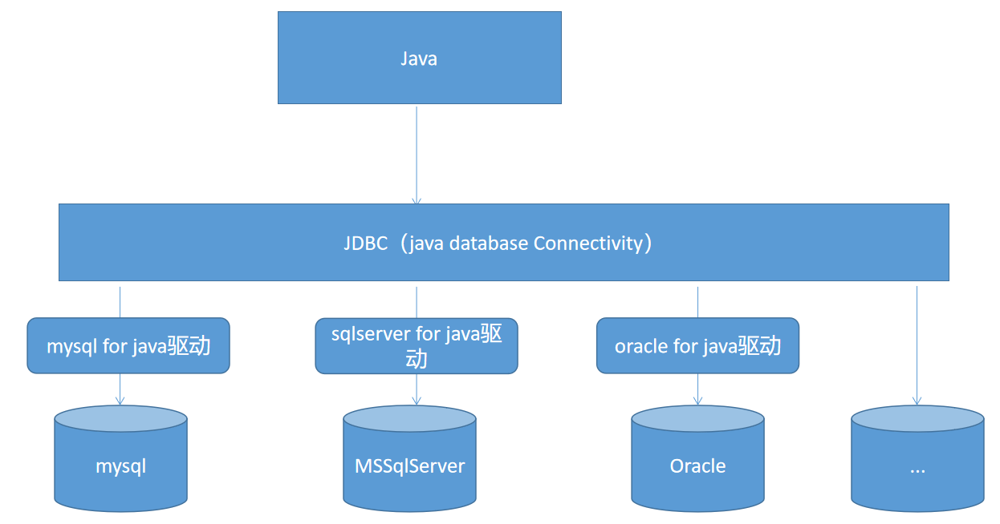
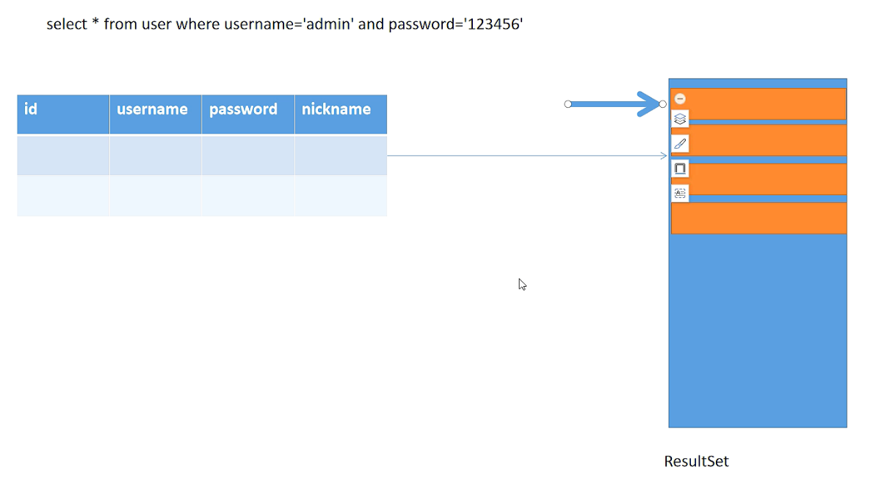

# 01 - JDBC 入门 :flight_departure:

[[TOC]]

## JDBC 概述

JDBC 全称:Java DataBase Connectivity;是由 SUN 公司提供的一套通用的 Java 连接数据的标准（接口），这套接口用于屏蔽数据库之间的差异（方言），使得 Java 程序员可以专注于处理数据而不需要考虑数据库之间的差异；



JDBC 这套标准所有的类和接口都位于`java.sql`包中。

## 入门案例

第一个 JDBC 程序:

**实现添加一条固定的数据到表格中**

```java
// 1.加载数据库驱动
Class.forName("com.mysql.jdbc.Driver");

// 2.获取数据库连接对象
Connection conn = DriverManager.getConnection("jdbc:mysql://localhost:3306/test", "root", "123456");

// 3.获取处理sql语句的对象
Statement stat = conn.createStatement();

// 4.执行sql(当执行结果为resultset（执行select操作时）时返回值为true，其他任何时候都是false)
boolean f = stat.execute("insert into user(username,password,nickname) values('softeem','soft123','软帝')");

// 5.处理结果
System.out.println("执行结果："+f);

// 6.关闭资源
stat.close();
conn.close();
```

## JDBC 常见类与接口

### DriverManager

DriverManager 是 java.sql 包中提供的一个用于进行数据库驱动管理的工具类，对于驱动的注册，以及连接的获取都可以通过 DriverManager 来完成，另外从 jdbc4 开始，不再需要显示的使用`Class.forName("com.mysql.jdbc.Driver")`加载驱动；因为 DriverManager 会自动寻找驱动包里面的以下文件:


DriverManager 提供的常见方法：

- **getConnection(String url,String user,String password)**

- getConnection(String url)

  ```java
  Connection conn = DriverManager.getConnection("jdbc:mysql://localhost:3306/test?user=root&password=123456");
  ```

- getConnection(String url,Properties prop)

  ```java
  Properties info = new Properties();
  info.put("user","root");
  info.put("password","123456");
  Connection conn = DriverManager.getConnection("jdbc:mysql://localhost:3306/test",info);
  ```

### Connection

Connection 是 JDBC 中的核心接口位于`java.sql`包，用于实现应用程序和数据库管理系统（DBMS）进行通信一个通道，通过该接口可以向数据库发送可以执行 sql 脚本，以及将执行之后的结果返回到程序中。connection 即数据库与应用程序之间的一个会话(session)

常用方法：

- createStatement() :获取一个用于执行 sql 语句的执行对象，主要用于执行静态的 sql（存在 SQL 注入风险）
- prepareStatement(String sql) :获取一个预处理 sql 语句的执行对象，预先对 sql 语句编译，一般用于执行动态 sql（解决 SQL 注入风险）
- prepareCall(String sql)：获取一个用于预处理 sql 存储过程的执行对象，主要用于执行存储过程（procedure）
- setAutoCommit(boolean b)：设置事物是否自动提交
- commit()：提交事务
- rollback()：事物回滚
- getMetaData(): 获取数据库的元数据对象（DatabaseMetaData），包含了数据库的详细信息

### Statement 与 PreparedStatement

#### Statement

Statement 是来自`java.sql`包中用于执行 sql 语句的处理接口对象，该接口声明了一些用于执行 sql 语句的相关方法，常见如下：

- execute(String sql)：用于执行任何的 sql 语句
- executeQuery(String sql)：主要用于执行 sql 查询(Select)操作
- executeUpdate(String sql)：主要用于执行 sql 更新(insert,update,delete)操作以及 DDL 操作
- addBatch(String sql)：用于将 sql 语句添加到当前 Statement 对象的命令列表中用于批量执行 sql
- executeBatch()：用于将一批（多条 sql）sql 命令同时执行
- getResultSet()：获取执行当前 SQL 语句之后的结果集对象（ResultSet）
- getGeneratedKeys()：获取自动生成的键所在结果集

具体使用如下:

```java
public static void insert(String name, String pwd, String nickname) throws ClassNotFoundException, SQLException {
    //准备sql语句
    String sql = "insert into user(username,password,nickname) values('" + name + "','" + pwd + "','" + nickname + "')";
    // 1.加载驱动
    Class.forName("com.mysql.jdbc.Driver");
    // 2.获取连接
    Connection conn = DriverManager.getConnection("jdbc:mysql://127.0.0.1:3306/test", "root", "123456");
    // 3.获取处理sql语句的执行对象
    Statement stat = conn.createStatement();
    // 4.执行sql语句
    boolean b = stat.execute(sql);
    // 5.处理结果
    System.out.println("是否有ResultSet：" + b);
    // 6.关闭资源
    stat.close();
    conn.close();
}
```

> 对以上程序在 main 方法中执行
>
> ```java
> public static void main(String[] args){
>     insert("rose","rose123","肉丝");
> }
> ```

通过对以上代码的观察发现，如果需要实现动态的数据操作，则需要对 sql 语句进行字符串拼接，使得 sql 语句编写起来比较麻烦，并且使用过程中存在 SQL 注入的风险：

#### SQL 注入

观察以下代码

```java
public static boolean login(String username, String password) throws ClassNotFoundException, SQLException {
    String sql = "select * from user where username='" + username + "' and password='" + password + "'";
    Connection conn = null;
    Statement stat = null;
    try {
        conn = DriverManager.getConnection("jdbc:mysql://127.0.0.1:3306/test", "root", "123456");
        stat = conn.createStatement();
        //执行查询获取结果集
        ResultSet rs = stat.executeQuery(sql);
        //判断结果集中是否存在可用结果行
        if (rs.next()) {
            return true;
        }
    } finally {
        conn.close();
        stat.close();
    }
    return false;
}
```

若调用该方法时按如下格式提供方法参数值：

```java
//select * from user where username='asdfasdf' and password='' or '1'='1'
boolean b = login("asdfasdf", "' or '1'='1 ");
System.out.println(b ? "登录成功" : "登录失败");
```

分析得知，无论账号如何提供，子需要密码按照第二个参数的写法，即可绕过登录过程直接输出如下结果:

```
登录成功
```

因为使用 Statement 不仅会存在字符串拼接的复杂问题，还会导致 SQL 注入的风险；因此 JDBC 中针对该问题从 Statement 接口还扩展了一个子接口`java.sql.PraparedStatement`用于解决以上问题:

#### PreparedStatement

PreparedStatement 是从 Statement 接口继承而来，使用该接口可以有效的避免 sql 注入以及字符串拼接的问题:

```java
public class JDBCDemo3 {

    public static boolean login(String username,String password) throws SQLException {
        //代码移动 alt+shift+up/down
        String sql = "select * from user where username=? and password=?";
        ResultSet rs = null;
        //JDK1.7新增
        try(
            Connection conn = DriverManager.getConnection("jdbc:mysql://127.0.0.1:3306/test", "root", "123456");
            //获取预编译sql的对象（已经完成的sql语句的预编译）
            PreparedStatement ps = conn.prepareStatement(sql);
        ){
            //预处理(向sql语句指定位置的占位符填充实际值)
            ps.setString(1,username);
            ps.setString(2,password);
            //执行
            rs = ps.executeQuery();
            if(rs.next()){
                return true;
            }
        }finally{
            rs.close();
        }
        return false;
    }

    public static void main(String[] args) throws SQLException {
        boolean b = login("admin", "123456");
        System.out.println(b ? "登录成功" : "登录失败");
    }
}
```

### ResultSet

结果集对象，用于表示对于查询语句执行之后的结果，内部的数据可能是一条也可以是多条

ResultSet 常见方法：

- boolean next() ： 判断是否有下一个结果行
- getXXX(int index)：根据列索引获取列值
- getXXX(String columnLabel)：根据列标签（默认列名）获取值
- ResultSetMetaData getMetaData()：返回结果集的元数据



ResultSet 的基本使用：

```java
String sql = "select * from user";
//获取连接
Connection conn = DriverManager.getConnection("jdbc:mysql://127.0.0.1:3306/test", "root", "123456");
//获取执行sql语句的对象
PreparedStatement ps = conn.prepareStatement(sql);
//执行查询
ResultSet rs = ps.executeQuery();
while (rs.next()) {
    //根据列索引获取当前列值				 // 根据列标签获取指定列值
    int uid = rs.getInt(1);             // rs.getInt("id")
    String username = rs.getString(2);  // rs.getString("username")
    String password = rs.getString(3);  // rs.getString("password")
    int status = rs.getInt(4);          // rs.getInt("status")
    String nickname = rs.getString(5);  // rs.getString("nickname")

    System.out.println(uid + "/" + username + "/" + password + "/" + status + "/" + nickname);
}
rs.close();
ps.close();
conn.close();
```

## CRUD 操作

```java
/**
* 添加数据
*/
public static void insert(String name, String pwd, String nickname) throws ClassNotFoundException, SQLException {
    //准备sql语句
    String sql = "insert into user(username,password,nickname) values(?,?,?)";
    // 1.加载驱动
    Class.forName("com.mysql.jdbc.Driver");
    // 2.获取连接
    Connection conn = DriverManager.getConnection("jdbc:mysql://127.0.0.1:3306/test", "root", "123456");
    // 3.获取处理sql语句的执行对象
    PreparedStatement ps = conn.prepareStatement();

    //预处理
    ps.setString(1,name);
    ps.setString(2,pwd);
    ps.setString(3,nickname);
    // 4.执行sql语句
    int i = ps.executeUpdate();
    // 5.处理结果
    System.out.println("受影响代码行：" + i);
    // 6.关闭资源
    stat.close();
    conn.close();
}

/**
 * 根据提供的用户id删除用户
 */
public static boolean delete(int id) throws SQLException {
    String sql = "delete from user where id=?";
    try(
        Connection conn = DriverManager.getConnection("jdbc:mysql://127.0.0.1:3306/test", "root", "123456");
        //获取预编译sql的对象（已经完成的sql语句的预编译）
        PreparedStatement ps = conn.prepareStatement(sql);
    ){
        ps.setInt(1,id);
        return ps.executeUpdate() > 0;
    }
}

/**
* 根据提供的用户id修改用户密码为指定值
*/
public static boolean update(int id,String newPwd) throws SQLException {
    String sql = "update user set password=? where id=?";
    try(
        Connection conn = DriverManager.getConnection("jdbc:mysql://127.0.0.1:3306/test", "root", "123456");
        PreparedStatement ps = conn.prepareStatement(sql);
    ){
        ps.setString(1,newPwd);
        ps.setInt(2,id);
        return ps.executeUpdate() > 0;
    }
}

/**
* 根据id查询数据
* @param id
* @throws SQLException
 */
public static void queryById(int id) throws SQLException {
    String sql = "select * from user where id=?";
    //获取连接
    Connection conn = DriverManager.getConnection("jdbc:mysql://127.0.0.1:3306/test", "root", "123456");
    //获取执行sql语句的对象
    PreparedStatement ps = conn.prepareStatement(sql);
    ps.setInt(1, id);
    //执行查询
    ResultSet rs = ps.executeQuery();

    if (rs.next()) {
        int uid = rs.getInt(1);             // rs.getInt("id")
        String username = rs.getString(2);  // rs.getString("username")
        String password = rs.getString(3);  // rs.getString("password")
        int status = rs.getInt(4);          // rs.getInt("status")
        String nickname = rs.getString(5);  // rs.getString("nickname")

        System.out.println(uid + "/" + username + "/" + password + "/" + status + "/" + nickname);
    }
    rs.close();
    ps.close();
    conn.close();
}
```

## 练习

1. 要求实现 JDBC 基本封装，将以下几行重复代码封装起来，提供简单的方式进行调用

   ```java
   Class.forName("com.mysql.jdbc.Driver")
   Connection conn = DriverManager.getConnection("jdbc:mysql://127.0.0.1:3306/test", "root", "123456");

   rs.close();
   ps.close();
   conn.close();
   ```

2. 完成一个简单的用户管理系统，其中用户的信息包含以下：

   - 用户 id/用户名/密码/性别/生日/手机号/账户状态

   要求实现以下功能：

   1. 用户登录
   2. 用户添加
   3. 根据 id 查询用户
   4. 查询所有用户
   5. 修改指定 id 的用户密码
   6. 修改指定 id 用户的登录状态
   7. 根据 id 删除指定用户

   说明：以上所有功能的实现都必须先经过登陆之后才可完成，另外登录功能需要验证用户的账户状态(0:账户不可用、1:账户可用)，登录失败时提示友好的信息（账号不正确、密码错误、账户不可用）
