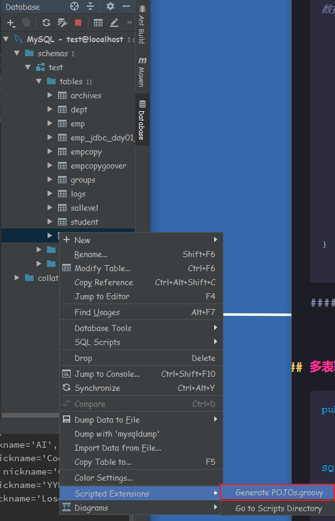
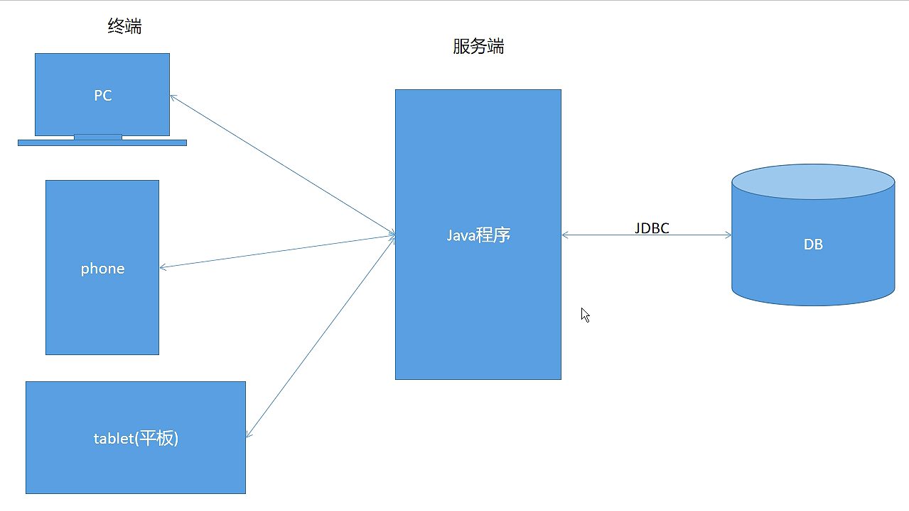
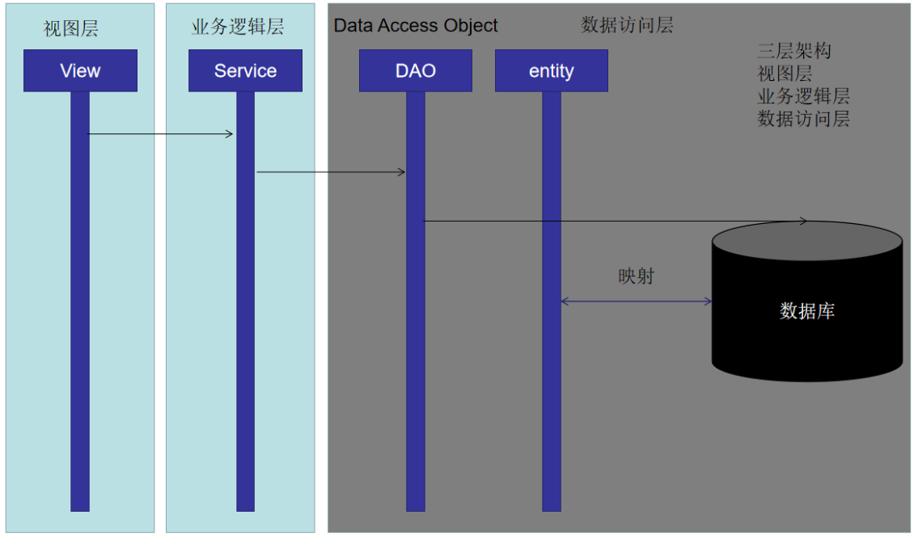

# 02 - JDBC 进阶 :waxing_crescent_moon:

[[TOC]]

## JDBC 封装 1.0

JDBC 操作常见的六个步骤中存在大量的重复操作，通过以下封装可以实现对其中三个步骤完成统一封装处理：

1. **加载驱动**
2. **获取连接**
3. 获取执行 sql 语句的对象
4. 执行
5. 处理结果
6. **关闭资源**

```java
/**
 * @Author mrchai 2020/12/10 9:16
 */
public class DBUtils {

    /**驱动类路径*/
    private static final String DRIVER_CLASS = "com.mysql.jdbc.Driver";
    /**URL地址*/
    private static final String URL = "jdbc:mysql://localhost:3306/test";
    /**登录数据库服务器的账号*/
    private static final String USER = "root";
    /**登录数据库服务器的密码*/
    private static final String PASSWORD = "123456";

    static{
        try {
            // 1.加载驱动
            Class.forName(DRIVER_CLASS);
        } catch (ClassNotFoundException e) {
            e.printStackTrace();
        }
    }

    /**
     * 返回数据库连接对象
     * @return
     */
    public static Connection getConn(){
        try {
            return DriverManager.getConnection(URL,USER,PASSWORD);
        } catch (SQLException e) {
            e.printStackTrace();
        }
        return null;
    }

    /**
     * 关闭资源
     * @param rs    结果集
     * @param stat  处理SQL的执行对象
     * @param conn  数据库连接
     */
    public static void close(ResultSet rs, Statement stat,Connection conn){
        //ctrl+alt+t
        try {
            if(rs != null){
                rs.close();
            }
            if(stat != null){
                stat.close();
            }
            if(conn != null){
                conn.close();
            }
        } catch (SQLException e) {
            e.printStackTrace();
        }
    }

}
```

使用以上封装完成基本的查询操作：

```java
String sql = "select * from user";
//通过工具类获取连接
Connection conn = DBUtils.getConn();
PreparedStatement ps = conn.prepareStatement(sql);
ResultSet rs = ps.executeQuery();
while (rs.next()) {
    int id = rs.getInt("id");
    String username = rs.getString("username");
    String password = rs.getString("password");
    String nickname = rs.getString("nickname");
    int status = rs.getInt("status");
    System.out.println(id + "/" + username + "/" + password + "/" + nickname + "/" + status);
}
//使用工具类关闭资源
DBUtils.close(rs,ps,conn);
```

## JDBC 查询详解

### 单行单列查询

```java
/**
 * 查询单行单列数据
 * @Author mrchai 2020/12/10 10:25
 */
public class Query01 {

    public static void main(String[] args) throws SQLException {
        String sql = "select count(*) as num from user";
        //获取连接
        Connection conn = DBUtils.getConn();
        //获取预处理sql的对象
        PreparedStatement ps = conn.prepareStatement(sql);
        //执行查询
        ResultSet rs = ps.executeQuery();
        if(rs.next()){
            int count = rs.getInt("num");
            //int count = rs.getInt(1);
            System.out.println("总数据条数："+count);
        }
        //关闭资源
        DBUtils.close(rs,ps,conn);
    }
}
```

### 分页查询

```java
/**
 * @Author mrchai 2020/12/10 10:30
 */
public class Query02 {

    /**
     *
     * @param offset  查询偏移量（起始查询的数据位置）
     * @param limit   查询结果集限制行（每页最大显示数据行）
     */
    public static List<User> queryLimit(int offset, int limit) throws SQLException {
        List<User> list = new ArrayList<>();
        //参数1：开始查询的位置
        //参数2：查询的数据条数
        String sql = "select * from user limit ?,?";
        Connection conn = DBUtils.getConn();
        PreparedStatement ps = conn.prepareStatement(sql);
        ps.setInt(1,offset);
        ps.setInt(2,limit);
        ResultSet rs = ps.executeQuery();
        while (rs.next()) {
            int id = rs.getInt("id");
            String username = rs.getString("username");
            String password = rs.getString("password");
            String nickname = rs.getString("nickname");
            int status = rs.getInt("status");
            int gid = rs.getInt("gid");
            //每一次循环，产生一个user对象
            list.add(new User(id,username,password,status,nickname,gid));
        }
        DBUtils.close(rs,ps,conn);
        return list;
    }

    public static void main(String[] args) throws SQLException {
        //真分页（select * from XXX limit ?,?） ：物理分页，从数据库查询多少条显示多少条
        //假分页（select * from XXX）：逻辑分页，一次性将数据全部从数据库查询出来，然后再内存中通过subList截取部分显示

        //当前页码
        int pageNow = 1;
        //每页数据条数
        int pageSize = 10;
        //计算起始查询位置
        int offset = (pageNow - 1) * pageSize;
        List<User> users = queryLimit(offset, pageSize);
        //遍历输出结果
        users.forEach(u-> System.out.println(u));
    }
}

```

> 使用 IDEA 工具 自动生成数据库表结构对应的 java 类



### 多表联合查询

```java
public class Query03 {

    public static void main(String[] args) throws SQLException {

        String sql = "select " +
            "u.id _uid," +
            "u.username _username," +
            "u.password _password," +
            "u.nickname _nickname," +
            "u.status _status," +
            "g.id _gid," +
            "g.gname _gname " +
            "from user u left join groups g on u.gid=g.id";

        Connection conn = DBUtils.getConn();
        PreparedStatement ps = conn.prepareStatement(sql);
        ResultSet rs = ps.executeQuery();
        while (rs.next()) {
            int uid = rs.getInt("_uid");
            String username = rs.getString("_username");
            String password = rs.getString("_password");
            String nickname = rs.getString("_nickname");
            int status = rs.getInt("_status");
            int gid = rs.getInt("_gid");
            String gname = rs.getString("_gname");
            System.out.println(uid + "/" + username + "/" + password + "/" + nickname + "/" + status + "/" + gid + "/" + gname);
        }
        DBUtils.close(rs,ps,conn);
    }
}

```

## DAO 与 DTO(Entity,VO,PO,POJO)





​ 以上时序图是常见的 web 项目架构模式，其中对于频繁的数据访问操作，实际开发中通常会抽取一层 DAO(Data Access Object)层;DAO 层主要负责访问数据库，对数据表进行 CRUD 操作，DAO 层并不关注具体的业务逻辑，因此称之为数据访问层。

常见 DAO 层的定义语法:

```java
public class EmpDAO{

	public boolean insert(Emp d) {
		// 执行添加操作
		return false;
	}

	public boolean delete(int id) {
		// 执行删除操作
		return false;
	}

	public boolean update(Emp d) {
		// 执行更新操作
		return false;
	}

	public Emp findById(int id) {
		// 根据id查询
		return null;
	}

    public List<Emp> findByAll(int id) {
		// 查询所有
		return null;
	}
}
```

## JDBC 封装 2.0 - 封装通用的更新操作

观察以下操作相关代码：

```java
/**
     * ctrl + shift + -/+ 语句块展开收缩
     * 用户添加
     * @param user
     * @return
     */
public boolean insert(User user){
    String sql = "insert into user_info(uname,upass,sex,birth,phone) values(?,?,?,?,?)";
    Connection conn = null;
    PreparedStatement ps = null;
    try {
        conn = DBUtils.getConn();
        ps = conn.prepareStatement(sql);
        ps.setString(1,user.getUname());
        ps.setString(2,user.getUpass());
        ps.setString(3,user.getSex());
        ps.setDate(4,user.getBirth());
        ps.setString(5,user.getPhone());
        return ps.executeUpdate() > 0;
    } catch (SQLException e) {
        e.printStackTrace();
    }finally{
        DBUtils.close(null,ps,conn);
    }
    return false;
}

/**
     * 根据提供用户信息修改用户密码
     * @param user
     * @return
     */
public boolean updatePwd(User user){
    String sql = "update user_info set upass=? where uid=?";
    Connection conn = null;
    PreparedStatement ps = null;
    try {
        conn = DBUtils.getConn();
        ps = conn.prepareStatement(sql);
        ps.setString(1,user.getUpass());
        ps.setInt(2,user.getUid());
        return ps.executeUpdate() > 0;
    } catch (SQLException e) {
        e.printStackTrace();
    }finally{
        DBUtils.close(null,ps,conn);
    }
    return false;
}

/**
     * 根据提供的用户信息修改用户状态
     * @param user
     * @return
     */
public boolean updateStatus(User user){
    String sql = "update user_info set status=? where uid=?";
    Connection conn = null;
    PreparedStatement ps = null;
    try {
        conn = DBUtils.getConn();
        ps = conn.prepareStatement(sql);
        ps.setInt(1,user.getStatus());
        ps.setInt(2,user.getUid());
        return ps.executeUpdate() > 0;
    } catch (SQLException e) {
        e.printStackTrace();
    }finally{
        DBUtils.close(null,ps,conn);
    }
    return false;
}

/**
     * 根据id删除用户
     * @param uid
     * @return
     */
public boolean deleteByUid(int uid){
    String sql = "delete from user_info where uid=?";
    Connection conn = null;
    PreparedStatement ps = null;
    try {
        conn = DBUtils.getConn();
        ps = conn.prepareStatement(sql);
        ps.setInt(1,uid);
        return ps.executeUpdate() > 0;
    } catch (SQLException e) {
        e.printStackTrace();
    }finally{
        DBUtils.close(null,ps,conn);
    }
    return false;
}
```

以上代码都是实现对于数据库的**更新**操作，其中所有功能的实现，除了 SQL 语句不一样（对应预处理时需要指定的参数随之变化）之外，其余代码基本是相同的，因此以上所有的增删改（insert,update,delte）功能可以通过一个封装方法统一完成:

**在 DBUtils.java 中新增以下方法:**

```java
/**
     * 封装通用的更新操作（即通过该方法实现对于任意数据表的insert,update,delete操作）
     * @param sql       需要被执行sql语句
     * @param params    执行sql语句时需要传递进去参数
     * @return          执行结果
     */
public static boolean exeUpdate(String sql,Object... params){
    Connection conn = getConn();
    PreparedStatement ps = null;
    try {
        ps = conn.prepareStatement(sql);
        //当传入的参数不为null时执行预处理
        if(Objects.nonNull(params)){
            for (int i = 0; i < params.length; i++) {
                ps.setObject(i + 1,params[i]);
            }
        }
        //执行更新
        return ps.executeUpdate() > 0;
    } catch (SQLException e) {
        e.printStackTrace();
    } finally{
        DBUtils.close(null,ps,conn);
    }
    return false;
}

```

通过对以上代码调用，之前的程序可以优化为以下代码：

```java
/**
     * ctrl + shift + -/+ 语句块展开收缩
     * 用户添加
     *
     * @param user
     * @return
     */
public boolean insert(User user) {
    String sql = "insert into user_info(uname,upass,sex,birth,phone) values(?,?,?,?,?)";
    return DBUtils.exeUpdate(sql, user.getUname(), user.getUpass(), user.getSex(), user.getBirth(), user.getPhone());
}

/**
     * 根据提供用户信息修改用户密码
     *
     * @param user
     * @return
     */
public boolean updatePwd(User user) {
    String sql = "update user_info set upass=? where uid=?";
    return DBUtils.exeUpdate(sql, user.getUpass(), user.getUid());
}

/**
     * 根据提供的用户信息修改用户状态
     *
     * @param user
     * @return
     */
public boolean updateStatus(User user) {
    String sql = "update user_info set status=? where uid=?";
    return DBUtils.exeUpdate(sql, user.getStatus(), user.getUid());
}

/**
     * 根据id删除用户
     *
     * @param uid
     * @return
     */
public boolean deleteByUid(int uid) {
    return DBUtils.exeUpdate("delete from user_info where uid=?", uid);
}
```

> 代码量瞬间减少，世界如此清净！！！

## getGeneratedKeys 获取自动生成键

​ 在实际开发中，可能会遇到如下需求：比如商品添加的功能，同时需要涉及到商品图片的上传，此时商品信息和图片信息通常会存储在不同的数据表中，而图片表中的商品图片应该要关联商品表的商品 ID，由于数据库商品表中商品 id 列可设置为自动递增，此时需要为商品图片指定所关联的商品 id，因此 JDBC 中提供了一个功能，允许在添加数据时获取自动生成的键：

```java
/**
     * 向数据库插入数据的同时，获取自动为当前数据行生成的键值（前提是主键列是自增列）
     *
     * @param user
     * @return   返回自动生成的键
     */
public int insertAndGetKeys(User user) {
    String sql = "insert into user_info(uname,upass,sex,birth,phone) values(?,?,?,?,?)";
    Connection conn = DBUtils.getConn();
    PreparedStatement ps = null;
    ResultSet rs = null;
    try {
        //获取预处理sql的执行对象，并设置其允许获取自动生成的键
        ps = conn.prepareStatement(sql, Statement.RETURN_GENERATED_KEYS);
        ps.setString(1, user.getUname());
        ps.setString(2, user.getUpass());
        ps.setString(3, user.getSex());
        ps.setDate(4, user.getBirth());
        ps.setString(5, user.getPhone());
        int i = ps.executeUpdate();
        if (i > 0) {
            //获取自动生成的键
            rs = ps.getGeneratedKeys();
            if (rs.next()) {
                return rs.getInt(1);
            }
        }
    } catch (SQLException e) {
        e.printStackTrace();
    } finally {
        DBUtils.close(rs, ps, conn);
    }
    return -1;
}

```

## SQL 语句批处理操作（1）

如何同时执行多条不同类型的 sql 语句？

```java
public class BatchDemo {

    public static void main(String[] args) throws SQLException {

        Connection conn = DBUtils.getConn();
        Statement stat = conn.createStatement();
        //添加sql语句到Statement执行队列中
        stat.addBatch("create table tbinfo(id int primary key auto_increment,msg varchar(30) not null)");
        stat.addBatch("insert into tbinfo(msg) values('数据添加')");
        stat.addBatch("insert into tbinfo(msg) values('数据添加')");
        stat.addBatch("update tbinfo set msg='数据更新' where id=1");
        //执行批量操作，返回每一条sql语句执行影响的数据行数
        int[] results = stat.executeBatch();
        for(int i:results){
            System.out.println(i);
        }

    }
}
```
