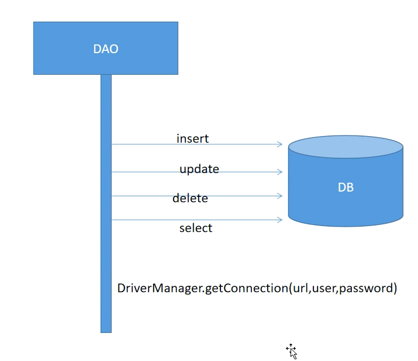
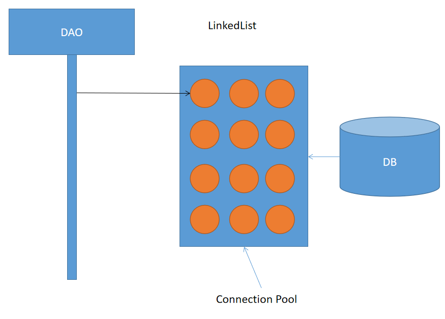

# 03 - JDBC 高级 :sun_with_face:

[[TOC]]

## JDBC 批处理（2）

在实际开发需求中，经常会涉及到将一张 excel 文件中的所有数据导入到数据库的需求，此时在 JDBC 中就必然会执行多次添加操作，传统的方式可以对 excel 文件中的每一条数据进行读取，然后每读取一次执行一次 insert 操作，但是这种效率十分低，因此 JDBC 中提供了对于数据批量添加的功能，通过批处理功能可以实现高效的数据导入，如下:

```java
public class BatchDemo2 {

    //传统的添加方式：循环添加
    public static void add1() throws SQLException {
        for (int i = 0; i < 5000; i++) {
            String sql = "insert into tbinfo(msg) values(?)";
            Connection conn = DBUtils.getConn();
            PreparedStatement ps = conn.prepareStatement(sql);
            ps.setString(1, "数据添加" + i);
            DBUtils.close(null, ps, conn);
        }
    }

    //批处理方式
    public static void add2() throws SQLException {
        String sql = "insert into tbinfo(msg) values(?)";
        Connection conn = DBUtils.getConn();
        PreparedStatement ps = conn.prepareStatement(sql);
        for (int i = 0; i < 5000; i++) {
            ps.setString(1, "数据新增" + i);
            ps.addBatch();
            if (i % 10 == 0) {
                //执行批处理
                int[] r = ps.executeBatch();
                //清空此 Statement(多态 父类应用指向之类对象)对象的当前SQL命令列表。
                ps.clearBatch();
            }
        }
        //执行批处理
        int[] r = ps.executeBatch();
        DBUtils.close(null, ps, conn);
    }

    public static void main(String[] args) throws SQLException {
        long start = System.currentTimeMillis();
        //add1();
        add2();
        long end = System.currentTimeMillis();
        System.out.println("耗时：" + (end - start));
    }
}

```

结果：

```
// 耗时：6917  //非批处理方式
// 耗时：3775		//批处理
```

## JDBC 事务操作

事务即在对数据库表中数据同时进行多次更新操作时，要么同时成功，要么同时失败，这一整个逻辑操作称之为事务，事务的四大特征（ACID）:

- 原子性

- 一致性

- 隔离性

- 持久性

在没有引入事务时可能出现以下问题：

```java
public class TxDemo {

    /**
     * 从指定账号向另一个账号转出指定金额
     * @param a 账号a
     * @param b 账号b
     */
    public static void change(int a, int b){
        String sql = "update account set money = money - 1000 where id=?";
        //减少
        DBUtils.exeUpdate(sql,a);
        //抛出一个算术异常
        System.out.println(10/0);
        //增加
        sql = "update account set money = money + 1000 where id=?";
        DBUtils.exeUpdate(sql,b);
    }

    public static void main(String[] args) {
        change(1,2);
    }
}
```

以上程序为一个简易的转账逻辑，最终结果会导致一个账号中金额减少，但是另一个账号中金额没有增加，从而最终结果不一致。

### JDBC 中使用事务

```java
/**
     * 从指定账号向另一个账号转出指定金额
     */
public static void change(){
    String sql1 = "update account set money=money-1000 where id=1";
    String sql2 = "update account set money=money+1000 where id=2";
    Connection conn = DBUtils.getConn();
    PreparedStatement ps = null;
    try {
        //关闭事务的自动提交
        conn.setAutoCommit(false);
        ps = conn.prepareStatement(sql1);
        int i = ps.executeUpdate();
        //            System.out.println(10/0);
        ps = conn.prepareStatement(sql2);
        int j = ps.executeUpdate();
        if(i > 0 && j > 0){
            //提交事务
            conn.commit();
        }
    } catch (Exception e) {
        e.printStackTrace();
        try {
            //事务回滚
            conn.rollback();
        } catch (SQLException e1) {
            e1.printStackTrace();
        }
    }finally{
        DBUtils.close(null,ps,conn);
    }
}
```

### DBUtils 中新增通用更新重载方法

保证多次更新在同一个事务中的前提是必须使所有更新操作都使用同一个数据库连接，因此`exeUpdate`方法中不能每次都获取一个新的连接，我们可以设置为从外部传入连接，这样一来只要调用该方法时传入的是同一个 Connection 即可进行事务管理：

```java
/**
     * 实现通用更新操作的方法，连接是需要外部提供的，事务可以在外部操作
     * 注意事项：该方法中出现异常必须抛出不能捕获，否则一旦出现异常，在当前方法就已经被catch，
     * 从而导致下一级调用者无法发现该异常，而导致事务无法回滚
     * @param conn
     * @param sql
     * @param params
     * @return
     */
public static boolean exeUpdate(Connection conn,String sql,Object... params) throws SQLException {
    PreparedStatement ps = null;
    try {
        ps = conn.prepareStatement(sql);
        //当传入的参数不为null时执行预处理
        if(Objects.nonNull(params)){
            for (int i = 0; i < params.length; i++) {
                ps.setObject(i + 1,params[i]);
            }
        }
        //执行更新
        return ps.executeUpdate() > 0;
    } finally{
        DBUtils.close(null,ps,null);
    }
}
```

使用：

```java
public static void change2(){
    String sql1 = "update account set money=money-1000 where id=1";
    String sql2 = "update account set money=money+1000 where id=2";
    Connection conn = DBUtils.getConn();
    try {
        //关闭事务自动提交
        conn.setAutoCommit(false);
        DBUtils.exeUpdate(conn,sql1);
        //异常代码
        System.out.println(10/0);
        DBUtils.exeUpdate(conn,sql2);
        //提交事务
        conn.commit();
    } catch (Exception e) {
        e.printStackTrace();
        try {
            //事务回滚
            conn.rollback();
        } catch (SQLException e1) {
            e1.printStackTrace();
        }
    }finally{
        DBUtils.close(null,null,conn);
    }
}
```

## 数据库连接池技术

​ 在之前进行任何数据库操作的时候都必须要有一个可用的数据库连接对象（Connection）；而这个连接对象的获取需要通过：`DriverManager.getConnection(url,user,password)`并且连接的获取是非常耗时(0.05~1s 之间)的操作。因此传统的连接获取方式不满足现在的高并发需求场景的，所以 JDBC 中引入了一种称之为连接池(Connection Pool)的技术

​ 连接池的原理即，在程序启动时，事先开启并通过容器维护一定量的数据连接，从而为后续的数据持久化功能节省连接获取的时间开销，因为一旦 dao 需要使用连接时，只需要从连接池中直接获取即可（类似从一个集合中取一个元素），并且使用完毕之后只需将连接归还到连接池中即可，从程序的访问效率上得到极大提升，因此，连接池技术，是服务端技术的重要组成部分。





目前市面上提供了各种丰富的连接池解决方案：

- DBCP/DBCP2
- C3P0
- Proxool
- **Druid(德鲁伊：alibaba)**
- HikraCP(SpringBoot 推荐)

> 任何连接池的实现都必须要从`javax.sql.DataSource`进行实现

### 使用 Druid 连接池

1. 添加依赖

   `druid-1.1.9.jar`

2. 连接池创建并获取连接

   ```java
   public static void main(String[] args) throws SQLException, InterruptedException {
       //创建连接池对象
       DruidDataSource dataSource = new DruidDataSource();
       //设置数据库的基本信息
       //dataSource.setDriverClassName("com.mysql.jdbc.Driver");
       dataSource.setUrl("jdbc:mysql://127.0.0.1:3306/test");
       dataSource.setUsername("root");
       dataSource.setPassword("123456");

       //设置初始连接数
       dataSource.setInitialSize(2);
       //设置最大连接数
       dataSource.setMaxActive(5);
       //获取连接获取的最长等待时间(如果连接池中连接被耗尽时,等待重新连接的时间超出时会抛出异常)
       dataSource.setMaxWait(5000);
       //设置最小闲置连接数
       dataSource.setMinIdle(1);

       //获取连接(多态)
       Connection conn1 = dataSource.getConnection();
       Connection conn2 = dataSource.getConnection();
       Connection conn3 = dataSource.getConnection();
       Connection conn4 = dataSource.getConnection();
       Connection conn5 = dataSource.getConnection();

       System.out.println(conn1);
       System.out.println(conn2);
       System.out.println(conn3);
       System.out.println(conn4);
       System.out.println(conn5);

       //等待三秒
       Thread.sleep(3000);
       //归还第一个连接  这个close 不是关闭连接 而是归还连接！！
       conn1.close();

       //超过最长等待时间抛异常
       Connection conn6 = dataSource.getConnection();
       System.out.println(conn6);
   }
   ```

> 执行结果：
>
> ```java
> com.mysql.jdbc.JDBC4Connection@574caa3f
> com.mysql.jdbc.JDBC4Connection@64cee07
> com.mysql.jdbc.JDBC4Connection@1761e840
> com.mysql.jdbc.JDBC4Connection@6c629d6e
> com.mysql.jdbc.JDBC4Connection@5ecddf8f
> com.mysql.jdbc.JDBC4Connection@574caa3fs
> ```

### 改造 DBUtils

```java
public class DBUtils2 {

    /**驱动类路径*/
    private static final String DRIVER_CLASS = "com.mysql.jdbc.Driver";
    /**URL地址*/
    private static final String URL = "jdbc:mysql://localhost:3306/test";
    /**登录数据库服务器的账号*/
    private static final String USER = "root";
    /**登录数据库服务器的密码*/
    private static final String PASSWORD = "123456";
    /**初始连接数*/
    private static final int INIT_SIZE = 1;
    /**最大活动连接数*/
    private static final int MAX_ACTIVE = 5;
    /**最长等待连接获取时间*/
    private static final long MAX_WAIT = 5000;
    /**最小闲置连接数*/
    private static final int MIN_IDLE = 1;

    /**声明数据源*/
    private static DruidDataSource dataSource;

    static{
        dataSource = createDataSource();
    }

    /**
     * 创建连接池并返回
     * @return
     */
    private static DruidDataSource createDataSource(){
        //创建连接池对象
        dataSource = new DruidDataSource();
        //设置连接数据库的基本字符串
        dataSource.setUrl(URL);
        dataSource.setUsername(USER);
        dataSource.setPassword(PASSWORD);
        //设置连接池的初始参数
        dataSource.setInitialSize(INIT_SIZE);
        dataSource.setMaxActive(MAX_ACTIVE);
        dataSource.setMaxWait(MAX_WAIT);
        dataSource.setMinIdle(MIN_IDLE);
        return dataSource;
    }

    /**
     * 返回数据库连接对象
     * @return
     */
    public static Connection getConn(){
        try {
            //当连接池对象为null或者连接池对象被关闭时重新创建连接池
            if(dataSource == null || dataSource.isClosed()){
                dataSource = createDataSource();
            }
            //返回连接
            return dataSource.getConnection();
        } catch (SQLException e) {
            e.printStackTrace();
        }
        return null;
    }

}
```

## 封装通用查询

### 基于回调机制的查询封装

**DBUtils2.java**

```java
public class DBUtils2 {

    /**
     * 驱动类路径
     */
    private static final String DRIVER_CLASS = "com.mysql.jdbc.Driver";
    /**
     * URL地址
     */
    private static final String URL = "jdbc:mysql://localhost:3306/test";
    /**
     * 登录数据库服务器的账号
     */
    private static final String USER = "root";
    /**
     * 登录数据库服务器的密码
     */
    private static final String PASSWORD = "123456";
    /**
     * 初始连接数
     */
    private static final int INIT_SIZE = 1;
    /**
     * 最大活动连接数
     */
    private static final int MAX_ACTIVE = 5;
    /**
     * 最长等待连接获取时间
     */
    private static final long MAX_WAIT = 5000;
    /**
     * 最小闲置连接数
     */
    private static final int MIN_IDLE = 1;

    /**
     * 声明数据源
     */
    private static DruidDataSource dataSource;

    static {
        dataSource = createDataSource();
    }

    /**
     * 创建连接池并返回
     *
     * @return
     */
    private static DruidDataSource createDataSource() {
        //创建连接池对象
        dataSource = new DruidDataSource();
        //设置连接数据库的基本字符串
        dataSource.setUrl(URL);
        dataSource.setUsername(USER);
        dataSource.setPassword(PASSWORD);
        //设置连接池的初始参数
        dataSource.setInitialSize(INIT_SIZE);
        dataSource.setMaxActive(MAX_ACTIVE);
        dataSource.setMaxWait(MAX_WAIT);
        dataSource.setMinIdle(MIN_IDLE);
        return dataSource;
    }

    /**
     * 返回数据库连接对象
     *
     * @return
     */
    public static Connection getConn() {
        try {
            //当连接池对象为null或者连接池对象被关闭时重新创建连接池
            if (dataSource == null || dataSource.isClosed()) {
                dataSource = createDataSource();
            }
            //返回连接
            return dataSource.getConnection();
        } catch (SQLException e) {
            e.printStackTrace();
        }
        return null;
    }

    /**
     * 关闭资源
     *
     * @param rs   结果集
     * @param stat 处理SQL的执行对象
     * @param conn 数据库连接
     */
    public static void close(ResultSet rs, Statement stat, Connection conn) {
        //ctrl+alt+t
        try {
            if (rs != null) {
                rs.close();
            }
            if (stat != null) {
                stat.close();
            }
            if (conn != null) {
                conn.close();
            }
        } catch (SQLException e) {
            e.printStackTrace();
        }
    }

    /**
     * 自动提交事务
     * 封装通用的更新操作（即通过该方法实现对于任意数据表的insert,update,delete操作）
     *
     * @param sql    需要被执行sql语句
     * @param params 执行sql语句时需要传递进去参数
     * @return 执行结果
     */
    public static boolean exeUpdate(String sql, Object... params) {
        Connection conn = getConn();
        PreparedStatement ps = null;
        try {
            ps = conn.prepareStatement(sql);
            //当传入的参数不为null时执行预处理
            if (Objects.nonNull(params)) {
                for (int i = 0; i < params.length; i++) {
                    ps.setObject(i + 1, params[i]);
                }
            }
            //执行更新
            return ps.executeUpdate() > 0;
        } catch (SQLException e) {
            e.printStackTrace();
        } finally {
            DBUtils2.close(null, ps, conn);
        }
        return false;
    }


    /**
     * 实现通用更新操作的方法，连接是需要外部提供的，事务可以在外部操作
     * 注意事项：该方法中出现异常必须抛出不能捕获，否则一旦出现异常，在当前方法就已经被catch，
     * 从而导致下一级调用者无法发现该异常，而导致事务无法回滚
     *
     * @param conn
     * @param sql
     * @param params
     * @return
     */
    public static boolean exeUpdate(Connection conn, String sql, Object... params) throws SQLException {
        PreparedStatement ps = null;
        try {
            ps = conn.prepareStatement(sql);
            //当传入的参数不为null时执行预处理
            if (Objects.nonNull(params)) {
                for (int i = 0; i < params.length; i++) {
                    ps.setObject(i + 1, params[i]);
                }
            }
            //执行更新
            return ps.executeUpdate() > 0;
        } finally {
            DBUtils2.close(null, ps, null);
        }
    }

    /**
     * 查询单行数据
     * @param sql
     * @param call
     * @param params
     * @return
     */
    public static Object queryOne(String sql,Callback call,Object... params) {
        Connection conn = getConn();
        PreparedStatement ps = null;
        ResultSet rs = null;
        try {
            ps = conn.prepareStatement(sql);
            if (Objects.nonNull(params)) {
                for (int i = 0; i < params.length; i++) {
                    ps.setObject(i + 1, params[i]);
                }
                rs = ps.executeQuery();
                //将结果集转换为Object返回
                return call.toObject(rs);
            }
        } catch (SQLException e) {
            e.printStackTrace();
        } finally{
            DBUtils.close(rs,ps,conn);
        }
        return null;
    }

    /**
     * 封装查询多条记录的方法
     * @param sql
     * @param call
     * @param params
     * @return
     */
    public static List queryList(String sql,Callback call,Object... params) {
        Connection conn = getConn();
        PreparedStatement ps = null;
        ResultSet rs = null;
        try {
            ps = conn.prepareStatement(sql);
            if (Objects.nonNull(params)) {
                for (int i = 0; i < params.length; i++) {
                    ps.setObject(i + 1, params[i]);
                }
                rs = ps.executeQuery();
                //将结果集转换为List返回
                return call.toList(rs);
            }
        } catch (SQLException e) {
            e.printStackTrace();
        } finally{
            DBUtils.close(rs,ps,conn);
        }
        return null;
    }


    //内部接口
    public interface Callback{
        //回调函数（钩子函数）

        /**
         * 将结果集转换为Object 为查询单条数据准备
         * @param rs
         * @return
         */
        default Object toObject(ResultSet rs){
            return null;
        }

        /**
         * 将结果集转换为List集合 为查询多条数据准备
         * @param rs
         * @return
         */
        default List toList(ResultSet rs) {
            return null;
        }
    }
}
```

具体使用：

```java
public class UserDAO {

    public User selectById(int id){
        String sql = "select * from user where id=?";
        Object obj = DBUtils2.queryOne(sql, new DBUtils2.Callback() {
            @Override
            public Object toObject(ResultSet rs) {
                User user = new User();
                try {
                    if(rs.next()){
                        user.setId(id);
                        user.setUsername(rs.getString("username"));
                        user.setPassword(rs.getString("password"));
                        user.setNickname(rs.getString("nickname"));
                        user.setStatus(rs.getLong("status"));
                        user.setGid(rs.getLong("gid"));
                    }
                } catch (SQLException e) {
                    e.printStackTrace();
                }
                return user;
            }
        }, id);
        return (User)obj;
    }

    public List<User> selectAll(){
        String sql = "select * from user";
        List list = DBUtils2.queryList(sql, new DBUtils2.Callback() {
            @Override
            public List toList(ResultSet rs) {
                List<User> users = new ArrayList<>();
                try {
                    User user = null;
                    while (rs.next()) {
                        user = new User();
                        user.setId(rs.getInt("id"));
                        user.setUsername(rs.getString("username"));
                        user.setPassword(rs.getString("password"));
                        user.setNickname(rs.getString("nickname"));
                        user.setStatus(rs.getLong("status"));
                        user.setGid(rs.getLong("gid"));
                        //将用户对象存储到集合
                        users.add(user);
                    }
                }catch (SQLException e){
                    e.printStackTrace();
                }
                return users;
            }
        });
        return list;
    }

    public static void main(String[] args) {
        UserDAO d = new UserDAO();
//        User user = d.selectById(2);
//        System.out.println(user);
        List<User> list = d.selectAll();
        list.forEach(System.out::println);
    }
}
```

### ResultSetMetaData

​ 使用回调机制能够实现对于 JDBC 的查询封装，但是从 DAO 层的代码量来并没有多大的减少，通过观察封装的代码不难看出，程序执行到 executeQuery，获取 ResultSet 对象之后，就存在问题了：不清楚查询的是哪一张表，也不知道查询的是多少列；针对以上问题，JDBC 中提供了一个结果集元素据类：`ResultSetMetaData`能够轻松的获取到结果集中对应每一列的详细信息，比如：列名称，列标签，列类型，长度等。使用如下：

```java
public static void main(String[] args) throws SQLException {

    String sql = "select * from user";

    Connection conn = DBUtils2.getConn();
    PreparedStatement ps = conn.prepareStatement(sql);
    ResultSet rs = ps.executeQuery();
    //获取结果集元数据对象
    ResultSetMetaData rsmd = rs.getMetaData();
    int count = rsmd.getColumnCount();
    System.out.println("结果集查询的总列数：" + count);

    for (int i = 1; i <= count; i++) {
        //获取指定索引的列名称 索引从1开始
        String cname = rsmd.getColumnName(i);
        //获取指定索引的列标签（别名）
        String clabel = rsmd.getColumnLabel(i);
        //获取指定索引列的类型
        int ctype = rsmd.getColumnType(i);
        //获取列的长度
        int precision = rsmd.getPrecision(i);
        //获取指定索引的列是否是自增列
        boolean autoIncrement = rsmd.isAutoIncrement(i);

        System.out.println(cname + "/" + clabel + "/" + ctype + "/" + precision + "/" + autoIncrement);
    }

}
```

结果

```
结果集查询的总列数：6
id/id/4/11/true
username/username/12/255/false
password/password/12/255/false
status/status/4/255/false
nickname/nickname/12/255/false
gid/gid/4/11/false
```

使用`ResultSetMetaData`可以封装以下查询功能：

```java
/**
     * Object -> Map
     * 将查询的结果存储到一个List集合中，集合中的每一个元素即一个Map对象
     * （属性:属性值）
     * @return
     */
public static List<Map<String,Object>> queryToMap(String sql,Object...params) {
    //声明List集合存储所有查询到的数据（内部的每一条数据使用一个Map对象表示）
    List<Map<String,Object>> list = new ArrayList<>();
    Connection conn = DBUtils2.getConn();
    PreparedStatement ps = null;
    ResultSet rs = null;
    try {
        ps = conn.prepareStatement(sql);
        //执行预处理(如果存在占位符，则为占位符填充具体的值)
        if(Objects.nonNull(params)){
            for (int i = 0; i < params.length; i++) {
                ps.setObject(i+1,params[i]);
            }
        }
        //执行查询
        rs = ps.executeQuery();
        //获取结果集元数据对象
        ResultSetMetaData rsmd = rs.getMetaData();
        //获取总查询列数
        int columnCount = rsmd.getColumnCount();
        //遍历结果集
        while(rs.next()){
            //每一次循环执行创建一个Map(查询到一条数据)
            Map<String,Object> map = new HashMap<>();
            //获取每一列的列标签
            for (int i = 1; i <= columnCount ; i++) {
                //获取指定的列名称
                String cname = rsmd.getColumnName(i);
                //根据列标签获取列值
                Object value = rs.getObject(i);
                //将一个查询列装入map
                map.put(cname,value);
            }
            //将map集合（javabean）存储到List
            list.add(map);
        }
    } catch (SQLException e) {
        e.printStackTrace();
    } finally {
        close(rs,ps,conn);
    }
    return list;
}
```

> 以上功能可以实现对任意表的任意列以及任意查询条件进行查询，并且可以将查询结果转换为`List<Map<String,Object>>`对象，然后通过反射机制以及泛型等技术手段即可实现将集合数据转换为对应的 Javabean 或者集合:
>
> ```java
> /**
>     * 封装通用查询单条数据的方法
>     *
>     * JDBC，反射，集合框架，lambda表达式，新增Objects类
>     *
>     * @param <T>
>     * @param t
>     * @param sql
>     * @param params
>     * @return
>     */
> public static <T> T queryOne(Class<T> t, String sql, Object... params) {
>    // 获取查询到到数据集合
>    List<Map<String, Object>> list = queryToMap(sql, params);
>    if (list.size() > 0) {
>        // 获取一个Map对象
>        Map<String, Object> map = list.get(0);
>        // 将map集合转换为Javabean并返回
>        return mapToBean(map, t);
>    }
>    return null;
> }
>
> /**
>     * 封装通用查询多条数据的方法
>     *
>     * @param <T>
>     * @param t
>     * @param sql
>     * @param params
>     * @return
>     */
> public static <T> List<T> queryList(Class<T> t, String sql, Object... params) {
>    List<T> list = new ArrayList<T>();
>    // 获取所有查询的到的数据
>    List<Map<String, Object>> maps = queryToMap(sql, params);
>    // 遍历集合中每一条数据(map)
>    maps.forEach(m -> {
>        // 将map转换为Javabean
>        T obj = mapToBean(m, t);
>        // 将Javabean装入list
>        list.add(obj);
>    });
>    return list;
> }
>
> /**
>     * 将Map集合转换为一个确定的类型
>     *
>     * @param <T>
>     * @param map
>     * @param t
>     * @return
>     */
> private static <T> T mapToBean(Map<String, Object> map, Class<T> t) {
>    try {
>        // 根据提供的Class对象创建对应类型的Object
>        T obj = t.newInstance();
>        map.forEach((k, v) -> {
>            try {
>                // 根据Field名称获取字段对象
>                Field field = t.getDeclaredField(k);
>                // 设置字段的可访问性
>                field.setAccessible(true);
>                // 为字段设置值
>                field.set(obj, v);
>            } catch (NoSuchFieldException e) {
>                e.printStackTrace();
>            } catch (SecurityException e) {
>                e.printStackTrace();
>            } catch (IllegalArgumentException e) {
>                e.printStackTrace();
>            } catch (IllegalAccessException e) {
>                e.printStackTrace();
>            }
>        });
>        return obj;
>    } catch (InstantiationException e) {
>        e.printStackTrace();
>    } catch (IllegalAccessException e) {
>        e.printStackTrace();
>    }
>    // 返回对象
>    return null;
> }
> ```

#### 使用完全封装好的工具实现查询操作

任何查询均可一行代码轻松搞定：

```java
public class UserDAO3 {

    public List<User> selectAll(){
        String sql = "select * from user";
        return DBUtils3.queryList(User.class,sql);
    }

    public User selectById(int id){
        String sql = "select * from user where id=?";
        return DBUtils3.queryOne(User.class,sql,id);
    }

    public static void main(String[] args) {
        UserDAO3 dao3 = new UserDAO3();
//        List<User> list = dao3.selectAll();
//        list.forEach(System.out::println);
        User user = dao3.selectById(5);
        System.out.println(user);
    }
}
```

#### 附：完整 DBUtils 类

注意事项：需要引入**数据库驱动包**以及**druid 连接池**依赖

```java
/**
 * @Author mrchai 2020/12/10 9:16
 */
public class DBUtils3 {

    /**
     * 驱动类路径
     */
    private static final String DRIVER_CLASS = "com.mysql.jdbc.Driver";
    /**
     * URL地址
     */
    private static final String URL = "jdbc:mysql://localhost:3306/test";
    /**
     * 登录数据库服务器的账号
     */
    private static final String USER = "root";
    /**
     * 登录数据库服务器的密码
     */
    private static final String PASSWORD = "123456";
    /**
     * 初始连接数
     */
    private static final int INIT_SIZE = 1;
    /**
     * 最大活动连接数
     */
    private static final int MAX_ACTIVE = 5;
    /**
     * 最长等待连接获取时间
     */
    private static final long MAX_WAIT = 5000;
    /**
     * 最小闲置连接数
     */
    private static final int MIN_IDLE = 1;

    /**
     * 声明数据源
     */
    private static DruidDataSource dataSource;

    static {
        dataSource = createDataSource();
    }

    /**
     * 创建连接池并返回
     *
     * @return
     */
    private static DruidDataSource createDataSource() {
        //创建连接池对象
        dataSource = new DruidDataSource();
        //设置连接数据库的基本字符串
        dataSource.setUrl(URL);
        dataSource.setUsername(USER);
        dataSource.setPassword(PASSWORD);
        //设置连接池的初始参数
        dataSource.setInitialSize(INIT_SIZE);
        dataSource.setMaxActive(MAX_ACTIVE);
        dataSource.setMaxWait(MAX_WAIT);
        dataSource.setMinIdle(MIN_IDLE);
        return dataSource;
    }

    /**
     * 返回数据库连接对象
     *
     * @return
     */
    public static Connection getConn() {
        try {
            //当连接池对象为null或者连接池对象被关闭时重新创建连接池
            if (dataSource == null || dataSource.isClosed()) {
                dataSource = createDataSource();
            }
            //返回连接
            return dataSource.getConnection();
        } catch (SQLException e) {
            e.printStackTrace();
        }
        return null;
    }

    /**
     * 关闭资源
     *
     * @param rs   结果集
     * @param stat 处理SQL的执行对象
     * @param conn 数据库连接
     */
    public static void close(ResultSet rs, Statement stat, Connection conn) {
        //ctrl+alt+t
        try {
            if (rs != null) {
                rs.close();
            }
            if (stat != null) {
                stat.close();
            }
            if (conn != null) {
                conn.close();
            }
        } catch (SQLException e) {
            e.printStackTrace();
        }
    }

    /**
     * 自动提交事务
     * 封装通用的更新操作（即通过该方法实现对于任意数据表的insert,update,delete操作）
     *
     * @param sql    需要被执行sql语句
     * @param params 执行sql语句时需要传递进去参数
     * @return 执行结果
     */
    public static boolean exeUpdate(String sql, Object... params) {
        Connection conn = getConn();
        PreparedStatement ps = null;
        try {
            ps = conn.prepareStatement(sql);
            //当传入的参数不为null时执行预处理
            if (Objects.nonNull(params)) {
                for (int i = 0; i < params.length; i++) {
                    ps.setObject(i + 1, params[i]);
                }
            }
            //执行更新
            return ps.executeUpdate() > 0;
        } catch (SQLException e) {
            e.printStackTrace();
        } finally {
            DBUtils3.close(null, ps, conn);
        }
        return false;
    }

    /**
     * 实现通用更新操作的方法，连接是需要外部提供的，事务可以在外部操作
     * 注意事项：该方法中出现异常必须抛出不能捕获，否则一旦出现异常，在当前方法就已经被catch，
     * 从而导致下一级调用者无法发现该异常，而导致事务无法回滚
     *
     * @param conn
     * @param sql
     * @param params
     * @return
     */
    public static boolean exeUpdate(Connection conn, String sql, Object... params) throws SQLException {
        PreparedStatement ps = null;
        try {
            ps = conn.prepareStatement(sql);
            //当传入的参数不为null时执行预处理
            if (Objects.nonNull(params)) {
                for (int i = 0; i < params.length; i++) {
                    ps.setObject(i + 1, params[i]);
                }
            }
            //执行更新
            return ps.executeUpdate() > 0;
        } finally {
            DBUtils3.close(null, ps, null);
        }
    }

    /**
     * Object -> Map
     * 将查询的结果存储到一个List集合中，集合中的每一个元素即一个Map对象
     * （属性:属性值）
     * @return
     */
    public static List<Map<String,Object>> queryToMap(String sql,Object...params) {
        //声明List集合存储所有查询到的数据（内部的每一条数据使用一个Map对象表示）
        List<Map<String,Object>> list = new ArrayList<>();
        Connection conn = DBUtils2.getConn();
        PreparedStatement ps = null;
        ResultSet rs = null;1
        try {
            ps = conn.prepareStatement(sql);
            //执行预处理(如果存在占位符，则为占位符填充具体的值)
            if(Objects.nonNull(params)){
                for (int i = 0; i < params.length; i++) {
                    ps.setObject(i+1,params[i]);
                }
            }
            //执行查询
            rs = ps.executeQuery();
            //获取结果集元数据对象
            ResultSetMetaData rsmd = rs.getMetaData();
            //获取总查询列数
            int columnCount = rsmd.getColumnCount();
            //遍历结果集
            while(rs.next()){
                //每一次循环执行创建一个Map(查询到一条数据)
                Map<String,Object> map = new HashMap<>();
                //获取每一列的列标签
                for (int i = 1; i <= columnCount ; i++) {
                    //获取指定的列名称
                    String cname = rsmd.getColumnName(i);
                    //根据列标签获取列值
                    Object value = rs.getObject(i);
                    //将一个查询列装入map
                    map.put(cname,value);
                }
                //将map集合（javabean）存储到List
                list.add(map);
            }
        } catch (SQLException e) {
            e.printStackTrace();
        } finally {
            close(rs,ps,conn);
        }
        return list;
    }

    /**
     * 封装通用查询单条数据的方法
     *
     * JDBC，反射，集合框架，lambda表达式，新增Objects类
     *
     * @param <T>
     * @param t
     * @param sql
     * @param params
     * @return
     */
    public static <T> T queryOne(Class<T> t, String sql, Object... params) {
        // 获取查询到到数据集合
        List<Map<String, Object>> list = queryToMap(sql, params);
        if (list.size() > 0) {
            // 获取一个Map对象
            Map<String, Object> map = list.get(0);
            // 将map集合转换为Javabean并返回
            return mapToBean(map, t);
        }
        return null;
    }

    /**
     * 封装通用查询多条数据的方法
     *
     * @param <T>
     * @param t
     * @param sql
     * @param params
     * @return
     */
    public static <T> List<T> queryList(Class<T> t, String sql, Object... params) {
        List<T> list = new ArrayList<T>();
        // 获取所有查询的到的数据
        List<Map<String, Object>> maps = queryToMap(sql, params);
        // 遍历集合中每一条数据(map)
        maps.forEach(m -> {
            // 将map转换为Javabean
            T obj = mapToBean(m, t);
            // 将Javabean装入list
            list.add(obj);
        });
        return list;
    }

    /**
     * 将Map集合转换为一个确定的类型
     *
     * @param <T>
     * @param map
     * @param t
     * @return
     */
    private static <T> T mapToBean(Map<String, Object> map, Class<T> t) {
        try {
            // 根据提供的Class对象创建对应类型的Object
            T obj = t.newInstance();
            map.forEach((k, v) -> {
                try {
                    // 根据Field名称获取字段对象
                    Field field = t.getDeclaredField(k);
                    // 设置字段的可访问性
                    field.setAccessible(true);
                    // 为字段设置值
                    field.set(obj, v);
                } catch (NoSuchFieldException e) {
                    e.printStackTrace();
                } catch (SecurityException e) {
                    e.printStackTrace();
                } catch (IllegalArgumentException e) {
                    e.printStackTrace();
                } catch (IllegalAccessException e) {
                    e.printStackTrace();
                }
            });
            return obj;
        } catch (InstantiationException e) {
            e.printStackTrace();
        } catch (IllegalAccessException e) {
            e.printStackTrace();
        }
        // 返回对象
        return null;
    }
}
```
