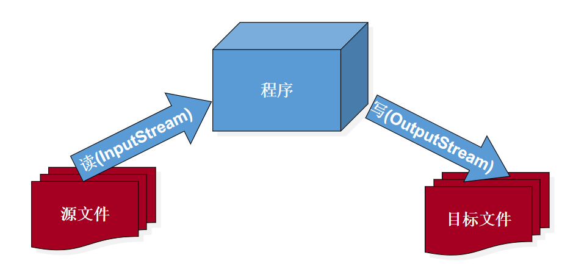
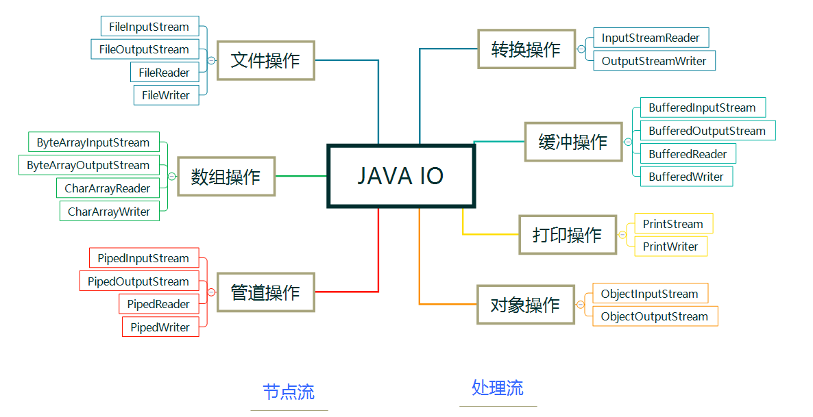
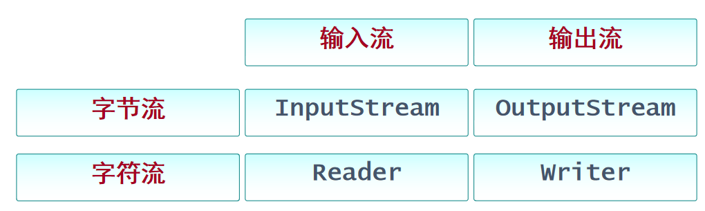
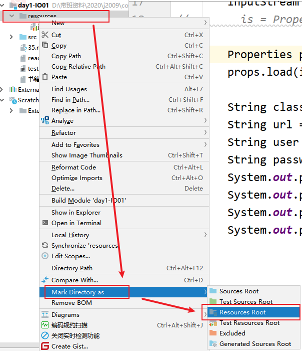
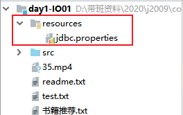

# 01 - IO（一） :black_nib:

[[TOC]]

## 流概述

### 什么是流(IO)

​ 流(Stream)，是一种抽象的概念，比如:现实生活中的的：水流，河流等；指的是一种物质(数据)从一个位置以一种特殊的方式，转移到另一个位置的过程，那么这种特殊的转移方式称之为流；流在计算中以 IO(Input/Output)的形式存在，即输入（耳朵）与输出（嘴巴），比如通过程序将数据写入文件的过程称之为**输出**，将文件中的数据读取到程序中的过程称之为**输入**

输入输出目标:

- 文件
- **网络**

> JavaIO 中的所有类都是位于`java.io`包

### 流向说明

java 中的流向指的是**输入**与**输出**，并且这个概念是站在程序的角度考虑。



### 流的分类

#### 分类

流根据不同的分类方式分为以下几类:

1. 按流向分:输入流与输出流
2. 按传输的数据类型分:字节流和字符流
3. 按照处理能力分为:节点流与处理流(包装流)

> java 中大多数以 Stream 结尾的流都是字节流，大多数以 Reader 或 Writer 结尾的流都是字符流

#### 体系结构



#### 顶级父类

java 中所有的流的顶级父类都从以下几个父类继承，以下这些所有的都是抽象类(abstrtact)



## 字节流与字符流

#### 字节流

所谓字节流，即数据的传输方式以字节为单位进行，字节流的读取方式为每次以一个字节进行传输，一般字节流相对比较通用的一种流，比如常见二进制文件(图片，视频，音频)的操作都可以通过字节流完成。

字节流的顶级父类主要包含：

- InputStream：字节输入流
- OutputStream：字节输出流

##### InputStream

字节输入流，是一个抽象类，其中常见的子类主要有：

- FileInputStream
- BufferedInputStream
- ByteArrayInputStream
- ObjectInputStream

**InputStream 常见方法：**

- available()：获取流中的可读字节数
- read()：读取一个字节的数据，并返回（如果流中没有可读字节内容则返回-1）
- read(byte[] b)：将输入的字节内容存储到字节缓冲区(b)中，并返回实际的读取长度
- skip(int i)：跳过指定个字节发生下一次读取
- close()：关闭程序与系统资源之间的通道

基本案例:

```java
File file = new File("C:\\Users\\Administrator\\Desktop\\test.txt");
InputStream is = new FileInputStream(file);
byte[] bytes = new byte[is.available()]; //0  0.0 false ' ' null
//跳过指定个字节读取
is.skip(5);
//将流中的数据读取到字节数组中
is.read(bytes);
//将字节数组转换为字符串
String s = new String(bytes);
System.out.println(s);
//关闭资源
is.close();
```

##### OutputStream

字节输出流基类，所有的的字节输出流都是从该类继承，OutputStream 是一个抽象类，常见子类有:

- FileOutputStream
- BufferedOutputStream
- ByteArrayOutputStream
- ObjectOutputStream

**OutputStream 常见方法**

- write(int b)：向指定输出源输出一个字节
- write(byte[] b)：向指定输出源输出字节数组
- write(byte[] b,int offset,int len)：向指定输出源输出字节数组，并且偏移 offset 个字节，写入 len 长度个字节
- close()：关闭程序与系统资源之间的连接通道

使用案例：

```java
public class OutputDemo1 {

    public static void main(String[] args) throws IOException {
        File file = new File("day1-IO01/readme.txt");
        //创建文件的输出流，使用追加模式(在文件末尾发生写入操作)
        OutputStream os = new FileOutputStream(file,true);
        //向输入流中写入一个字节
//        os.write(97);
        String str = "宝剑锋自磨砺出，梅花香自苦寒来";
        os.write(str.getBytes(Charset.forName("gbk")));
        os.close();
    }
}
```

#### 字符流

所谓字节流，即数据的传输方式以字符为单位进行，数据的传输为每次传输一个字符(即两个字节)，因此比较适合与传输文本信息，但是不适用与传输二进制文件数据，会导致文件格式破坏从而无法正常打开。另外一种常见的字符流使用为字符格式转码(例如:UTF-8 转 GBK)

JavaIO 中的字符流都从以下两个抽象类继承而来:

- Reader：字符输入流
- Writer：字符输出流

##### Reader

Reader 用于使用字符的形式从输入源(文件或网络)中读取字符内容，读取方式是一个一个字符读取，常见方法类似 InputStream：

- read()：读取一个字符
- read(char[] ch)：将读取的字符存储到字符缓冲区，返回真实读取字符数，读取到末尾时返回-1
- read(char[] ch,int offset,int len)：将读取的字符存储到字符缓冲区，偏移 offset 位读取，读取 len 为位
- skip(long l)：跳过指定个字符发生下一次读取

**Reader 常见的子类:**

- FileReader
- InputStreamReader
- BufferedReader

基本案例:

```java
File file = new File("D:\\文档资料\\电子书\\书籍推荐.txt");
//根据提供的文件构建一个字符文件输入流
FileReader reader = new FileReader(file);
String encoding = reader.getEncoding();
System.out.println("字符编码:"+encoding);

int i = -1;
while((i = reader.read()) != -1){
    System.out.print((char)i);
}

```

> 以上的读取方式，从底层来看，效率比较低，因为循环的时候是每次读取一个字符，因此循环的次数较多，必然会增加时间上的开销。若需要提高读取效率，则可以考虑使用空间换取时间的方式,使用字符缓冲区：
>
> ```java
> File file = new File("D:\\文档资料\\电子书\\书籍推荐.txt");
> //根据提供的文件构建一个字符文件输入流
> FileReader reader = new FileReader(file);
> String encoding = reader.getEncoding();
> System.out.println("字符编码:"+encoding);
>
> char[] c = new char[512];
> int len = 0;
> while((len = reader.read(c)) != -1){
>     String s = new String(c,0,len);
>     System.out.println(s);
> }
> ```

##### Writer

Writer 用于以字符的形式将文本内容输出到指定的输出源，常见方法：

- write(int b)
- write(char[] c)
- write(char[] c,int offset,int len)
- write(String s)
- flush()

基本案例:

```java
File file = new File("day1-IO01/test.txt");
FileWriter fw = new FileWriter(file, true);
fw.write("床前明月光，汗滴禾下土");
fw.close();
```

**使用字符流实现文件拷贝：**

> **在 GBK 的编码模式下 1 个中文字符等于 2 个字节；**
>
> **在 UTF-8 的编码模式下 1 个中文字符等于 3 个字节；**
>
> 字节流字符流的区别：
>
> 两种流分别采用的不同形式读取文件，**在进行二进制文件读取时适合使用字节流，而对文本文件读取时适合使用字符流**

## 流案例之文件拷贝

所谓文件拷贝，即将一个文件从一个指定的目录复制到另一个目录的过程，原理：对源文件使用输入流读取，将读取的字节缓存到程序的内存中，然后再获取目标文件的输出流，将缓存的字节通过输出流写出到指定位置

实现代码：

```java
/**
 * @Author mrchai 2021/1/11 11:32
 */
public class FileCopy {

    /**
     * 将一个源文件拷贝到目标目录中
     * @param source 源文件
     * @param dir  目标目录
     */
    public static void copy(File source, File dir) throws IOException {
        //获取源文件的输出流
        try(
            FileInputStream fis = new FileInputStream(source);
            //获取目标文件的输出流
            FileOutputStream fos  = new FileOutputStream(new File(dir,source.getName()));
        ) {
            //声明字节缓冲区
            byte[] b = new byte[1024];
            int len = 0;
            System.out.println("开始拷贝...");
            while ((len = fis.read(b)) != -1) {
                fos.write(b, 0, len);
            }
            System.out.println("拷贝完成！");
        }
    }

    public static void main(String[] args) throws IOException {
        File source = new File("day1-IO01/35.mp4");
        File dir = new File("C:\\Users\\Administrator\\Desktop");
        copy(source,dir);

        //思考:如何实现目录拷贝(目录中还可能包含子目录)
    }
}
```

## 资源文件读取与 Properties 类

### 读取 resources 目录下的资源



java 项目中的资源文件或配置文件(比如:xml 文件，properties 文件)一般会存放在 resources 目录下，该目录在 maven 项目中自动包含，如果是非 maven 项目，需要手动创建目录,并将目录设置为`Resource Root`,参考以上操作，操作完成后，目录显示效果如下:



在程序中对资源文件的读取方式如下:

```java
//读取资源为InputStream
//方式一：
InputStream is1 = PropertiesDemo.class.getResourceAsStream("/jdbc.properties");
//方式二:
InputStream is2 = PropertiesDemo.class.getClassLoader().getResourceAsStream("jdbc.properties");

//读取资源为URL
//方式一：
URL url1 = PropertiesDemo.class.getResource("/jdbc.properties");
//方式二：
URL url2 = PropertiesDemo.class.getClassLoader().getResource("jdbc.properties");
```

### Properties 类

Properties 是从 Hashtable 继承而来，存储的结构为键值对的属性信息，通过加载输入流(字节，字符)将流中的数据读取为属性列表(键值对对结构)；

属性文件的结构:

jdbc.properties：

```properties
driverClass=com.mysql.jdbc.Driver
url=jdbc:mysql://127.0.0.1:3306/test
user=root
password=123456
```

读取属性文件内容:

```java
//加载指定资源文件成为流
InputStream is = PropertiesDemo.class.getResourceAsStream("/jdbc.properties");
//创建Properties对象
Properties props = new Properties();
//将流数据装载Properties对象中
props.load(is);

//根据属性的键获取值
String className = props.getProperty("driverClass");
String url = props.getProperty("url");
String user = props.getProperty("user");
String password = props.getProperty("password");
System.out.println(className);
System.out.println(url);
System.out.println(user);
System.out.println(password);
```

## 处理流与打印流

​ 之前所了解的流都是直接与输入输出源对接的流，这些流称之节点流（低级流）；因此在 IO 的体系结构中，另外还存在一些用于对其他流进行处理的高级流，也称之处理流（包装流），比如流类型的转换会使用**转换流**，提高读写效率时使用**缓冲流**，进行打印输出操作时使用**打印流**等。高级流实际是基于一种设计模式所实现(装饰器模式)；处理流主要有以下几类：

- 转换流：用于字节流和字符流之间的转换
  - **InputStreamReader**：将字节输入流转换为字符输入流（从字节通往字符的桥梁）
  - OutputStreamWriter：将字符输出流转换为字节输出流（从字符通往字节的桥梁）
- 缓冲流
  - BufferedInputStream
  - BufferedOutputStream
  - BufferedReader
  - BufferedWriter
- 打印流

### 转换流基本使用

```java
//        InputStream is = System.in;
//        //将字节流包装为字符流
//        InputStreamReader isr = new InputStreamReader(is,"gbk");
//        int i = -1;
//        while((i = isr.read()) != -1){
//            System.out.print((char)i);
//        }
//        isr.close();

//将字符输出流转换为字节输出流
OutputStreamWriter osw = new OutputStreamWriter(new FileOutputStream("day1-IO01/test.txt",true));
osw.write("鹅鹅鹅，曲项向天歌");
osw.close();
```

#### 文件编码转换(主要针对文本文件)

```java
public class CharacterConverterUtils {

    public static void convert(File source, File dir, String oldEncoding, String newEncoding) throws IOException {
        try(
            //将源文件以字节流读取，并以指定的字符编码读取并转换为字符流
            InputStreamReader isr = new InputStreamReader(new FileInputStream(source),oldEncoding);
            //获取目标文件的输出流并以自定的字符编码写入
            OutputStreamWriter osw  = new OutputStreamWriter(new FileOutputStream(new File(dir,source.getName())),newEncoding);
        ) {
            char[] c = new char[512];
            int len = 0;
            System.out.println("开始转换...");
            while ((len = isr.read(c)) != -1) {
                osw.write(c, 0, len);
            }
            System.out.println("转换完成");
        }
    }

    public static void main(String[] args) throws IOException {
        File source = new File("C:\\Users\\Administrator\\Desktop\\gbk\\Config.java");
        File dir = new File("C:\\Users\\Administrator\\Desktop\\utf8");
        convert(source,dir,"gbk","utf-8");
    }
}

```

### 缓冲流

缓冲流是 IO 包中提供的用于高效进行读写操作的流，流的内部实现包含了一个固定大小的缓冲区，缓冲流主要包含以下四个类:

- BufferedInputStream
- BufferedOutputStream
- BufferedReader
- BufferedWriter

BufferedInputStream 基本使用：

```java
public static void main(String[] args) throws IOException {

    File file = new File("day1-IO01/35.mp4");
    BufferedInputStream bis = new BufferedInputStream(new FileInputStream(file));
    long begin = System.currentTimeMillis();
    byte[] b = new byte[1024];
    int len = 0;
    while((len = bis.read(b)) != -1){
    }
    long end = System.currentTimeMillis();
    System.out.println("耗时:"+(end- begin));
    bis.close();
}
```

BufferedReader 基本使用:

```java
public class BufferedDemo2 {

    public static void main(String[] args) throws IOException {

        File file = new File("day1-IO01/书籍推荐.txt");
        BufferedReader br = new BufferedReader(new FileReader(file));
        String line = null;
        while((line  = br.readLine()) != null){
            System.out.println(line);
        }
        br.close();
    }
}

```
