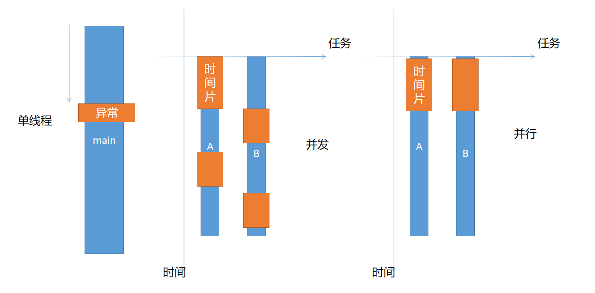
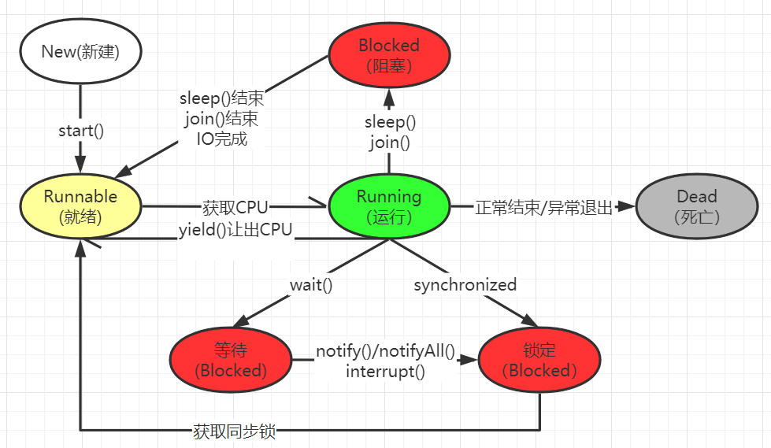

# 03 - 线程（一） :space_invader:

[[TOC]]

## 线程概述

​ 在之前所接触任何 java 程序的执行流程，都是先从 mian 方法开始，从上往下依次执行，其中任何一个步骤出现异常或者错误，都会导致程序结束（JVM 退出）；在这种情况下，程序的稳定性无法得到保障，因此，在程序中需要有一种并行或者并发的机制，使得程序能够同时执行多个任务。

### 并发与并行

- 并发：在一个**时间段**之内同时执行多个任务，但是同一时间点只有一个任务运行（单核 CPU 时代）
- 并行：在同一个**时间点**同时执行多个任务（要求的系统 CPU 具备多核能力）



> 并行和并发通俗解释：
>
> 1.  你在吃饭，电话来了，你先吃完饭，然后接电话（不并行，也不并发）
> 2.  你在吃饭，电话来了，你先暂停吃饭，然后接电话，接完之后继续吃饭(并发)
> 3.  你在吃饭，电话来了，你拿起电话一边接电话一边吃饭(并行)

### 进程与线程

​ 目前的操作系统是一个支持多任务的系统（可以"同时"运行多个应用程序），计算机中的每一个任务称之为进程,进程即一个应用程序（windows 系统中一个 exe 文件），但是一个应用程序内部可能又存在多个子任务，比如正在运行的 360 卫士，可以同时执行垃圾清理，开机启动优化，后台检查更新等任务，正在运行的程序称之为一个进程，每一个子任务称之为线程。

- 进程：一个应用程序称之为进程（食堂打饭）
- 线程：进程中的一条执行路径（每一个打饭的窗口）


> 每一个进程的运行都需要有系统分配独立的运行空间(内存)

### 线程概述

线程是进程中的一条执行路径(一个进程可以包含多个线程)，每个进程中至少有一条线程，在一个进程中的多个线程是共享该进程的内存空间的，线程一般分为通用的五种状态（线程生命周期）：

- 新建状态（New）
- 就绪状态（Runnable）
- 运行状态（Running）
- 阻塞状态（Blocked）
- 死亡状态（Dead）



> 线程的主要作用在于提高 CPU 的利用率

## 线程创建与启动

### 线程创建

java 中创建线程包含三种方式（四种）：

- **继承 Thread**
- **实现 Runnable**
- **实现 Callable 接口**
- 使用线程池\*

#### 继承 Thread 类

线程创建的第一种较为简单的方式是：

- 创建一个普通 Java 类继承 Thread 类
- 重写 run 方法。

案例代码:

```java
 */
public class MyThread01 extends Thread{
    @Override
    public void run() {
        for (int i = 0; i < 10; i++) {
            System.out.println(this.getName()+" "+i);
        }
    }
}
```

#### 实现 Runnable 接口

第二种创建线程的方式为实现 Runnable 接口：

- 创建类实现 Runnable 接口
- 实现 run 方法

```java
public class MyThread02 implements Runnable{

    @Override
    public void run() {
        for (int i = 0; i < 10; i++) {
            System.out.println("子线程--》"+i);
        }
    }
}
```

#### 实现 Callable 接口

Callable 接口是 JDK1.5 之后，新增`java.util.concurrent`包中新增的接口，用于执行一些并行计算，功能相对 Runnable 接口更为强大，创建方式为实现 Callable 接口：

- 创建类实现 Callable 接口
- 实现 call 方法

```java
public class MyThread03 implements Callable<Integer> {

    @Override
    public Integer call() throws Exception {
        int sum = 0;
        for (int i = 1; i <= 100; i++) {
            Thread.sleep(10);
            System.out.println("子线程运行---》"+i);
            sum += i;
        }
        return sum;
    }
}
```

> 三种创建线程方式的区别：
>
> 1.  继承 Thread 类
>
> - 优点：简单方便(只需要继承 Thread 类，即可创建当前类对象调用 start 启动线程)
> - 缺点：影响扩展性(一旦继承 Thread 则无法再继承其他类，使用比较局限)
>
> 2.  实现 Runnable 接口
>
> - 优点：不影响程序的扩展性（类还可以继承其他类或者实现其他接口）
> - 缺点：使用相对继承 Thread 复杂(创建 Runnable 对象之后，最终依然需要 Thread 创建并且启动线程)
>
> 3.  实现 Callable 接口
>
> - 优点：方法允许有任意类型的返回值，方法可以抛出异常，适合做一些分布式计算
> - 缺点：使用比较复杂（需要依赖 FutureTask 类完成 Runnable 对象创建，然后还需要 Thread 创建并启动）

### 启动线程

#### 继承 Thread 类

```java
//创建线程对象
MyThread01 mt = new MyThread01();
//启动线程
mt.start();
```

#### 实现 Runnable 接口

```java
MyThread02 mt = new MyThread02();
Thread t = new Thread(mt);
t.start();
```

#### 实现 Callable 接口（JDK1.5）

```java
MyThread03 mt = new MyThread03();
FutureTask<Integer> task = new FutureTask<>(mt);
Thread t = new Thread(task);
t.start();
//获取线程执行结果
Integer i = task.get();
```

### 线程池

Java 中线程对象的创建需要一定的时间开销，如果频繁创建，销毁必然对内存以及程序的运行效率产生影响，因此，Java 中提供线程池解决方案，允许通过资源的池的概念对线程进行统一管理，尽可能节省不必要的内存以及时间的开销。Java 中的线程池包含四种类型：

- newCachedThreadPool() ：由程序决定需要创建任意个线程的线程池对象
- **newFiexdThreadPool(int count)**：创建一个固定核心线程数的线程池
- **newScheduledThreadPool(int count)**：创建一个核心线程数为指定数目的定时调度线程
- **newSingleThreadExecutor()**：创建单个线程执行器

以上线程池对象的创建都需要 Executors 类完成，上述方法都是`java.util.concurrent.Executors`类中的静态方法

### 线程综合案例：文件监控

```
子线程每1秒钟一次，判断指定的某个目录下的某个文件是否被修改，如果被修改，
就在Console上打印出“File changed…”, ，最后修改时间
```

```java
public class Demo extends Thread{

    /**需要被监控的目标文件*/
    private File file = new File("C:\\Users\\Administrator\\Desktop\\data.txt");

    @Override
    public void run() {
        //获取文件的最后修改时间
        long last = file.lastModified();
        System.out.println("开始监控文件，时间:"+DateFormat.getDateTimeInstance().format(new Date(last)));
        while(true){
            try {
                sleep(1000);
            } catch (InterruptedException e) {
                e.printStackTrace();
            }
            //获取最新的文件最后修改时间
            long now = file.lastModified();
            //判断两次时间是否一致
            if(last != now){
                //文件被修改了
                System.out.println("File changed..."+DateFormat.getDateTimeInstance().format(new Date(now)));
                //更新最后修改时间
                last = now;
            }
        }
    }

    public static void main(String[] args) throws InterruptedException {

        //创建线程对象监控文件的修改
        new Demo().start();

        while(true){
            Thread.sleep(3000);
            System.out.println("主线程运行中..."+ DateFormat.getTimeInstance().format(new Date()));
        }
    }
}
```

### 使用匿名内部类创建并启动线程

```java
new Thread(){
    @Override
    public void run() {
        for (int i = 0; i < 10; i++) {
            System.out.println(this.getName()+"--"+i);
        }
    }
}.start();
```

## Thread 类

`java.lang.Thread`类是由 JDK 提供的一个用于创建线程对象的核心类，从 Runnable 接口实现而来，提供 Java 的多线程执行能力.

### 构造器

- Thread()：创建一个默认的 Thread 实例
- Thread(String name)：根据提供的线程名称创建 Thread 实例
- Thread(Runnable r)：根据提供的 Runnable 对象创建一个 Thread 实例
- Thread(Runnable r,String name)：根据提供的 Runnable 对象以及线程名称创建一个 Thread 实例

### 常见方法

- static int activeCount()：获取活动线程数
- static Thread currentThread()：返回当前正在执行的线程实例
- long getId()：获取线程的 id（该 id 在当前线程结束后可以被重用）
- String getName()：获取当前线程的名称

使用案例:

```java
public class ThreadDemo1 extends Thread{

    public ThreadDemo1(){}

    public ThreadDemo1(String name){
        super(name);
    }

    @Override
    public void run() {
        System.out.println("线程执行：" + getName()+"/"+getId());
    }

    public static void main(String[] args) {

        ThreadDemo1 t = new ThreadDemo1();
        t.start();
        System.out.println("活动线程数："+Thread.activeCount());

        System.out.println("主线程ID："+Thread.currentThread().getId());
    }
}
```

### 线程优先级

线程是具备优先级，优先级越高的线程获得的执行机会更多，反之越少；Java 中线程的优先级取值范围从 0~10 之间（默认为:5），java 中设置和获取线程的优先级通过以下两个方法实现:

- setPriority(int priority)
- getPriority()

```java
public class ThreadDemo2 extends Thread{

    public ThreadDemo2(String name){
        super(name);
    }

    @Override
    public void run() {
        for (int i = 0;i<100;i++){
            System.out.println(getName()+"---->"+i);
        }
    }

    public static void main(String[] args) {
        ThreadDemo2 t1 = new ThreadDemo2("线程A");
        ThreadDemo2 t2 = new ThreadDemo2("Thread-B");
        //设置线程优先级 默认为：5 最大为：10 最小为：1
        t1.setPriority(Thread.MIN_PRIORITY);
        t2.setPriority(Thread.MAX_PRIORITY);

        t1.start();
        t2.start();
        //获取线程的优先级
        System.out.println("线程1优先级："+t1.getPriority());
        System.out.println("线程2优先级："+t2.getPriority());
    }
}
```

### 守护线程

​ 守护线程（daemon）也称之后台线程，是为其他主线程提供服务的后台线程，一旦主线程结束，则守护线程也会随之结束，典型的守护线程案例即：JVM 中的垃圾收集器，就是典型的守护线程，一旦程序执行结束，JVM 退出，则垃圾收集线程也会随之结束。

```java
public class ThreadDemo3 extends Thread{

    @Override
    public void run() {

        for (int i = 0;i < 10;i++){
            if(i == 5){
                //启动另一个线程
                System.out.println("守护线程启动...");
                ThreadDemo2 t = new ThreadDemo2("守护线程");
                //设置当前线程为守护线程
                t.setDaemon(true);
                t.start();
            }
            try {
                sleep(600);
            } catch (InterruptedException e) {
                e.printStackTrace();
            }
            System.out.println("目标线程：" + i);
        }
        System.out.println("目标线程结束");
    }

    public static void main(String[] args) throws InterruptedException {
        ThreadDemo3 t = new ThreadDemo3();
        t.start();

        int i = 100;
        while(i<150){
            i++;
            System.out.println("主线程："+i);
            Thread.sleep(200);
        }
        System.out.println("主线程结束");
    }
}
```

> 以上程序解读:
>
> 启动目标线程后，线程中的任务每隔 0.6 秒执行一次，当 i 的到达 5 目标线程计数，此时启动守护线程 ThreadDemo2 并未结束，等到 main 方法中 while 循环执行完成(即主线程执行完毕)，守护线程也随之结束。

### join 线程(插队)

Thread 类中提供的 join 方法允许将当前线程并入到其他线程(即当前线程暂停执行，先执行其他线程)，通过设置并入的时间，当并入时间到达之后，继续执行当前线程，join 方法包含以下两个:

- join()
- join(long milis)

```java
public class ThreadDemo4 extends Thread{

    public ThreadDemo4(String name){
        super(name);
    }

    @Override
    public void run() {
        for(int i = 0;i<10000;i++){
            if(i == 20 && getName().equals("线程A")){
                try {
                    this.join(100);
                    System.out.println(getName()+"====>"+i);
                } catch (InterruptedException e) {
                    e.printStackTrace();
                }
            }else{
                System.out.println(getName()+"---->"+i);
            }
        }
        System.out.println(getName()+"结束执行");
    }

    public static void main(String[] args) {
        ThreadDemo4 t1 = new ThreadDemo4("线程A");
        ThreadDemo4 t2 = new ThreadDemo4("thread-B");
        t1.start();
        t2.start();
    }
}

```

join 的另一种使用使用方式为：当某个线程执行到一定的时间之后，执行目标线程的 join 方法，此时目标线程会获取所有的执行时间(插队)，当目标线程执行完毕之后才交出执行权，给其他线程执行，如下:

```java
public class TreadDemo5 extends Thread{

    @Override
    public void run() {
        for (int i = 0; i < 50; i++) {
            try {
                sleep(100);
            } catch (InterruptedException e) {
                e.printStackTrace();
            }
            System.out.println(getName()+"--->"+i);
        }
    }

    public static void main(String[] args) throws InterruptedException {

        TreadDemo5 t = new TreadDemo5();
        t.start();

        for (int i = 0; i < 40; i++) {
            Thread.sleep(50);
            if(i == 20){
                t.join();
            }
            System.out.println("main-->"+i);
        }
    }
}

```

## 线程中断

大多数时候线程只有在任务执行完毕之后才会终止，但是在程序运行期间可能因为一些特殊的原因，需要提前结束某个线程；此时 java 的线程中提供了几种用于中断线程的方式：

- 异常中断（以抛出运行时异常的方式结束）
- 直接调用 stop()方法（不推荐，已经过时；会导致对象锁的释放，造成并发修改结果异常）
- 调用 interrupt()方法 (不推荐)
- **标记中断法（推荐）**

### 标记中断

原理是:在线程类中声明一个全局的变量用于表示为线程是否结束，然后再 run 方法中根据该状态决定是否执行线程任务，如果线程外部需要将当前线程中止，此时可通过对外提供访问该状态标记的方法，外部可以设置该线程的中断状态(True||False)，以实现线程的中断操作。

```java
public class ThreadBreakDemo2 extends Thread{

    private boolean over;

    public boolean isOver() {
        return over;
    }
    public void setOver(boolean over) {
        this.over = over;
    }
    @Override
    public void run() {
        int i = 0;
        while(!over){
            i++;
            try {
                sleep(5);
            } catch (InterruptedException e) {
                e.printStackTrace();
            }
            System.out.println(getName()+"--->"+i);
            if(i > 1000) {
                //标记线程当前线程可以结束
                over = true;
            }
        }
    }

    public static void main(String[] args) {
        ThreadBreakDemo2 tb = new ThreadBreakDemo2();
        tb.start();

        for (int i = 0; i < 1000; i++) {
            try {
                sleep(10);
            } catch (InterruptedException e) {
                e.printStackTrace();
            }
            if(i == 500){
                tb.setOver(true);
            }
            System.out.println("main===>"+i);
        }
    }
}

```

## 多线程编程(GUI)详情代码请查看代码文件夹
