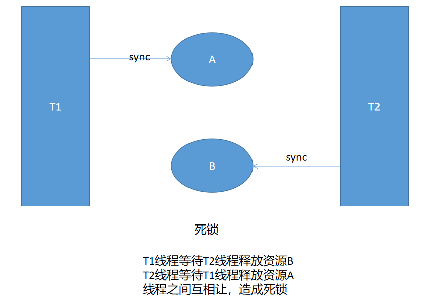
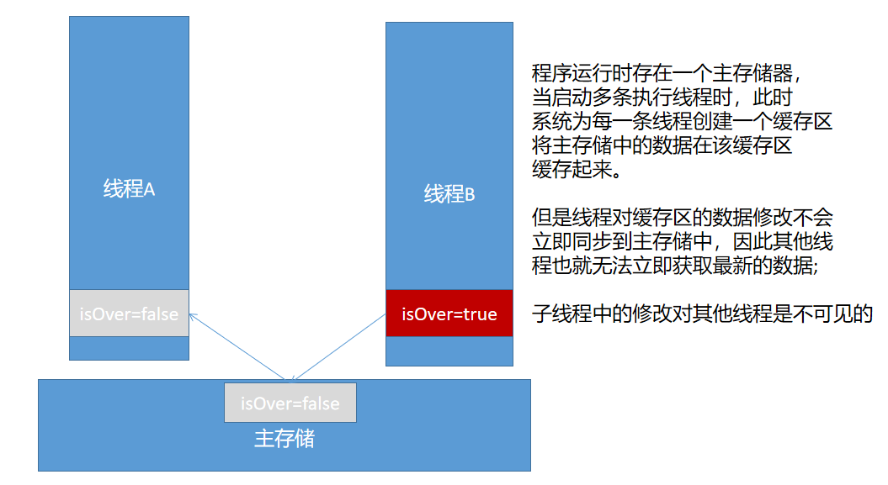

# 04 - 线程（二） :heart_eyes_cat:

[[TOC]]

## 线程并发问题

### 概述

在多线程操作共享变量时可能会遇到如下问题：

例如：银行取钱，现有多个用户操作同一个账户，可能会遇到并发安全问题，假设一个账户中余额一共 10000 元，现在有多个用户同时通过该账户取款，各取 10000；取款的过程必然会先进行余额检查，如果余额足够则允许取款；如果多个用户将取款的时间恰好定在同一个时刻，此时就可能出现这些用户同时取款成功的情况，但是实际账户的余额与预期的结果出现不一致。

以上问题就称之为**线程安全**问题；所谓线程安全问题：即多线程并发操作共享变量时造成的结果污染问题

### 案例场景

类似以上线程安全问题有很多：

- 购票
- 限时秒杀

### 并发编程有三要素

- 原子性：线程是原子操作的，要么都成功，要么都失败
- 可见性：多个线程并发操作时，一个线程对共享变量的修改要实时的同步到其他线程中
- 有序性：线程内部的程序执行，由上而下依次执行。(避免指令重排)

## 线程同步解决方案

### Synchronized

synchronized 是 java 中提供一个用于实现线程同步的关键字，通过使用该关键字，可以有效的解决线程并发时线程安全的问题，解决的并发编程中的原子性。synchronized 有三种使用方式：

- 对象锁（使用 synchronized 关键对对象/实例锁定）
- 方法锁（使用 synchronized 对方法修饰锁定方法）
- 类锁（使用 synchronized 直接锁定类）

#### 对象锁

```java
public class AccountOperation extends Thread {

    /** 账户*/
    private Account a;
    /** 待取款金额*/
    private double target;

    public AccountOperation(Account a, double target) {
        this.a = a;
        this.target = target;
    }

    @Override
    public void run() {
        synchronized (a) {
            try {
                sleep(500);
            } catch (InterruptedException e) {
                e.printStackTrace();
            }
            a.giveMoney(target);
        }
    }
}

```

#### 方法锁

```java
public synchronized void giveMoney(double m){
    if(m <= money){
        money -= m;
        System.out.println(Thread.currentThread().getName()+ "取款成功，余额：" + money);
    }else{
        System.out.println("余额不足，" + Thread.currentThread().getName() + "取款失败!");
    }
}
```

#### 类锁

```java
public void giveMoney(double m){
    synchronized (Account.class){
        if(m <= money){
            money -= m;
            System.out.println(Thread.currentThread().getName()+ "取款成功，余额：" + money);
        }else{
            System.out.println("余额不足，" + Thread.currentThread().getName() + "取款失败!");
        }
    }
}
```

> 类锁的另一种写法
>
> ```java
> public synchronized static  void giveMoney(double m){
>     if(m <= money){
>         money -= m;
>         System.out.println(Thread.currentThread().getName()+ "取款成功，余额：" + money);
>     }else{
>         System.out.println("余额不足，" + Thread.currentThread().getName() + "取款失败!");
>     }
> }
> ```

#### 死锁问题

使用锁虽然能够解决多线程访问共享变量造成的安全问题，但是如果使用不当，也有可能会导致死锁；

死锁即多个线程等待被对方线程占有的资源时陷入一个僵局。



参考代码:

```java
public class DeadLock implements Runnable {

    private Object o1 = new Object();
    private Object o2 = new Object();

    @Override
    public void run() {
        //获取线程名称
        String name = Thread.currentThread().getName();
        try {
            Thread.sleep(3000);
        } catch (InterruptedException e) {
            e.printStackTrace();
        }
        if ("t1".equals(name)) {
            synchronized (o1) {
                System.out.println(name + "已锁定o1");
                synchronized (o2) {
                    System.out.println(name + "执行完毕");
                }
            }
        } else if ("t2".equals(name)) {
            synchronized (o2) {
                System.out.println(name + "已锁定o2");
                synchronized (o1) {
                    System.out.println(name + "执行完毕");
                }
            }
        }
    }
}
```

### lock

在 Java5 中新增的并发编程包中，提供一种新型的锁机制`Lock`,提供了比 synchronized 功能更为强大的锁，`Lock`是一个接口，主要的实现类是`ReentrantLock`（可重入锁），提供了公平锁与非公平锁机制，默认是非公平锁的实现。

**构造器**

| `ReentrantLock()`             | 创建一个 `ReentrantLock`的实例。                   |
| ----------------------------- | -------------------------------------------------- |
| `ReentrantLock(boolean fair)` | 根据给定的公平政策创建一个 `ReentrantLock`的实例。 |

用法如下:

```java
public class SaleTickets implements Runnable{

    private int count = 100;
    private transient ReentrantLock lock = new ReentrantLock();

    @Override
    public void run() {
        while(count > 0) {
            //获取锁
            lock.lock();
            try {
                Thread.sleep(300);
                System.out.println(Thread.currentThread().getName() + "买到车票：" + (--count));
            } catch (InterruptedException e) {
                e.printStackTrace();
            } finally{
                //解锁
                lock.unlock();
            }

        }
    }

    public static void main(String[] args) {

        SaleTickets st = new SaleTickets();

        Thread t1 = new Thread(st,"小明");
        Thread t2 = new Thread(st,"小红");
        Thread t3 = new Thread(st,"小王");

        t1.start();
        t2.start();
        t3.start();
    }
}

```

> 注意事项
>
> 由于 Lock 是手动获取以及释放锁（区别 synchronized 自动锁机制），因此一般锁的获取会放在 try 语句块之前，并且对于锁的释放如果使用的位置不恰当,很有可能造成死锁，因此建议将锁的释放定义在 finally 语句块中
>
> synchornized 和 lock 区别？
>
> synchronized：
>
> - 是 java 中提供的一个关键字
> - synchronized 锁在任务执行完毕之后会自动释放
> - synchronized 是一种非公平锁
> - synchronized 适用于少量的代码片段
>
> lock：
>
> - 是一个 java 类，提供的功能要强大于 synchronized
> - 锁的释放需要手动控制，因此可以控制粒度更为细腻的操作
> - lock 既可以使用公平锁，也可以使用非公平锁实现
> - lock 适用于大量代码片段的锁机制

### volatile

在了解 volatile 之前，先看以下代码：

```java
public class VolatileDemo implements Runnable{

    private int i;
    private volatile boolean isOver;

    @Override
    public void run() {
        System.out.println("子线程启动");
        while(!isOver){
            i++;
        }
        System.out.println("线程终止。。。");
    }

    public static void main(String[] args) throws InterruptedException {
        VolatileDemo vd = new VolatileDemo();
        Thread t1 = new Thread(vd);
        t1.start();

        Thread.sleep(3000);
        vd.isOver = true;
    }
}
/*

*/
```

​ 分析以上程序，启动了两条线程，其中主线程中等待三秒之后会将结束标记修改，正常情况下，被修改的变量值应该立即被子线程读取，从而结束子线程；但是实际情况是，子线程并未结束，而是一直循环执行。

​ 产生原因如下：



如果需要将线程中对变量的修改立即同步给其他线程，只需要将变量使用`volatile`关键字修饰即可:

```java
private volatile boolean isOver;
```

volatile 可以保证数据的**可见性**以及**有序性**（不会进行指令重排），但是不保证原子性。

## 作业

- 思考：设计一个医院的挂号系统，存在多台挂号机器，要求这多台挂号机器能同时工作（同时放号），发放的号码要求不能出现重复，效果如下：

  ```
  线程A:1  5  8
  线程B:2  4  9
  线程C:3  6  7
  ```

  并且要求能够支持断电后号码不还原，即若号码发放到 9 号，此时断电了，下一次恢复供电之后号码从 10 继续开始。
