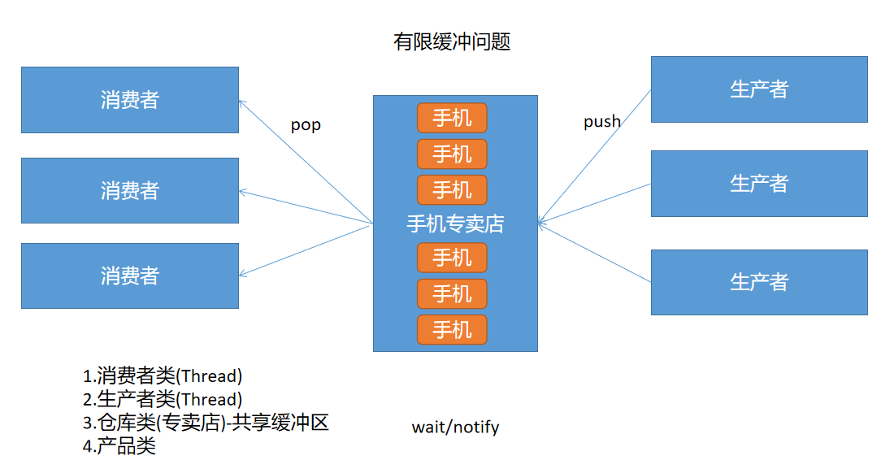

# 05 - 线程（三） :right_anger_bubble:

[[TOC]]

## 线程同步案例-多线程放号器

```java
public class NumberGen implements Runnable{

    private volatile static int num;
    private static RandomAccessFile raf;
    private boolean over;

    static{
        try {
            raf = new RandomAccessFile("day5-Thread/record.txt","rw");
            num = raf.readInt();
        } catch (FileNotFoundException e) {
            e.printStackTrace();
        }catch (EOFException e){
//            e.printStackTrace();
            System.out.println("当前没有号码记录，重新放号");
            num = 0;
        }catch (IOException e) {
            e.printStackTrace();
        }
    }

    @Override
    public void run() {
        while(!over){
            try {
                Thread.sleep(500);
            } catch (InterruptedException e) {
                e.printStackTrace();
            }
            synchronized (this) {
                try {
                    num++;
                    System.out.println(Thread.currentThread().getName() + "获取号码:" + num);
                    //将文件指针设置到开头处
                    raf.seek(0);
                    //将当前号码记录到文件中
                    raf.writeInt(num);
                } catch (IOException e) {
                    e.printStackTrace();
                }
            }
        }

    }

    public boolean isOver() {
        return over;
    }

    public void setOver(boolean over) {
        this.over = over;
    }

    public static void main(String[] args) {
        NumberGen ng = new NumberGen();

        Thread t1 = new Thread(ng,"放号机A");
        Thread t2 = new Thread(ng,"放号机B");
        Thread t3 = new Thread(ng,"放号机C");
        t1.start();
        t2.start();
        t3.start();
    }
}

```

## 线程的状态

### 概述

java 中的线程创建并启动之后不一定会一致持续执行，会根据程序的执行情况，存在各种不同的状态，之前了解操作系统中的线程分为 5 中状态（新建，就绪，执行，阻塞，死亡）；但是 java 中对于线程有其他不同的解释，因此，java 中的线程状态在 Thread 类中有详细表述的。

Java 将线程分为六种状态：

| 状态         | 描述                                                                                 |
| ------------ | ------------------------------------------------------------------------------------ |
| NEW          | 新建状态，该状态表示线程对象创建还未处于可运行状态                                   |
| RUNNABLE     | 可运行状态，线程处于准备运行或者正在被 JVM 进行调度执行的状态                        |
| BLOCKED      | 锁阻塞状态，线程等待被其他线程占据的对象监视器释放                                   |
| WATING       | 无限等待，当执行以下对象的相关方法时：Object#wait(),Thread#join(),LockSuport#park()  |
| TIMED_WATING | 限时等待，当执行以下对象的相关方法时：Thread#sleep(long time),Object#wait(long time) |
| TERMINATED   | 中止状态，程序正常执行结束。线程销毁                                                 |

以上状态可以到 Thread.State 枚举类中找到：

```java
public enum State {
    /**
         * Thread state for a thread which has not yet started.
         */
    NEW,

    /**
         * Thread state for a runnable thread.  A thread in the runnable
         * state is executing in the Java virtual machine but it may
         * be waiting for other resources from the operating system
         * such as processor.
         */
    RUNNABLE,

    /**
         * Thread state for a thread blocked waiting for a monitor lock.
         * A thread in the blocked state is waiting for a monitor lock
         * to enter a synchronized block/method or
         * reenter a synchronized block/method after calling
         * {@link Object#wait() Object.wait}.
         */
    BLOCKED,

    /**
         * Thread state for a waiting thread.
         * A thread is in the waiting state due to calling one of the
         * following methods:
         * <ul>
         *   <li>{@link Object#wait() Object.wait} with no timeout</li>
         *   <li>{@link #join() Thread.join} with no timeout</li>
         *   <li>{@link LockSupport#park() LockSupport.park}</li>
         * </ul>
         *
         * <p>A thread in the waiting state is waiting for another thread to
         * perform a particular action.
         *
         * For example, a thread that has called <tt>Object.wait()</tt>
         * on an object is waiting for another thread to call
         * <tt>Object.notify()</tt> or <tt>Object.notifyAll()</tt> on
         * that object. A thread that has called <tt>Thread.join()</tt>
         * is waiting for a specified thread to terminate.
         */
    WAITING,

    /**
         * Thread state for a waiting thread with a specified waiting time.
         * A thread is in the timed waiting state due to calling one of
         * the following methods with a specified positive waiting time:
         * <ul>
         *   <li>{@link #sleep Thread.sleep}</li>
         *   <li>{@link Object#wait(long) Object.wait} with timeout</li>
         *   <li>{@link #join(long) Thread.join} with timeout</li>
         *   <li>{@link LockSupport#parkNanos LockSupport.parkNanos}</li>
         *   <li>{@link LockSupport#parkUntil LockSupport.parkUntil}</li>
         * </ul>
         */
    TIMED_WAITING,

    /**
         * Thread state for a terminated thread.
         * The thread has completed execution.
         */
    TERMINATED;
}
```

### Timed Wating(计时等待)

计时等待也称之为限时等待，即线程会执行一段时间的休眠，等待休眠时间到达，此时线程自动苏醒

#### sleep(long time)

```java
public class TimedWatingDemo extends Thread{

    @Override
    public void run() {
        for (int i = 0;i < 100 ;i++){
            try {
                sleep(5000);
                System.out.println(getName()+"-->"+i);
            } catch (InterruptedException e) {
                e.printStackTrace();
            }
        }
    }

    public static void main(String[] args) {
        new TimedWatingDemo().start();
    }
}

```

#### wait(long time)

```java
public class TimedWatingDemo extends Thread {

    private Object obj = new Object();

    @Override
    public void run() {
        for (int i = 0; i < 100; i++) {
            synchronized (obj) {
                try {
                    obj.wait(5000);
                    System.out.println(getName() + "-->" + i);
                } catch (InterruptedException e) {
                    e.printStackTrace();
                }
            }
        }
    }
    public static void main(String[] args) {
        new TimedWatingDemo().start();
    }
}

```

> sleep()和 wait()区别？
>
> sleep:
>
> 1.  sleep()是**Thread 类**中提供一个方法，用于实现线程的限时休眠
> 2.  **sleep()方法的执行不需要持有对象的监视器(不需要获取锁)**
>
> wait:
>
> 1.  wait 方法是来自**Object 类**中的方法，既可以实现线程的限时休眠，也可以实现线程的无限休眠
> 2.  **wait 方法的使用必须持有对象的监视器**，否则会出现`java.lang.IllegalMonitorStateException`异常
> 3.  wait 方法如果处于无限等待状态，则需要其他通过 notify 或 notifyAll 唤醒
> 4.  wait 方法的执行将会释放对象监视器

### Blocked(锁阻塞)

该状态即一个线程处于等待其他线程释放对象锁的状态，例如死锁案例中：

```java
if ("t1".equals(name)) {
    synchronized (o1) {
        System.out.println(name + "已锁定o1");
        //此时t1线程等待其他线程释放o2的对象锁
        synchronized (o2) {
            System.out.println(name + "执行完毕");
        }
    }
} else if ("t2".equals(name)) {
    synchronized (o2) {
        System.out.println(name + "已锁定o2");
        //此时t2线程等待其他线程释放o1的对象锁
        synchronized (o1) {
            System.out.println(name + "执行完毕");
        }
    }
}
```

### Wating(无限等待)

当执行对象的某些特定方法时(如 Object 的 wait)，会导致线程处于无限等待状态,即处于不确定何时能恢复执行，具体的恢复时间通常由其他线程进行控制(例如调用 Object 的 notify 或 notifyAll)：

```java
public class WaitDemo {

    public static void main(String[] args) {
        final Object obj = new Object();

        new Thread("线程A"){
            @Override
            public void run() {
                synchronized (obj){
                    System.out.println(getName()+"执行。。。已锁住obj");
                    try {
                        //线程A处于无限等待状态（同时会释放obj对象的对象监视器）
                        obj.wait();
                    } catch (InterruptedException e) {
                        e.printStackTrace();
                    }
                    System.out.println("执行完毕");
                }
            }
        }.start();

        new Thread("线程B"){
            @Override
            public void run() {
                synchronized (obj) {
                    try {
                        Thread.sleep(5000);
                        //等待5秒之后，线程B会唤醒(同时释放obj对象的对象监视器)
                        obj.notify();
                    } catch (InterruptedException e) {
                        e.printStackTrace();
                    }
                }
            }
        }.start();

    }
}
```

## wait、notify、notifyAll

```Java
public static void main(String[] args) {
    final Object obj = new Object();
    final Object obj2 = new Object();

    new Thread("线程A"){
        @Override
        public void run() {
            synchronized (obj){
                System.out.println(getName()+"执行...已锁住obj");
                try {
                    obj.wait();
                } catch (InterruptedException e) {
                    e.printStackTrace();
                }
                System.out.println(getName()+"执行完毕");
            }
        }
    }.start();

    new Thread("线程C"){
        @Override
        public void run() {
            synchronized (obj){
                System.out.println(getName()+"执行...已锁住obj");
                try {
                    obj.wait();
                } catch (InterruptedException e) {
                    e.printStackTrace();
                }
                System.out.println(getName()+"执行完毕");
            }
        }
    }.start();

    new Thread("线程B"){
        @Override
        public void run() {
            synchronized (obj){
                try {
                    Thread.sleep(5000);
                    obj.notifyAll();
                } catch (InterruptedException e) {
                    e.printStackTrace();
                }
            }
        }
    }.start();
}
```

- wait()：方法的执行会导致当前线程处于无限等待状态，只有其他具备该对象监视器的对象执行 notify 或 notifyAll 时才能将其唤醒
- notify()：唤醒等待当前对象的对象监视器的单个线程
- notifyAll()：唤醒等待当前对象对象监视器的所有线程

## 生产者消费者问题

生产者消费者问题是线程中一个比较经典的案例，也成为有限缓冲区问题


