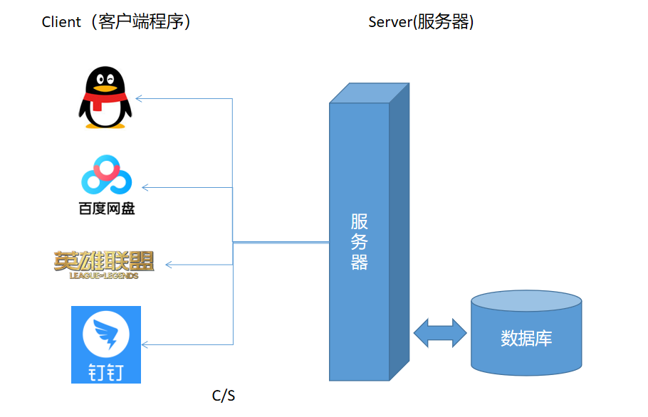
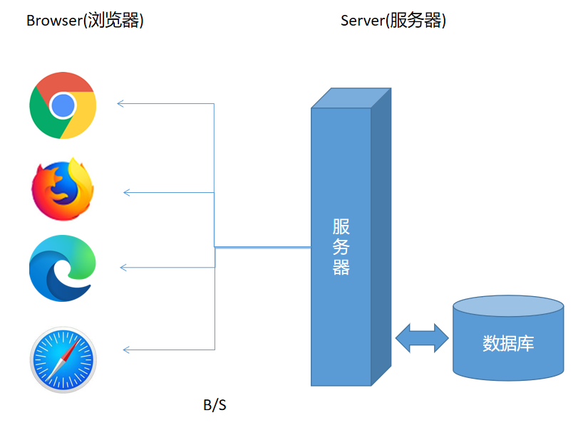
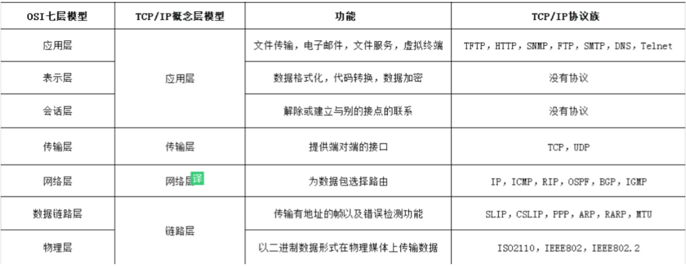
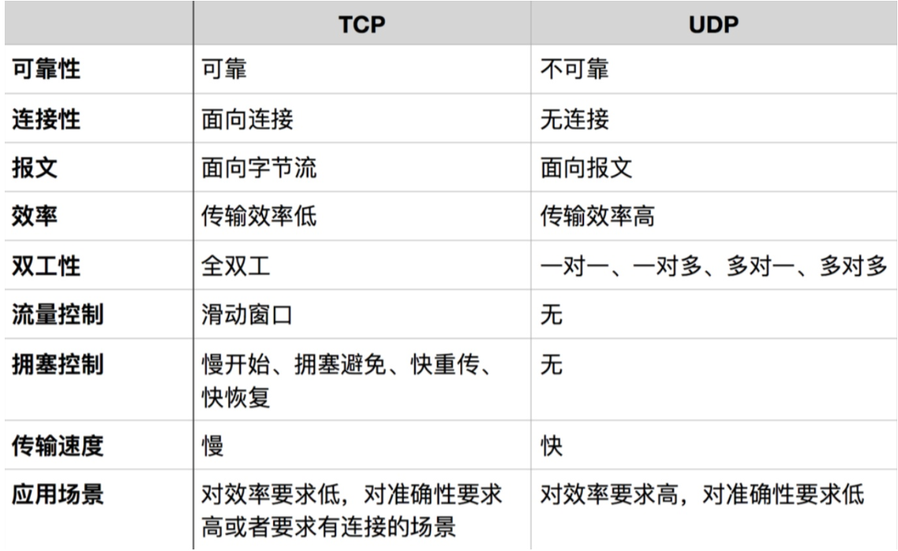
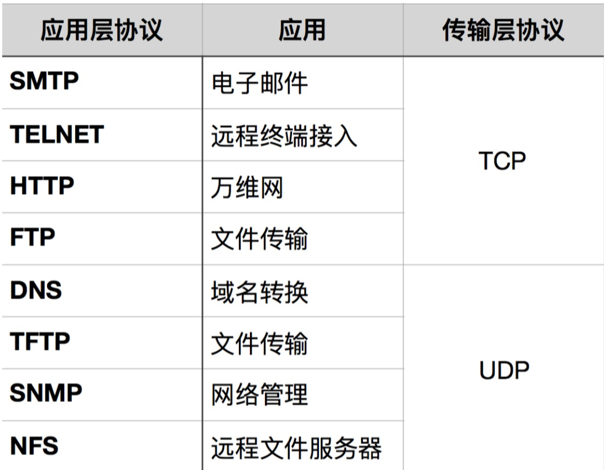
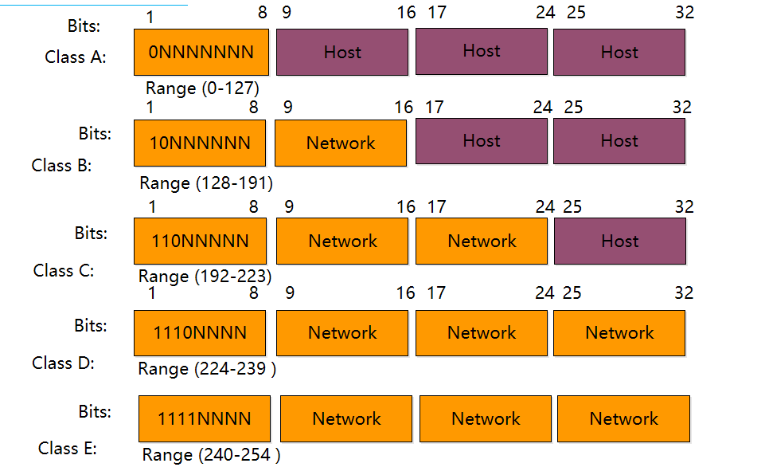
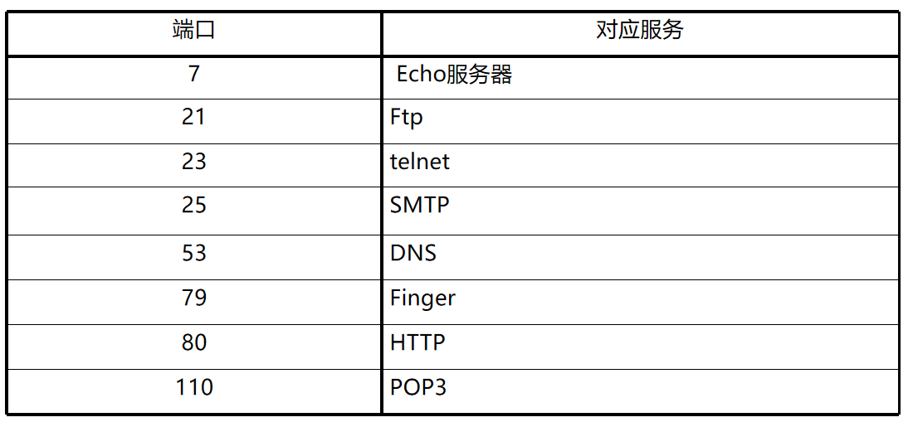
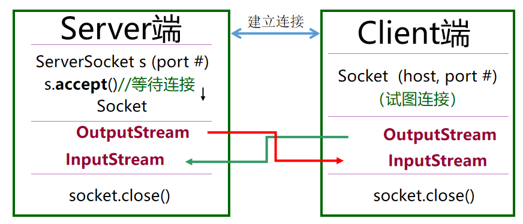
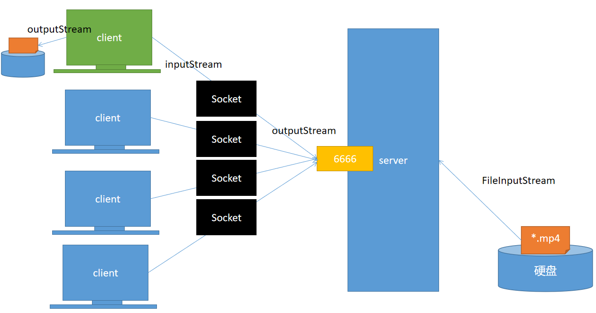

# 06 - 网络编程（一） :person_fencing:

[[toc]]

## 软件结构

在互联网的软件结构中主要分为两种结构模式:

1. CS 结构:Client/Server
2. BS 结构:Browser/Server

### CS 结构

CS:客户端/服务器模式，在这种结构下，我们需要先在终端（PC/手机/平板）下载相关的客户端程序，连接到服务端使用软件相关的功能，这种结构如下：



- 优点:用户体验好，对网络要求相对较低
- 缺点:对硬件要求高,软件升级需要推送到服务端,所有客户都需要重新安装

### BS 结构

BS:浏览器/服务器模式，在这种结构下，任何软件的使用不需要下载客户端程序，只需终端支持浏览器即可（all in one）,所有的程序都可以直接通过浏览器打开，实现真正的即用即走思想。BS 结构如下:



- 优点:对硬件要求较低
- 缺点:对网络的要求较高

对于以上两种软件结构来说，无论哪一种都有各自的优劣势，但是两种结构都有一个共同的要求：必需保持**网络连接**，才能使用相关功能

## 计算机网络

### 概述

计算机网络：通过相关的网络介质连接位于不同地理区域的计算机设备，将这些能够联网的设备连接成一个规模庞大的网络系统，实现设备之间的数据交换，从而达到一种能力：**数据共享**，计算机网络存在的意义:

- 使用远程资源
- 共享信息、程序和数据
- 分布式处理

### 网络分类

- 局域网
- 城域网（都市网）
- **广域网**

### 网络协议

计算机设备之间的连接需要两种必要资源：

- 硬件设备（网卡，交换机，路由器，连接介质:光纤，双绞线，同轴电缆）
- 软件设备（网络协议）

#### 协议

通信双方之间约定好的一些通信规则，类似一个组织内部通信暗语；计算中网络连接的底层协议主要分为：TCP/IP 协议与 UDP 协议

##### TCP/IP(打电话)

​ 传输控制协议，是一个安全可靠的互联网协议，需要通信的主机之间需要先建立正确的链接，才能够进行通信，并且改协议能够保证数据传输稳定性(必须的保证信息发送到一台主机，由该主机确认之后才能发送下一条信息)，另外该协议也能保证数据传输的有序性(先发送的信息一定先到达)。一般基于 C/S 架构，存在服务器客户端模式。

应用领域:远程登陆



##### UDP(发快递)

User Diagram Protocol（用户数据报协议），是一个不安全的网络协议，不需要双方之间建立联系，也不保证信息传输的有序性(有可能后发消息先到)，传输效率比 TCP/IP 更高.没有专门服务器和客户端，只有发送端和接收端.

应用领域: 广播，视频会议



##### TCP/IP 与 UDP 协议应用层协议对比



## IP 与端口(port)

### IP

IP:Internet Protocol 互联网协议，表示当前主机在网络中的位置(同一个网络系统中是独一无二的)；简单的认为:ip 即主机在网络中的位置

IP 地址目前主要分为两类:

- IPV4：32 位，4 个字节组成，取值范围位：0~255；目前全球可用的 ipv4 地址也就 40 多亿
- IPV6：128 位，126 个字节组成，可取的地址“无穷无尽”

其中 IPV4 主要分为 5 类，目前民用主要位于 C 类地址:



> ip 地址就类似家庭住址(精确到街道)

### 端口

计算机设备能够联网的应用种类很多，但是如果需要精确的找到某一个的应用程序，则该应用程序就需要存在一个对外的独一无二的通信端点，这个端点称之为:端口号；

端口号的可选择范围: 0~65535 之间

端口也分为三类：

- 公端认口:0~1023 之间，理论上不应该为你的应用程序分配这些端口，因为这些端口密集绑定了一些固定的服务
- **注册端口:1024~49151 之间，一般建议将应用程序的端口在这个范围内选择；位于这个区域的端口松散的绑定了部分服务**
- 动态端口/私有端口：从 49152 到 65535。理论上不应为服务分配这些端口

常用 TCP 端口占用情况:



> 端口就类似家庭住址的所在门牌号

## InetAddress 类(ip 地址的 Java 对象表示形式)

`java.net.InetAddress`类是来自`java.net`包中，用于表示一个 ip 地址的 Java 类，内部包含目标主机的**主机名和 ip 地址**

### 常见方法

- getByName(String host)：根据提供的 IP 地址或者主机名称获取当前主机所表示的 IP 地址对象
- getAllByName(String host)：获取所有符合主机名称的主机 ip 对象
- getLocalHost()：获取本地主机 ip 对象

```java
//根据提供的主机名获取主机所在的ip地址对象
InetAddress ip = InetAddress.getByName("mrchailiu");
System.out.println(ip);

//根据提供的主机名获取所有匹配的主机对象
InetAddress[] ips = InetAddress.getAllByName("mrchailiu");
for (InetAddress addr:ips) {
    System.out.println(addr);
}

//获取当前主机的本地地址对象
InetAddress localHost = InetAddress.getLocalHost();
System.out.println(localHost);

```

### localhost 与 127.0.0.1

- localhost 是本地主机的**域名**表示形式
- 127.0.0.1 是本地主机的**ip**表示形式

## InetSocketAddress（InetAddress+port 组合）

InetSocketAddress 类是从 SocketAddress（抽象类）继承而来，内部表示为 ip 地址对象与端口的结合，称之为 ip 套接字(主机对外通信的桥梁)

### 常见构造器

- InetSocketAddress(String host,int port)
- InetSocketAddress(InetAddress ip,int port)

### 常见方法

- getHostAddress()
- getHostName()
- getPort()
- getAddress()

```java
InetSocketAddress ipSocket = new InetSocketAddress("192.168.6.254",2425);
System.out.println(ipSocket);
//获取当前对象表示InetAddress对象
System.out.println(ipSocket.getAddress());
//获取主机名
System.out.println(ipSocket.getHostName());
System.out.println(ipSocket.getHostString());
//获取端口号
System.out.println(ipSocket.getPort());
```

## Socket 之 TCP 通信

### Socket 概述

socket 又称为**套接字**，用于实现两台主机之间通信的端点（桥梁），基于 TCP 通信协议的套接字类主要由以下两个类构成:

- ServerSocket
- Socket

基于 Socket 的 TCP 通信主要由两个方法分别获取基于 Socket 的输入流和输出流，然后通过 input/output 的原理实现主机之间的信息交换：



### ServerSocket(服务端套接字)

ServerSocket 提供的是服务端套接字功能，通过该类可以创建任何的网络服务程序。

```java
public class MyServer {

    public static void main(String[] args) throws IOException {
        //在指定的端口创建一个服务
        ServerSocket server = new ServerSocket(8888);
        System.out.println("服务已启动，等待连接....");
        while(true) {
            //开始监听并获取Socket对象
            Socket s = server.accept();
            System.out.println("客户端已连接!"+s.getInetAddress().getHostAddress());
            //获取基于Socket的输出流
            OutputStream os = s.getOutputStream();
            //编码转换
            //            OutputStreamWriter osw = new OutputStreamWriter(os,"gbk");
            //将节点流包装到打印流中
            PrintWriter out = new PrintWriter(os);
            out.println("欢迎进入SOFTEEM聊天室！！！");
            out.close();
        }

    }
}

```

### Socket

Socket 提供的是客户端套接字功能，该类可以连接指定地址指定端口的服务

```java
public class MyClient {

    public static void main(String[] args) throws IOException {
        //连接到指定ip和端口的服务
        Socket s = new Socket("192.168.6.254",8888);
        //获取基于Socket输入流
        InputStream is = s.getInputStream();
        Scanner sc = new Scanner(is);
        String msg = sc.nextLine();
        System.out.println("服务器:"+msg);
    }
}
```

## 综合案例:文件传输服务

案例结合 IO 流、多线程、网络编程三个 java 高级知识点实现，原理图如下：



以上原理解释：

1. 服务端读取本地文件到内存中
2. 通过 socket 的输出流将字节数据输出
3. 客户端获取 socket 输入流
4. 将流中的字节数据通过客户端文件的输出流输出，完成下载

### 服务端

1. 文件服务线程：

   ```java
   public class FileServer extends Thread {

       /**需要传输的文件*/
       private File target;
       /**实现通信的socket对象*/
       private Socket s;

       public FileServer(Socket s, File target) {
           this.target = target;
           this.s = s;
       }

       @Override
       public void run() {
           try (
               //获取目标文件的输入流（读取到内存中）
               BufferedInputStream bis = new BufferedInputStream(new FileInputStream(target));
               //获取目标socket输出流
               BufferedOutputStream bos = new BufferedOutputStream(s.getOutputStream());
           ) {
               byte[] buff = new byte[1024];
               int len = 0;
               System.out.println("开始传输文件:"+s.getInetAddress().getHostAddress());
               while((len = bis.read(buff)) != -1){
                   bos.write(buff,0,len);
               }
               System.out.println("传输完成:"+s.getInetAddress().getHostAddress());
           } catch (FileNotFoundException e) {
               e.printStackTrace();
           } catch (IOException e) {
               e.printStackTrace();
           }

       }
   }
   ```

2. 服务端主启动类：

   ```java
   public class Main {

       public static void main(String[] args) throws IOException {

           //在指定端口创建一个文件传输服务
           ServerSocket server = new ServerSocket(6666);
           System.out.println("服务已创建，等待连接...");
           //目标文件
           File target = new File("D:\\素材\\视频\\短视频\\大事发生.mp4");
           while(true){
               //接收每一个客户端的连接,并获取Socket对象
               Socket s = server.accept();
               //为每一个客户端单独创建文件传输线程
               new FileServer(s,target).start();
           }
       }
   }
   ```

### 客户端

```java
public class FileDownloadClient {

    public static void main(String[] args) throws IOException {
        //连接到指定地址指定端口的服务
        Socket s = new Socket("192.168.6.254",6666);
        //准备接收服务端传输过来的文件存储目标
        File f = new File("C:\\Users\\Administrator\\Desktop\\a.mp4");
        try(
                //获取基于该文件的输出流
                BufferedOutputStream bos = new BufferedOutputStream(new FileOutputStream(f));
                //获取基于socket的输入流
                BufferedInputStream bis = new BufferedInputStream(s.getInputStream());
        ) {
            byte[] buff = new byte[1024];
            int len = 0;
            while ((len = bis.read(buff)) != -1) {
                bos.write(buff, 0, len);
            }
            System.out.println("下载完成！");
        }
    }
}
```

## 思考

1. **如何将上述文件传输的代码进行优化（减少重复代码）**
2. 如何实现一个目录的共享(对象序列化)
   1. 服务端启动
   2. 客户端连接服务端
   3. 客户端看到可下载的文件列表（序号->文件名）
   4. 客户端发送文件序号到服务端
   5. 服务端接收到需要找到对应文件
   6. 服务端将目标文件传输到客户端
   7. 客户端下载文件存储到本地
3. 实现一个多线程的聊天室
