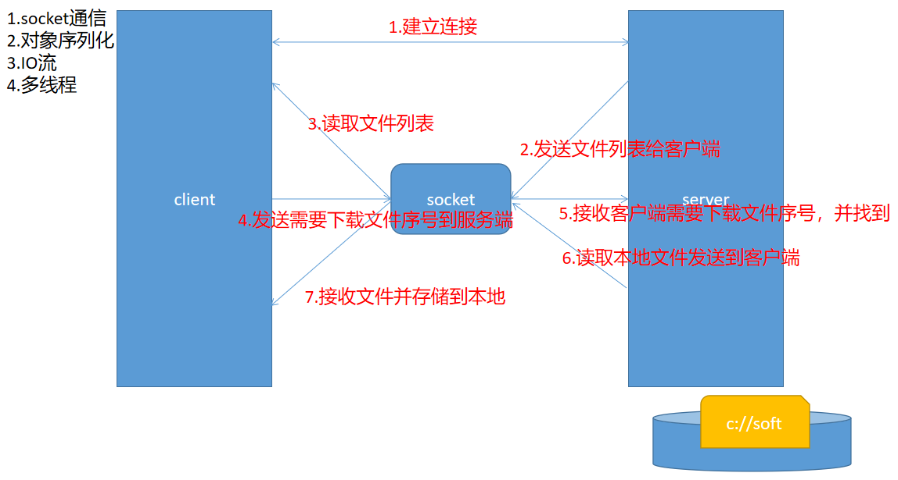
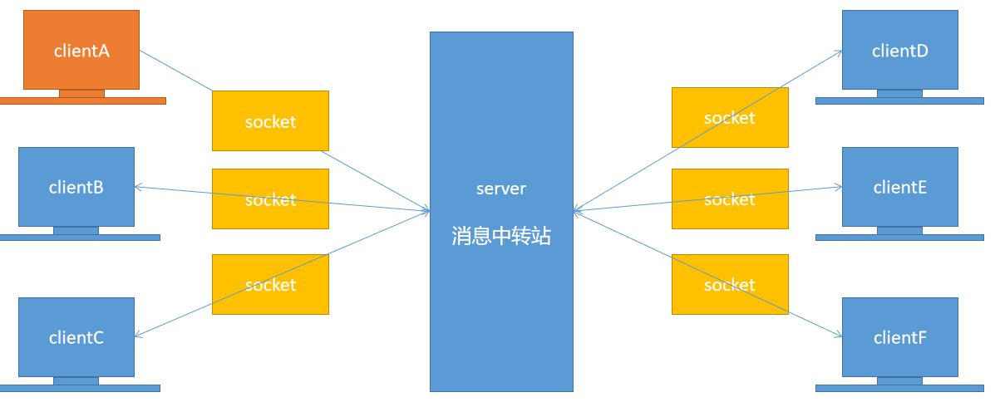
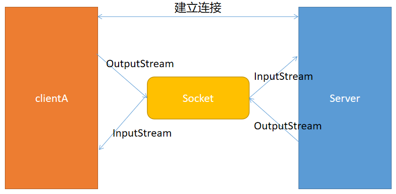
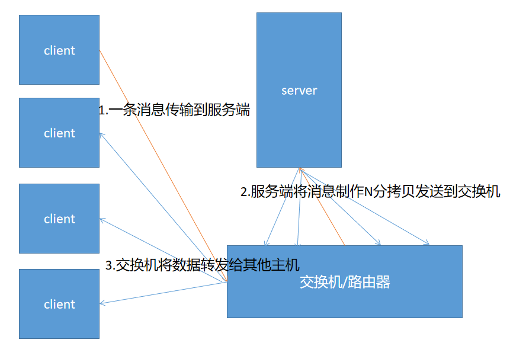
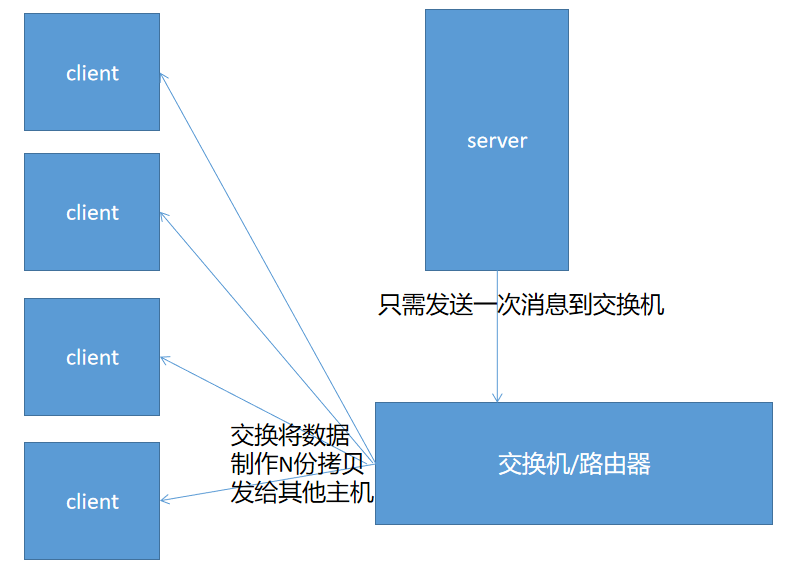
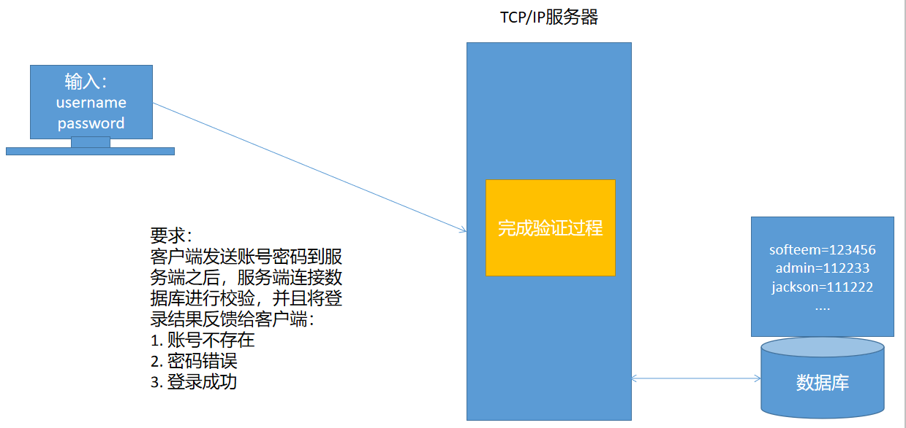

# 07 - 网络编程（二） :surfer:

[[TOC]]

## 基于 TCP 的 Socket 通信案例讲解

### 文件服务器实现



### 聊天室实现





## 基于 UDP 协议的 Socket 通信

### 概述

​ UDP(User Datagram Protocol)用户数据报协议，在这种协议之下，通信的双方之间不需要建立稳定可靠的连接，UDP 协议下没有服务端和客户端的概念，只存在发送方和接收方（发送方也可能是接收方：例如飞秋）；数据的传输模式是以**报文的形式发送（TCP 基于输入输出流）**；类似于快递包裹的投递，UDP 协议不保证数据发送的安全性，可能会出现数据报包丢失(丢包)，导致数据传输的卡顿，但是数据报包的偶尔丢失对于用户来说无关紧要；数据报包的到达也不一定是有序的，可能会出现后发先到；UDP 协议的使用场景十分常见：

例如:

- 视频会议
- 屏幕广播
- 常见的端游

> TCP：打电话（必须先接通，才能通话）
>
> UDP：发快递（无需建立稳定连接）

### DatagramSocket（UDP 网络通道）

DatagramSocket 用于构建一个无连接的网络通道，通过该对象可以实现消息的发送(send)和消息的接收(receive)。

**常见构造器：**

- DatagramSocket()
- DatagramSocket(int port)

常见方法：

- send(DatagramPacket dp)：发送数据报包
- receive(DatagramPacket dp)：接收数据存储到数据报包中

### DatagramPacket（数据报包）

DatagramPacket 用于表示数据报包，内部通过字节数组作为缓冲区存储或者接收数据.

**常见构造器：**

- DatagramPacket(byte[] buff,int len)
- DatagramPacket(byte[] buff,int offset ,int len,InetAddress addr,int port)

**常见方法：**

- getLength():获取数据报包裹中实际的字节长度

### UDP 通信实例

#### 发送方

```java
public class Sender {

    public static void main(String[] args) throws IOException {

        //创建基于UDP协议的网络通道
        DatagramSocket ds = new DatagramSocket();

        //准备需要发送的消息
        String msg = "天王盖地虎，小鸡炖蘑菇!!!";

        //基于需要发送的数据将数据打包成数据报包
        DatagramPacket dp = new DatagramPacket(
                msg.getBytes(),
                0,
                msg.getBytes().length,
                InetAddress.getByName("localhost"),
               	10000
        );

        //发送数据报包
        ds.send(dp);
    }
}
```

#### 接收方

```java
public class Receiver {

    public static void main(String[] args) throws IOException {

        //占据在指定端口创建网络通道
        DatagramSocket ds = new DatagramSocket(10000);

        //创建字节缓冲区
        byte[] buff = new byte[1024];
        //构建空数据报包用于接收发送方发送的数据
        DatagramPacket dp = new DatagramPacket(buff,buff.length);
        while(true){
            //接收数据
            ds.receive(dp);
            //将发送的文本信息转换为String
            String msg = new String(buff,0,dp.getLength());
            String ip = dp.getAddress().getHostAddress();
            System.out.println(ip+":"+msg);
        }
    }
}

```

### UDP 通信之与飞秋通信实例

飞秋的消息发送实现也是基于 UDP 协议的，如果我们熟悉飞秋消息的组织方式，即可通过编写 Java 程序向飞秋发送消息：

飞秋的消息发送协议如下:

```
版本号:消息识别号:发送人昵称:发送人主机地址:命令字:消息内容
```

> 其中：
>
> 版本号固定为`1`
>
> 消息识别号:保持唯一即可（一般使用系统时间）
>
> 发送昵称可以任意编写
>
> 发送主机地址可伪装，即任意编写
>
> 命令字：32 固定表示为消息发送
>
> 消息内容：实际需要发送到目标地址的消息内容
>
> 例如:
>
> ```
> 1:100:刘德华:liudehua:32:hello飞秋
> ```

```java
public class FeiQUtils {

    /**
     * 飞秋协议版本号，默认:1
     */
    private static final int VERSION_CODE = 1;
    /**
     * 发送人昵称
     */
    private static final String NICK_NAME = "SOFTEEM";
    /**
     * 发送人主机地址:可伪装
     */
    private static final String HOST_NAME = "localhost";
    /**
     * 命令字：32表示发送消息
     */
    private static final int COMM_CODE = 32;

    private DatagramSocket ds;
    private String ip;

    public FeiQUtils(String ip) throws SocketException {
        ds = new DatagramSocket();
        this.ip = ip;
    }

    public void sendMsg(String msg) throws IOException {
        //创建网络通道
        //准备数据
        String content = VERSION_CODE + ":" + System.currentTimeMillis() + ":" + NICK_NAME + ":" + HOST_NAME + ":" + COMM_CODE + ":" + msg;
        //将需要发送的数据打包成数据报包
        DatagramPacket dp = new DatagramPacket(
            content.getBytes("gbk"),
            0,
            content.getBytes("gbk").length,
            InetAddress.getByName(ip),
            2425
        );
        //发送消息
        ds.send(dp);
    }

    public static void main(String[] args) throws IOException {
        FeiQUtils utils = new FeiQUtils("192.168.6.255");
        utils.sendMsg("hello1");
        utils.sendMsg("hello2");
        utils.sendMsg("hello3");
        utils.sendMsg("hello4");
    }
}

```

### UDP 数据广播之 MulticastSocket

在传统的互联网架构之下，一台主机需要将消息发送的多台不同的主机时 中间是经过了交换机(路由器)，如果需要进行消息的群发，此时在 TCP 协议之下，发送方需要将消息制作 N 份拷贝发给交换机，然后交换机再将这些消息分发给局域网中其他主机，这样一来，大大增加网络负担。



因此，在 UDP 协议中，提供了组播功能（数据广播），使用 UDP 数据广播，只需要将消息发送一次到交换机，交换机会将消息制作 N 份拷贝，发送到位于该广播组内的所有其他主机。类似如下结构:



使用 UDP 数据广播时，需要提供一个数据广播地址，该地址为 IP 地址的 D 类地址,可选范围为:`224.0.0.0`~`239.255.255.255`之间，并且广播消息的发送方和接收方需要加入该广播地址：

#### 发送广播

```java
public class BoradcastSender {

    public static void main(String[] args) throws IOException {

        //准备组播地址
        InetAddress groupIP = InetAddress.getByName("225.6.7.8");

        //创建广播网络通道
        MulticastSocket ms = new MulticastSocket();
        //为网络通道绑定组播地址
        ms.joinGroup(groupIP);

        String msg = "今晚八点半，在村委会有大型歌舞表演，请各位村民端好小板凳准时观看！！！";
        DatagramPacket dp = new DatagramPacket(
            msg.getBytes(),
            0,
            msg.getBytes().length,
            groupIP,
            9999
        );
        //发送广播
        ms.send(dp);
        ms.close();
    }
}
```

#### 接收广播

```java
public class BordercastReceiver {

    public static void main(String[] args) throws IOException {
        //准备组播地址
        InetAddress groupIP = InetAddress.getByName("225.6.7.8");

        //创建广播网络通道
        MulticastSocket ms = new MulticastSocket(9999);
        //为网络通道绑定组播地址
        ms.joinGroup(groupIP);

        byte[] b = new byte[1024];
        //创建空数据报包
        DatagramPacket dp = new DatagramPacket(b,b.length);
        while(true){
            ms.receive(dp);
            String msg = new String(b,0,dp.getLength());
            System.out.println(dp.getAddress().getHostAddress()+"广播消息："+msg);
        }
    }
}
```

###

## 作业

1. 基于 UDP 协议实现一个聊天室

2. 基于 TCP/IP 协议完成一个远程登陆功能

   
