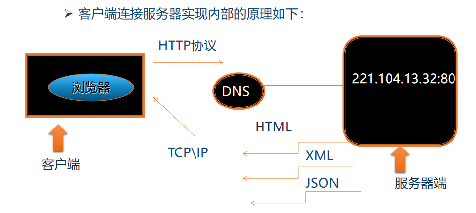
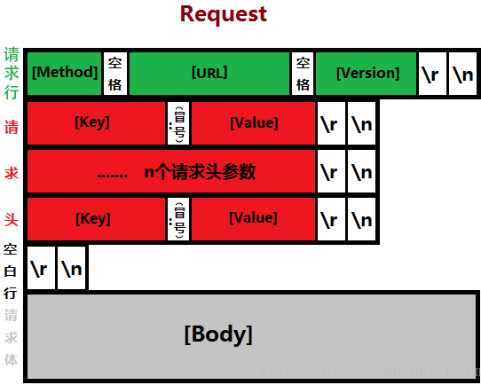
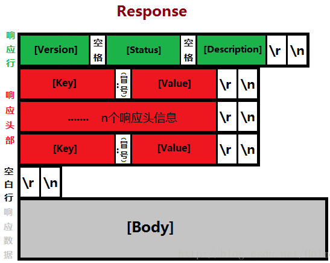

# 08 - 网络编程（三） :cherry_blossom:

[[toc]]

## 远程登录案例

## Http 协议

### 概述

在了解 HTTP 之前我们已经学习过了 HTML(**HyperText** Markup Language：超文本标记语言)；而实现 html 文件传输所使用到的一个**协议**即：Http。

协议：即双方（多方）之间事先约定好的规则

HTTP：**HyperText** Transfer Protocol（超文本传输协议），用于实现传统的 web 服务端和客户端之间的通信，是一种**无状态协议**,短连接协议；是用于从万维网（WWW:World Wide Web ）服务器传输超文本到本地浏览器的传送协议。HTTP 是一个基于 TCP/IP 通信协议来传递数据（HTML 文件, 图片文件, 查询结果等），是基于 TCP/IP 的应用层协议。

请求原理十分简单：

客户端基于 http 协议发送请求到服务端，服务端根据请求作出相应以 http 协议返回数据（html,xml,json,二进制流）


> 无状态:
>
> 每一次请求无关下一次请求；并且服务端不存储任何的请求状态

请求流程图如下：



### Http 协议解析(报文详解)

Http 协议通常由两大核心步骤组成：

1. Http 请求头
2. Http 响应头

#### Http 请求头

http 请求头的组成如下:



| 请求体                                          | 是否必选 |
| ----------------------------------------------- | -------- |
| GET/POST\[请求方法] [URL 路径] HTTP/[HTTP 版本] | 是       |
| Host: [URL 主机]                                | 是       |
| User-Agent: [请求类型唯一标识]                  | 否       |
| Accept: [设置服务器返回的数据类型]              | 否       |
| Accept-Language:[设置服务器返回的语言]          | 否       |
| Accept-Encoding: [设置服务器返回的压缩编码]     | 否       |
| Accept-Charset: [设置服务器返回的文字编码]      | 否       |
| \r\n[空行]                                      | 是       |
| 请求内容                                        | 否       |

> **请求行：**
>
> **Method**：请求方法（GET,POST,PUT,DELETE,OPTION,TRACE...）
>
> **URL**：请求的资源地址(相对路径)
>
> **Version：** http 协议的版本(默认 HTTP1.1)
>
> **请求头：**
>
> 请求头中包含一系列请求参数，这些参数均已键值对结构形式表示，代表请求的配置信息，例如:
>
> content-Type：text/html,text/json,\*/\*
>
> Cookie: scroll-cookie=0
>
> ....
>
> **空白行：**
>
> 在发送请求正文时必须保留空白行
>
> **请求体：**
>
> 请求体即需要发送的数据内容：例如: username=admin&password=123456
>
> **请求头数据参考：**
>
> ```
> GET /src/index.html?name=admin&pwd=123 HTTP/1.1
> Host: 192.168.6.254:8888
> Connection: keep-alive
> Upgrade-Insecure-Requests: 1
> User-Agent: Mozilla/5.0 (Windows NT 10.0; Win64; x64) AppleWebKit/537.36 (KHTML, like Gecko) Chrome/87.0.4280.141 Safari/537.36
> Accept: text/html,application/xhtml+xml,application/xml;q=0.9,image/avif,image/webp,image/apng,*/*;q=0.8,application/signed-exchange;v=b3;q=0.9
> Accept-Encoding: gzip, deflate
> Accept-Language: zh-CN,zh;q=0.9,zh-TW;q=0.8,en-US;q=0.7,en;q=0.6
>
> ```

##### Post 和 Get 区别

get 和 post 都是 HTTP 请求中比较常见的两种请求方式，之间区别也比较大：

**GET 请求：**

get 请求一般用于从服务端请求数据，并且也可以向服务端发送少量的数据，数据的提交方式，以字符串的形式在地址栏中拼接，由于地址栏的长度是有限制的，一般不允许超过 1024 字节，因此 GET 请求无法提交大量的数据到服务端,类似如下:

```
https://www.baidu.com/s?wd=http%E5%8D%8F%E8%AE%AE&rsv_spt=1&rsv_iqid=0xb52216bb00038bb7&issp=1&f=8&rsv_bp=1&rsv_idx=2&ie=utf-8&rqlang=cn&tn=baiduhome_pg&rsv_dl=tb&oq=http&rsv_btype=t&rsv_t=b3f47waQnUiwHbIWG1u43avGJAbUGGPDtNp1ZhVzANcxn%2FeAJwZpmjIzIsmMtQr6sgi3&rsv_enter=0&rsv_pq=c5be2ed80004ad83&rsv_sug3=13&rsv_sug2=0&inputT=721&rsv_sug4=1133
```

**POST 请求：**

post 请求一般用于向服务端提交大量数据，由于 Post 请求是将请求数据通过请求头封装，因此不在地址栏中显示数据信息，post 可以提交大量数据，例如文件上传

#### Http 响应头

响应头的结构如下：



| 回复体                                                  | 是否必须返回 |
| ------------------------------------------------------- | ------------ |
| HTTP/\[HTTP 版本] [HTTP 状态]                           | 是           |
| Date: [服务器时间]t't't't't't't't't't't't't't't't't't't | 否           |
| Server: [服务器类型]                                    | 否           |
| Content-Type: [返回的数据流内容类型]                    | 否           |
| Content-Length:[返回的数据流内容长度]                   | 否           |
| Content-Encoding:[返回的数据流压缩编码]                 | 否           |
| Accept-Charset: [设置服务器返回的文字编码]              | 否           |
| \r\n                                                    | 是           |
| 回复体内容                                              | 否           |

> **响应行：**
>
> - **Version：**Http 版本(HTTP1.1)
>
> - **http 状态：**http 响应状态码（200,404,500,501....）
>
> **响应头：**
>
> 对于客户端请求作出响应之后的响应配置信息都位于响应头中，例如:
>
> ```
> Content-Type:text/html;charset=utf-8
> Content-Length:1757
> Date：Mon, 18 Jan 2021 03:41:02 GMT
> ```
>
> **空白行：**
>
> 在正式响应数据到客户端时必须保留空白行
>
> **响应体：**
>
> 服务端响应回来的数据在这个位置，数据一般包含以下格式:
>
> - HTML
> - JSON
> - XML
> - 二进制流
> - ...

对于请求头和响应头最需关注的分别是请求头中请求方法(get，post，delete，put...)；响应头最需要关注的是响应状态码(200,404,500,501...)

### 模拟 Http 服务器

平时访问某些网站一般都会在浏览器地址栏中输入网络地址，例如:

```h
http://www.baidu.com/index.html
```

通过对以上地址的解析，实际上按如下方式访问也是可以的

```
http://14.215.177.39:80/index.html
```

从以上访问方式看出，只需要得到主机地址，端口号，以及请求的资源即可访问远程服务器；因此，基于 TCP/IP 协议（应用层 Http 协议）可以对以上访问流程进行模拟：

```java
public class MyWebServer extends Thread{

    private Socket s;

    public MyWebServer(Socket s) {
        this.s = s;
    }

    @Override
    public void run() {
        try {
            //获取http协议第一行报文（目标:获取请求资源）
            String line = Tools.readLine(s.getInputStream());
            System.out.println(line+"=====");
            //使用空格分隔解析第一行报文
            String[] str = line.split(" ");
            //获取请求的资源地址
            String path = str[1];
            System.out.println("请求的资源---->"+path);
            //获取客户端需要请求的资源URL地址
            URL url = MyWebServer.class.getResource(path);
            if(url != null){
                //根据地址创建对应的File对象
                File file = new File(url.toURI());
                //发送响应头信息：务必按照http协议格式编写，否则浏览器中无法正常显示内容
                Tools.responseMsg(s.getOutputStream(),"HTTP/1.1 200 ok");
                Tools.responseMsg(s.getOutputStream(),"Server: myserver/1.0");
                Tools.responseMsg(s.getOutputStream(),"Date: "+new Date());
                Tools.responseMsg(s.getOutputStream(),"Content-Length: "+file.length());
                Tools.responseMsg(s.getOutputStream(),"Content-Type: text/html");
                Tools.responseMsg(s.getOutputStream(),"");
                //将资源数据输出到socket中
                Tools.responseData(new FileInputStream(file),s.getOutputStream());
            }else{
                //404
                Tools.responseMsg(s.getOutputStream(),"HTTP/1.1 404 NotFound");
                Tools.responseMsg(s.getOutputStream(),"Server: myserver/1.0");
                Tools.responseMsg(s.getOutputStream(),"Date: "+new Date());
                Tools.responseMsg(s.getOutputStream(),"Content-Length=0");
                Tools.responseMsg(s.getOutputStream(),"Content-Type: text/html");
                Tools.responseMsg(s.getOutputStream(),"");
                Tools.responseMsg(s.getOutputStream(),"<h1>请求的资源不存在(404)</h1>");
            }
        } catch (IOException e) {
            e.printStackTrace();
        } catch (URISyntaxException e) {
            e.printStackTrace();
        }finally{
            try {
                s.close();
            } catch (IOException e) {
                e.printStackTrace();
            }
        }
    }

    public static void main(String[] args) throws IOException {

        ServerSocket server = new ServerSocket(8090);
        System.out.println("web服务已启动...");
        while(true){
            Socket s = server.accept();
            new MyWebServer(s).start();
        }
    }
}
```

## URL 类与 HttpURLConnection

### URL 类

#### 概述：

URL：统一资源定位器，通过 url 地址可以从互联网中找到对应的资源，可以认为 url 即从网络中搜索资源的指针；在 java.net 包中提供 URL 类用于操作 url 资源信息。

URL 的格式如下：

```
jdbc:mysql://localhost:3306/test
http://www.softeem.top/index.html?username=softeem&pwd=123
ftp://20.149.67.88
```

#### URL 构成

一个完整的 URL 通常由一下几个部分构成：

- 协议部分（例如: `http://`,`https://`）
- 主机地址（例如:`localhost`,`www.softeem.top`,`20.149.67.88`）
- 端口号（例如: `80`,`3306`,`1521`,`1433`,`8080`）
- 请求资源（例如：`/test`,`/index.html`,`/main/test/a.txt`）
- 查询地址（例如:`?username=softeem&pwd=123`)
- 哈希地址（锚链接：`#links`）

```java
URL url = new URL("http://www.softeem.top:8080/myxj/food?method=list");

System.out.println("协议："+url.getProtocol());
System.out.println("主机地址："+url.getHost());
System.out.println("端口："+url.getPort());
System.out.println("资源："+url.getPath());
System.out.println("查询地址："+url.getQuery());


```

运行结果:

```
协议：http
主机地址：www.softeem.top
端口：8080
资源：/myxj/food
查询地址：method=list
```

### HttpURLConnection 类

#### 概述

HttpURLConnection 是来自 java.net 包中 URLConnection 的一个子类，该类可以发送 HTTP 请求，并获取远程服务端响应的数据，具体使用方式如下：

```java
URL url = new URL("http://www.softeem.top:8080/myxj/food?method=list");
//打开一个url连接获取HttpURLConnection对象
HttpURLConnection conn = (HttpURLConnection)url.openConnection();
//设置请求方式
conn.setRequestMethod("GET");
//设置读取超时时间
conn.setReadTimeout(3000);

//获取响应状态码
int code = conn.getResponseCode();
System.out.println("响应状态码:"+code);

//判断是否响应成功
if(code == HttpURLConnection.HTTP_OK){
    //从连接中获取输入流
    InputStream in = conn.getInputStream();
    InputStreamReader isr = new InputStreamReader(in);
    BufferedReader br = new BufferedReader(isr);
    String line = br.readLine();
    System.out.println(line);

    br.close();
}
```

运行结果:

```json
{
  "code": 1,
  "data": [
    {
      "category": { "cid": 2, "cname": "米饭", "foods": [] },
      "cid": 2,
      "fid": 5,
      "fname": "精品蛋包饭",
      "img": "foodImg/2/3.jpg",
      "intro": "萌萌的小熊蛋包饭，小盆友大盆友都喜欢！\r\n鸡蛋一定要选用上好的土鸡蛋，才会有这么明快亮丽的色彩噢。",
      "price": 12.0,
      "salecount": 987,
      "wid": 5,
      "windos": { "intro": "嘉慧员2楼中间", "wid": 5, "wname": "大观园1楼" }
    },
    {
      "category": { "cid": 4, "cname": "粤菜", "foods": [] },
      "cid": 4,
      "fid": 11,
      "fname": "腊肠焖饭",
      "img": "foodImg/4/1.jpg",
      "intro": "做焖饭的秘诀就是除了米饭要焖煮到位之外，最最关键的菜的味道要入米饭中去。这次在焖米时我加了家乐的鸡粉，在吃的过程中发现味道确实很鲜美。",
      "price": 16.0,
      "salecount": 789,
      "wid": 1,
      "windos": { "intro": "嘉慧员一楼靠里边", "wid": 1, "wname": "嘉慧员一楼" }
    },
    {
      "category": { "cid": 4, "cname": "粤菜", "foods": [] },
      "cid": 4,
      "fid": 12,
      "fname": "带皮叉烧肉",
      "img": "foodImg/4/2.jpg",
      "intro": "叉烧肉是广东省传统的汉族名菜，属于粤菜系，是广东烧味的一种。叉烧肉多呈红色，用猪瘦肉或半肥瘦肉做成，口味偏甜。叉烧肉是把腌渍后的瘦猪肉挂在特制的叉子上，放入炉内烧烤而成。做出来的叉烧应该肉质软嫩多汁、色泽鲜明、香味四溢，当中又以肥、瘦肉均衡为上佳。",
      "price": 18.0,
      "salecount": 203,
      "wid": 1,
      "windos": { "intro": "嘉慧员一楼靠里边", "wid": 1, "wname": "嘉慧员一楼" }
    },
    {
      "category": { "cid": 2, "cname": "米饭", "foods": [] },
      "cid": 2,
      "fid": 3,
      "fname": "什锦炒饭",
      "img": "foodImg/2/1.jpg",
      "intro": "葱末8克，午餐肉80克切丁、黄瓜50克切丁，\r\n鸡蛋1个，打散，食用油5ML，倒入蛋液，小火炒熟",
      "price": 9.0,
      "salecount": 200,
      "wid": 3,
      "windos": { "intro": "风华园二楼靠里边", "wid": 3, "wname": "风华园二楼" }
    },
    {
      "category": { "cid": 2, "cname": "米饭", "foods": [] },
      "cid": 2,
      "fid": 6,
      "fname": "菠萝炒饭",
      "img": "foodImg/2/4.jpg",
      "intro": "可香甜软糯的菠萝饭，吃惯了普通的米饭，快来试试它吧～",
      "price": 13.0,
      "salecount": 176,
      "wid": 1,
      "windos": { "intro": "嘉慧员一楼靠里边", "wid": 1, "wname": "嘉慧员一楼" }
    },
    {
      "category": { "cid": 6, "cname": "西餐", "foods": [] },
      "cid": 6,
      "fid": 16,
      "fname": "经典榴莲披萨",
      "img": "foodImg/6/1.jpg",
      "intro": "天的披萨不是烤肉披萨，而是一种水果披萨，这也是我第一次尝试水果披萨，没想到味道这么好，水果的香甜烤出来更甜了，很清爽，不油腻，这颜色金黄的是不是也很漂亮呢？",
      "price": 38.0,
      "salecount": 100,
      "wid": 2,
      "windos": { "intro": "风华园一楼", "wid": 2, "wname": "风华园一楼" }
    },
    {
      "category": { "cid": 3, "cname": "湘菜", "foods": [] },
      "cid": 3,
      "fid": 8,
      "fname": "秘制油焖大虾",
      "img": "foodImg/3/1.jpeg",
      "intro": "麻辣小龙虾，简称麻小，湖南特色小吃，又叫口味虾、长沙口味虾、香辣小龙虾、十三香小龙虾等。以小龙虾制成，口感麻辣鲜香。",
      "price": 35.0,
      "salecount": 76,
      "wid": 1,
      "windos": { "intro": "嘉慧员一楼靠里边", "wid": 1, "wname": "嘉慧员一楼" }
    },
    {
      "category": { "cid": 2, "cname": "米饭", "foods": [] },
      "cid": 2,
      "fid": 4,
      "fname": "海鲜炒饭",
      "img": "foodImg/2/2.jpg",
      "intro": "虾营养丰富，含蛋白质是鱼、蛋、奶的几倍到几十倍；还含有丰富的钾、碘、镁、磷等矿物质及维生素A、氨茶碱等成分，且其肉质松软，易消化，对身体虚弱以及病后需要调养的人是极好的食物。",
      "price": 15.0,
      "salecount": 58,
      "wid": 3,
      "windos": { "intro": "风华园二楼靠里边", "wid": 3, "wname": "风华园二楼" }
    },
    {
      "category": { "cid": 6, "cname": "西餐", "foods": [] },
      "cid": 6,
      "fid": 17,
      "fname": "披萨套餐",
      "img": "foodImg/6/2.jpg",
      "intro": "做披萨，首先要准备一块披萨饼底。由于时间关系，我们可以提前将饼底做好，冷冻保存，随用随取。本配方份量是6寸披萨2个或8、9寸披萨皮1个",
      "price": 45.0,
      "salecount": 55,
      "wid": 2,
      "windos": { "intro": "风华园一楼", "wid": 2, "wname": "风华园一楼" }
    },
    {
      "category": { "cid": 8, "cname": "甜品", "foods": [] },
      "cid": 8,
      "fid": 19,
      "fname": "冰粉",
      "img": "foodImg/8/1.jpg",
      "intro": "冰粉，有些地方又叫凉粉。据说起源于云、贵地区，后传入四川，是一道著名的夏季小吃。其冰凉香甜、嫩滑爽口、生津解暑、清凉降火，倍受大家喜欢。",
      "price": 8.0,
      "salecount": 25,
      "wid": 4,
      "windos": { "intro": "嘉慧员2楼中间", "wid": 4, "wname": "嘉慧员2楼" }
    },
    {
      "category": { "cid": 3, "cname": "湘菜", "foods": [] },
      "cid": 3,
      "fid": 10,
      "fname": "干锅牛蛙",
      "img": "foodImg/3/2.jpg",
      "intro": "牛蛙肉质鲜嫩，一直喜欢吃牛蛙，就是店里的太油太贵，一盘牛蛙，翻来翻去没几块牛蛙肉，自己做的肉多吃得也放心",
      "price": 20.0,
      "salecount": 22,
      "wid": 1,
      "windos": { "intro": "嘉慧员一楼靠里边", "wid": 1, "wname": "嘉慧员一楼" }
    },
    {
      "category": { "cid": 5, "cname": "川菜", "foods": [] },
      "cid": 5,
      "fid": 14,
      "fname": "松鼠鱼",
      "img": "foodImg/5/2.jpg",
      "intro": "松鼠鱼的造型漂亮别致，外酥里嫩，酸甜可口，老幼皆宜，而且松鼠鱼上浇的糖醋汁，颜色红亮，又代表着我们的生活红红火火。",
      "price": 25.0,
      "salecount": 22,
      "wid": 3,
      "windos": { "intro": "风华园二楼靠里边", "wid": 3, "wname": "风华园二楼" }
    },
    {
      "category": { "cid": 9, "cname": "清真", "foods": [] },
      "cid": 9,
      "fid": 21,
      "fname": "清真羊肉汤",
      "img": "foodImg/9/1.jpg",
      "intro": "冬季很多人开始吃羊肉。\r\n以前我基本不吃羊肉的，今年我们家隔壁开了一家羊肉馆。每天都现杀羊，所以羊肉很新鲜，生意火爆。\r\n我去吃了好几次，发现羊肉汤真的很喝\r\n经过学习后，我也会做羊肉汤了。\r\n清淡的，很好喝。",
      "price": 12.0,
      "salecount": 22,
      "wid": 6,
      "windos": { "intro": "嘉慧员2楼中间", "wid": 6, "wname": "大观园2楼" }
    },
    {
      "category": { "cid": 12, "cname": "徽菜", "foods": [] },
      "cid": 12,
      "fid": 24,
      "fname": "全家福火锅",
      "img": "foodImg/10/1.jpg",
      "intro": "辣辣辣辣辣辣辣辣辣辣辣辣辣辣辣辣辣辣辣辣",
      "price": 120.0,
      "salecount": 20,
      "wid": 3,
      "windos": { "intro": "风华园二楼靠里边", "wid": 3, "wname": "风华园二楼" }
    },
    {
      "category": { "cid": 7, "cname": "粥类", "foods": [] },
      "cid": 7,
      "fid": 18,
      "fname": "皮蛋廋肉粥",
      "img": "foodImg/7/1.jpg",
      "intro": "皮蛋瘦肉粥是一道经典的粥，周围没有喝过此粥的人，寥寥无几。也许有人接受不了皮蛋的味道，但是先别忙着拒绝，一旦把它切碎，放进米粥中与肉丁同熬，就会产生意想不到的效果。米粥浓稠丝滑，因为肉丁和皮蛋的加入，而变得有滋有味，醇香馥郁。再搭配一两样家常的小咸菜，就是一顿丰盛、完美的早餐了。",
      "price": 15.0,
      "salecount": 15,
      "wid": 5,
      "windos": { "intro": "嘉慧员2楼中间", "wid": 5, "wname": "大观园1楼" }
    },
    {
      "category": { "cid": 1, "cname": "面食", "foods": [] },
      "cid": 1,
      "fid": 2,
      "fname": "腊肉炒豆丝",
      "img": "foodImg/1/2.jpg",
      "intro": "豆丝是以绿豆、大米等为原料，磨碎成浆，在锅里摊成皮，切成丝，湖北人很爱吃，有汤豆丝、干豆丝、炒豆丝等多种吃法。豆丝是武汉市黄陂区的三大传统小吃之一，也是长江中下游区域的农家传统食品，主要分布在湖北东南部、安徽西南部及江西。豆丝是用大米、绿豆等按一定比例打浆摊成饼此时为湿豆丝，一般吃饭是直接抹上酱料或自行包菜吃，当然为了便于保存可切丝晾干。今天炒的就是湿豆丝，融入蒜苗和腊肉的时令菜香，是不可多得的地道小吃",
      "price": 12.0,
      "salecount": 10,
      "wid": 2,
      "windos": { "intro": "风华园一楼", "wid": 2, "wname": "风华园一楼" }
    },
    {
      "category": { "cid": 5, "cname": "川菜", "foods": [] },
      "cid": 5,
      "fid": 15,
      "fname": "酸菜鱼",
      "img": "foodImg/5/3.jpg",
      "intro": "实在话已记不起色拉油是哪年兴起的，但能记住的就是：家中至此就彻底告别那些传统味道重重的散装食用油，如豆油、菜籽油等等；偶尔去农村亲戚家会吃到一些菜籽油炒的菜，那种特殊的油香很能勾起儿时味蕾和记忆；这不咱今天的这道酸菜鱼也是用菜籽油做的，确实比普通色拉油做的香很多很多呢~~~",
      "price": 30.0,
      "salecount": 10,
      "wid": 2,
      "windos": { "intro": "风华园一楼", "wid": 2, "wname": "风华园一楼" }
    },
    {
      "category": { "cid": 9, "cname": "清真", "foods": [] },
      "cid": 9,
      "fid": 23,
      "fname": "清真萝卜闷羊肉",
      "img": "foodImg/9/3.jpg",
      "intro": "入秋第一件事就是进补，秋冬进补要数萝卜羊肉最滋补了，萝卜炖羊肉有荤有素还有汤，是一道非常营养美味的汤。",
      "price": 35.0,
      "salecount": 10,
      "wid": 6,
      "windos": { "intro": "嘉慧员2楼中间", "wid": 6, "wname": "大观园2楼" }
    },
    {
      "category": { "cid": 9, "cname": "清真", "foods": [] },
      "cid": 9,
      "fid": 22,
      "fname": "土鸡闷花卷",
      "img": "foodImg/9/2.jpg",
      "intro": "新疆大盘鸡分两个类型：一个是沙湾的土豆青椒炖土鸡配皮带面，最近新疆流行的小土鸡焖花卷有点改良的意思，很多内地的朋友可能还没有听过。 ",
      "price": 28.0,
      "salecount": 9,
      "wid": 6,
      "windos": { "intro": "嘉慧员2楼中间", "wid": 6, "wname": "大观园2楼" }
    },
    {
      "category": { "cid": 8, "cname": "甜品", "foods": [] },
      "cid": 8,
      "fid": 20,
      "fname": "天鹅蛋糕",
      "img": "foodImg/8/2.jpg",
      "intro": "夏季天气炎热，就算在空调房里裱花也很容易化，所以不如做慕斯蛋糕，免去怕奶油融化的烦恼。榴莲是一种极端的水果，喜欢的人想起它就禁不住口水四溢，吃完恨不得把盘子也舔舔，不喜欢的人老远闻到就捏鼻子，闻味丧胆。",
      "price": 35.0,
      "salecount": 6,
      "wid": 2,
      "windos": { "intro": "风华园一楼", "wid": 2, "wname": "风华园一楼" }
    },
    { "category": { "cid": 1, "cname": "面食", "foods": [] }, "cid": 1, "fid": 1, "fname": "招牌蟹脚面", "img": "foodImg/1/1.jpg", "intro": "味道好极啦", "price": 18.0, "salecount": 5, "wid": 4, "windos": { "intro": "嘉慧员2楼中间", "wid": 4, "wname": "嘉慧员2楼" } },
    {
      "category": { "cid": 5, "cname": "川菜", "foods": [] },
      "cid": 5,
      "fid": 13,
      "fname": "红烧肉",
      "img": "foodImg/5/1.jpg",
      "intro": "红烧肉以其香甜松软的口感而得到大多数人的喜欢，相信是每家的餐桌上都会有这样一道菜，而且每家的味道也不尽相同，虽没有统一标准，但一份好的红烧肉是能够让大家喜欢，肥而不腻入口即化，瘦肉不柴入口化渣，这样的红烧肉想必不会有人不喜欢。",
      "price": 22.0,
      "salecount": 5,
      "wid": 5,
      "windos": { "intro": "嘉慧员2楼中间", "wid": 5, "wname": "大观园1楼" }
    }
  ],
  "msg": "共22条记录"
}
```

## 练习

1. 根据提供的机器人接口，要求实现一个聊天机器人项目（最好提供 UI）
