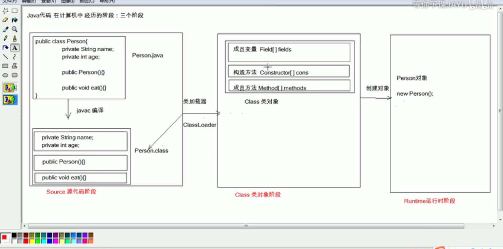
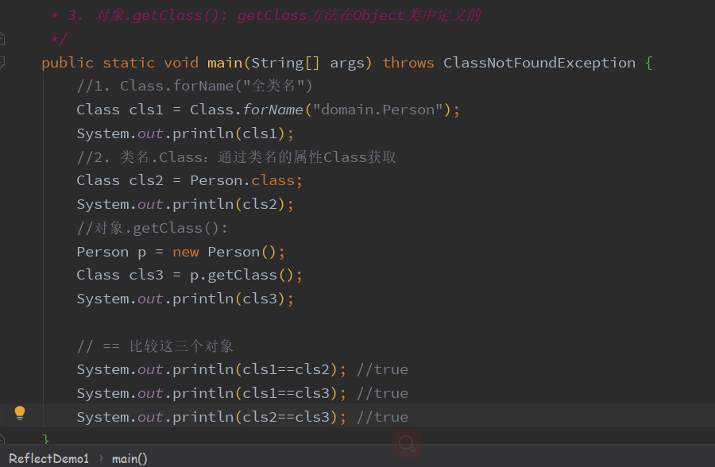
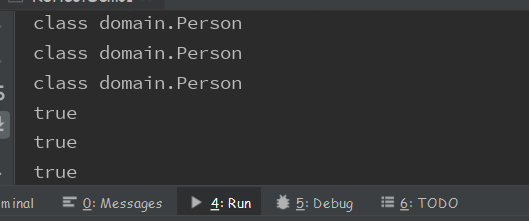
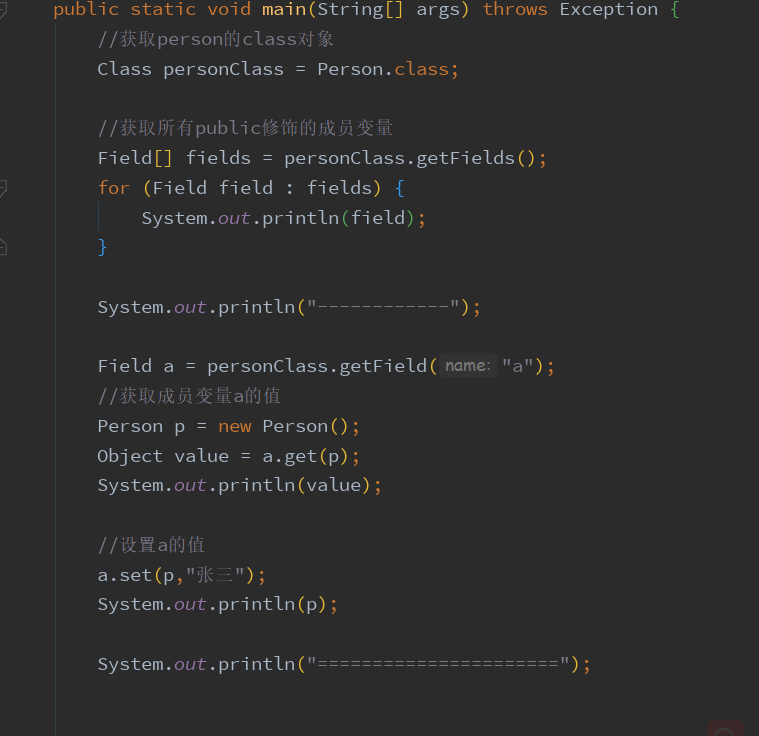
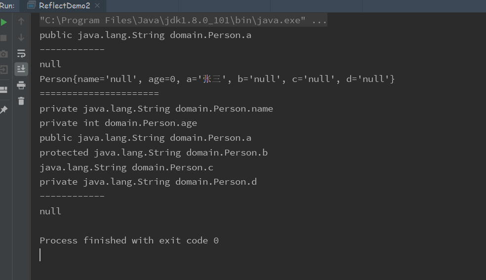

# 09 - 反射：框架的设计灵魂 :star:

[[toc]]

- 框架：半成品软件。可以在框架的基础上进行软件开发，简化编码

- 反射：将类的各个组成部分封装为其他对象，这就是反射机制

- 好处

  1. 可以在程序运行过程中，操作这些对象
  2. 可以解耦，提高程序的可扩展性

- 获取 class 对象的方式

  1. Class.forName("全类名")：将字节码文件加载进内存，返回 class 对象

     （多数用于配置文件，将类名定义在配置文件中。读取文件，加载类）

  2. 类名.Class：通过类名的属性 Class 获取

     （多用于参数的传递）

  3. 对象.getClass(): getClass 方法在 Object 类中定义的

     （多用于对象的获取字节码的方式）







结论： 通过同一个字节码文件（.Class）在一次程序运行过程中，只会被加载一次，无论通过那一种方式获取的 class 对象都是同一个

## Class 对象功能

**获取功能**

1. 获取成员变量们

   ```java
   Field[]	getFields()						//获取所有以public修饰的成员变量
   Field	getField(String name)			 //获取单个以public修饰的成员变量

   Field[]	getDeclaredFields()				 //获取所有修饰的成员变量
   Field	getDeclaredField(String name)	  //获取所有修饰的成员变量
   ```

   

   

2. 获取构造方法们 construction [ ]

   ```java
   Constructor<?>[]	getConstructors()
   Constructor<T>	getConstructor(class<?>... parameterTypes)

   Constructor<?>[]	getDeclaredConstructors()
   Constructor<T>	getDeclaredConstructor(class<?>... parameterTypes)
   ```

3. 获取成员方法们 method [ ]

   ```java
   Method[]	getMethods()										//获取所有以public修饰的方法
   Method	getMethod(String name, class<?>... parameterTypes)		   //获取单个以public修饰的方法

   Method[]	getDeclaredMethods()								 //获取所有方法
   Method	getDeclaredMethod(String name, class<?>... parameterTypes)	//获取单个方法

   ```

4. 获取类名

   ```java
   String	getName() 	//获取类名
   ```

#### Field：成员变量

操作：

1. 设置值

   ```java
   Object	get(Object obj)
   ```

2. 获取值

   ```java
   void	set(Object obj, Object value)
   ```

3. 忽略访问修饰符的安全检查

   ```java
   setAccessible(true);  //暴力反射
   ```

#### Construction:构造方法

创建对象

```java
T	newInstance(Object... initargs)
```

`如果使用空参数构造方法创建对象，控制可以简化：class对象的newInstance`

#### Method：方法

执行方法：

```java
Object invoke (Object obj ，Object...args)
```

获取方法名称

```java
String getName()
```
