# 01 - JavaWeb 入门 :fountain:

[[TOC]]

## Web 应用程序

### 什么是 Web 程序

​ 基于浏览器+服务端模式运行的应用程序（即 BS 结构）；客户端只需要存在浏览器，或者支持浏览器的设备，即可在任意地点，任意的时间，由任何人访问服务端，软件的更新升级只需要更新服务端即可；主流的 web 应用程序：淘宝，12306，京东，csdn...

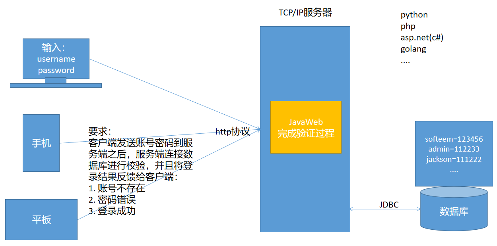

### JavaWeb 概述

​ 以 Java 语言为基础，在 web 服务器中创建的能够进行数据库访问，处理前端（终端）提交的数据能力的应用程序称之为 Javaweb 程序。

**javaweb 学习的前置知识：**

- java 基础语法
- 面向对象
- 数据库与数据库编程
- web 前端
- java 高级（IO，线程，网络）

### JavaWeb 开发环境介绍

javaweb 应用是一项综合性较强的技术体系，程序的运行需要一系列相关软件的支持，javaweb 开发必备环境:

- 安装 JDK（jdk8）
- Eclipse(jee)/Idea(旗舰版)
- mysql 数据库
- **web 容器(web 服务器)**

## Web 服务器之 Tomcat

### Http 服务器和 Web 服务器

#### Http 服务器（静态资源）

http 服务器一般只提供静态资源访问能力（例如 CDN），不提供对于程序的解析，转换等处理能力，典型的 http 服务器：

- Nginx
- Apache

> **lamp**=linux+apache+mysql+php

#### Web 服务器（动态资源）

Web 容器也称之为 web 服务器，提供了对于 web 应用程序(JavaWeb)的运行环境，内部能够对一些特殊的网页模板(JSP)进行解析，编译等等操作;即提供了动态资源的访问能力，典型的 Web 服务器:

- **Apache Tomcat**
- JBOSS
- **WebLogic**
- Jetty

### Tomcat 概述

​ Apache Tomcat 是阿帕奇软件基金会（开源组织）下的一个子项目，由 java 编写(所以必须要有 Java 环境)，提供了 javaweb 应用程序访问的能力，内部提供了对于 Servlet,JSP，WebSocket 的支持，Tomcat 是一个**开源免费**的 web 容器。

### 下载与安装(配置)

- 下载地址（tomcat9）

  https://tomcat.apache.org/download-90.cgi

  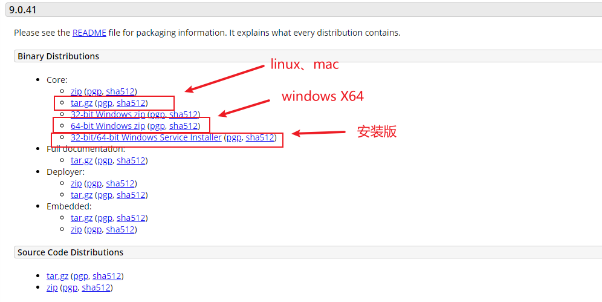

- 解压缩之后：

### Tomcat 目录结构

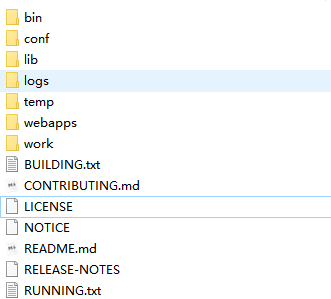

- **bin**：tomcat 的启动、关闭文件和必须的依赖
- **conf**：tomcat 的相关配置文件存储
  - 配置登录账户
  - 端口号(server.xml)
  - 虚拟路径(server.xml)
- **lib**：web 程序运行的依赖（jar 包）
  - jsp-api
  - servlet-api
  - websocket-api
- **logs**：存储 tomcat 运行日志
- **temp**：临时文件存储目录
- **webapps**：web 项目的主发布目录
- **work**：tomcat 服务器工作目录，对于 jsp 文件编译之后产生的 java 文件和字节码文件存储目录

### 启动与停止

- 安装配置 Java 运行环境

  因为 Tomcat 是基于 Java 开发的，因此 Tomcat 的运行离不开 java 的环境，必须要在 tomcat 的运行主机中安装 Java 运行环境(JRE)，并且需要配置`JAVA_HOME`

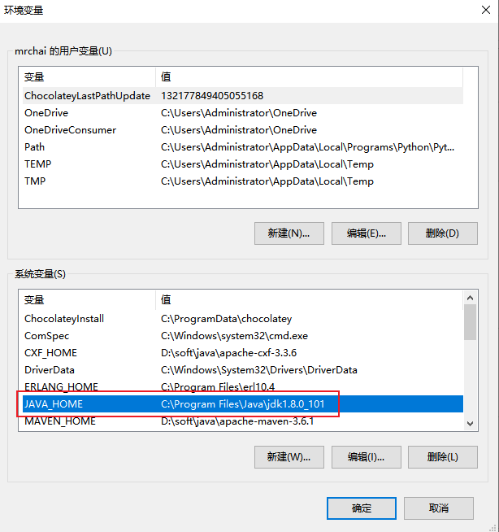

- 启动 Tomcat

  tomcat 的启动非常简单，只需要找到 tomcat 所在目录的 bin 目录，双击启动`startup.bat`文件即可

### 项目部署

将项目部署到 Tomcat 服务器只需要将项目的归档文件(war 文件)或者直接将项目的目录复制到`webapps`下即可启动并访问，例如:

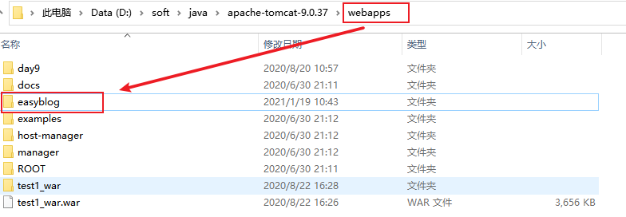

以上向 webapps 目录下存储了一个静态 web 项目，**首页是**`index.html`

然后只需要在浏览器的地址栏中输入：`http://localhost:8080/easyblog` 即可打开首页：


### 虚拟访问路径配置

通常可以将项目直接部署到 webapps 目录下提供远程访问的可能性，同时也可以使用其他方式实现远程访问的能力，例如配置**虚拟路径**

虚拟路径配置：即将本地的指定资源(文件，网页，视频，图片等)通过服务器内部转发的形式对外界提供访问

1. 找到 tomcat 服务器的 conf 目录

2. 打开`server.xml`文件

3. 在`<Host>`标签结束之前配置如下信息

   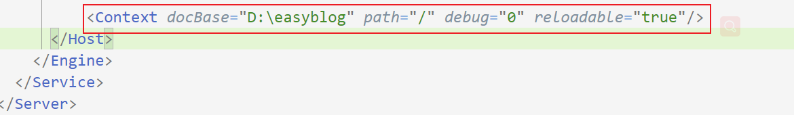

   > `<Context />` 表示配置一个虚拟的访问路径
   >
   > docBase：设置对外提供访问的资源目录所在的绝对路径(到磁盘根的路径)
   >
   > path：虚拟的访问路径，路径名可以任意编写，如果配置为"/"则为根目录
   >
   > debug：调试级别，从 0~9,级别越高，输出信息越详细，缺省 0
   >
   > 注意事项:
   >
   > docBase 指向的目录路径必须是存在的目录，否则启动报错
   >
   > path 路径不允许重复，否则报错

4. 配置完成，重启服务器，此时访问`easyblog`资源这只需要在浏览器的地址栏中输入:`http://localhost:8080`即可访问该项目

### 端口号修改

tomcat 服务器的端口默认为`8080`，但是可能会由于计算机中安装一些应用占据该端口，会导致 tomcat 服务器无法绑定该端口;因此，我们需要了解如何修改 tomcat 的端口号

- 修改 tomcat 的端口号需要找到`conf/server.xml`文件

  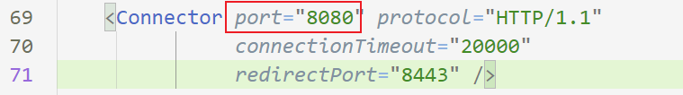

- 修改端口号为：80

  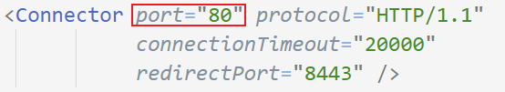

- 重启 tomcat

- 访问项目时无需再添加端口号(Http 协议默认端口是 80)

  ```
  http://localhost
  ```

> 查看计算机中所有应用程序的端口占用情况:
>
> `cmd`->`netstat -ano`
>
> 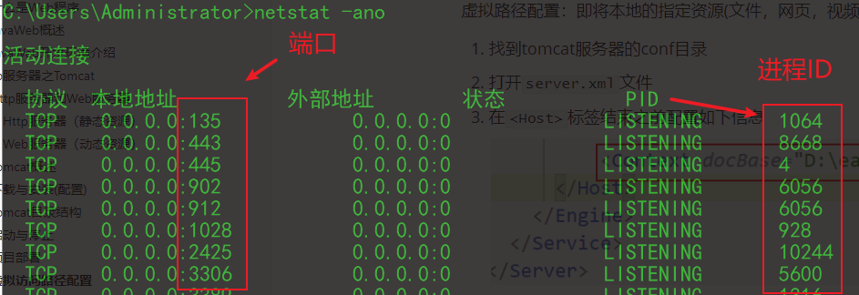

### 将 tomcat 服务打入系统服务中（用于生产环境）

每一次需要启动 tomcat 服务器都必须找到 bin 目录，然后手动启动`startup.bat`；这样十分麻烦，而且对于普通用户来说操作难度较大，因此，可以将 tomcat 服务打入系统服务中，并且可以设置为开机自动启动。

#### 安装为系统服务

- 找到 tomcat 的 bin 目录

- 以管理员身份在 bin 目录中打开 cmd（或者 shift+鼠标右键->在此处打开 PowerShell）

  cmd:

  ```bash
  service.bat install tomcat9.0.37
  ```

  PowerShell（linux）:

  ```powershell
  ./service.bat install tomcat9.0.37
  ```

  > 将服务安装到系统服务中，服务名为:tomcat9（可缺省）

- 效果

  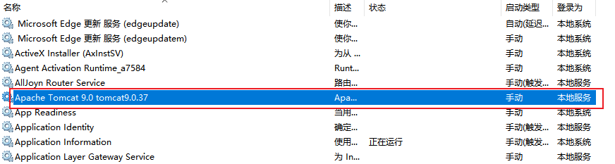

- 可以右键属性，设置开机自动启动等操作

#### 卸载服务

- 进入到 tomcat 的 bin 目录

- 以相同的方式打开 cmd 或者 powershell

- 输入指令：

  cmd:

  ```bash
  service.bat uninstall tomcat9.0.37
  ```

  powershell:

  ```powershell
  ./service.bat uninstall tomcat9.0.37
  ```

### 在 IDE 中集成 Tomcat

由于我们在开发环境下经常涉及到代码的更改以及调试，不可能每做一点修改都需要将项目拷贝到 tomcat 的 webapps 目录下重启服务器，这样太过于繁琐，因此，对于 tomcat 的使用可以集成到开发工具中，下面提供两个环境的集成方式，分为 Idea 和 Eclipse 中集成：

#### 基于 Idea 工具集成

1. 配置运行方式

   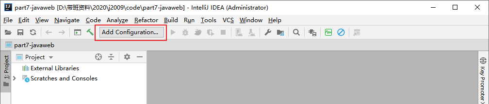

2. 添加 tomcat 服务器

   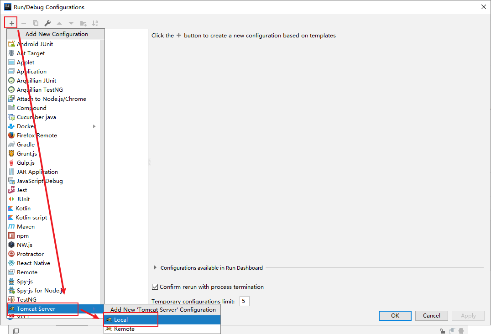

3. 配置服务器基本信息

   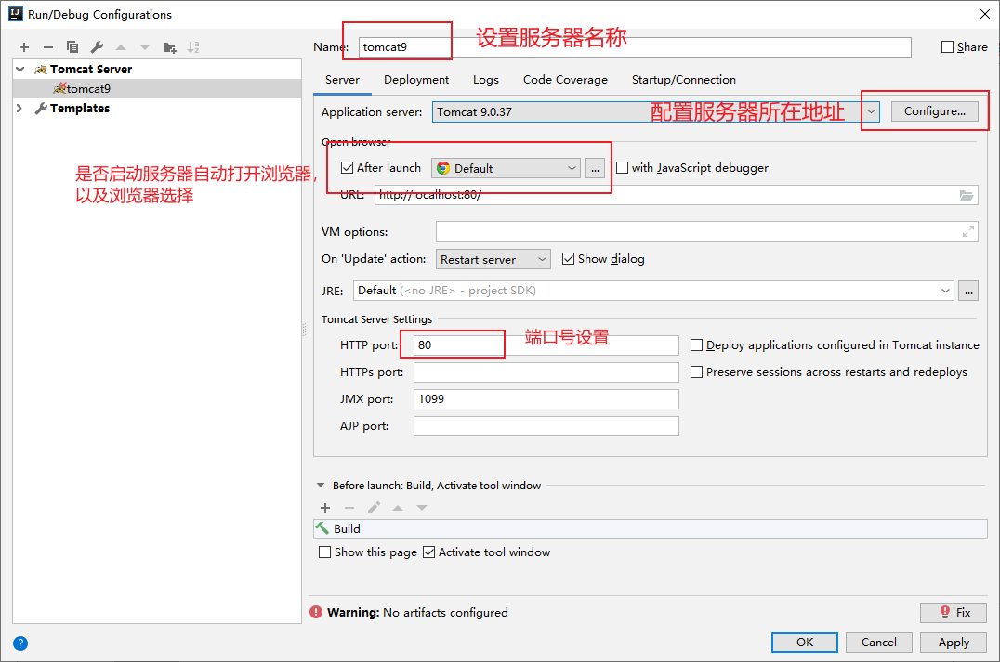

   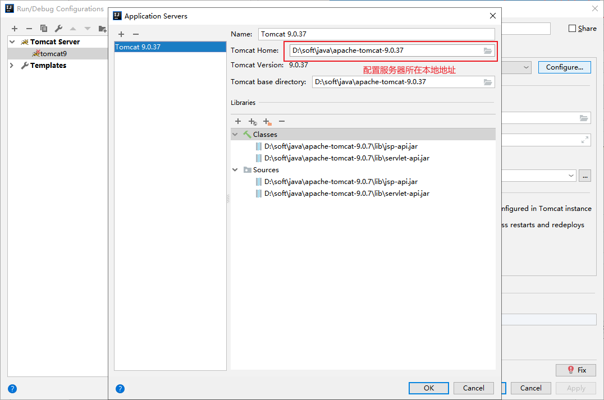

#### 基于 Eclipse 集成

1. 打开服务器配置视图

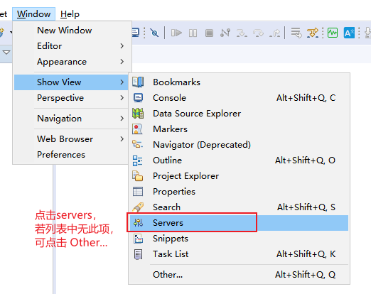

2. 配置服务器

   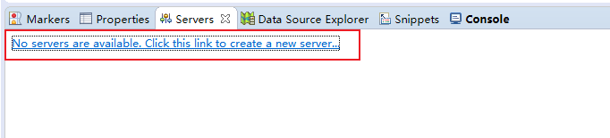

   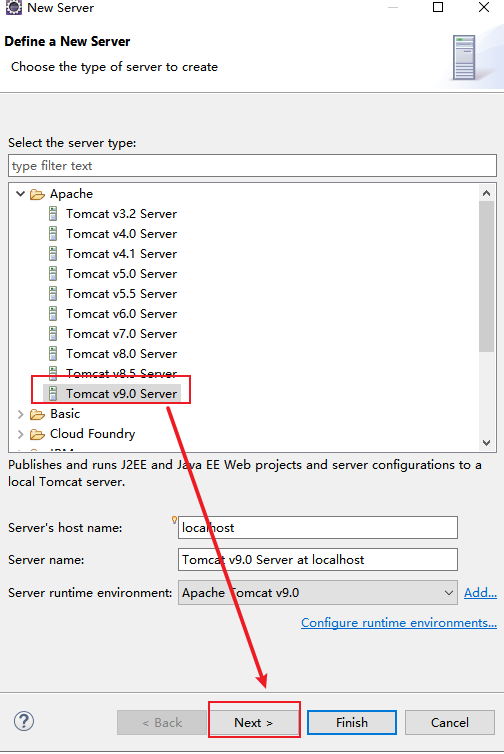

   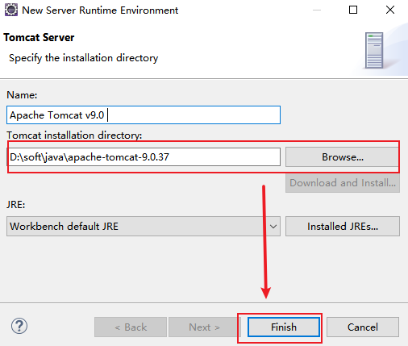

### 第一个 JavaWeb 项目

#### Idea 中 Web 项目创建

1. 创建 project/module

   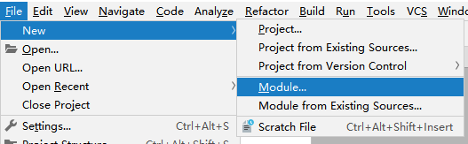

   > 实际开发环境下，一个项目即一个 Project，应选择创建 Project；教学环境下默认为一个 project 为工作空间，将 Module 作为项目看待

2. 设置 web application

   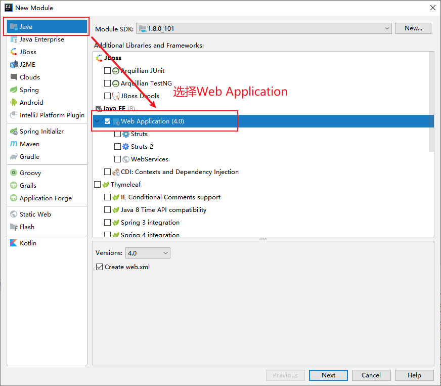

   对于上述步骤还有一种创建方式：

   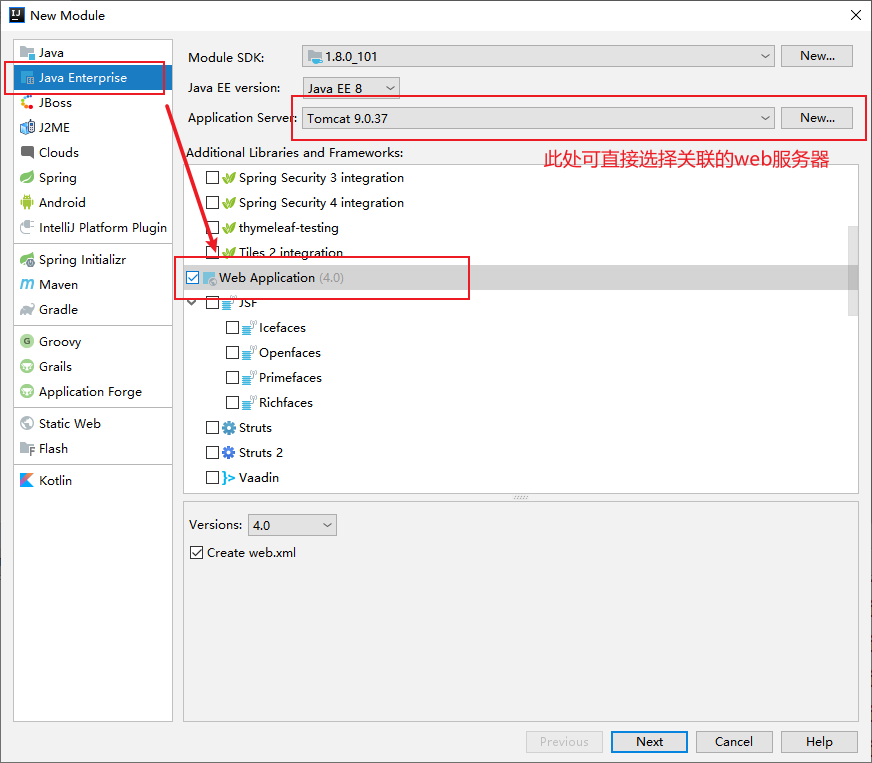

   > 注意：
   >
   > 新版本（idea2020.X）的 idea 中创建 web 项目的选项已经被移除，可以直接选择创建普通 java 项目/模块的方式创建，然后选择模块添加相关的 web 框架支持：
   >
   > 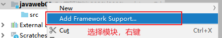
   >
   > 然后在弹出的对话框中选择 web application 即可
   >
   > 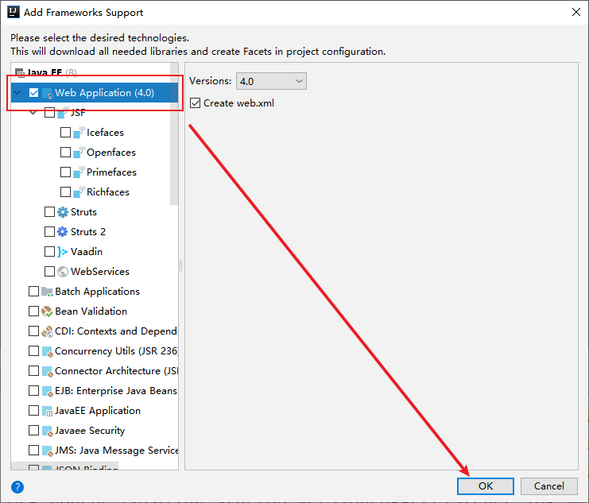

3. 创建完成后可看到如下目录结构的 web 项目:

   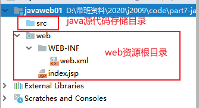

4. 部署项目到服务器中

   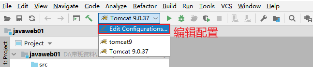

   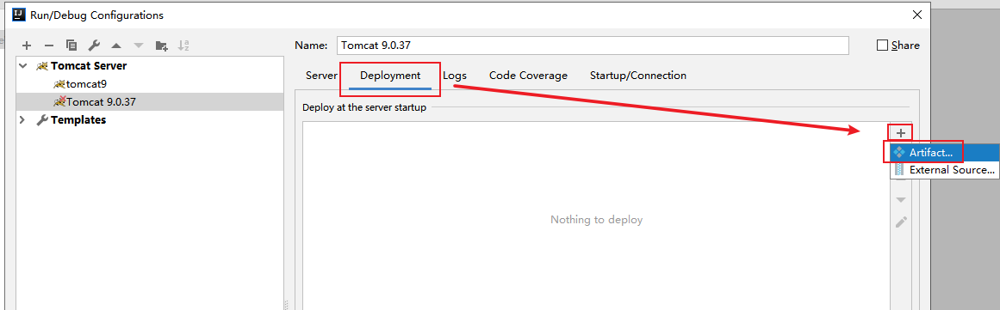

   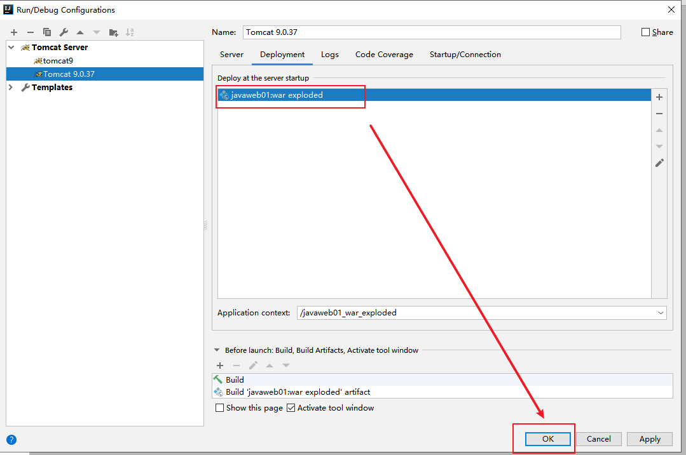

5. 启动服务器

   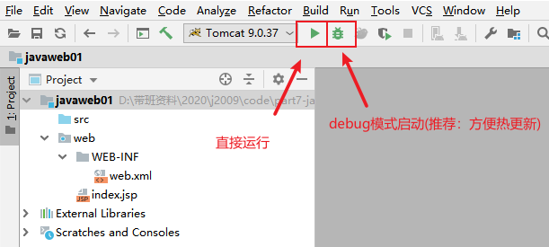

#### Eclipse Web 项目创建

1. File->New->Dynamic Web Project

   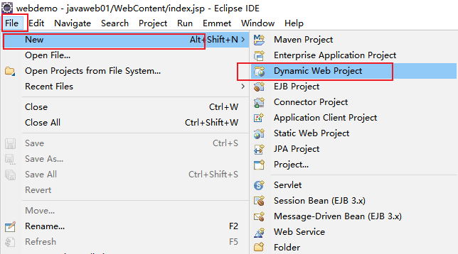

2. 填写选择项目相关信息

   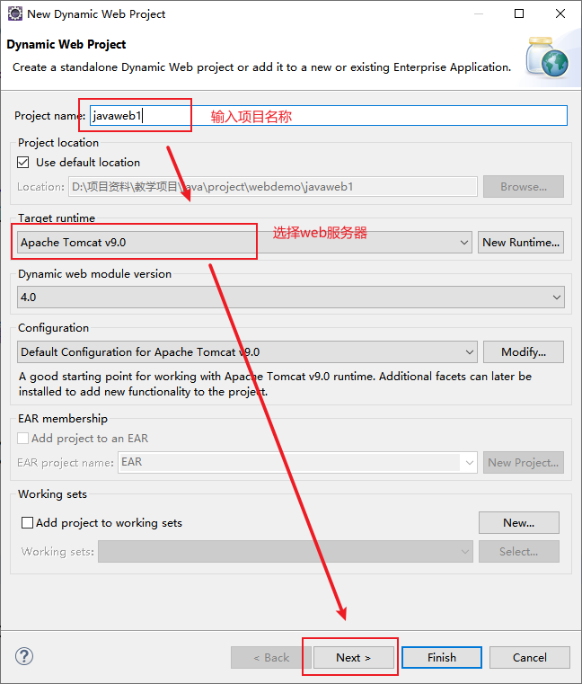

   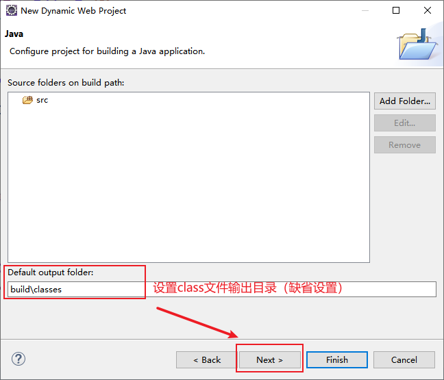

   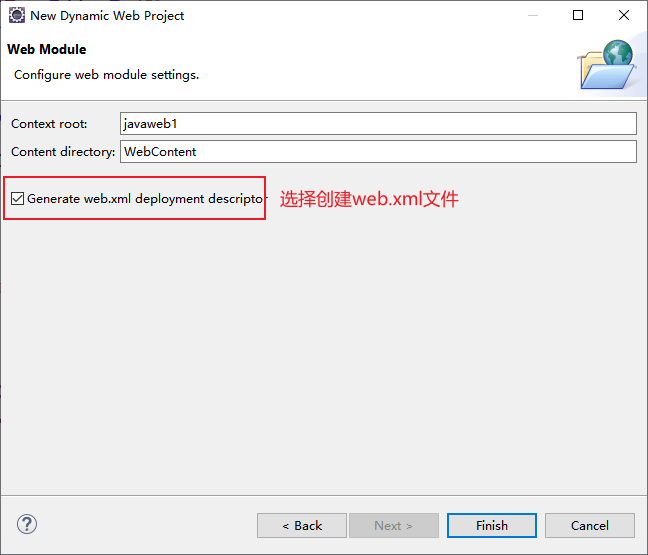

3. 目录结构

   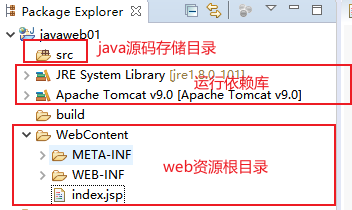

4. 部署项目到服务器

   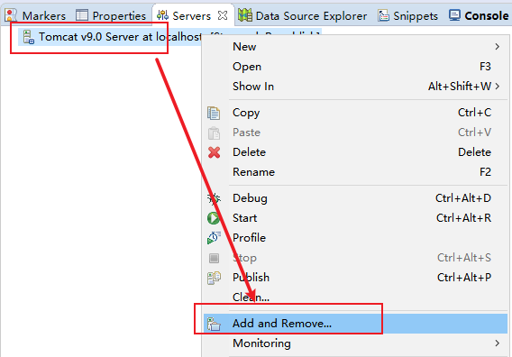

   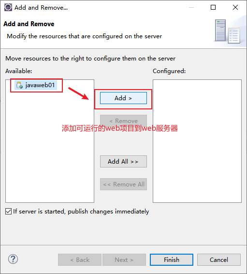

   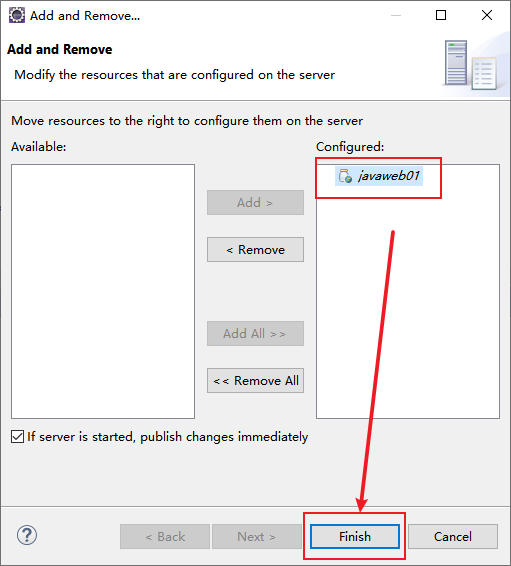

5. 启动服务器

   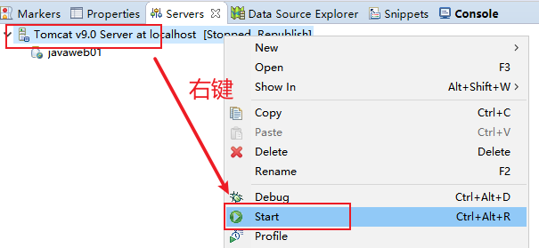
