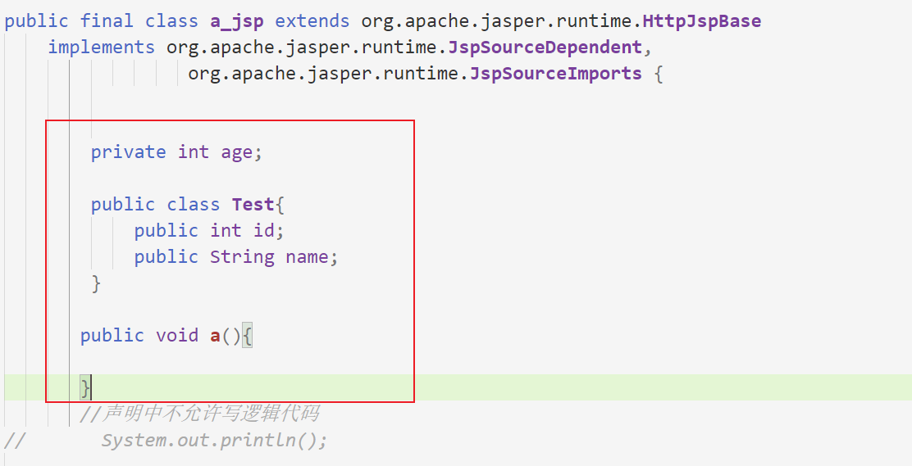
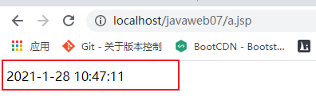
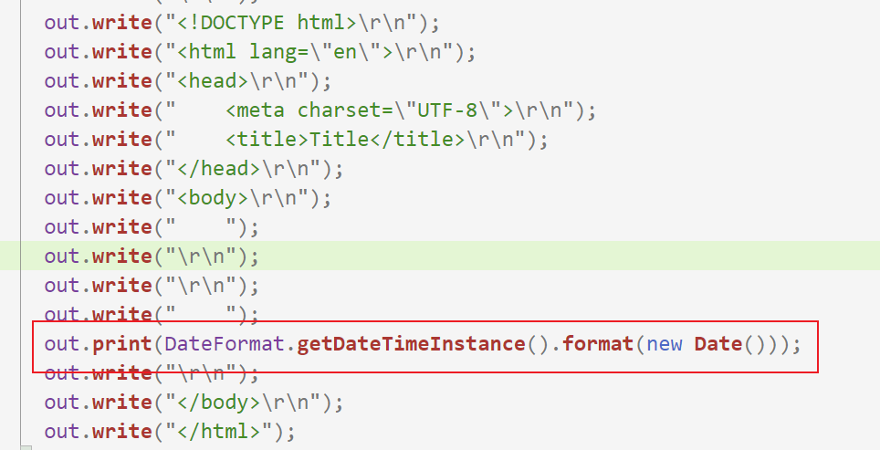
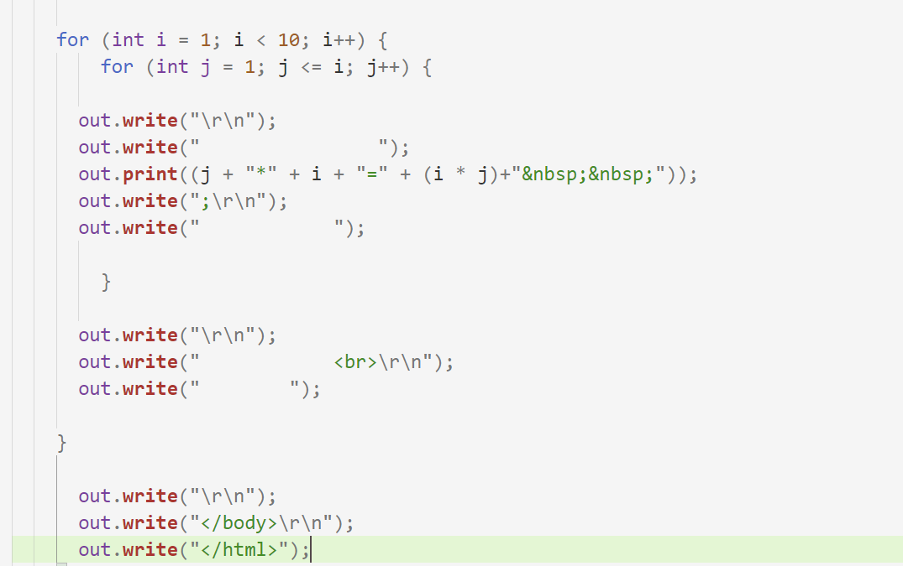
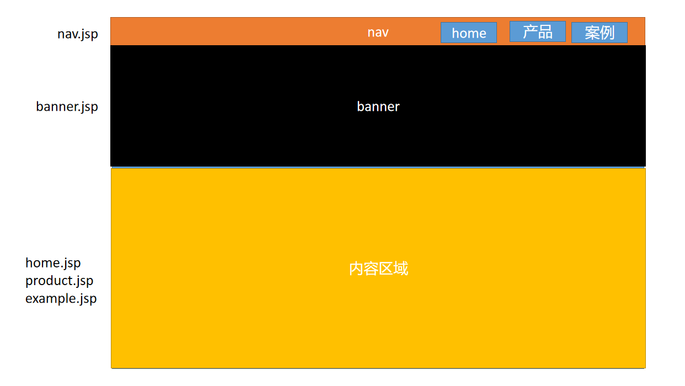
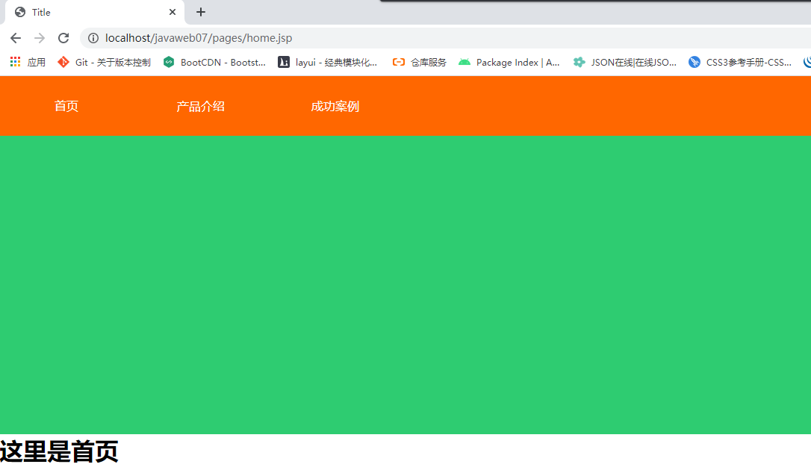
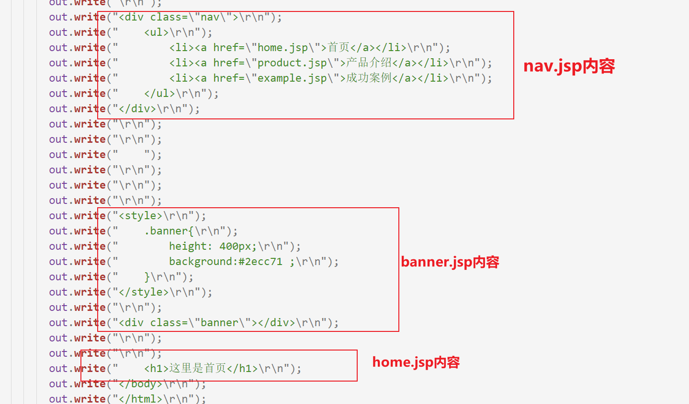
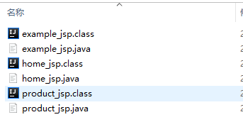
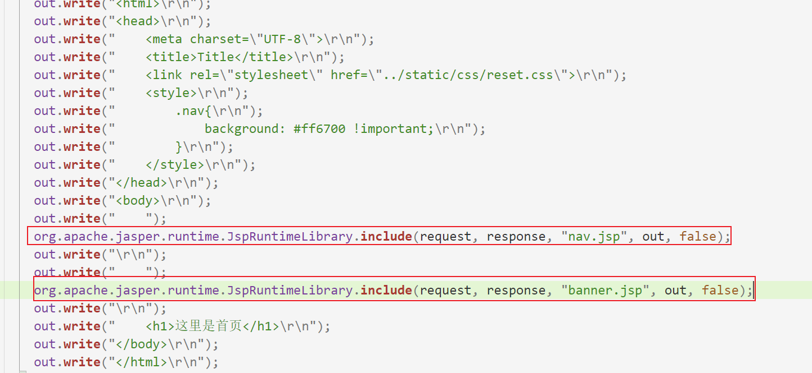
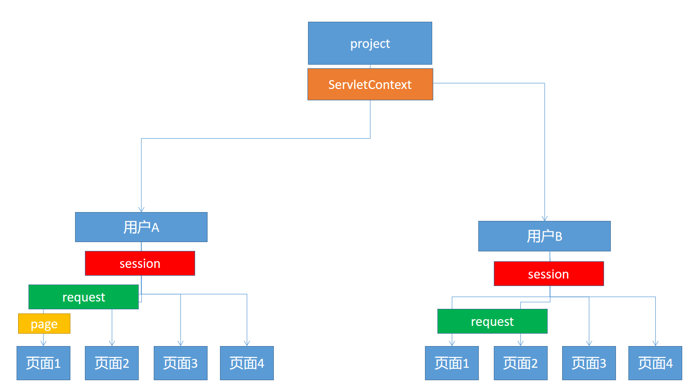

# 07 - JSP 快速入门 :mountain_cableway:

[[TOC]]

## JSP 概述

JSP（Java Server **Pages**）：java 服务页面，是一项动态网页技术；允许开发人员**在 html 页面中编写 java 代码**，从而快速构建 web 应用；在 jsp 还未出现之前，网页的动态效果实现是由 Servlet 技术完成，在 servlet 时代需要将网页代码直接在 servlet 类中编写（**在 java 代码中写 html**），并且通过 HttpServletReponse 对象对外输出，这种方式对于后端开发员人员要求极高.

**JSP：在 html 页面中编写 java 代码**

Servlet：在 java 中编写 html

**运行原理:**

JSP 实际上就是一个轻量级的 Servlet.JSP 的运行原理：

1. web 容器启动后，当请求第一次到达指定的 JSP 时，web 容器会启动 JSP 引擎对 jsp 文件进行转换操作
2. web 容器将 jsp 文件转换成一个 java 类（Servlet）
3. 再通过 Java 编译器对 Servlet 编译，
4. 执行 servlet 的初始化与请求处理，向客户端响应数据（将数据内容以网页的形式向客户端输出）

**jsp 核心内容：**

1. **两种跳转方式（转发，重定向）**
2. 三种脚本
3. 三大指令
4. **四大作用域（page,request,session,application）**
5. 七大动作
6. **九大内置对象**

### 基本语法（三种脚本）

一个常规的 JSP 页面必须在页面头部包含以下声明

```html
<%@ page contentType="text/html;charset=UTF-8" language="java" %>
```

并且文件名的后缀必须是`.jsp`

JSP 的编写语法分为三种类型的脚本：

1. 声明脚本（几乎不用）
2. 表达式脚本（输出）
3. 代码脚本（编写逻辑）

#### 声明脚本

jsp 声明脚本：在类结构中能够直接定义的元素(属性，方法，内部类等)都可以在声明部分编写

语法：

```jsp
<%!
	//编写java代码
%>
```

案例:

```jsp
<%!
    private int age;

    public class Test{
        public int id;
        public String name;
    }

    public void a(){
		//System.out.println("但是这里可以写");
    }
//声明中不允许写逻辑代码
//       System.out.println();
%>
```

在服务器中编译之后，在代码中出现的位置：



#### 表达式脚本

表达式脚本用于在页面上输出数据

语法：

```jsp
<%=输出内容 %>
```

案例：

```jsp
<%=DateFormat.getDateTimeInstance().format(new Date())%>
```



在服务器经过编译之后出现的位置：



#### 代码脚本

代码脚本即项目的业务逻辑代码编写区域，**在方法中可以写什么内容在代码脚本中就可以写什么**！

语法：

```jsp
<%
	//编写java代码
%>
```

案例：

```jsp
<%
for (int i = 1; i < 10; i++) {
    for (int j = 1; j <= i; j++) {
        System.out.print(j + "*" + i + "=" + (i * j)+"")

    }
    System.out.println()
}
%>
------------------------------------------------------------------
<%
for (int i = 0; i < 10; i++) {
    for (int j = 0; j < i; j++) {
        %>
<%=(j + "*" + i + "=" + (j * i) + "&nbsp;&nbsp;")%>
<%
}
%>
<br>
<%
}
%>
```

经过服务器处理之后的内容:



#### JSP 注释

```jsp
<%--
    // 单行

    /*
    * 多行注释
    **/

--%>
```

> 注意 `<%`没有作用域 即 他的作用只是作区分(区分 Java 代码和 HTML 代码)

## 三大指令

jsp 中包含三大指令，指令与业务无关，指令的语法：

```jsp
<%@ %>
```

三大指令分为别：

1. page：jsp 页面的声明指令
2. include：静态包含指令
3. taglib：标签库指令(重要)

### page 指令

page 指令用于对 jsp 页面进行配置，比如编码，错误页面等常规配置,

```jsp
<%@ page contentType="text/html;charset=UTF-8" language="java" %>
```

page 指令常用的属性：

1. contentType：设置服务端响应内容的类型以及内容的编码方式
2. language：页面采用的服务端语言（默认:java）
3. **pageEncoding**：设置页面文件的编码方式
4. **import**：用于导包，等同 java 类中的`import com.XXX.XXX`
5. session：是否启用 session，若为 false 则页面中不允许使用 session 对象，默认为 true
6. **errorPage**：错误页面，当 jsp 页面中出现异常时，此时转发(并不是从定向)到目标的错误页面
7. isErrorPage：是否启用异常处理，默认值是 false,其中之后 jsp 页面中支持 exception 对象
8. buffer：页面缓冲区大小，默认 8kb
9. **isELIgnored**：是否忽略页面中的**EL 表达式**，默认是：false(自动识别 el 表达式并正常取值)

### include 指令

include 称之为静态包含（引入），作用于将另一个页面包含到当前页面中；经常见到类似以下需求：



语法：

```jsp
<%@ include file="nav.jsp"%>
```

案例:

```jsp
<%@ page contentType="text/html;charset=UTF-8" language="java" %>
<html>
<head>
    <meta charset="UTF-8">
    <title>Title</title>
    <link rel="stylesheet" href="../static/css/reset.css">
    <style>
        .nav{
            background: #ff6700 !important;
        }
    </style>
</head>
<body>
    <%@ include file="nav.jsp"%>
    <%@ include file="banner.jsp"%>
    <h1>这里是首页</h1>
</body>
</html>

```

效果:



静态包含的实现原理：

所有被包含的 jsp 文件不会单独编译产生 java 文件，而是组合到目标的 jsp 页面中统一编译，即只产生一个 java 文件，生成的代码如下：



例如:home 页面中包含其他两个页面：`nav.jsp`、`banner.jsp`,但是 web 容器不会针对这两个页面单独产生 java 文件，而是合并到 home.jsp 中，只对 home.jsp 单独转换以及编译,若访问其他页面主要页面也不会单独对组件页面编译：



### taglib 指令（EL 表达式&JSTL 标准标记库）

taglib 指令用于在 jsp 中引入标记库，通常为 JSTL（jsp 标准标签库）

## JSP 常用标签（JSP 动作）

jsp 页面除了支持`<% %>`表达式外，另外也提供了一些常用动作指令标签，通常 jsp 中包含七大动作：

- **include：动态包含**
- useBean：在 jsp 中表示一个 javabean
- getProperty：用于获取 bean 中的属性,结合 useBean 使用
- setProperty：用于设置 bean 中的属性，结合 useBean 使用
- param：参数传递
- **forward：服务端请求转发**
- plugin：用于指定在客户端运行的一些插件

### include

是 jsp 中的一个动作，用于动态包含其他 jsp 页面，语法如下：

```jsp
<jsp:include page="nav.jsp" />
```

案例代码:

```jsp
<%@ page contentType="text/html;charset=UTF-8" language="java" %>
<html>
<head>
    <meta charset="UTF-8">
    <title>Title</title>
    <link rel="stylesheet" href="../static/css/reset.css">
    <style>
        .nav{
            background: #ff6700 !important;
        }
    </style>
</head>
<body>
    <jsp:include page="nav.jsp" flush="true"/>
    <jsp:include page="banner.jsp" flush="true"/>
    <h1>这里是首页</h1>
</body>
</html>

```

动态包含的页面会单独的被容器转换以及编译，然后再引入到主页面中，生成 java 代码如下：



### forward

forward 动作用于在 jsp 中将请求转发到其他目标，使用如下：

```jsp
 <jsp:forward page="pages2/home.jsp"/>
```

## 内置对象(九大内置对象)

所谓内置对象，即在 JSP 中预先定义好的一些对象，在使用时无需重复声明，可以直接拿来即用；JSP 中一共包含九大内置对象：

- **request**：是 HttpServletRequest 接口的实例
- **response**：是 HttpServletResponse 接口的实例
- **session**：是 HttpSession 实例
- **application**：是 ServletContext 实例
- **out：是一个基于 response 的输出流实例**
- page：是当前 jsp/servlet 对象本身
- pageContext：当前页面的上下文对象
- config：是 ServletConfig 实例
- exception：是 Throwable 实例

## 四大作用域

在 jsp 中存在四个作用域对象：

- **pageContext**：当前页面上下文，存储在该区域的数据只能在`当前页面生效`
- **request**：在一次请求范围内生效
- **session**：在一次会话中生效
- **application**：在整个 web 容器实例运行期间都生效(单例)



## 练习

1. 完成一个企业员工管理系统（servlet+JSP），要求包含两个模块：员工，部门，核心功能：
   1. 员工管理
      1. 员工新增
      2. 修改员工信息
      3. 检索员工（根据工号，姓名，部门）
      4. 员工删除
      5. 员工列表显示
   2. 部门管理
      1. 部门新增
      2. 部门列表显示
      3. 部门删除（删除之前先将员工的所在部门置空）
