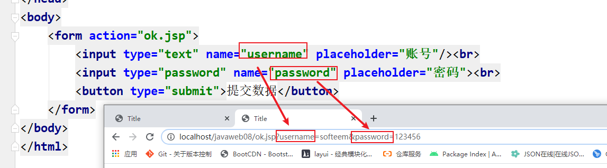
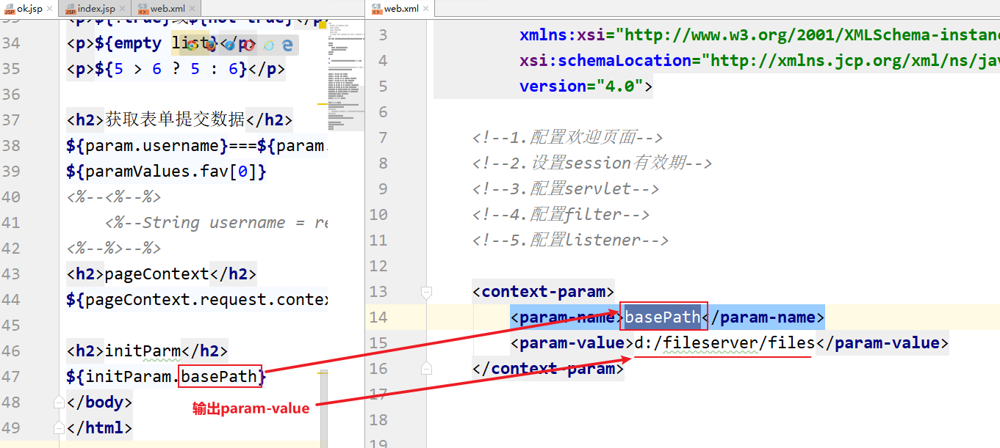
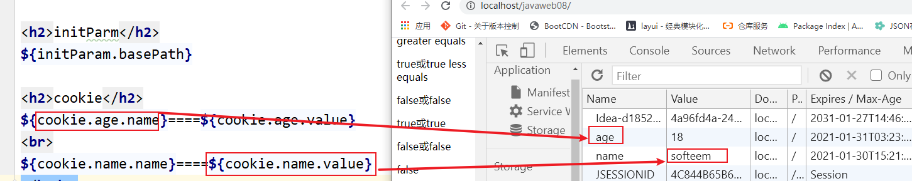

# 09 - EL 表达式与 JSTL :steam_locomotive:

[[TOC]]

## 传统 JSP 脚本存在的问题

由于 JSP 是一种动态网页技术，实际就是在 html 中编写 java 代码（相当于以脚本形式存在），因此在页面中既有 java 代码又有 html 代码，编写的时候比较复杂，而且代码的可读性不高

- 编写复杂
- 可读性差

## EL 表达式

### 引入

```jsp
<!--传统jsp写法-->
<h1><%=request.getAttribute("msg") == null ? "" : request.getAttribute("msg") %></h1>

<!--EL表达式-->
<h1>${msg}</h1>
```

### 概述

EL(Expression Language)表达式语言，是 JSP2.0 规范中引入一种新特性，灵感来自于 ECMAScript 中 XPath(快速节点检索技术)语法；允许使用`${}`操作 jsp 各个作用域中的数据，另外 EL 表达式还引入了一些内置对象，也支持一些基本的运算操作。

### 语法

EL 表达式通过`$`符号作为定界符，在`{}`之间编写表达式(一行输出语句)内容，如下：

```
${表达式内容}
```

例如:

```jsp
${sessionScope.msg}
```

> 以上代码等同于：
>
> ```jsp
> <%=session.getAttribute("msg")%>
> ```

### 运算符

| 分类           | 运算符                                             | 案例                                                                                                                                              |
| -------------- | -------------------------------------------------- | ------------------------------------------------------------------------------------------------------------------------------------------------- |
| 算术运算符     | +、-、\*、/或 div、%或 mod                         | ${2+3}<br>${3-2}<br>${3*4}<br>${6/3}或${6 div3 }<br>${10 % 3}或${10 mod 3}                                                                        |
| 关系运算符     | ==或 eq、!=或 ne、<或 lt、>或 gt、<=或 le、>=或 ge | ${ 5 == 5}或${5 eq 5}<br>${2 != 3}或​${2 ne 3}<br>${5 < 6}或​${5 lt 6}<br>${ 7 > 6}或​${7 gt 6}<br>${8 <= 9}或​${8 le 9}<br>${8 >= 7}或​${8 ge 7} |
| 布尔逻辑运算符 | &&或 and、\|\|或 or、!或 not                       | {true && true}或{true and true}<br>{true \|\| false}或{true or false}<br>{!true}或{not true}                                                      |
| 其他           | Empty 运算符、三目运算符、()运算符                 | ${empty ['a','b','c']}<br>${a > b ? a : b} <br>${10 > 6 ? 10 : 10 > 11 ? 10 : 11}                                                                 |

```jsp
<h1>
    <%--            <%= request.getAttribute("msg") == null ? "" : request.getAttribute("msg")  %>--%>
    <h1>${msg}</h1>
    <p>${3+5}</p>
    <p>${3/5}或者${3 div 5}</p>
    <p>${3%2}或者${3 mod 2}</p>
    <p>${3>2}或者${3 gt 2}</p>
    <p>${3<2}或者${3 lt 2}</p>
    <p>${3 == 2}或者${3 eq 2}</p>
    <p>${3 >= 2}或者${3 ge 2}</p>
    <p>${3 <= 2}或者${3 le 2}</p>

    <p>${true && false}或者${true and false}</p>
    <p>${true || false}或者${true or false}</p>
    <p>${!true}或者${not true}</p>

    <p>${empty list}</p>
    <p>${5 > 6 ? 1 : 2}</p>
</h1>
```

### 内置对象

EL 表达式内置了一系列对象，方便进行关于 jsp 的操作：

- 作用域对象
- 请求参数对象
- 请求头对象
- 上下文对象
- 全局初始化参数
- cookie 对象

#### 作用域对象（重要）

jsp 中提供了四大作用域（page、request、session、application），因此在 EL 表达式中为了方便的访问这四个作用域，提供了 4 个内置对象操作这些作用域中的数据：

- pageScope
- requestScope
- sessionScope
- applicationScope

使用方式：

```jsp
${pageScope.XXX}
${requestScope.XXX}
${sessionScope.XXX}
${applicationScope.XXX}
```

`XXX`表示是各自范围中存储的元素的键：`requst.setAttribute("XXX","request的数据")`

> 注意事项：
>
> 不使用任何作用域对象访问数据时**(${msg})**，默认搜索范围从小到大`pageScope>requestScope>sessionScope>applicationScope`

#### 请求参数对象（次重要）



EL 表达式中提供的请求参数对象，可以实现获取表单(URL)提交的数据，EL 中提供的请求参数对象包含两个:

- param
- paramValues

使用方式：

```jsp
${param.username}===${param.password}
${paramValues.fav}
```

等同于：

```java
<%=request.getParameter("username")%>===<%=request.getParameter("password")%>
<%=request.getParameterValues("fav")%>
```

#### 其他对象

##### 请求头对象

获取请求头中的信息

- header

##### 上下文对象（熟悉）

EL 中提供了一个 JSP 上下文的对象，可以通过该对象获取当前页面的上下文信息（获取 page,request,session--->jsp 运行环境）,对象名称：

- pageContext

使用方式

```jsp
${pageContext.request.contextPath}
```

以上代码表示获取当前应用所在的根地址。

##### 全局初始化参数对象

EL 中提供了一个用于获取全局初始化参数的内置对象`initParam`；所谓全局初始化参数，即指的是在 web.xml 中配置`<context-param>`，使用方式如下：



```jsp
${initParam.basePath}
```

等同于如下代码：

```jsp
//jap写法
<%=request.getServletContext().getInitParameter("basePath")%>

//servlet写法
String basepath = req.getServletContext().getInitParameter("basepath");
```

##### cookie 对象

EL 中对于 cookie 的操作也提供了一个内置对象：

```java
<%
    Cookie c = new Cookie("age", "18");
	c.setMaxAge(60 * 60 * 24);
	c.setPath("/");
	response.addCookie(c);
%>
```

- cookie



## JSTL

### 概述

JSTL（JavaServer Pages Standard Tag Library）jsp 标准标签库，由一系列**内置的标签构成**，提供了简化的业务操作，比如条件判断，循环语句，输出等操作；作用于完全替代原始的 jsp 的脚本；

#### 传统的 jsp 代码：

```jsp
<table>
    <tr>
        <th>工号</th>
        <th>姓名</th>
        <th>职位</th>
        <th>生日</th>
        <th>月薪</th>
        <th>部门</th>
        <th>操作</th>
    </tr>
    <%
    Object obj = request.getAttribute("list");
    if(obj != null){
        List<Emp> list = (List<Emp>) obj;
        for(Emp e:list){
            %>
    <tr>
        <td><%=e.getEno()%></td>
        <td><%=e.getEname()%></td>
        <td><%=e.getJob().equals("2") ? "部门经理" : "普通员工" %></td>
        <td>
            <%
            DateFormat fmt = DateFormat.getDateInstance(); //yyyy-mm-dd
            String birth = fmt.format(e.getBirth());
            out.write(birth);
            %>
        </td>
        <td>
            <%
            NumberFormat numberFormat = NumberFormat.getNumberInstance();
            String sal = numberFormat.format(e.getSal());
            out.write(sal);
            %>
        </td>
        <td><%=e.getDept().getDname()%></td>
        <td>
            <a href="">详情</a>&nbsp;&nbsp;
            <a href="">操作</a>
        </td>
    </tr>
    <%
    }
    }else{
        out.write("<tr><th colspan='7' style='color:#f00'>暂无数据!</th></tr>");
    }
    %>
</table>
```

以上的代码表现形式比较复杂，而且可读性差，使用 JSTL 优化之后，代码可编写为如下方式:

```jsp
<table>
    <tr>
        <th>工号</th>
        <th>姓名</th>
        <th>职位</th>
        <th>生日</th>
        <th>月薪</th>
        <th>部门</th>
        <th>操作</th>
    </tr>
    <c:if test="${empty list || list.size() < 1}">
        <tr><th style="color: #ff0000;">暂无数据!</th></tr>
    </c:if>
    <c:if test="${not empty list}">
        <c:forEach items="${list}" var="e">
            <tr>
                <td>${e.eno}</td>
                <td>${e.ename}</td>
                <td>${e.job eq "2" ? "部门经理":"普通员工"}</td>
                <td><fmt:formatDate value="${e.birth}" pattern="yyyy-MM-dd"/></td>
                <td><fmt:formatNumber value="${e.sal}" pattern="###.##"/></td>
                <td>${e.dept.dname}</td>
                <td>
                    <a href="">详情</a>&nbsp;&nbsp;
                    <a href="">操作</a>
                </td>
            </tr>
        </c:forEach>
    </c:if>
</table>
```

#### JSTL 的分类

JSTL 提供的内置标签包含：

- **核心标签库（c 标签）**
- **格式化标签库（fmt）**
- xml 标签库（xml）
- sql 标签库（sql）
- 函数标签库（fn）

以上标签库的 url 和前缀名：

| 标签库     | 标签库的 URI                           | 前缀    |
| ---------- | -------------------------------------- | ------- |
| **Core**   | **http://java.sun.com/jsp/jstl/core**  | **c**   |
| **Format** | **http://java.sun.com/jsp/jstl/fmt**   | **fmt** |
| XML        | http://java.sun.com/jsp/jstl/xml       | xml     |
| SQL        | http://java.sun.com/jsp/jstl/sql       | sql     |
| Functions  | http://java.sun.com/jsp/jstl/functions | fn      |

### 使用方式

标签库是 servlet2.3 之后引入的新特性，需要使用 JSTL 必须导入相关的依赖：

`jstl.jar`

`standard.jar`

使用方式分为两步:

1. 导入依赖

2. 在需要使用 jstl 页面中添加 taglib 指令

   ```jsp
   <%--引入标签库--%>
   <%@ taglib prefix="c" uri="http://java.sun.com/jsp/jstl/core"%>
   ```

### 核心标签库

C 标签也称之核心标签，也是 jstl 使用率最高的一种标签，c 标签分为以下常用标签：

| 标签名          | 说明                                                                                              | 示例                                                   |
| --------------- | ------------------------------------------------------------------------------------------------- | ------------------------------------------------------ |
| \<c:out\>       | 输出标签，value 是必须的属性                                                                      | `<c:out value="${msg}">`                               |
| \<c:set\>       | 向指定的作用域中存放数据 参数：var:键值 values:值 scope:作用范围 page/request/session/application | `<c:set var="msg" value="${msg}" scope="session">`     |
| \<c:if\>        | 条件判断标签，test 是必须的属性                                                                   | `<c:if test="${user ne null}"> 欢迎你,${user} </c:if>` |
| \<c:choose\>    | 选择标签，结构标签，不包含任何属性，类似 switch                                                   |                                                        |
| \<c:when>       | 结合 choose 标签使用，类似 switch 中的 case                                                       |                                                        |
| \<c:otherwise\> | 结合 choose 标签使用，类似 switch 中的 default                                                    |                                                        |
| \<c:foreach\>   | 迭代标签，用于对集合遍历或者执行循环逻辑                                                          |                                                        |

#### c:if 标签

用于执行逻辑判断，内部包含的属性：test(必须)

使用方法:

```jsp
<c:if test="${user ne null}">
    欢迎你,${user}
</c:if>
```

#### c:choose/c:when/c:otherwise 标签

c:choose/when/otherwise 是一套组合标签，通常情况是结合到一起同时使用，唯独 when 标签中有一个必须的属性：test,其余标签都是结构标签（只存在结构，无属性与属性值）

使用方式：

```jsp
<c:choose>
    <c:when test="${param.role eq '1'}">
        <ul>
            <li><a href="">查看成绩</a></li>
            <li><a href="">修改密码</a></li>
        </ul>
    </c:when>
    <c:when test="${param.role eq '2'}">
        <ul>
            <li><a href="">成绩录入</a></li>
            <li><a href="">学生查看</a></li>
            <li><a href="">课表查看</a></li>
            <li><a href="">密码修改</a></li>
        </ul>
    </c:when>
    <c:when test="${param.role eq '3'}">
        <ul>
            <li>学生管理</li>
            <li>老师管理</li>
            <li>平台功能设置</li>
            <li>教辅材料管理</li>
            <li>系统设置</li>
        </ul>
    </c:when>
    <c:otherwise>
        <c:set var="msg" value="请亮明身份" scope="request"/>
        <jsp:forward page="login.jsp"/>
    </c:otherwise>
</c:choose>
```

#### c:forEach 标签(重要)

用于进行数据迭代的标签，常见属性：

- items：需要遍历的集合对象
- var：标签当前遍历的一个对象引用名
- begin：需要显示的数据列表项的开始索引
- end：需要显示的数据列表项的结束索引
- step：步进值（每次增长指定位，默认：1）
- varStatus：表示当前遍历集合中元素的状态，包含一些子属性
  - index：当前元素的索引，从 0 开始
  - count：当前元素的总个数，从 1 开始
  - last：是否是最后一个元素
  - first：是否是第一个元素

使用方式

```jsp
<table>
    <tr>
        <th>序号</th>
        <th>工号</th>
        <th>姓名</th>
        <th>职位</th>
        <th>月薪</th>
        <th>部门</th>
        <th>是否第一个</th>
        <th>是否最后一个</th>
    </tr>
    <c:forEach items="${requestScope.list}" var="emp" varStatus="stat" begin="0" end="20">
        <tr>
            <td>${stat.index + 1}</td>
            <td>${emp.eno}</td>
            <td>${emp.ename}</td>
            <td>${emp.job}</td>
            <td>${emp.sal}</td>
            <td>${emp.dept.dname ne null ? emp.dept.dname : "没有部门"}</td>
            <td>${stat.first}</td>
            <td>${stat.last}</td>
        </tr>
    </c:forEach>
</table>

```

#### c:forTokens 标签

用于按照执行的分隔符对字符串文本进行切割，并转换为数组进行遍历

使用方式：

```jsp
<!--向page范围存储数据-->
<c:set var="data" value="lily|lucy|lilei|hanmeimei|tom" scope="page"></c:set>
<!--分割遍历-->
<c:forTokens items="${pageScope.data}" delims="|" var="name" >
    <p>${name}</p>
</c:forTokens>
```

结果:

```html
<p>lily</p>
<p>lucy</p>
<p>lilei</p>
<p>hanmeimei</p>
<p>tom</p>
```

### 格式化标签库（fmt 标签）

格式化标签主要用于对数值，日期等常见的数据类型进行格式化处理，格式化标签的前缀是`fmt`,因此使用前需要将标签指令引入到 jsp 页面中：

```jsp
<%@ taglib prefix="fmt" uri="http://java.sun.com/jsp/jstl/fmt" %>
```

> 如果频繁需要在每一个页面都引入相同的标签库，则可以将这些标签库集中到一个 jsp 文件中，然后将改文件静态引入到其他页面中
>
> tag.jsp
>
> ```jsp
> <%@ taglib prefix="fmt" uri="http://java.sun.com/jsp/jstl/fmt" %>
> <%@ taglib prefix="c" uri="http://java.sun.com/jsp/jstl/core"%>
> ```
>
> 页面引入
>
> ```jsp
> <%@ include page="tag.jsp"%>
> ```

JSTL 中提供的格式化标签库主要包含以下两个:

- fmt:formatDate
- fmt:formatNumber

使用方式：

```jsp
<%@ page contentType="text/html;charset=UTF-8" language="java" %>
<%@ include file="tag.jsp"%>
<html>
<head>
    <base href="${pageContext.request.contextPath}/">
    <meta charset="UTF-8">
    <title>Title</title>
</head>
<body>
    <%
        pageContext.setAttribute("now",new Date());
        pageContext.setAttribute("money","1564782.4567");
    %>

    现在时间(将Date格式化为String):
    <fmt:formatDate value="${now}" pattern="yyyy-MM-dd HH:mm:ss"/>
    <br>
    解析字符串为Date对象：
    <fmt:parseDate value="2021/12/12 10:12:12" pattern="yyyy/MM/dd HH:mm:ss" scope="session" var="nowTime"/>
    现在时间：${sessionScope.nowTime}

    <hr>
    数字格式化：<fmt:formatNumber value="${money}" pattern="##,###.##"/> <br>
    解析字符串为number类型: <fmt:parseNumber value="74,598.2" pattern="##,###.#" var="m" scope="session"/>
    ${sessionScope.m + 2}
</body>
</html>

```
