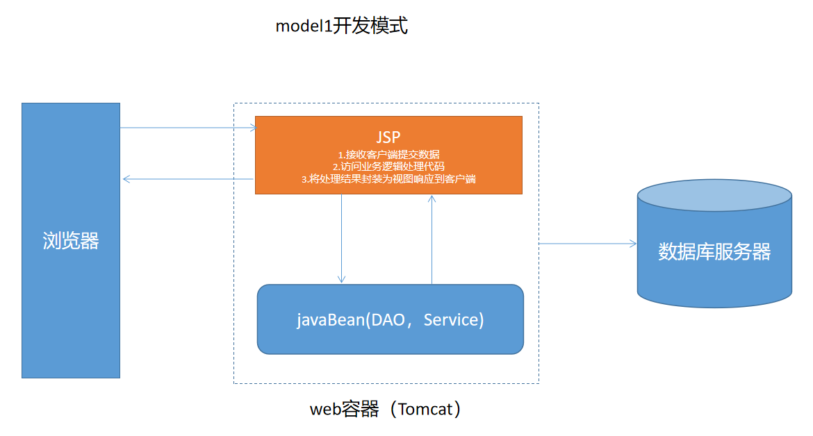
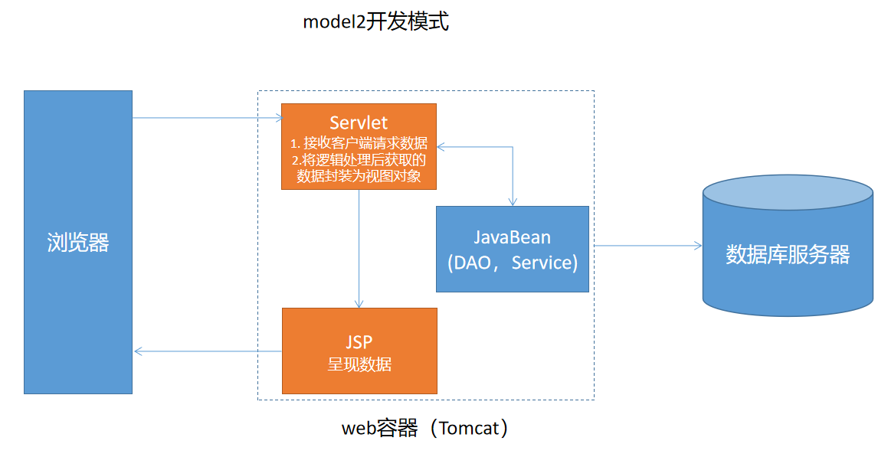
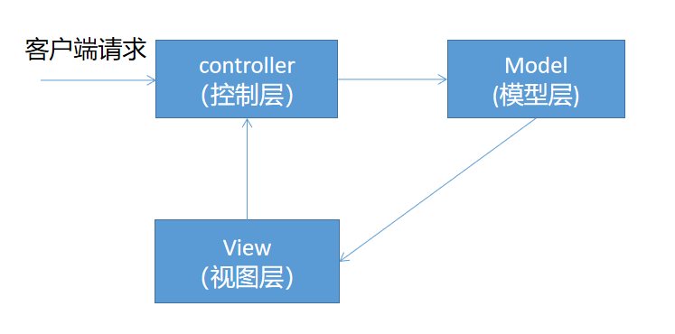
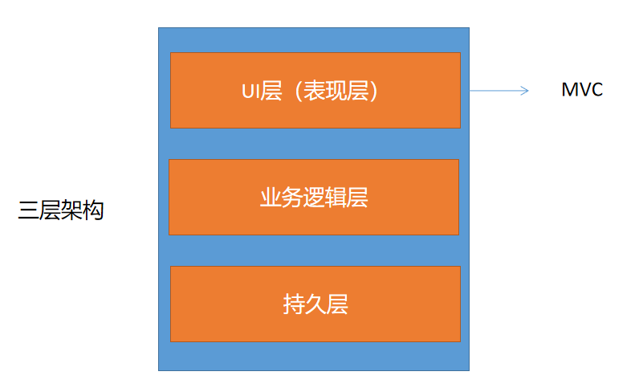
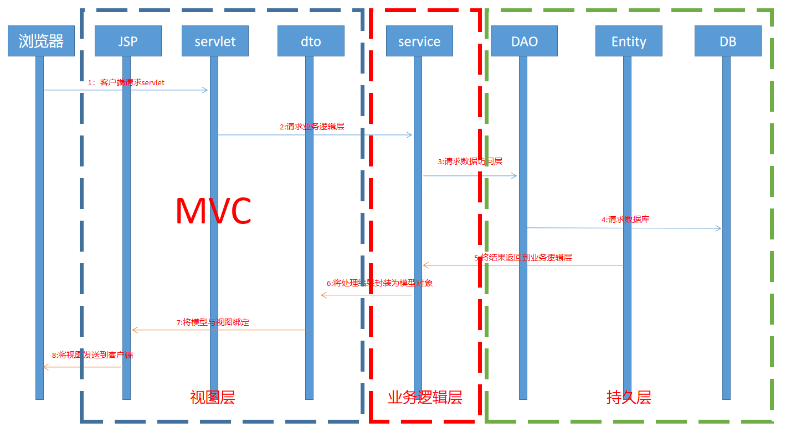
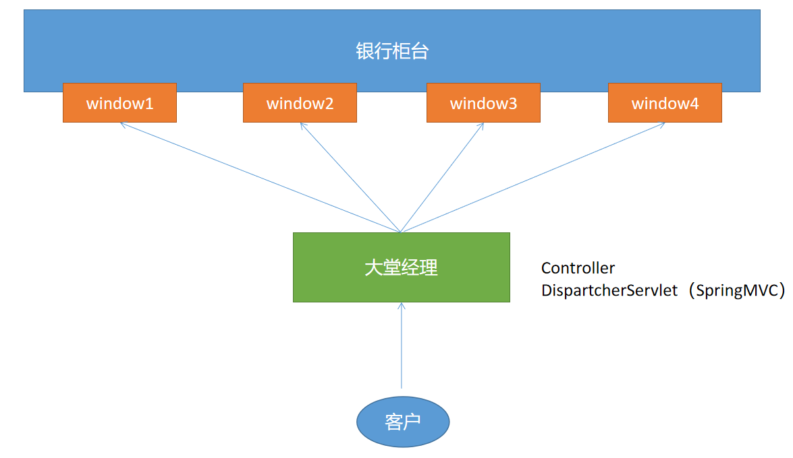

# 10 - MVC :rocket:

[[TOC]]

## 从 Model1 到 Model2(MVC)

软件架构编年史

Servlet--->JSP

### Model1 模式

model1 是早期 javaweb 软件开发中最为流行的一种技术，整个项目的开发只需要：JSP+JavaBean 即可完成



**Model1 模式的优缺点:**

- 优点：
  - 开发效率很高
  - 架构简单
  - 适合小型的项目开发
- 缺点：
  - JSP 的职责过重
  - 表现层和逻辑混杂
  - 代码的可重用性低
  - 不利于维护

### Model2 模式（MVC）

通过对 model1 模式的了解，会发现随着互联网的发展，model1 模式已经不适用于当前的环境，因此在 model1 的基础上，软件架构继续发展出现了 Model2(MVC)模式，Model2 模式的架构如下:



Model2 模式的优缺点

- 优点
  - 职责清晰，每层各司其责
  - 代码的可重用性高
  - 维护方便
  - 适合大型的软件项目
- 缺点
  - 不适合小型项目
  - 对于开发人员要求高



### 三层架构和 MVC 区别





三层架构:

- 表现层（UI）
- 业务逻辑层（BL）
- 持久层（DL）

MVC：

- 视图层（View）
- 控制层（Controller）
- 模型层（Model）

三层架构是一种软件架构技术，MVC 是一种设计模式；三层架构中的表现层即 MVC

> MVC 框架目前市面上有很多：
>
> 1.  struts1
> 2.  struts2
> 3.  WebWork
> 4.  **springMVC**

分层开发的最终目的是：

降低耦合度（**高内聚低耦合**）

## BaseServlet



实现代码：

```java
public class BaseServlet extends HttpServlet {

    @Override
    protected void service(HttpServletRequest req, HttpServletResponse resp) throws ServletException, IOException {
        //获取请求参数（需要执行的方法名称）
        String methodName = req.getParameter("method");
        try {
            //根据提供的方法名以及方法中的参数类型创建方法对象
            Method method = this.getClass().getMethod(methodName, HttpServletRequest.class, HttpServletResponse.class);
            //执行方法,并获取返回值（跳转的目标位置）
            Object returnVal = method.invoke(this,req,resp);
            //如果返回值不为空，则说明servlet需要进行跳转（为空则说明方法响应json数据）
            if(Objects.nonNull(returnVal)){
                //将返回值转换为字符串
                String path = returnVal.toString();
                if(path.startsWith("redirect:")){
                    //重定向
                    path = path.split("redirect:")[1];
                    resp.sendRedirect(path);
                }else{
                    //转发
                    req.getRequestDispatcher(path).forward(req,resp);
                }
            }
        } catch (NoSuchMethodException e) {
            e.printStackTrace();
        } catch (IllegalAccessException e) {
            e.printStackTrace();
        } catch (InvocationTargetException e) {
            e.printStackTrace();
        }
    }
}
```

## 分页技术

### 通用分页工具类

1. 编写分页模型类(PageModel)

   ```java
   public class PageModel<T> {

       /**当前页*/
       private int pageNow;
       /**每页数据行数*/
       private int pageSize;

       /**首页*/
       private int first = 1;
       /**上一页*/
       private int prev;
       /**下一页*/
       private int next;
       /**尾页*/
       private int last;

       /**总数据行数*/
       private int totalNum;
       /**总页数*/
       private int totalPage;

       /**查询记录的偏移值*/
       private int offset;

       /**记录开始的序号位置*/
       private int startNum;

       /**设置最大显示的页码数*/
       private int limitPage = 6;
       /**开始显示的页码位置*/
       private int begin;
       /**结束显示的页码*/
       private int end;

       /**存储当前页码的数据*/
       private List<T> dataList = new ArrayList<>();

       /**设置目标跳转地址*/
       private String url;

       public PageModel(int pageNow,int pageSize,int totalNum){
           this.pageNow = pageNow;
           this.pageSize = pageSize;
           this.totalNum = totalNum;

           //计算获取总页数（尾页）
           this.last = this.totalPage = (int)Math.ceil((double)totalNum/pageSize);
           //防止当前页小于1
           this.pageNow = Math.max(this.pageNow,1);
           //防止当前页大于总页数
           this.pageNow = Math.min(this.pageNow, totalPage);
           //防止上一页小于1
           this.prev = Math.max(this.pageNow - 1,1);
           //防止下一页大于总页数
           this.next = Math.min(this.pageNow + 1,totalPage);
           //计算sql查询的偏移值
           this.startNum = this.offset = (this.pageNow - 1) * pageSize;

           //计算开始显示的页码
           this.begin = Math.max(1,this.pageNow - this.limitPage/2);
           //计算结束显示的页码
           this.end = Math.min(this.totalPage,this.begin + limitPage - 1);
       }

       //setter/getter
   }
   ```

2. 业务逻辑层调用

   ```java
   public class EmpService implements IEmpService {

       private EmpDAO empDAO;

       @Override
       public PageModel<Emp> queryAllEmps(int pageNow, int pageSize) {
           empDAO = new EmpDAO();
           //获取总记录数
           int totalNum = empDAO.getTotalNum();
           //根据提供的数据创建通用的分页工具对象
           PageModel<Emp> model = new PageModel<>(pageNow,pageSize,totalNum);
           //使用分页对象中处理完的属性查询数据
           List<Emp> emps = empDAO.selectByPage(model.getOffset(), model.getPageSize());
           //将数据存入PageModel
           model.setDataList(emps);
           return model;
       }
   }

   ```

3. 控制层的请求处理

   ```java
   @WebServlet("/emp")
   public class EmpServlet extends BaseServlet{

       public String queryList(HttpServletRequest req,HttpServletResponse resp){
           //获取客户端提交的页码数
           String page = req.getParameter("page");
           //获取客户端提交的每页大小数
           String limit = req.getParameter("limit");
           //初始化当前页码数和每页数据条数
           int pageNow = 1;
           int pageSize = 10;
           if(page != null){
               pageNow = Integer.parseInt(page);
           }
           if(limit != null){
               pageSize = Integer.parseInt(limit);
           }
           //执行分页的业务逻辑
           IEmpService service = new EmpService();
           PageModel model = service.queryAllEmps(pageNow, pageSize);
           //设置跳转目标
           model.setUrl("emp?method=queryList");
           //将model数据通过request对象传递到下一个servlet中
           req.setAttribute("model",model);
           return "list.jsp";
       }

   }
   ```

4. 页面数据列表展示（list.jsp）

   ```jsp
   <%@ page contentType="text/html;charset=UTF-8" language="java" %>
   <%@ include file="tags.jsp"%>
   <html>
   <head>
       <base href="${pageContext.request.contextPath}/">
       <meta charset="UTF-8">
       <title>Title</title>
       <style>
           table{
               width: 1000px;
               border: 1px solid rgba(0,0,0,0.2);
               border-collapse: collapse;
           }
           th,
           td{
               padding: 5px 10px;
               border: 1px solid rgba(0,0,0,0.2);
           }
       </style>
   </head>
   <body>

       <h1>员工信息表</h1>
       <table>
           <tr>
               <th>序号</th>
               <th>工号</th>
               <th>头像</th>
               <th>姓名</th>
               <th>性别</th>
               <th>入职时间</th>
               <th>生日</th>
               <th>月薪</th>
               <th>职位</th>
               <th>部门号</th>
           </tr>
           <c:if test="${not empty model.dataList}">
               <c:forEach items="${model.dataList}" var="e" varStatus="stat">
               <tr>
                   <td>${stat.count + model.startNum}</td>
                   <td>${e.eno}</td>
                   <td>${e.pic}</td>
                   <td>${e.ename}</td>
                   <td>${e.sex}</td>
                   <td>${e.hiredate}</td>
                   <td>${e.birth}</td>
                   <td>${e.sal}</td>
                   <td>${e.job}</td>
                   <td>${e.dno}</td>
               </tr>
               </c:forEach>
           </c:if>
       </table>
       <%--导入分页工具--%>
       <%@ include file="pagination.jsp"%>
   </body>
   </html>

   ```

5. 分页工具（pagenation.jsp）

   ```jsp
   <%@ page contentType="text/html;charset=UTF-8" language="java" %>
   <style>
       .pages{
           padding:0;
           margin:20px 0;
           list-style: none;
       }
       .pages>li{
           float:left;
           margin-right: 20px;
           width: 80px;
           height: 30px;
           line-height: 30px;
           text-align: center;
           border:1px solid rgba(0,0,0,0.1);
       }
       a{
           display: block;
           text-decoration: none;
           color: #666;
       }
       a:hover{
           background: #666;
           color:#fff;
       }
       .page{
           width: 40px !important;
       }
       .active{
           background: #666;
           color:#fff;
       }
   </style>
   <ul class="pages">
       <li><a href="${model.url}&page=1">首页</a></li>
       <li><a href="${model.url}&page=${model.prev}">上一页</a></li>

       <c:forEach var="page" begin="${model.begin}" end="${model.end}">
           <c:choose>
               <c:when test="${page == model.pageNow}">
                   <%--将当前页高亮显示，同时不能被点击--%>
                   <li class="page"><a class="active" href="javasript:;">${page}</a></li>
               </c:when>
               <c:otherwise>
                   <li class="page"><a href="${model.url}&page=${page}">${page}</a></li>
               </c:otherwise>
           </c:choose>
       </c:forEach>

       <li><a href="${model.url}&page=${model.next}">下一页</a></li>
       <li><a href="${model.url}&page=${model.last}">尾页</a></li>
   </ul>
   ```

## 基于 MVC 的 web 开发案例
