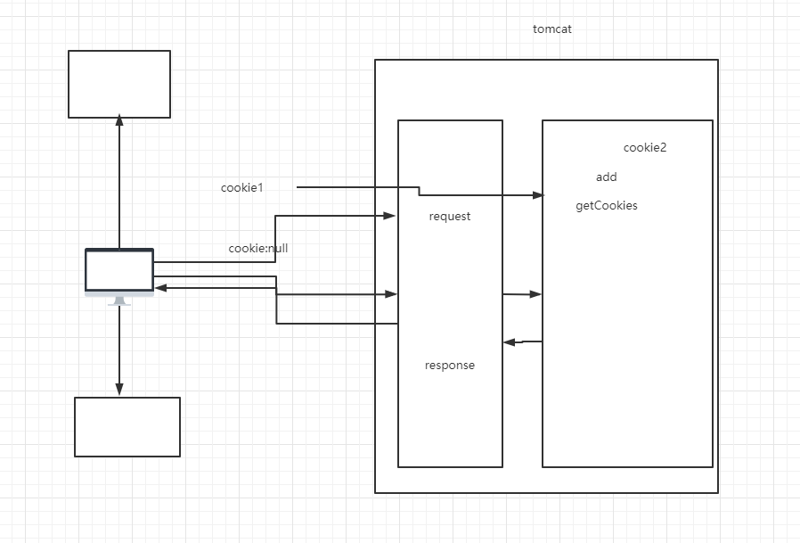

# 11-复习-四大作用域对象 :milky_way:

[[TOC]]

## 1 cookie

- 如何发送 cookie

```java
/*cookie其实就是把信息存在客户端
  每次客户访问都会带着cookie进行访问
  默认cookie是一次会话
*/

//怎么创建一个cookie
Cookie cookie = new Cookie("name","zyk");
//设置持久化时间  参数是秒  cookie存在硬盘中
cookie.setMaxAge(60*10);
//设置携带cookie的访问路径
cookie.setPath("/order");

//怎么发送一个cookie
resp.addCookie(cookie);
```

- 如何接收 cookie

```java
//如何接收cookie
Cookie[] cookies = req.getCookies();
//判断cookies是否为空
if(cookies !=null){
    //遍历cookies数组
    for (Cookie cookie : cookies) {
        //获取每个cookie的键
        String cookieName = cookie.getName();
        //判断cookie的键是否与我发送时设置的键一致
        if(cookieName.equals("name")){
            //获取cookie的值
            String cookieValue = cookie.getValue();
            System.out.println(cookieName);
            System.out.println(cookieValue);
        }
    }
}
```

- 使用 cookie 实现用户上次的访问记录

```java
//进此方法就先记录当前时间
String LastAccessTime = new SimpleDateFormat("yyyy-MM-dd|HH:mm:ss").format(new Date());
resp.setContentType("text/html;charset=utf-8");
//创建cookie将时间记录并发送到浏览器
Cookie cookie = new Cookie("currentTime",LastAccessTime);
cookie.setMaxAge(60*10);
resp.addCookie(cookie);
String cookieValue = null;
Cookie[] cookies = req.getCookies();
if(cookies !=null){
    //遍历cookies数组
    for (Cookie coo : cookies) {
        //获取每个cookie的键
        String cookieName = coo.getName();
        //判断cookie的键是否与我发送时设置的键一致
        if(cookieName.equals("currentTime")){
            //获取cookie的值
            cookieValue = coo.getValue();
        }
    }
}
if(cookieValue==null){
    resp.getWriter().write("亲爱的 您是第一次访问");
}else{
    resp.getWriter().write("您上次的访问时间是："+cookieValue);
}
```



# 2 session

- 创建 session

```java
//session其实就是把信息存储在服务端
//session掌握 如何创建session
/**
         * 当浏览器访问时，先会判断是否有之前的sessionId
         * 如果有则req.getSession();取之前现有的
         * 没有就创建一个新的session
         */
HttpSession session = req.getSession();
//获取唯一session的一个标志性id
String sessionId = session.getId();

session.setAttribute("name","zyk");
System.out.println(sessionId);
resp.sendRedirect("/session2");
```

- session 的持久化---->关闭掉页面仍然能取到 session 中存到的

```java
protected void doGet(HttpServletRequest request, HttpServletResponse response) throws ServletException, IOException {
    HttpSession session = request.getSession();
    String id = session.getId();

    Cookie cookie = new Cookie("JSESSIONID",id);

    cookie.setMaxAge(600);

    response.addCookie(cookie);

    session.setAttribute("用户名","赵元坤");

    String 用户名 = (String) session.getAttribute("用户名");

    System.out.println(id);
    System.out.println(用户名);

    response.sendRedirect(request.getContextPath()+"/SessionDemo2");

}


protected void doGet(HttpServletRequest request, HttpServletResponse response) throws 			ServletException, IOException {
    HttpSession session = request.getSession();

    String 用户名 = (String) session.getAttribute("用户名");
    String id = session.getId();

    System.out.println(id);
    System.out.println(用户名);

}


```

# 3 四大域对象

域对象都有对应的生命周期，生命周期只需要关注何时创建，何时销毁 域的作用都是用来存储数据的

域对象都有对应的 set，get 方法

- page 域，当前页面
- request 域，一次请求
- session 域，超时，或者手动注销
- context 域，整个项目 （可以写一个统计页面总访问量）

该本地的域名映射

C:\Windows\System32\drivers\etc------>hosts
