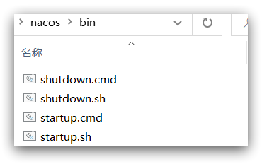
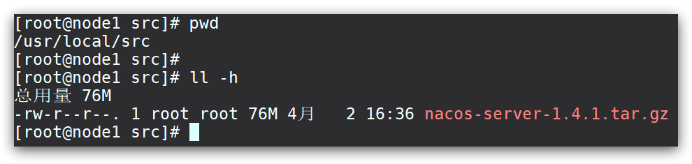
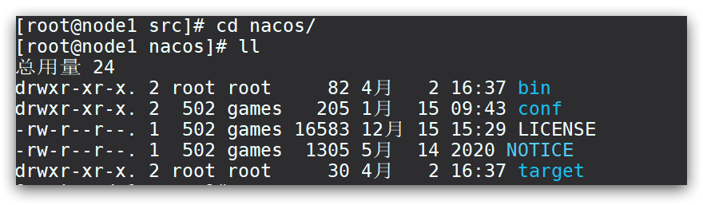

# Nacos 安装指南 🧙

[[TOC]]

# 1.Windows 安装

开发阶段采用单机安装即可。

## 1.1.下载安装包

在 Nacos 的 GitHub 页面，提供有下载链接，可以下载编译好的 Nacos 服务端或者源代码：

GitHub 主页：https://github.com/alibaba/nacos

GitHub 的 Release 下载页：https://github.com/alibaba/nacos/releases

如图：


本课程采用 1.4.1.版本的 Nacos，课前资料已经准备了安装包：


windows 版本使用`nacos-server-1.4.1.zip`包即可。

## 1.2.解压

将这个包解压到任意非中文目录下，如图：


目录说明：

- bin：启动脚本
- conf：配置文件

## 1.3.端口配置

Nacos 的默认端口是 8848，如果你电脑上的其它进程占用了 8848 端口，请先尝试关闭该进程。

**如果无法关闭占用 8848 端口的进程**，也可以进入 nacos 的 conf 目录，修改配置文件中的端口：


修改其中的内容：


## 1.4.启动

启动非常简单，进入 bin 目录，结构如下：



然后执行命令即可：

- windows 命令：

  ```cmd
  startup.cmd -m standalone
  ```

执行后的效果如图：


## 1.5.访问

在浏览器输入地址：http://127.0.0.1:8848/nacos即可：


默认的账号和密码都是 nacos，进入后：


# 2.Linux 安装

Linux 或者 Mac 安装方式与 Windows 类似。

## 2.1.安装 JDK

Nacos 依赖于 JDK 运行，索引 Linux 上也需要安装 JDK 才行。

上传 jdk 安装包：


上传到某个目录，例如：`/usr/local/`

然后解压缩：

```sh
tar -xvf jdk-8u144-linux-x64.tar.gz
```

然后重命名为 java

配置环境变量：

```sh
export JAVA_HOME=/usr/local/java
export PATH=$PATH:$JAVA_HOME/bin
```

设置环境变量：

```sh
source /etc/profile
```

## 2.2.上传安装包

如图：


也可以直接使用课前资料中的 tar.gz：


上传到 Linux 服务器的某个目录，例如`/usr/local/src`目录下：



## 2.3.解压

命令解压缩安装包：

```sh
tar -xvf nacos-server-1.4.1.tar.gz
```

然后删除安装包：

```sh
rm -rf nacos-server-1.4.1.tar.gz
```

目录中最终样式：


目录内部：



## 2.4.端口配置

与 windows 中类似

## 2.5.启动

在 nacos/bin 目录中，输入命令启动 Nacos：

```sh
sh startup.sh -m standalone
```

# 3.Nacos 的依赖

父工程：

```xml
<dependency>
    <groupId>com.alibaba.cloud</groupId>
    <artifactId>spring-cloud-alibaba-dependencies</artifactId>
    <version>2.2.5.RELEASE</version>
    <type>pom</type>
    <scope>import</scope>
</dependency>
```

客户端：

```xml
<!-- nacos客户端依赖包 -->
<dependency>
    <groupId>com.alibaba.cloud</groupId>
    <artifactId>spring-cloud-starter-alibaba-nacos-discovery</artifactId>
</dependency>

```
