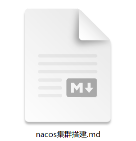
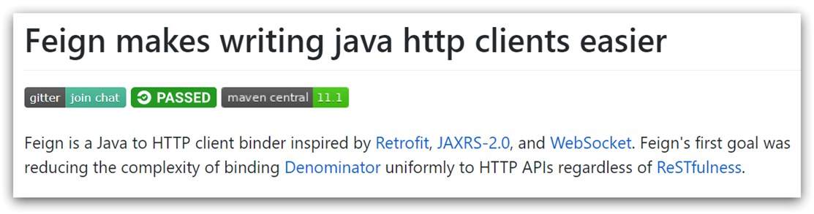
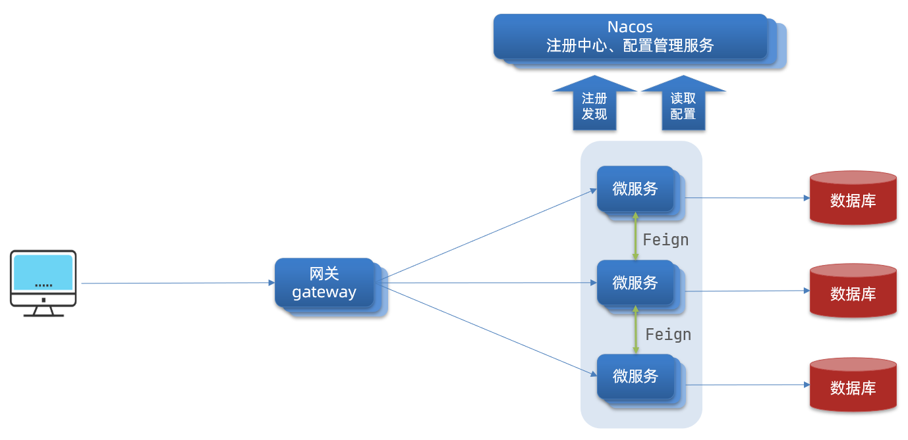

# SpringCloud 实用篇 02 🍑

[[TOC]]

# 0.学习目标

# 1.Nacos 配置管理

Nacos 除了可以做注册中心，同样可以做配置管理来使用。

## 1.1.统一配置管理

当微服务部署的实例越来越多，达到数十、数百时，逐个修改微服务配置就会让人抓狂，而且很容易出错。我们需要一种统一配置管理方案，可以集中管理所有实例的配置。


Nacos 一方面可以将配置集中管理，另一方可以在配置变更时，及时通知微服务，实现配置的热更新。

### 1.1.1.在 nacos 中添加配置文件

如何在 nacos 中管理配置呢？


然后在弹出的表单中，填写配置信息：


> 注意：项目的核心配置，需要热更新的配置才有放到 nacos 管理的必要。基本不会变更的一些配置还是保存在微服务本地比较好。

### 1.1.2.从微服务拉取配置

微服务要拉取 nacos 中管理的配置，并且与本地的 application.yml 配置合并，才能完成项目启动。

但如果尚未读取 application.yml，又如何得知 nacos 地址呢？

因此 spring 引入了一种新的配置文件：bootstrap.yaml 文件，会在 application.yml 之前被读取，流程如下：


1）引入 nacos-config 依赖

首先，在 user-service 服务中，引入 nacos-config 的客户端依赖：

```xml
<!--nacos配置管理依赖-->
<dependency>
    <groupId>com.alibaba.cloud</groupId>
    <artifactId>spring-cloud-starter-alibaba-nacos-config</artifactId>
</dependency>
```

2）添加 bootstrap.yaml

然后，在 user-service 中添加一个 bootstrap.yaml 文件，内容如下：

```yaml
spring:
  application:
    name: userservice # 服务名称
  profiles:
    active: dev #开发环境，这里是dev
  cloud:
    nacos:
      server-addr: localhost:8848 # Nacos地址
      config:
        file-extension: yaml # 文件后缀名
```

这里会根据 spring.cloud.nacos.server-addr 获取 nacos 地址，再根据

`${spring.application.name}-${spring.profiles.active}.${spring.cloud.nacos.config.file-extension}`作为文件 id，来读取配置。

本例中，就是去读取`userservice-dev.yaml`：


3）读取 nacos 配置

在 user-service 中的 UserController 中添加业务逻辑，读取 pattern.dateformat 配置：


完整代码：

```java
package cn.itcast.user.web;

import cn.itcast.user.pojo.User;
import cn.itcast.user.service.UserService;
import lombok.extern.slf4j.Slf4j;
import org.springframework.beans.factory.annotation.Autowired;
import org.springframework.beans.factory.annotation.Value;
import org.springframework.web.bind.annotation.*;

import java.time.LocalDateTime;
import java.time.format.DateTimeFormatter;

@Slf4j
@RestController
@RequestMapping("/user")
public class UserController {

    @Autowired
    private UserService userService;

    @Value("${pattern.dateformat}")
    private String dateformat;

    @GetMapping("now")
    public String now(){
        return LocalDateTime.now().format(DateTimeFormatter.ofPattern(dateformat));
    }
    // ...略
}
```

在页面访问，可以看到效果：


## 1.2.配置热更新

我们最终的目的，是修改 nacos 中的配置后，微服务中无需重启即可让配置生效，也就是**配置热更新**。

要实现配置热更新，可以使用两种方式：

### 1.2.1.方式一

在@Value 注入的变量所在类上添加注解@RefreshScope：


### 1.2.2.方式二

使用@ConfigurationProperties 注解代替@Value 注解。

在 user-service 服务中，添加一个类，读取 patterrn.dateformat 属性：

```java
package cn.itcast.user.config;

import lombok.Data;
import org.springframework.boot.context.properties.ConfigurationProperties;
import org.springframework.stereotype.Component;

@Component
@Data
@ConfigurationProperties(prefix = "pattern")
public class PatternProperties {
    private String dateformat;
}
```

在 UserController 中使用这个类代替@Value：


完整代码：

```java
package cn.itcast.user.web;

import cn.itcast.user.config.PatternProperties;
import cn.itcast.user.pojo.User;
import cn.itcast.user.service.UserService;
import lombok.extern.slf4j.Slf4j;
import org.springframework.beans.factory.annotation.Autowired;
import org.springframework.web.bind.annotation.GetMapping;
import org.springframework.web.bind.annotation.PathVariable;
import org.springframework.web.bind.annotation.RequestMapping;
import org.springframework.web.bind.annotation.RestController;

import java.time.LocalDateTime;
import java.time.format.DateTimeFormatter;

@Slf4j
@RestController
@RequestMapping("/user")
public class UserController {

    @Autowired
    private UserService userService;

    @Autowired
    private PatternProperties patternProperties;

    @GetMapping("now")
    public String now(){
        return LocalDateTime.now().format(DateTimeFormatter.ofPattern(patternProperties.getDateformat()));
    }

    // 略
}
```

## 1.3.配置共享

其实微服务启动时，会去 nacos 读取多个配置文件，例如：

- `[spring.application.name]-[spring.profiles.active].yaml`，例如：userservice-dev.yaml

- `[spring.application.name].yaml`，例如：userservice.yaml

而`[spring.application.name].yaml`不包含环境，因此可以被多个环境共享。

下面我们通过案例来测试配置共享

### 1）添加一个环境共享配置

我们在 nacos 中添加一个 userservice.yaml 文件：


### 2）在 user-service 中读取共享配置

在 user-service 服务中，修改 PatternProperties 类，读取新添加的属性：


在 user-service 服务中，修改 UserController，添加一个方法：


### 3）运行两个 UserApplication，使用不同的 profile

修改 UserApplication2 这个启动项，改变其 profile 值：


这样，UserApplication(8081)使用的 profile 是 dev，UserApplication2(8082)使用的 profile 是 test。

启动 UserApplication 和 UserApplication2

访问 http://localhost:8081/user/prop，结果：


访问 http://localhost:8082/user/prop，结果：


可以看出来，不管是 dev，还是 test 环境，都读取到了 envSharedValue 这个属性的值。

### 4）配置共享的优先级

当 nacos、服务本地同时出现相同属性时，优先级有高低之分：


## 1.4.搭建 Nacos 集群

Nacos 生产环境下一定要部署为集群状态，部署方式参考课前资料中的文档：



# 2.Feign 远程调用

先来看我们以前利用 RestTemplate 发起远程调用的代码：


存在下面的问题：

•代码可读性差，编程体验不统一

•参数复杂 URL 难以维护

Feign 是一个声明式的 http 客户端，官方地址：https://github.com/OpenFeign/feign

其作用就是帮助我们优雅的实现 http 请求的发送，解决上面提到的问题。



## 2.1.Feign 替代 RestTemplate

Fegin 的使用步骤如下：

### 1）引入依赖

我们在 order-service 服务的 pom 文件中引入 feign 的依赖：

```xml
<dependency>
    <groupId>org.springframework.cloud</groupId>
    <artifactId>spring-cloud-starter-openfeign</artifactId>
</dependency>
```

### 2）添加注解

在 order-service 的启动类添加注解开启 Feign 的功能：


### 3）编写 Feign 的客户端

在 order-service 中新建一个接口，内容如下：

```java
package cn.itcast.order.client;

import cn.itcast.order.pojo.User;
import org.springframework.cloud.openfeign.FeignClient;
import org.springframework.web.bind.annotation.GetMapping;
import org.springframework.web.bind.annotation.PathVariable;

@FeignClient("userservice")
public interface UserClient {
    @GetMapping("/user/{id}")
    User findById(@PathVariable("id") Long id);
}
```

这个客户端主要是基于 SpringMVC 的注解来声明远程调用的信息，比如：

- 服务名称：userservice
- 请求方式：GET
- 请求路径：/user/{id}
- 请求参数：Long id
- 返回值类型：User

这样，Feign 就可以帮助我们发送 http 请求，无需自己使用 RestTemplate 来发送了。

### 4）测试

修改 order-service 中的 OrderService 类中的 queryOrderById 方法，使用 Feign 客户端代替 RestTemplate：


是不是看起来优雅多了。

### 5）总结

使用 Feign 的步骤：

① 引入依赖

② 添加@EnableFeignClients 注解

③ 编写 FeignClient 接口

④ 使用 FeignClient 中定义的方法代替 RestTemplate

## 2.2.自定义配置

Feign 可以支持很多的自定义配置，如下表所示：

| 类型                   | 作用             | 说明                                                        |
| ---------------------- | ---------------- | ----------------------------------------------------------- |
| **feign.Logger.Level** | 修改日志级别     | 包含四种不同的级别：NONE、BASIC、HEADERS、FULL              |
| feign.codec.Decoder    | 响应结果的解析器 | http 远程调用的结果做解析，例如解析 json 字符串为 java 对象 |
| feign.codec.Encoder    | 请求参数编码     | 将请求参数编码，便于通过 http 请求发送                      |
| feign. Contract        | 支持的注解格式   | 默认是 SpringMVC 的注解                                     |
| feign. Retryer         | 失败重试机制     | 请求失败的重试机制，默认是没有，不过会使用 Ribbon 的重试    |

一般情况下，默认值就能满足我们使用，如果要自定义时，只需要创建自定义的@Bean 覆盖默认 Bean 即可。

下面以日志为例来演示如何自定义配置。

### 2.2.1.配置文件方式

基于配置文件修改 feign 的日志级别可以针对单个服务：

```yaml
feign:
  client:
    config:
      userservice: # 针对某个微服务的配置
        loggerLevel: FULL #  日志级别
```

也可以针对所有服务：

```yaml
feign:
  client:
    config:
      default: # 这里用default就是全局配置，如果是写服务名称，则是针对某个微服务的配置
        loggerLevel: FULL #  日志级别
```

而日志的级别分为四种：

- NONE：不记录任何日志信息，这是默认值。
- BASIC：仅记录请求的方法，URL 以及响应状态码和执行时间
- HEADERS：在 BASIC 的基础上，额外记录了请求和响应的头信息
- FULL：记录所有请求和响应的明细，包括头信息、请求体、元数据。

### 2.2.2.Java 代码方式

也可以基于 Java 代码来修改日志级别，先声明一个类，然后声明一个 Logger.Level 的对象：

```java
public class DefaultFeignConfiguration  {
    @Bean
    public Logger.Level feignLogLevel(){
        return Logger.Level.BASIC; // 日志级别为BASIC
    }
}
```

如果要**全局生效**，将其放到启动类的@EnableFeignClients 这个注解中：

```java
@EnableFeignClients(defaultConfiguration = DefaultFeignConfiguration .class)
```

如果是**局部生效**，则把它放到对应的@FeignClient 这个注解中：

```java
@FeignClient(value = "userservice", configuration = DefaultFeignConfiguration .class)
```

## 2.3.Feign 使用优化

Feign 底层发起 http 请求，依赖于其它的框架。其底层客户端实现包括：

•URLConnection：默认实现，不支持连接池

•Apache HttpClient ：支持连接池

•OKHttp：支持连接池

因此提高 Feign 的性能主要手段就是使用**连接池**代替默认的 URLConnection。

这里我们用 Apache 的 HttpClient 来演示。

1）引入依赖

在 order-service 的 pom 文件中引入 Apache 的 HttpClient 依赖：

```xml
<!--httpClient的依赖 -->
<dependency>
    <groupId>io.github.openfeign</groupId>
    <artifactId>feign-httpclient</artifactId>
</dependency>
```

2）配置连接池

在 order-service 的 application.yml 中添加配置：

```yaml
feign:
  client:
    config:
      default: # default全局的配置
        loggerLevel: BASIC # 日志级别，BASIC就是基本的请求和响应信息
  httpclient:
    enabled: true # 开启feign对HttpClient的支持
    max-connections: 200 # 最大的连接数
    max-connections-per-route: 50 # 每个路径的最大连接数
```

接下来，在 FeignClientFactoryBean 中的 loadBalance 方法中打断点：


Debug 方式启动 order-service 服务，可以看到这里的 client，底层就是 Apache HttpClient：


总结，Feign 的优化：

1.日志级别尽量用 basic

2.使用 HttpClient 或 OKHttp 代替 URLConnection

① 引入 feign-httpClient 依赖

② 配置文件开启 httpClient 功能，设置连接池参数

## 2.4.最佳实践

所谓最近实践，就是使用过程中总结的经验，最好的一种使用方式。

自习观察可以发现，Feign 的客户端与服务提供者的 controller 代码非常相似：

feign 客户端：


UserController：


有没有一种办法简化这种重复的代码编写呢？

### 2.4.1.继承方式

一样的代码可以通过继承来共享：

1）定义一个 API 接口，利用定义方法，并基于 SpringMVC 注解做声明。

2）Feign 客户端和 Controller 都集成改接口


优点：

- 简单
- 实现了代码共享

缺点：

- 服务提供方、服务消费方紧耦合

- 参数列表中的注解映射并不会继承，因此 Controller 中必须再次声明方法、参数列表、注解

### 2.4.2.抽取方式

将 Feign 的 Client 抽取为独立模块，并且把接口有关的 POJO、默认的 Feign 配置都放到这个模块中，提供给所有消费者使用。

例如，将 UserClient、User、Feign 的默认配置都抽取到一个 feign-api 包中，所有微服务引用该依赖包，即可直接使用。


### 2.4.3.实现基于抽取的最佳实践

#### 1）抽取

首先创建一个 module，命名为 feign-api：


项目结构：


在 feign-api 中然后引入 feign 的 starter 依赖

```xml
<dependency>
    <groupId>org.springframework.cloud</groupId>
    <artifactId>spring-cloud-starter-openfeign</artifactId>
</dependency>
```

然后，order-service 中编写的 UserClient、User、DefaultFeignConfiguration 都复制到 feign-api 项目中


#### 2）在 order-service 中使用 feign-api

首先，删除 order-service 中的 UserClient、User、DefaultFeignConfiguration 等类或接口。

在 order-service 的 pom 文件中中引入 feign-api 的依赖：

```xml
<dependency>
    <groupId>cn.itcast.demo</groupId>
    <artifactId>feign-api</artifactId>
    <version>1.0</version>
</dependency>
```

修改 order-service 中的所有与上述三个组件有关的导包部分，改成导入 feign-api 中的包

#### 3）重启测试

重启后，发现服务报错了：


这是因为 UserClient 现在在 cn.itcast.feign.clients 包下，

而 order-service 的@EnableFeignClients 注解是在 cn.itcast.order 包下，不在同一个包，无法扫描到 UserClient。

#### 4）解决扫描包问题

方式一：

指定 Feign 应该扫描的包：

```java
@EnableFeignClients(basePackages = "cn.itcast.feign.clients")
```

方式二：

指定需要加载的 Client 接口：

```java
@EnableFeignClients(clients = {UserClient.class})
```

# 3.Gateway 服务网关

Spring Cloud Gateway 是 Spring Cloud 的一个全新项目，该项目是基于 Spring 5.0，Spring Boot 2.0 和 Project Reactor 等响应式编程和事件流技术开发的网关，它旨在为微服务架构提供一种简单有效的统一的 API 路由管理方式。

## 3.1.为什么需要网关

Gateway 网关是我们服务的守门神，所有微服务的统一入口。

网关的**核心功能特性**：

- 请求路由
- 权限控制
- 限流

架构图：



**权限控制**：网关作为微服务入口，需要校验用户是是否有请求资格，如果没有则进行拦截。

**路由和负载均衡**：一切请求都必须先经过 gateway，但网关不处理业务，而是根据某种规则，把请求转发到某个微服务，这个过程叫做路由。当然路由的目标服务有多个时，还需要做负载均衡。

**限流**：当请求流量过高时，在网关中按照下流的微服务能够接受的速度来放行请求，避免服务压力过大。

在 SpringCloud 中网关的实现包括两种：

- gateway
- zuul

Zuul 是基于 Servlet 的实现，属于阻塞式编程。而 SpringCloudGateway 则是基于 Spring5 中提供的 WebFlux，属于响应式编程的实现，具备更好的性能。

## 3.2.gateway 快速入门

下面，我们就演示下网关的基本路由功能。基本步骤如下：

1. 创建 SpringBoot 工程 gateway，引入网关依赖
2. 编写启动类
3. 编写基础配置和路由规则
4. 启动网关服务进行测试

### 1）创建 gateway 服务，引入依赖

创建服务：


引入依赖：

```xml
<!--网关-->
<dependency>
    <groupId>org.springframework.cloud</groupId>
    <artifactId>spring-cloud-starter-gateway</artifactId>
</dependency>
<!--nacos服务发现依赖-->
<dependency>
    <groupId>com.alibaba.cloud</groupId>
    <artifactId>spring-cloud-starter-alibaba-nacos-discovery</artifactId>
</dependency>
```

### 2）编写启动类

```java
package cn.itcast.gateway;

import org.springframework.boot.SpringApplication;
import org.springframework.boot.autoconfigure.SpringBootApplication;

@SpringBootApplication
public class GatewayApplication {

	public static void main(String[] args) {
		SpringApplication.run(GatewayApplication.class, args);
	}
}
```

### 3）编写基础配置和路由规则

创建 application.yml 文件，内容如下：

```yaml
server:
  port: 10010 # 网关端口
spring:
  application:
    name: gateway # 服务名称
  cloud:
    nacos:
      server-addr: localhost:8848 # nacos地址
    gateway:
      routes: # 网关路由配置
        - id: user-service # 路由id，自定义，只要唯一即可
          # uri: http://127.0.0.1:8081 # 路由的目标地址 http就是固定地址
          uri: lb://userservice # 路由的目标地址 lb就是负载均衡，后面跟服务名称
          predicates: # 路由断言，也就是判断请求是否符合路由规则的条件
            - Path=/user/** # 这个是按照路径匹配，只要以/user/开头就符合要求
```

我们将符合`Path` 规则的一切请求，都代理到 `uri`参数指定的地址。

本例中，我们将 `/user/**`开头的请求，代理到`lb://userservice`，lb 是负载均衡，根据服务名拉取服务列表，实现负载均衡。

### 4）重启测试

重启网关，访问 http://localhost:10010/user/1 时，符合`/user/**`规则，请求转发到 uri：http://userservice/user/1，得到了结果：


### 5）网关路由的流程图

整个访问的流程如下：


总结：

网关搭建步骤：

1. 创建项目，引入 nacos 服务发现和 gateway 依赖

2. 配置 application.yml，包括服务基本信息、nacos 地址、路由

路由配置包括：

1. 路由 id：路由的唯一标示

2. 路由目标（uri）：路由的目标地址，http 代表固定地址，lb 代表根据服务名负载均衡

3. 路由断言（predicates）：判断路由的规则，

4. 路由过滤器（filters）：对请求或响应做处理

接下来，就重点来学习路由断言和路由过滤器的详细知识

## 3.3.断言工厂

我们在配置文件中写的断言规则只是字符串，这些字符串会被 Predicate Factory 读取并处理，转变为路由判断的条件

例如 Path=/user/\*\*是按照路径匹配，这个规则是由

`org.springframework.cloud.gateway.handler.predicate.PathRoutePredicateFactory`类来

处理的，像这样的断言工厂在 SpringCloudGateway 还有十几个:

| **名称**   | **说明**                        | **示例**                                                                                               |
| ---------- | ------------------------------- | ------------------------------------------------------------------------------------------------------ |
| After      | 是某个时间点后的请求            | - After=2037-01-20T17:42:47.789-07:00[America/Denver]                                                  |
| Before     | 是某个时间点之前的请求          | - Before=2031-04-13T15:14:47.433+08:00[Asia/Shanghai]                                                  |
| Between    | 是某两个时间点之前的请求        | - Between=2037-01-20T17:42:47.789-07:00[America/Denver], 2037-01-21T17:42:47.789-07:00[America/Denver] |
| Cookie     | 请求必须包含某些 cookie         | - Cookie=chocolate, ch.p                                                                               |
| Header     | 请求必须包含某些 header         | - Header=X-Request-Id, \d+                                                                             |
| Host       | 请求必须是访问某个 host（域名） | - Host=**.somehost.org,**.anotherhost.org                                                              |
| Method     | 请求方式必须是指定方式          | - Method=GET,POST                                                                                      |
| Path       | 请求路径必须符合指定规则        | - Path=/red/{segment},/blue/\*\*                                                                       |
| Query      | 请求参数必须包含指定参数        | - Query=name, Jack 或者- Query=name                                                                    |
| RemoteAddr | 请求者的 ip 必须是指定范围      | - RemoteAddr=192.168.1.1/24                                                                            |
| Weight     | 权重处理                        |                                                                                                        |

大多数情况下我们只需要掌握 Path 这种路由工厂就可以了。

## 3.4.过滤器工厂

GatewayFilter 是网关中提供的一种过滤器，可以对进入网关的**请求**和微服务返回的**响应**做处理：


### 3.4.1.路由过滤器的种类

Spring 提供了 31 种不同的路由过滤器工厂。例如：

| **名称**             | **说明**                     |
| -------------------- | ---------------------------- |
| AddRequestHeader     | 给当前请求添加一个请求头     |
| RemoveRequestHeader  | 移除请求中的一个请求头       |
| AddResponseHeader    | 给响应结果中添加一个响应头   |
| RemoveResponseHeader | 从响应结果中移除有一个响应头 |
| RequestRateLimiter   | 限制请求的流量               |

### 3.4.2.请求头过滤器

下面我们以 AddRequestHeader 为例来讲解。

> **需求**：给所有进入 userservice 的请求添加一个请求头：Truth=itcast is freaking awesome!

只需要修改 gateway 服务的 application.yml 文件，添加路由过滤即可：

```yaml
spring:
  cloud:
    gateway:
      routes:
        - id: user-service
          uri: lb://userservice
          predicates:
            - Path=/user/**
          filters: # 过滤器
            - AddRequestHeader=Truth, Itcast is freaking awesome! # 添加请求头
```

当前过滤器写在 userservice 路由下，因此仅仅对访问 userservice 的请求有效。

### 3.4.3.默认过滤器

如果要对所有的路由都生效，则可以将过滤器工厂写到 default 下。格式如下：

```yaml
spring:
  cloud:
    gateway:
      routes:
        - id: user-service
          uri: lb://userservice
          predicates:
            - Path=/user/**
      default-filters: # 默认过滤项
        - AddRequestHeader=Truth, Itcast is freaking awesome!
```

### 3.4.4.总结

过滤器的作用是什么？

① 对路由的请求或响应做加工处理，比如添加请求头

② 配置在路由下的过滤器只对当前路由的请求生效

defaultFilters 的作用是什么？

① 对所有路由都生效的过滤器

## 3.5.全局过滤器

上一节学习的过滤器，网关提供了 31 种，但每一种过滤器的作用都是固定的。如果我们希望拦截请求，做自己的业务逻辑则没办法实现。

### 3.5.1.全局过滤器作用

全局过滤器的作用也是处理一切进入网关的请求和微服务响应，与 GatewayFilter 的作用一样。区别在于 GatewayFilter 通过配置定义，处理逻辑是固定的；而 GlobalFilter 的逻辑需要自己写代码实现。

定义方式是实现 GlobalFilter 接口。

```java
public interface GlobalFilter {
    /**
     *  处理当前请求，有必要的话通过{@link GatewayFilterChain}将请求交给下一个过滤器处理
     *
     * @param exchange 请求上下文，里面可以获取Request、Response等信息
     * @param chain 用来把请求委托给下一个过滤器
     * @return {@code Mono<Void>} 返回标示当前过滤器业务结束
     */
    Mono<Void> filter(ServerWebExchange exchange, GatewayFilterChain chain);
}
```

在 filter 中编写自定义逻辑，可以实现下列功能：

- 登录状态判断
- 权限校验
- 请求限流等

### 3.5.2.自定义全局过滤器

需求：定义全局过滤器，拦截请求，判断请求的参数是否满足下面条件：

- 参数中是否有 authorization，

- authorization 参数值是否为 admin

如果同时满足则放行，否则拦截

实现：

在 gateway 中定义一个过滤器：

```java
package cn.itcast.gateway.filters;

import org.springframework.cloud.gateway.filter.GatewayFilterChain;
import org.springframework.cloud.gateway.filter.GlobalFilter;
import org.springframework.core.annotation.Order;
import org.springframework.http.HttpStatus;
import org.springframework.stereotype.Component;
import org.springframework.web.server.ServerWebExchange;
import reactor.core.publisher.Mono;

//@Order(-1)// 将来会有N个过滤器 Order就是来设置过滤器执行顺序的 值越小优先级越高
@Component
public class AuthorizeFilter implements GlobalFilter, Ordered {
    @Override
    public Mono<Void> filter(ServerWebExchange exchange, GatewayFilterChain chain) {
        // 1.获取请求参数
        MultiValueMap<String, String> params = exchange.getRequest().getQueryParams();
        // 2.获取authorization参数
        String auth = params.getFirst("authorization");
        // 3.校验
        if ("admin".equals(auth)) {
            // 放行
            return chain.filter(exchange);
        }
        // 4.拦截
        // 4.1.禁止访问，设置状态码
        exchange.getResponse().setStatusCode(HttpStatus.FORBIDDEN);
        // 4.2.结束处理
        return exchange.getResponse().setComplete();
    }

    /**
     * 也可以用实现接口的方式 进行排序
     *
     * @return
     */
    @Override
    public int getOrder() {
        return -1;
    }
}
```

### 3.5.3.过滤器执行顺序

请求进入网关会碰到三类过滤器：当前路由的过滤器、DefaultFilter、GlobalFilter

请求路由后，会将当前路由过滤器和 DefaultFilter、GlobalFilter，合并到一个过滤器链（集合）中，排序后依次执行每个过滤器：


排序的规则是什么呢？

- 每一个过滤器都必须指定一个 int 类型的 order 值，**order 值越小，优先级越高，执行顺序越靠前**。
- GlobalFilter 通过实现 Ordered 接口，或者添加@Order 注解来指定 order 值，由我们自己指定
- 路由过滤器和 defaultFilter 的 order 由 Spring 指定，默认是按照声明顺序从 1 递增。
- 当过滤器的 order 值一样时，会按照 defaultFilter > 路由过滤器 > GlobalFilter 的顺序执行。

详细内容，可以查看源码：

`org.springframework.cloud.gateway.route.RouteDefinitionRouteLocator#getFilters()`方法是先加载 defaultFilters，然后再加载某个 route 的 filters，然后合并。

`org.springframework.cloud.gateway.handler.FilteringWebHandler#handle()`方法会加载全局过滤器，与前面的过滤器合并后根据 order 排序，组织过滤器链

## 3.6.跨域问题

### 3.6.1.什么是跨域问题

跨域：域名不一致就是跨域，主要包括：

- 域名不同： www.taobao.com 和 www.taobao.org 和 www.jd.com 和 miaosha.jd.com

- 域名相同，端口不同：localhost:8080 和 localhost8081

跨域问题：**浏览器禁止**请求的发起者与服务端发生跨域**ajax 请求**，请求被浏览器拦截的问题

解决方案：CORS，这个以前应该学习过，这里不再赘述了。不知道的小伙伴可以查看https://www.ruanyifeng.com/blog/2016/04/cors.html

### 3.6.2.模拟跨域问题

找到课前资料的页面文件：


放入 tomcat 或者 nginx 这样的 web 服务器中，启动并访问。

可以在浏览器控制台看到下面的错误：


从 localhost:8090 访问 localhost:10010，端口不同，显然是跨域的请求。

### 3.6.3.解决跨域问题

在 gateway 服务的 application.yml 文件中，添加下面的配置：

```yaml
spring:
  cloud:
    gateway:
      # 。。。
      globalcors: # 全局的跨域处理
        add-to-simple-url-handler-mapping: true # 解决options请求被拦截问题
        corsConfigurations:
          '[/**]':
            allowedOrigins: # 允许哪些网站的跨域请求
              - 'http://localhost:8090'
            allowedMethods: # 允许的跨域ajax的请求方式
              - 'GET'
              - 'POST'
              - 'DELETE'
              - 'PUT'
              - 'OPTIONS'
            allowedHeaders: '*' # 允许在请求中携带的头信息
            allowCredentials: true # 是否允许携带cookie
            maxAge: 360000 # 这次跨域检测的有效期
```
