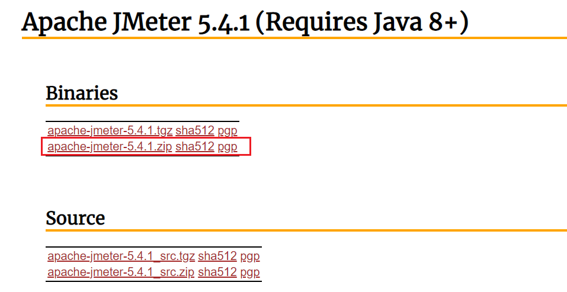
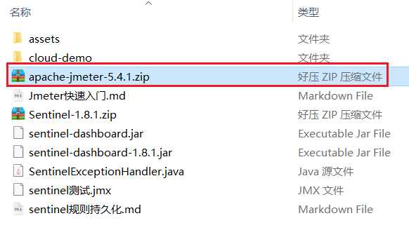
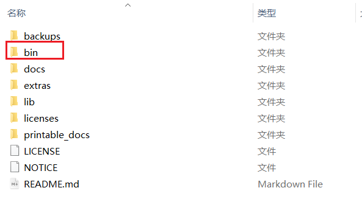
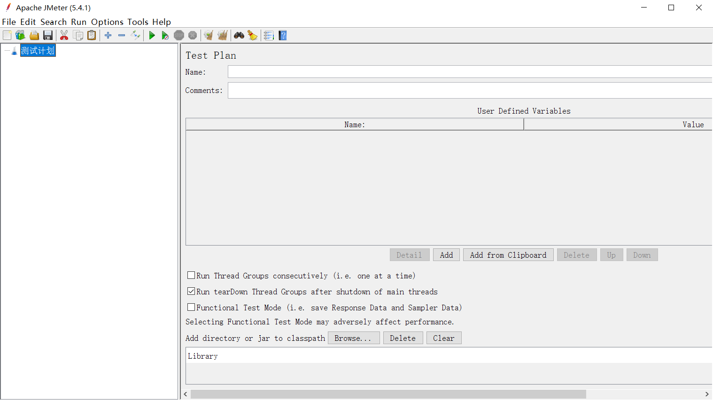
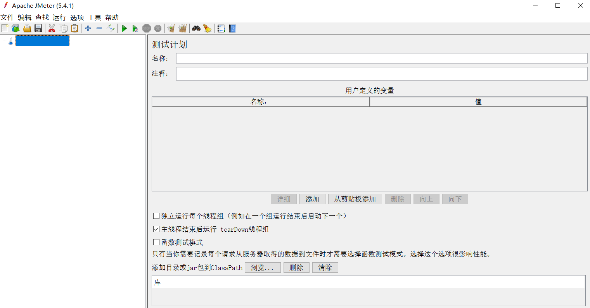
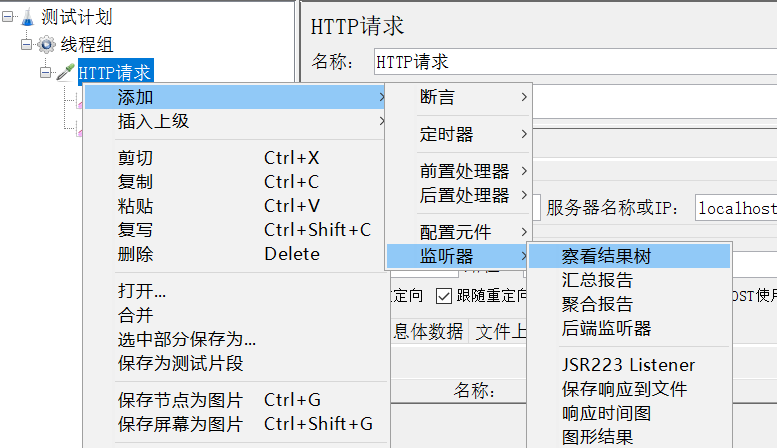
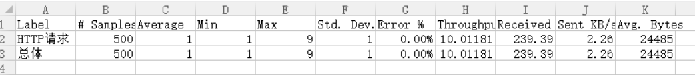
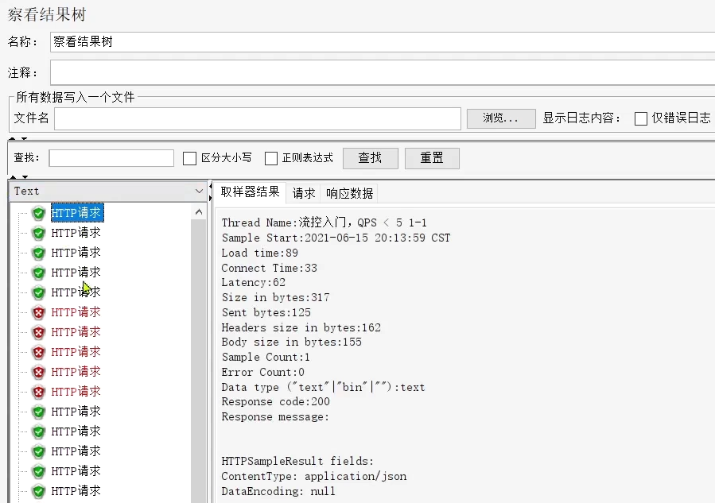

# Jmeter 快速入门 🧙

[[TOC]]

# 1.安装 Jmeter

Jmeter 依赖于 JDK，所以必须确保当前计算机上已经安装了 JDK，并且配置了环境变量。

## 1.1.下载

可以 Apache Jmeter 官网下载，地址：http://jmeter.apache.org/download_jmeter.cgi



当然，我们课前资料也提供了下载好的安装包：



## 1.2.解压

因为下载的是 zip 包，解压缩即可使用，目录结构如下：



其中的 bin 目录就是执行的脚本，其中包含启动脚本：


### 1.3.运行

双击即可运行，但是有两点注意：

- 启动速度比较慢，要耐心等待
- 启动后黑窗口不能关闭，否则 Jmeter 也跟着关闭了



# 2.快速入门

## 2.1.设置中文语言

默认 Jmeter 的语言是英文，需要设置：


效果：



> **注意**：上面的配置只能保证本次运行是中文，如果要永久中文，需要修改 Jmeter 的配置文件

打开 jmeter 文件夹，在 bin 目录中找到 **jmeter.properties**，添加下面配置：

```properties
language=zh_CN
```


> 注意：前面不要出现#，#代表注释，另外这里是下划线，不是中划线

## 2.2.基本用法

在测试计划上点鼠标右键，选择添加 > 线程（用户） > 线程组：


在新增的线程组中，填写线程信息：


给线程组点鼠标右键，添加 http 取样器：


编写取样器内容：


添加监听报告：


添加监听结果树：



汇总报告结果：



结果树：


