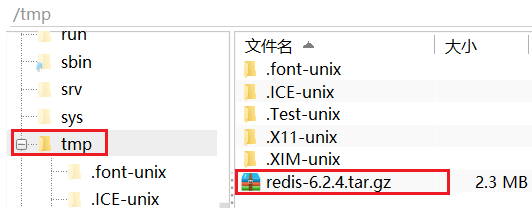
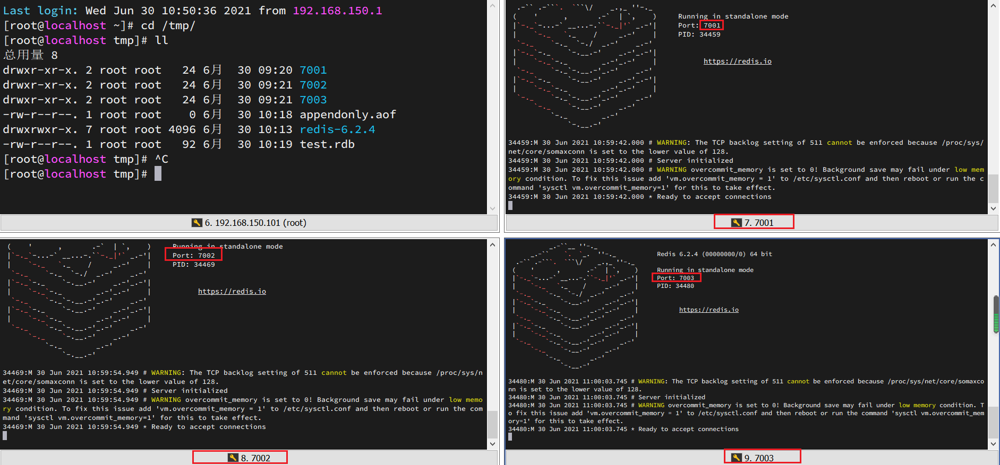
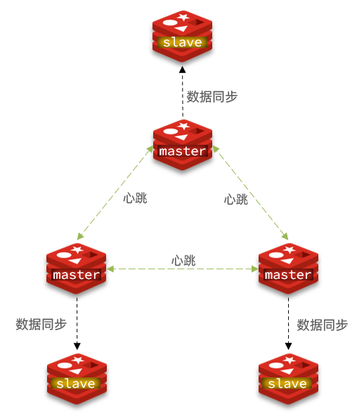

# Redis 集群 🧙

[[TOC]]

本章是基于 CentOS7 下的 Redis 集群教程，包括：

- 单机安装 Redis
- Redis 主从
- Redis 分片集群

# 1.单机安装 Redis

首先需要安装 Redis 所需要的依赖：

```sh
yum install -y gcc tcl
```

然后将课前资料提供的 Redis 安装包上传到虚拟机的任意目录：


例如，我放到了/tmp 目录：



解压缩：

```sh
tar -xvf redis-6.2.4.tar.gz
```

解压后：


进入 redis 目录：

```sh
cd redis-6.2.4
```

运行编译命令：

```sh
make && make install
```

如果没有出错，应该就安装成功了。

然后修改 redis.conf 文件中的一些配置：

```properties
# 绑定地址，默认是127.0.0.1，会导致只能在本地访问。修改为0.0.0.0则可以在任意IP访问
bind 0.0.0.0
# 数据库数量，设置为1
databases 1
```

启动 Redis：

```sh
redis-server redis.conf
```

停止 redis 服务：

```sh
redis-cli shutdown
```

# 2.Redis 主从集群

## 2.1.集群结构

我们搭建的主从集群结构如图：


共包含三个节点，一个主节点，两个从节点。

这里我们会在同一台虚拟机中开启 3 个 redis 实例，模拟主从集群，信息如下：

|       IP        | PORT |  角色  |
| :-------------: | :--: | :----: |
| 192.168.150.101 | 7001 | master |
| 192.168.150.101 | 7002 | slave  |
| 192.168.150.101 | 7003 | slave  |

## 2.2.准备实例和配置

要在同一台虚拟机开启 3 个实例，必须准备三份不同的配置文件和目录，配置文件所在目录也就是工作目录。

1）创建目录

我们创建三个文件夹，名字分别叫 7001、7002、7003：

```sh
# 进入/tmp目录
cd /tmp
# 创建目录
mkdir 7001 7002 7003
```

如图：


2）恢复原始配置

修改 redis-6.2.4/redis.conf 文件，将其中的持久化模式改为默认的 RDB 模式，AOF 保持关闭状态。

```properties
# 开启RDB
# save ""
save 3600 1
save 300 100
save 60 10000

# 关闭AOF
appendonly no
```

3）拷贝配置文件到每个实例目录

然后将 redis-6.2.4/redis.conf 文件拷贝到三个目录中（在/tmp 目录执行下列命令）：

```sh
# 方式一：逐个拷贝
cp redis-6.2.4/redis.conf 7001
cp redis-6.2.4/redis.conf 7002
cp redis-6.2.4/redis.conf 7003
# 方式二：管道组合命令，一键拷贝
echo 7001 7002 7003 | xargs -t -n 1 cp redis-6.2.4/redis.conf
```

4）修改每个实例的端口、工作目录

修改每个文件夹内的配置文件，将端口分别修改为 7001、7002、7003，将 rdb 文件保存位置都修改为自己所在目录（在/tmp 目录执行下列命令）：

```sh
sed -i -e 's/6379/7001/g' -e 's/dir .\//dir \/tmp\/7001\//g' 7001/redis.conf
sed -i -e 's/6379/7002/g' -e 's/dir .\//dir \/tmp\/7002\//g' 7002/redis.conf
sed -i -e 's/6379/7003/g' -e 's/dir .\//dir \/tmp\/7003\//g' 7003/redis.conf
```

5）修改每个实例的声明 IP

虚拟机本身有多个 IP，为了避免将来混乱，我们需要在 redis.conf 文件中指定每一个实例的绑定 ip 信息，格式如下：

```properties
# redis实例的声明 IP
replica-announce-ip 192.168.150.101
```

每个目录都要改，我们一键完成修改（在/tmp 目录执行下列命令）：

```sh
# 逐一执行
sed -i '1a replica-announce-ip 192.168.150.101' 7001/redis.conf
sed -i '1a replica-announce-ip 192.168.150.101' 7002/redis.conf
sed -i '1a replica-announce-ip 192.168.150.101' 7003/redis.conf

# 或者一键修改
printf '%s\n' 7001 7002 7003 | xargs -I{} -t sed -i '1a replica-announce-ip 192.168.126.129' {}/redis.conf
```

## 2.3.启动

为了方便查看日志，我们打开 3 个 ssh 窗口，分别启动 3 个 redis 实例，启动命令：

```sh
# 第1个
redis-server 7001/redis.conf
# 第2个
redis-server 7002/redis.conf
# 第3个
redis-server 7003/redis.conf
```

启动后：



如果要一键停止，可以运行下面命令：

```sh
printf '%s\n' 7001 7002 7003 | xargs -I{} -t redis-cli -p {} shutdown
```

## 2.4.开启主从关系

现在三个实例还没有任何关系，要配置主从可以使用 replicaof 或者 slaveof（5.0 以前）命令。

有临时和永久两种模式：

- 修改配置文件（永久生效）

  - 在 redis.conf 中添加一行配置：`slaveof <masterip> <masterport>`

- 使用 redis-cli 客户端连接到 redis 服务，执行 slaveof 命令（重启后失效）：

  ```sh
  slaveof <masterip> <masterport>
  ```

<strong><font color='red'>注意</font></strong>：在 5.0 以后新增命令 replicaof，与 salveof 效果一致。

这里我们为了演示方便，使用方式二。

通过 redis-cli 命令连接 7002，执行下面命令：

```sh
# 连接 7002
redis-cli -p 7002
# 执行slaveof
slaveof 192.168.126.129 7001
```

通过 redis-cli 命令连接 7003，执行下面命令：

```sh
# 连接 7003
redis-cli -p 7003
# 执行slaveof
slaveof 192.168.126.129 7001
```

然后连接 7001 节点，查看集群状态：

```sh
# 连接 7001
redis-cli -p 7001
# 查看状态
info replication
```

结果：


## 2.5.测试

执行下列操作以测试：

- 利用 redis-cli 连接 7001，执行`set num 123`

- 利用 redis-cli 连接 7002，执行`get num`，再执行`set num 666`

- 利用 redis-cli 连接 7003，执行`get num`，再执行`set num 888`

可以发现，只有在 7001 这个 master 节点上可以执行写操作，7002 和 7003 这两个 slave 节点只能执行读操作。

# 3.搭建哨兵集群

## 3.1.集群结构

这里我们搭建一个三节点形成的 Sentinel 集群，来监管之前的 Redis 主从集群。如图：


三个 sentinel 实例信息如下：

| 节点 |       IP        | PORT  |
| ---- | :-------------: | :---: |
| s1   | 192.168.150.101 | 27001 |
| s2   | 192.168.150.101 | 27002 |
| s3   | 192.168.150.101 | 27003 |

## 3.2.准备实例和配置

要在同一台虚拟机开启 3 个实例，必须准备三份不同的配置文件和目录，配置文件所在目录也就是工作目录。

我们创建三个文件夹，名字分别叫 s1、s2、s3：

```sh
# 进入/tmp目录
cd /tmp
# 创建目录
mkdir s1 s2 s3
```

如图：


然后我们在 s1 目录创建一个 sentinel.conf 文件，添加下面的内容：

```ini
port 27001
sentinel announce-ip 192.168.126.129
sentinel monitor mymaster 192.168.126.129 7001 2
sentinel down-after-milliseconds mymaster 5000
sentinel failover-timeout mymaster 60000
dir "/tmp/s1"
```

解读：

- `port 27001`：是当前 sentinel 实例的端口
- `sentinel monitor mymaster 192.168.150.101 7001 2`：指定主节点信息
  - `mymaster`：主节点名称，自定义，任意写
  - `192.168.150.101 7001`：主节点的 ip 和端口
  - `2`：选举 master 时的 quorum 值

然后将 s1/sentinel.conf 文件拷贝到 s2、s3 两个目录中（在/tmp 目录执行下列命令）：

```sh
# 方式一：逐个拷贝
cp s1/sentinel.conf s2
cp s1/sentinel.conf s3
# 方式二：管道组合命令，一键拷贝
echo s2 s3 | xargs -t -n 1 cp s1/sentinel.conf
```

修改 s2、s3 两个文件夹内的配置文件，将端口分别修改为 27002、27003：

```sh
sed -i -e 's/27001/27002/g' -e 's/s1/s2/g' s2/sentinel.conf
sed -i -e 's/27001/27003/g' -e 's/s1/s3/g' s3/sentinel.conf
```

## 3.3.启动

为了方便查看日志，我们打开 3 个 ssh 窗口，分别启动 3 个 redis 实例，启动命令：

```sh
# 第1个
redis-sentinel s1/sentinel.conf
# 第2个
redis-sentinel s2/sentinel.conf
# 第3个
redis-sentinel s3/sentinel.conf
```

启动后：


## 3.4.测试

尝试让 master 节点 7001 宕机，查看 sentinel 日志：


查看 7003 的日志：


查看 7002 的日志：


# 4.搭建分片集群

## 4.1.集群结构

分片集群需要的节点数量较多，这里我们搭建一个最小的分片集群，包含 3 个 master 节点，每个 master 包含一个 slave 节点，结构如下：



这里我们会在同一台虚拟机中开启 6 个 redis 实例，模拟分片集群，信息如下：

|       IP        | PORT |  角色  |
| :-------------: | :--: | :----: |
| 192.168.150.101 | 7001 | master |
| 192.168.150.101 | 7002 | master |
| 192.168.150.101 | 7003 | master |
| 192.168.150.101 | 8001 | slave  |
| 192.168.150.101 | 8002 | slave  |
| 192.168.150.101 | 8003 | slave  |

## 4.2.准备实例和配置

删除之前的 7001、7002、7003 这几个目录，重新创建出 7001、7002、7003、8001、8002、8003 目录：

```sh
# 进入/tmp目录
cd /tmp
# 删除旧的，避免配置干扰
rm -rf 7001 7002 7003
# 创建目录
mkdir 7001 7002 7003 8001 8002 8003
```

在/tmp 下准备一个新的 redis.conf 文件，内容如下：

```ini
port 6379
# 开启集群功能
cluster-enabled yes
# 集群的配置文件名称，不需要我们创建，由redis自己维护
cluster-config-file /tmp/6379/nodes.conf
# 节点心跳失败的超时时间
cluster-node-timeout 5000
# 持久化文件存放目录
dir /tmp/6379
# 绑定地址
bind 0.0.0.0
# 让redis后台运行
daemonize yes
# 注册的实例ip
replica-announce-ip 192.168.150.101
# 保护模式
protected-mode no
# 数据库数量
databases 1
# 日志
logfile /tmp/6379/run.log
```

将这个文件拷贝到每个目录下：

```sh
# 进入/tmp目录
cd /tmp
# 执行拷贝
echo 7001 7002 7003 8001 8002 8003 | xargs -t -n 1 cp redis.conf
```

修改每个目录下的 redis.conf，将其中的 6379 修改为与所在目录一致：

```sh
# 进入/tmp目录
cd /tmp
# 修改配置文件
printf '%s\n' 7001 7002 7003 8001 8002 8003 | xargs -I{} -t sed -i 's/6379/{}/g' {}/redis.conf
```

## 4.3.启动

因为已经配置了后台启动模式，所以可以直接启动服务：

```sh
# 进入/tmp目录
cd /tmp
# 一键启动所有服务
printf '%s\n' 7001 7002 7003 8001 8002 8003 | xargs -I{} -t redis-server {}/redis.conf
```

通过 ps 查看状态：

```sh
ps -ef | grep redis
```

发现服务都已经正常启动：


如果要关闭所有进程，可以执行命令：

```sh
ps -ef | grep redis | awk '{print $2}' | xargs kill
```

或者（推荐这种方式）：

```sh
printf '%s\n' 7001 7002 7003 8001 8002 8003 | xargs -I{} -t redis-cli -p {} shutdown
```

## 4.4.创建集群

虽然服务启动了，但是目前每个服务之间都是独立的，没有任何关联。

我们需要执行命令来创建集群，在 Redis5.0 之前创建集群比较麻烦，5.0 之后集群管理命令都集成到了 redis-cli 中。

1）Redis5.0 之前

Redis5.0 之前集群命令都是用 redis 安装包下的 src/redis-trib.rb 来实现的。因为 redis-trib.rb 是有 ruby 语言编写的所以需要安装 ruby 环境。

```sh
# 安装依赖
yum -y install zlib ruby rubygems
gem install redis
```

然后通过命令来管理集群：

```sh
# 进入redis的src目录
cd /tmp/redis-6.2.4/src
# 创建集群
./redis-trib.rb create --replicas 1 192.168.150.101:7001 192.168.150.101:7002 192.168.150.101:7003 192.168.150.101:8001 192.168.150.101:8002 192.168.150.101:8003
```

2）Redis5.0 以后

我们使用的是 Redis6.2.4 版本，集群管理以及集成到了 redis-cli 中，格式如下：

```sh
redis-cli --cluster create --cluster-replicas 1 192.168.126.129:7001 192.168.126.129:7002 192.168.126.129:7003 192.168.126.129:8001 192.168.126.129:8002  192.168.126.129:8003
```

命令说明：

- `redis-cli --cluster`或者`./redis-trib.rb`：代表集群操作命令
- `create`：代表是创建集群
- `--replicas 1`或者`--cluster-replicas 1` ：指定集群中每个 master 的副本个数为 1，此时`节点总数 ÷ (replicas + 1)` 得到的就是 master 的数量。因此节点列表中的前 n 个就是 master，其它节点都是 slave 节点，随机分配到不同 master

运行后的样子：


这里输入 yes，则集群开始创建：


通过命令可以查看集群状态：

```sh
redis-cli -p 7001 cluster nodes
```


## 4.5.测试

尝试连接 7001 节点，存储一个数据：

```sh
# 连接
redis-cli -p 7001
# 存储数据
set num 123
# 读取数据
get num
# 再次存储
set a 1
```

结果悲剧了：


集群操作时，需要给`redis-cli`加上`-c`参数才可以：

```sh
redis-cli -c -p 7001
```

这次可以了：


