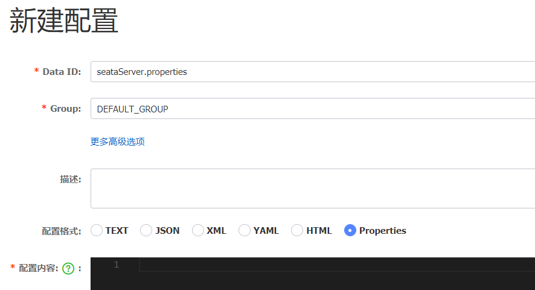
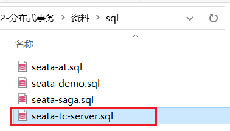
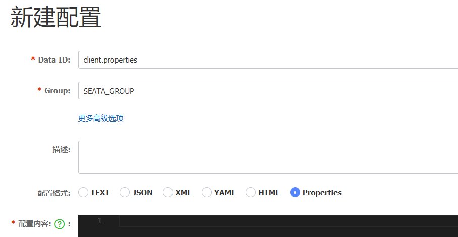

# seata 的部署和集成 🧙

[[TOC]]

# 一、部署 Seata 的 tc-server

## 1.下载

首先我们要下载 seata-server 包，地址在[http](http://seata.io/zh-cn/blog/download.html)[://seata.io/zh-cn/blog/download](http://seata.io/zh-cn/blog/download.html)[.](http://seata.io/zh-cn/blog/download.html)[html](http://seata.io/zh-cn/blog/download.html)

当然，课前资料也准备好了：


## 2.解压

在非中文目录解压缩这个 zip 包，其目录结构如下：


## 3.修改配置

修改 conf 目录下的 registry.conf 文件：


内容如下：

```properties
registry {
  # tc服务的注册中心类，这里选择nacos，也可以是eureka、zookeeper等
  type = "nacos"

  nacos {
    # seata tc 服务注册到 nacos的服务名称，可以自定义
    application = "seata-tc-server"
    serverAddr = "127.0.0.1:8848"
    group = "DEFAULT_GROUP"
    namespace = ""
    cluster = "SH"
    username = "nacos"
    password = "nacos"
  }
}

config {
  # 读取tc服务端的配置文件的方式，这里是从nacos配置中心读取，这样如果tc是集群，可以共享配置
  type = "nacos"
  # 配置nacos地址等信息
  nacos {
    serverAddr = "127.0.0.1:8848"
    namespace = ""
    group = "SEATA_GROUP"
    username = "nacos"
    password = "nacos"
    dataId = "seataServer.properties"
  }
}
```

## 4.在 nacos 添加配置

特别注意，为了让 tc 服务的集群可以共享配置，我们选择了 nacos 作为统一配置中心。因此服务端配置文件 seataServer.properties 文件需要在 nacos 中配好。

格式如下：



配置内容如下：

```properties
# 数据存储方式，db代表数据库
store.mode=db
store.db.datasource=druid
store.db.dbType=mysql
store.db.driverClassName=com.mysql.jdbc.Driver
store.db.url=jdbc:mysql://127.0.0.1:3306/seata?useUnicode=true&rewriteBatchedStatements=true
store.db.user=root
store.db.password=123456
store.db.minConn=5
store.db.maxConn=30
store.db.globalTable=global_table
store.db.branchTable=branch_table
store.db.queryLimit=100
store.db.lockTable=lock_table
store.db.maxWait=5000
# 事务、日志等配置
server.recovery.committingRetryPeriod=1000
server.recovery.asynCommittingRetryPeriod=1000
server.recovery.rollbackingRetryPeriod=1000
server.recovery.timeoutRetryPeriod=1000
server.maxCommitRetryTimeout=-1
server.maxRollbackRetryTimeout=-1
server.rollbackRetryTimeoutUnlockEnable=false
server.undo.logSaveDays=7
server.undo.logDeletePeriod=86400000

# 客户端与服务端传输方式
transport.serialization=seata
transport.compressor=none
# 关闭metrics功能，提高性能
metrics.enabled=false
metrics.registryType=compact
metrics.exporterList=prometheus
metrics.exporterPrometheusPort=9898
```

==其中的数据库地址、用户名、密码都需要修改成你自己的数据库信息。==

## 5.创建数据库表

特别注意：tc 服务在管理分布式事务时，需要记录事务相关数据到数据库中，你需要提前创建好这些表。

新建一个名为 seata 的数据库，运行课前资料提供的 sql 文件：



这些表主要记录全局事务、分支事务、全局锁信息：

```mysql

SET NAMES utf8mb4;
SET FOREIGN_KEY_CHECKS = 0;

-- ----------------------------
-- 分支事务表
-- ----------------------------
DROP TABLE IF EXISTS `branch_table`;
CREATE TABLE `branch_table`  (
  `branch_id` bigint(20) NOT NULL,
  `xid` varchar(128) CHARACTER SET utf8 COLLATE utf8_general_ci NOT NULL,
  `transaction_id` bigint(20) NULL DEFAULT NULL,
  `resource_group_id` varchar(32) CHARACTER SET utf8 COLLATE utf8_general_ci NULL DEFAULT NULL,
  `resource_id` varchar(256) CHARACTER SET utf8 COLLATE utf8_general_ci NULL DEFAULT NULL,
  `branch_type` varchar(8) CHARACTER SET utf8 COLLATE utf8_general_ci NULL DEFAULT NULL,
  `status` tinyint(4) NULL DEFAULT NULL,
  `client_id` varchar(64) CHARACTER SET utf8 COLLATE utf8_general_ci NULL DEFAULT NULL,
  `application_data` varchar(2000) CHARACTER SET utf8 COLLATE utf8_general_ci NULL DEFAULT NULL,
  `gmt_create` datetime(6) NULL DEFAULT NULL,
  `gmt_modified` datetime(6) NULL DEFAULT NULL,
  PRIMARY KEY (`branch_id`) USING BTREE,
  INDEX `idx_xid`(`xid`) USING BTREE
) ENGINE = InnoDB CHARACTER SET = utf8 COLLATE = utf8_general_ci ROW_FORMAT = Compact;

-- ----------------------------
-- 全局事务表
-- ----------------------------
DROP TABLE IF EXISTS `global_table`;
CREATE TABLE `global_table`  (
  `xid` varchar(128) CHARACTER SET utf8 COLLATE utf8_general_ci NOT NULL,
  `transaction_id` bigint(20) NULL DEFAULT NULL,
  `status` tinyint(4) NOT NULL,
  `application_id` varchar(32) CHARACTER SET utf8 COLLATE utf8_general_ci NULL DEFAULT NULL,
  `transaction_service_group` varchar(32) CHARACTER SET utf8 COLLATE utf8_general_ci NULL DEFAULT NULL,
  `transaction_name` varchar(128) CHARACTER SET utf8 COLLATE utf8_general_ci NULL DEFAULT NULL,
  `timeout` int(11) NULL DEFAULT NULL,
  `begin_time` bigint(20) NULL DEFAULT NULL,
  `application_data` varchar(2000) CHARACTER SET utf8 COLLATE utf8_general_ci NULL DEFAULT NULL,
  `gmt_create` datetime NULL DEFAULT NULL,
  `gmt_modified` datetime NULL DEFAULT NULL,
  PRIMARY KEY (`xid`) USING BTREE,
  INDEX `idx_gmt_modified_status`(`gmt_modified`, `status`) USING BTREE,
  INDEX `idx_transaction_id`(`transaction_id`) USING BTREE
) ENGINE = InnoDB CHARACTER SET = utf8 COLLATE = utf8_general_ci ROW_FORMAT = Compact;

SET FOREIGN_KEY_CHECKS = 1;
```

## 6.启动 TC 服务

进入 bin 目录，运行其中的 seata-server.bat 即可：


启动成功后，seata-server 应该已经注册到 nacos 注册中心了。

打开浏览器，访问 nacos 地址：http://localhost:8848，然后进入服务列表页面，可以看到 seata-tc-server 的信息：


# 二、微服务集成 seata

## 1.引入依赖

首先，我们需要在微服务中引入 seata 依赖：

```xml
<dependency>
    <groupId>com.alibaba.cloud</groupId>
    <artifactId>spring-cloud-starter-alibaba-seata</artifactId>
    <exclusions>
        <!--版本较低，1.3.0，因此排除-->
        <exclusion>
            <artifactId>seata-spring-boot-starter</artifactId>
            <groupId>io.seata</groupId>
        </exclusion>
    </exclusions>
</dependency>
<!--seata starter 采用1.4.2版本-->
<dependency>
    <groupId>io.seata</groupId>
    <artifactId>seata-spring-boot-starter</artifactId>
    <version>${seata.version}</version>
</dependency>
```

## 2.修改配置文件

需要修改 application.yml 文件，添加一些配置：

```yaml
seata:
  registry: # TC服务注册中心的配置，微服务根据这些信息去注册中心获取tc服务地址
    # 参考tc服务自己的registry.conf中的配置
    type: nacos
    nacos: # tc
      server-addr: 127.0.0.1:8848
      namespace: ''
      group: DEFAULT_GROUP
      application: seata-tc-server # tc服务在nacos中的服务名称
      cluster: SH
  tx-service-group: seata-demo # 事务组，根据这个获取tc服务的cluster名称
  service:
    vgroup-mapping: # 事务组与TC服务cluster的映射关系
      seata-demo: SH
```

# 三、TC 服务的高可用和异地容灾

## 1.模拟异地容灾的 TC 集群

计划启动两台 seata 的 tc 服务节点：

| 节点名称 | ip 地址   | 端口号 | 集群名称 |
| -------- | --------- | ------ | -------- |
| seata    | 127.0.0.1 | 8091   | SH       |
| seata2   | 127.0.0.1 | 8092   | HZ       |

之前我们已经启动了一台 seata 服务，端口是 8091，集群名为 SH。

现在，将 seata 目录复制一份，起名为 seata2

修改 seata2/conf/registry.conf 内容如下：

```nginx
registry {
  # tc服务的注册中心类，这里选择nacos，也可以是eureka、zookeeper等
  type = "nacos"

  nacos {
    # seata tc 服务注册到 nacos的服务名称，可以自定义
    application = "seata-tc-server"
    serverAddr = "127.0.0.1:8848"
    group = "DEFAULT_GROUP"
    namespace = ""
    cluster = "HZ"
    username = "nacos"
    password = "nacos"
  }
}

config {
  # 读取tc服务端的配置文件的方式，这里是从nacos配置中心读取，这样如果tc是集群，可以共享配置
  type = "nacos"
  # 配置nacos地址等信息
  nacos {
    serverAddr = "127.0.0.1:8848"
    namespace = ""
    group = "SEATA_GROUP"
    username = "nacos"
    password = "nacos"
    dataId = "seataServer.properties"
  }
}
```

进入 seata2/bin 目录，然后运行命令：

```powershell
seata-server.bat -p 8092
```

打开 nacos 控制台，查看服务列表：


点进详情查看：


## 2.将事务组映射配置到 nacos

接下来，我们需要将 tx-service-group 与 cluster 的映射关系都配置到 nacos 配置中心。

新建一个配置：



配置的内容如下：

```properties
# 事务组映射关系
service.vgroupMapping.seata-demo=SH

service.enableDegrade=false
service.disableGlobalTransaction=false
# 与TC服务的通信配置
transport.type=TCP
transport.server=NIO
transport.heartbeat=true
transport.enableClientBatchSendRequest=false
transport.threadFactory.bossThreadPrefix=NettyBoss
transport.threadFactory.workerThreadPrefix=NettyServerNIOWorker
transport.threadFactory.serverExecutorThreadPrefix=NettyServerBizHandler
transport.threadFactory.shareBossWorker=false
transport.threadFactory.clientSelectorThreadPrefix=NettyClientSelector
transport.threadFactory.clientSelectorThreadSize=1
transport.threadFactory.clientWorkerThreadPrefix=NettyClientWorkerThread
transport.threadFactory.bossThreadSize=1
transport.threadFactory.workerThreadSize=default
transport.shutdown.wait=3
# RM配置
client.rm.asyncCommitBufferLimit=10000
client.rm.lock.retryInterval=10
client.rm.lock.retryTimes=30
client.rm.lock.retryPolicyBranchRollbackOnConflict=true
client.rm.reportRetryCount=5
client.rm.tableMetaCheckEnable=false
client.rm.tableMetaCheckerInterval=60000
client.rm.sqlParserType=druid
client.rm.reportSuccessEnable=false
client.rm.sagaBranchRegisterEnable=false
# TM配置
client.tm.commitRetryCount=5
client.tm.rollbackRetryCount=5
client.tm.defaultGlobalTransactionTimeout=60000
client.tm.degradeCheck=false
client.tm.degradeCheckAllowTimes=10
client.tm.degradeCheckPeriod=2000

# undo日志配置
client.undo.dataValidation=true
client.undo.logSerialization=jackson
client.undo.onlyCareUpdateColumns=true
client.undo.logTable=undo_log
client.undo.compress.enable=true
client.undo.compress.type=zip
client.undo.compress.threshold=64k
client.log.exceptionRate=100
```

## 3.微服务读取 nacos 配置

接下来，需要修改每一个微服务的 application.yml 文件，让微服务读取 nacos 中的 client.properties 文件：

```yaml
seata:
  config:
    type: nacos
    nacos:
      server-addr: 127.0.0.1:8848
      username: nacos
      password: nacos
      group: SEATA_GROUP
      data-id: client.properties
```

重启微服务，现在微服务到底是连接 tc 的 SH 集群，还是 tc 的 HZ 集群，都统一由 nacos 的 client.properties 来决定了。
