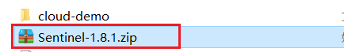
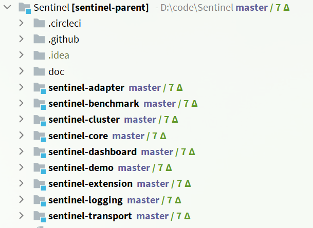

# Sentinel 规则持久化 🧙

[[TOC]]

## 一、修改 order-service 服务

修改 OrderService，让其监听 Nacos 中的 sentinel 规则配置。

具体步骤如下：

### 1.引入依赖

在 order-service 中引入 sentinel 监听 nacos 的依赖：

```xml
<dependency>
    <groupId>com.alibaba.csp</groupId>
    <artifactId>sentinel-datasource-nacos</artifactId>
</dependency>
```

### 2.配置 nacos 地址

在 order-service 中的 application.yml 文件配置 nacos 地址及监听的配置信息：

```yaml
spring:
  cloud:
    sentinel:
      datasource:
        flow:
          nacos:
            server-addr: localhost:8848 # nacos地址
            dataId: orderservice-flow-rules
            groupId: SENTINEL_GROUP
            rule-type: flow # 还可以是：degrade、authority、param-flow
```

## 二、修改 sentinel-dashboard 源码

SentinelDashboard 默认不支持 nacos 的持久化，需要修改源码。

### 1. 解压

解压课前资料中的 sentinel 源码包：



然后并用 IDEA 打开这个项目，结构如下：



### 2. 修改 nacos 依赖

在 sentinel-dashboard 源码的 pom 文件中，nacos 的依赖默认的 scope 是 test，只能在测试时使用，这里要去除：


将 sentinel-datasource-nacos 依赖的 scope 去掉：

```xml
<dependency>
    <groupId>com.alibaba.csp</groupId>
    <artifactId>sentinel-datasource-nacos</artifactId>
</dependency>
```

### 3. 添加 nacos 支持

在 sentinel-dashboard 的 test 包下，已经编写了对 nacos 的支持，我们需要将其拷贝到 main 下。


### 4. 修改 nacos 地址

然后，还需要修改测试代码中的 NacosConfig 类：


修改其中的 nacos 地址，让其读取 application.properties 中的配置：


在 sentinel-dashboard 的 application.properties 中添加 nacos 地址配置：

```properties
nacos.addr=localhost:8848
```

### 5. 配置 nacos 数据源

另外，还需要修改 com.alibaba.csp.sentinel.dashboard.controller.v2 包下的 FlowControllerV2 类：


让我们添加的 Nacos 数据源生效：


### 6. 修改前端页面

接下来，还要修改前端页面，添加一个支持 nacos 的菜单。

修改 src/main/webapp/resources/app/scripts/directives/sidebar/目录下的 sidebar.html 文件：


将其中的这部分注释打开：


修改其中的文本：


### 7. 重新编译、打包项目

运行 IDEA 中的 maven 插件，编译和打包修改好的 Sentinel-Dashboard：


### 8.启动

启动方式跟官方一样：

```sh
java -jar sentinel-dashboard.jar
```

如果要修改 nacos 地址，需要添加参数：

```sh
java -jar -Dnacos.addr=localhost:8848 sentinel-dashboard.jar
```
