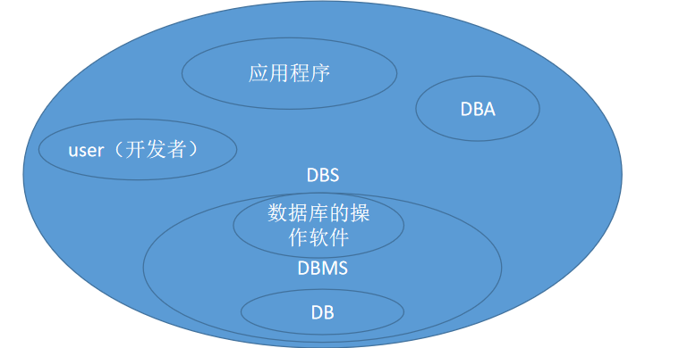
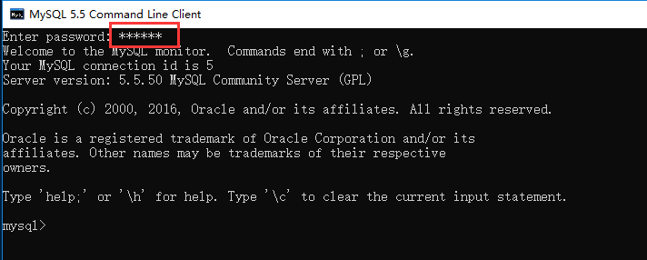
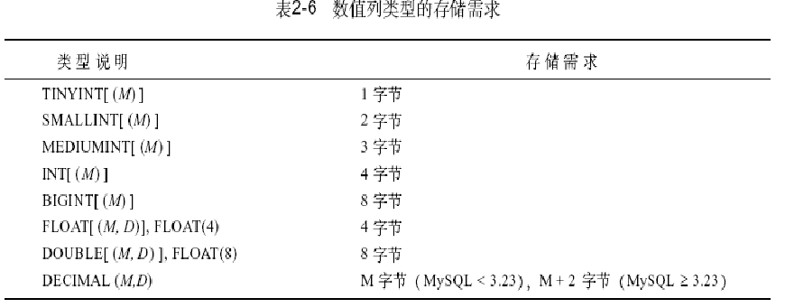
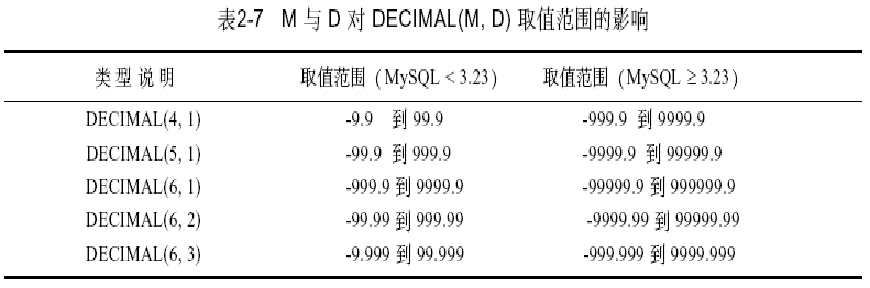
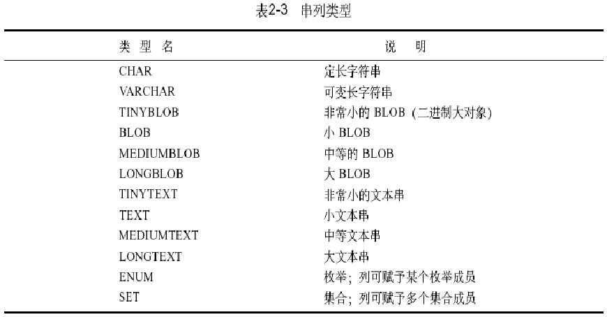
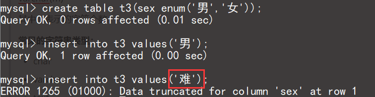
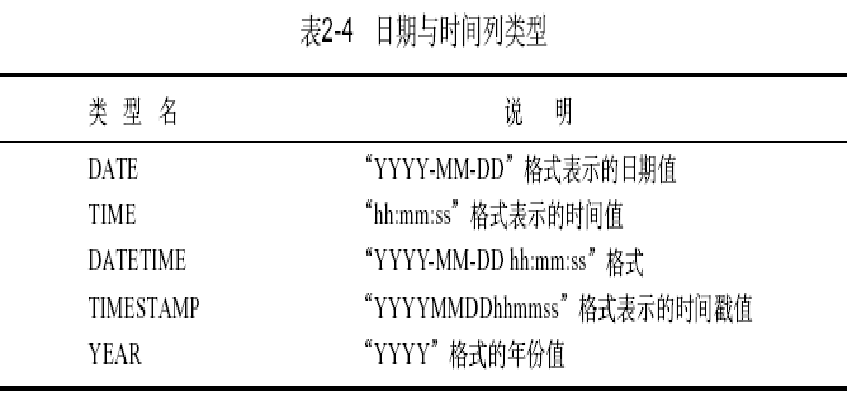
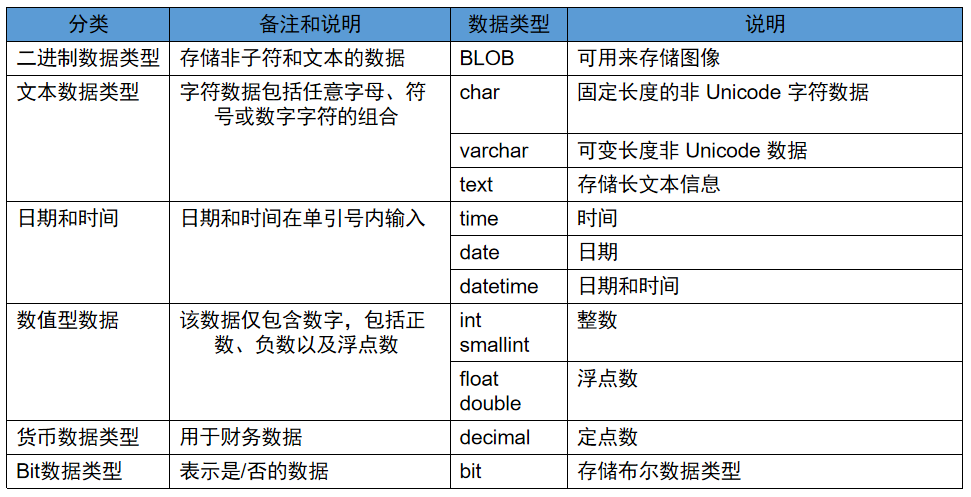

# 01 - Mysql 数据库入门 :monocle_face:

[[TOC]]

## 数据库概述

### 数据

数据即用于描述一些客观事物的符号；比如说人具备：年龄，身高，体重，姓名，性别等信息，这些信息都称之为数据（在 java 中称之为属性）；数据的分类:

- 文本
- 图形（图片）
- 图像（视频）
- 声音
- 文件

### 为什么需要数据库

​ 回顾之前所学习到的所有存储机制：`内存`>`文件`；通过以上分析得知，文件存储可以长期有效存储数据，但是文件只提供了存储机制，如果需要操作文件：

例如，一个文本文档中存储了 1000W 条数据，如果需要打开改文件会非常耗时，另外如果需要从文件中找出一条符合要求数据，首先需要先读取文件中的所有内容，然后一条一条去分析。

由于文件系统存在以上的问题：在进行检索时效率低，数据的组织方式不够结构化，因此操作数据方面没有优势；因此需要一种能够跟结构化，在检索方面具备绝对优势的数据存储系统

### 什么是数据库

​ 数据库由一批数据构成的有序集合，这些数据被分门别类地存放在一些结构化的数据表（table）里，而数据表之间又往往存在交叉引用的关系，这种关系使数据库又被称为**关系型数据库**

### 怎么理解数据库

- 数据库系统==档案室
- 数据库等同于档案柜（数据库实例==档案柜）
- 每一张数据表等同档案柜中的抽屉（数据表==抽屉）
- 抽屉中的每一个文件袋称之为一条数据（数据==文件袋）

### 名词解释

- **Data** 数据
- **Database** 数据库
- **DBMS** （DataBase Management System）数据库管理系统
- **DBS**（DataBase System）数据库系统
- **DBA**（Database Administrator）数据库管理员
  - OCA 初级认证
  - **OCP 专家认证**
  - **OCM 大师级认证**



### 主流数据库产品

- Sybase SqlServer
- **MSSqlServer（SqlServer）**
- Oracle(先知/甲骨文)
- DB2/Informix (IBM)
- **Mysql(瑞典 Mysql AB)**
- **MariaDB**
- **PostgreSQL**
- Access(微软)
- Sqlite3（应用于移动设备:手机，平板，pad）
- **达梦数据库(国产:政府，消防，军工以事业单位为主的客户)**
- **OceanBase（阿里巴巴+蚂蚁金服）**

Mysql 数据库：

​ 开源，免费，轻量级，可制作定制版

数据库移植：

​ 将一种数据库转移到另一个数据库中

​ (比如 SqlServer 的数据转移到 Mysql 中，会出现数据不匹配，字段类型冲突，SQL 语法不一样等操作)

## Mysql 安装与卸载

### 卸载

卸载 mysql 数据库分为以下四个步骤

1. 停止 mysql 服务
2. 进入控制面板，卸载 mysql 相关的安装程序
3. 进入 mysql 安装目录(默认 c:/Program Files) 删除 Mysql 目录
4. 进入 mysql 数据目录(默认 c:/ProgramData)删除 mysql 目录(**重要：如果不删除将会导致下一次重复安装失败**)

### 安装

- 安装
  - next
- 配置
  - 编码设置(gbk/utf8)
  - 密码设置

## Mysql 基本命令

### mysql 数据库组织结构


### 基本命令使用

1. 连接 mysql 数据库

   1. 直接通过 mysql 命令行客户端

      

      

   2. 通过 cmd 连接 mysql（需要配置环境变量）

      

      > -h：主机地址
      >
      > -u：用户名(默认 root)
      >
      > -p：连接密码

   3. 数据库和数据库实例

      数据库：所有表结构组成的一个大集合

      数据库实例：数据库管理系统对数据库的一种操作方式

2. 查看 mysql 数据库服务器中的所有实例

   ```mysql
   show databases;
   ```

3. 创建 mysql 实例

   ```mysql
   create database mydb
   default character  set utf8
   default collate utf8_general_ci;

   character 设置数据库字符串格式
   collate 设置字符串比较的格式
   ```

4. 查看创建实例的命令

   ```mysql
   show create database mydb;
   ```

5. 显示当前库的命令

   ```mysql
   select database();
   ```

6. 使用数据库实例

   ```mysql
   use mydb;
   ```

7. 当输入了错误命令，需要取消时

   ```mysql
   show databaes xxx \c
   ```

   > \c 表示取消当前的输入

8. 显示当前所有用户

   ```mysql
   select  user,host from mysql.user;
   ```

9. 查看帮助信息

   ```mysql
   \h
   ```

10. 修改默认的分隔符

    ```mysql
    delimiter $
    ```

    > 默认命令行结束为“;”，可以修改为指定符号结束

11. 退出 mysql 命令行

    ```mysql
    #方式一
    exit；
    #方式二
    quit；
    ```

12. 查看 mysql 服务器状态信息

    ```mysql
    \s
    ```

13. 显示实例下的所有表(前提先 use 过了)

    ```mysql
    show tables;
    ```

## SQL 语句入门

SQL 是 Structured Query Language(结构化查询语言)的缩写;sql 语句是专门为数据库管理提供的通用操作语言；语法类似于英语口语，在使用它时，只需要发出“做什么”的命令“怎么做”是不用使用者考虑的。sql 语句分为以下几个大类：

1. **DDL 语句（数据定义语句）**

   数据定义语句主要应用于对数据表的结构操作：比如建表，删除表，修改表的结构等；DDL 语句包含以下命令：

   - create （新建）
   - drop（删除，主要删除数据库中的结构，比如表，库等）
   - alter（主要用已有表删除，新建，修改行）
   - add(添加列)
   - modify（修改列）

2. **DML 语句（数据操作语句）**

   数据操作语句一般用于对的语句数据库表中数据进行更新操作，比如添加，删除，修改数据等，DML 语句包含以下命令:

   - insert （对表新增加数据）
   - update（更新表字段）
   - delete（删除信息）

3. **DQL 语句（数据查询语句）**

   数据查询语句一般用于对数据库表中数据进行查询操作，命令主要包含：select

4. **DCL 语句（数据控制语句）**

   数据控制语句一般用于对于数据库用户的权限管理，事务管理，DCL 包含以下命令:

   - grant （权限设置）
   - revoke（回收权限）
   - commit（事务提交）
   - rollback（事务回滚）

### DDL 语句

1. 创建一张数据库表

   ```sql
   create table emp		     -- 创建表，名称叫emp
   (
       eno int,				 --创建eno列，类型是int
       ename varchar(30),		 --创建ename列，类型是varchar长度是30字符
       job varchar(30),
       sex char(2) default '1', --创建sex列，类型是char
       sal double,
       birth date
   );
   ```

   > **关于 mysql 中字符长度问题：**
   >
   > 如果是 utf8 编码下，默认的中文字符占 3 个字节；如果是 gbk 编码，默认的中文占 2 个字节
   >
   > **关于 char 类型和 varchar 类型：**
   >
   > - char 类型是定长字符串，类似于 java 中 String；长度一旦定义则无法改变，并且无论数据是否够指定长度，都会占满，不够的用空格填充；char 类型一般应用于长度确定的字符串类型，比如：性别，手机号，身份证号等；
   > - varchar 类型是可变长度字符串，类似 java 中 StringBuffer；长度定义之后会根据实际填充的内容，选择占用多大空间，比较节省空间；varchar 类型一般使用在长度不确定的字符串类型，比如:姓名，邮箱地址，评论信息等。

2.显示表中所有与列等其他信息

```sql
show full fields from emp;
```

#### 修改表结构

语法：

`alter table 表名 [add/drop/modify/change/rename] 列名称`

1. 新增一个列

   ```sql
   alter table emp add hiredate date;
   ```

2. 删除列

   ```sql
   alter table emp drop column birth;
   ```

3. 修改列的类型

   ```sql
    alter table emp modify sal varchar(20);
   ```

4. 修改列名称

   ```sql
   alter table emp change job  ejob varchar(30);
   ```

5. 修改表名称

   ```sql
    alter table emp rename to tbemp;
   ```

### DML 语句

1. 显示表中所有的数据

   ```sql
   select * from tbemp;

   ```

#### insert 语句（插入）

**语法：**

`insert into 表名(列名1，列名2...) values(列值1,列值2...)`

1. 向表中添加数据(所有列)

   ```sql
   insert into tbemp values(1,'james','manager','1',8796,'2018-01-22',28);
   ```

2. 向某一些列插入值

   ```sql
   insert into tbemp(eno,ename,ejob,sal) values(4,'softeem','CEO',1500000);
   ```

3. 同时插入多条数据

   ```sql
   insert into tbemp(eno,ename) values(5,'来福'),(6,'狗蛋'),(7,'王二狗');
   ```

   > **插入数据出现中文乱码时解决方案：**
   >
   > 由于安装 mysql 使用的是 UTF8 编码，但是 cmd 命令行中默认为 GBK 编码，因此在命令行中
   >
   > 使用中文数据是会出现乱码；解决方式只需要在打开 cmd 命令行时输入以下命令：
   >
   > - **set names gbk；**
   >
   > 然后再进行插入操作即可解决（但是以上修改只对一次会话生效；如果只会再次使用 cmd 需要重新设置）

### select 语句：

```mysql
 select * from student;-- 查询所有
 select id,name from student; -- 查询指定的字段
 select * from student where id='1';--条件查询
 select * from student where id='1' and sex ='男';--多条件查询
 select * from student where id='1' or sex ='男';

```

#### update 语句（更新）

**语法：**

`update 表名 set 列名1=值1,列名2=值2... where 条件   `

1. 修改表中的一条记录

   ```sql
   update tbemp set hiredate='2006-03-01',age=45 where eno=4;
   ```

2. 修改数据(将员工姓名叫旺财的人的月薪提高 2000)

   ```sql
   update tbemp set sal=sal+2000 where ename='旺财';
   ```

3. 修改数据(将员工生日为 null 的人的生日全部设置为 2020-01-01)

   ```sql
   update tbemp set hiredate='2020-01-01' where hiredate is null;
   ```

   > 注意事项：
   >
   > 数据库中是否为空（null）的判断不能使用“=”或“!=”应该使用 is null 或者 is not null

#### delete 语句（删除）

**语法：**

`delete from 表名 where 条件  `

1. 删除一行指定 id 的数据

   ```sql
    delete from tbemp where eno=5;
   ```

2. 删除所有月薪为 null 的员工

   ```sql
   delete from tbemp where sal is null;
   ```

   > 注意事项:
   >
   > 实际开发中，数据积累不容易，一般不会轻易使用物理删除；大多数时候会选择使用逻辑删除；所谓逻辑删除实际就是在表中增加一个标识列，通过该列的取值标记该列是否应该被查询到
   >
   > 因此针对删除需求，可以在表中新增一列用于标记该列是否被删除
   >
   > ```sql
   > alter table tbemp add isdel tinyint;
   > ```

### 物理删除：

​ 使用 delect 语句直接讲数据库中的数据删除掉

### 逻辑删除：

​ 实际上执行的是 update 语句，更新了该条数据的状态字段，一般状态字段的值：0 表示删除，1 表示有效

​ 如果要做逻辑删除，就是将 stats 字段的值更新为 0,

## mysqldump 与 mysqladmin

### mysqldump(备份)

1. 备份指定实例到指定目录中······

   ​ 需要先退出当前数据库的登陆，再进行数据库的备份

```mysql
mysqldump -uroot -p123456 mydb > d:/mydb.sql
```

2. 从指定的 sql 文件中恢复备份数据

   ​ 要先登陆数据库，选择好需要导入的库，再执行导入命令，将备份的数据导入

```mysql
source d:/mydb.sql

```

### mysqladmin

1. 使用 mysqladmin 创建一个数据库实例

   ```bash
   mysqladmin -uroot -p123456 create mydb2
   ```

2. 使用 mysqladmin 删除一个数据库实例

   ```bash
   mysqladmin -uroot -p123456 drop mydb2
   ```

3. 修改密码

   ```bash
   mysqladmin -uroot -p password root
   ```

   > 将 root 用的密码改为"root"

## MySql 数据类型

mysql 数据库中支持的数据类型分为以下几个大类：

- 数值类型
  - 整型
  - 浮点型
- 字符类型
- 日期时间类型

### 数值类型

mysql 中数值类型主要包含以下两大类

- 整型
- 浮点型



取值范围：



> 常用数值类型主要包含以下几个:
>
> 1.  **int**
> 2.  **double**
> 3.  **decimal**

### 字符串类型



> **注意事项：**
>
> 在使用中文字符串时，如果数据库编码是 gbk,则每个中文字符占 2 个字节；如果是 utf8 编码，则每个中文字符占 3 个字节
>
> **关于取值返回:**
>
> char(m)
>
> varchar(m)
>
> 其中 m 表示的字符个数
>
> **常见的字符串类型：**
>
> - char
> - varchar
> - text
>
> **blog 和 clob**
>
> blob（Binary Large object）二进制大对象（视频，图片，音频）
>
> clob（Character Large Object）字符大对象（大文本）
>
> **enum 类型**
>
> 枚举类型，用于限定该列只能选择枚举中其中一个值
>
> 

### 日期时间类型

获取当前的系统时间

```sql
select now()
```



> 常用日期类型：
>
> - **date** 用于表示日期 如：2020-01-01
>
> - **datetime** 用于表示日期时间 如：2020-01-01 10:11:12
>
> - **timestamp** 用于表示时间戳，格式等同 datetime，支持默认值 CURRENT_TIMESTMP
>
> ​ 另外该类型也支持自动更新（on update CURRENT_TIMESTAMP）当前行 数据更新时，该列也会自动更新为最新的时间
>
> 注意事项：
>
> - 一张表中只能有一个字段的 timestamp 可以设置默认值

### 常用数据类型汇总



## 练习

1. **创建一个部门表，包含部门号，部门名称，部门的分机号码；数据类型根据实际情况自己选择。**

   1. 向表中插入 5 条数据
   2. 根据部门编号修改部门的分机号码
   3. 删除没有分机号的部门(物理删除)

2. **创建职位表(jobs)**
   ​ id
   ​ 工作经验要求（应届 0，1-3 年，3-5 年，5-10 年，10 年+）
   ​ 学历要求(不限，大专，本科，硕士，博士)
   ​ 行业(移动互联网，电子商务，金融，企业服务，教育，文化娱乐)
   ​ 地点(北京，上海，广州，深圳，武汉，成都，南京...)
   ​ 职位详情
   ​ 公司名称
   ​ 职位名

   要求实现:
   ​ 1.添加若干条数据
   ​ 2.新增招聘人数列
   ​ 3.修改学历要求类型为 enum 类型
   ​ 4.删除职位详情列
   ​ 5.修改指定职位 id 的学历要求
   ​ 6.查询出符合指定学历的职位
   ​ 7.查询出指定地点的职位信息
   ​ 8.查询指定行业的职位信息

3. **完成员工共管理系统相关的数据库设计与数据表操作：**

   1.创建员工表 employee(N)
   ​ 字段: 员工工号:eno,职位:job,姓名:ename,入职时间,年龄:age,性别:sex,月薪 sal,所在部门 dno
   ​ 要求:
   ​ 员工工号
   ​ 姓名不为空(not null)
   ​ 职位包含 manager 和 normal
   ​ 性别默认为男,并且只能是(男,女) 2.创建部门表 department(1)(冗余)
   ​ 字段: 部门编号 dno,部门名 dname,部门联系电话 tel
   ​ 要求:
   ​ 部门名只能为:销售部,培训部,研发部,财务部中一项
   ① 添加 5 条记录到员工表,其中两条记录没有月薪
   ② 删除年龄>60 的员工记录
   ③ 将 3 号员工和 2 号员工的月薪修改为一致
   ④ 修改工资低于 2000 的员工,将工资在原来基础之上增加 20%
   ⑤ 将所有女性员工的工资在原来基础上+200;
   ⑥ 添加 3 条记录到部门表
   ⑦ 修改部门表中 2 号部门的联系方式
   ⑧ 将所有经理的月薪上浮 5%
   ⑨ 查询职位为 manager 的所有员工信息
