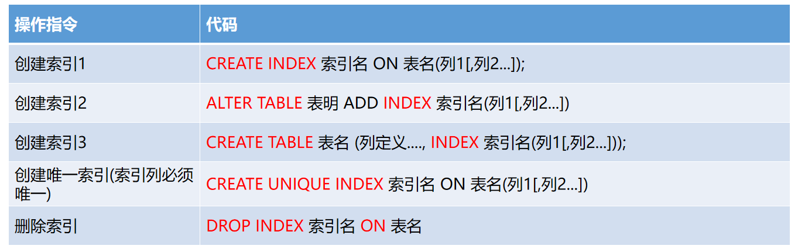
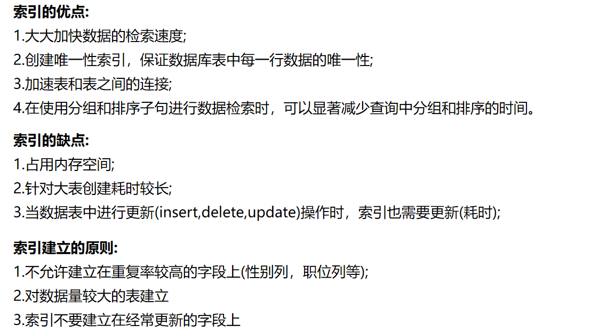
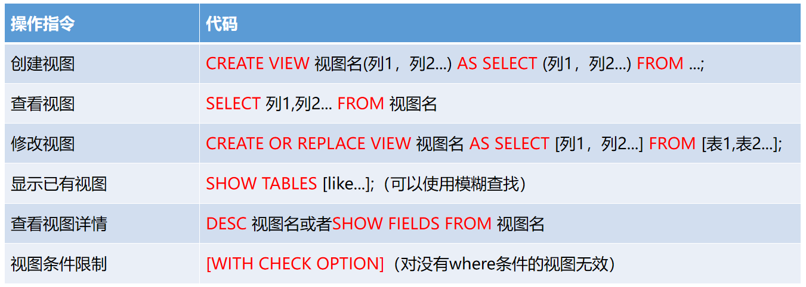
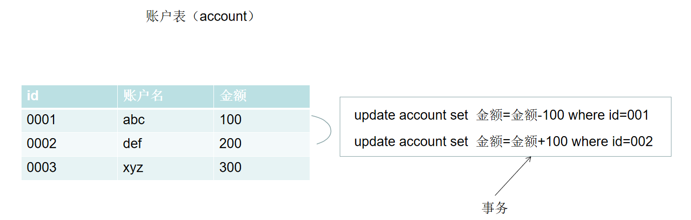
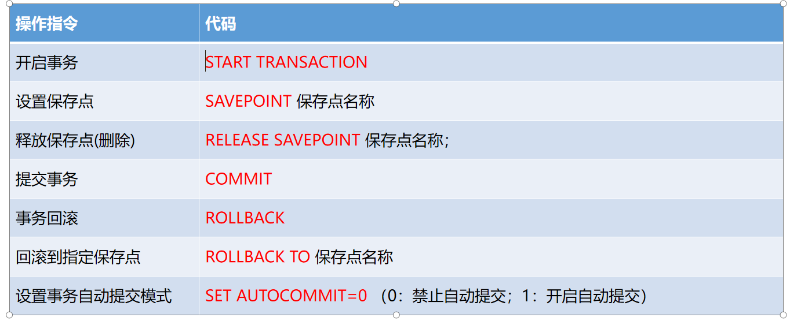
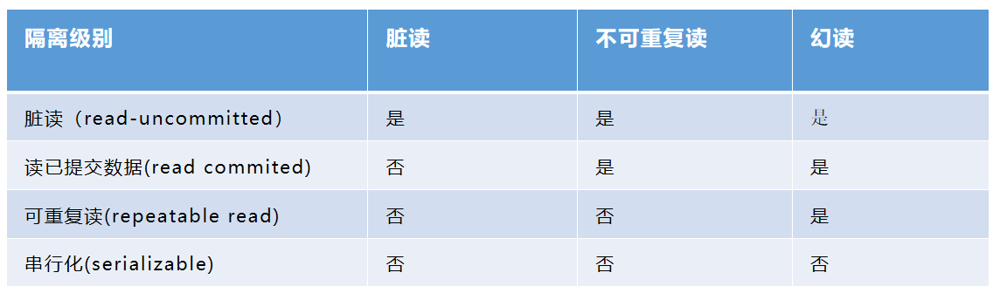
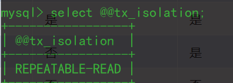
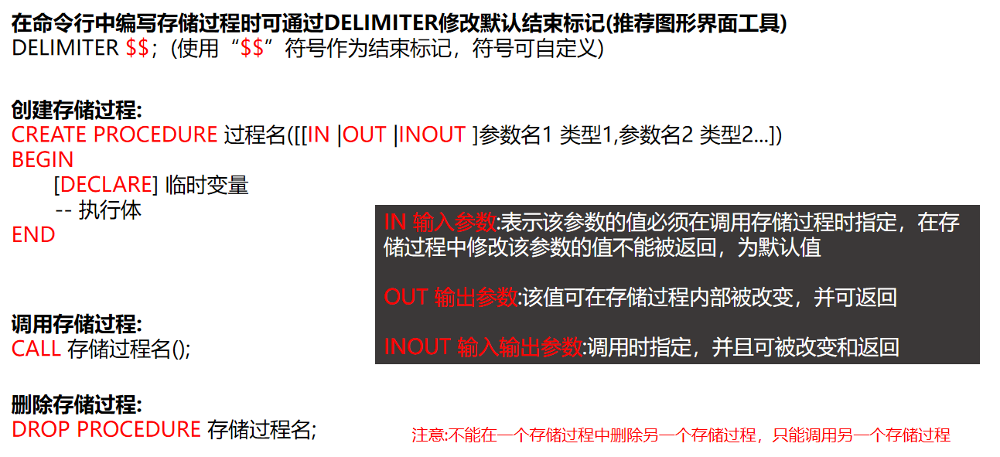
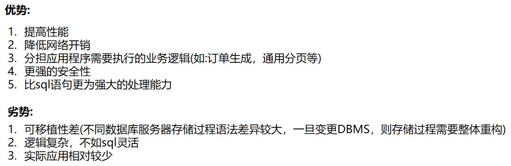

# 03 - Mysql 数据库 (三) :sweat_drops:

[[TOC]]

## 内置函数

### 聚合函数

| 函数名  | 说明             |
| ------- | ---------------- |
| count() | 统计数据行       |
| sum()   | 对指定列求和     |
| avg()   | 对指定列求平均值 |
| max()   | 获取指定列最大值 |
| min()   | 获取指定列最小值 |

```sql
--查询表中一共有多少员工
select count(*) from emp;

--查询所有员工的总薪资
select sum(sal) from emp;

--查询所有员工的月薪平均值
select avg(sal) from emp;

--查询工资最低的员工薪资
select min(sal) from emp;

--查询工资最高的员工薪资
select max(sal) from emp;
```

### 字符函数

| 函数名               | 说明                              |
| -------------------- | --------------------------------- |
| concat (st2 [,... ]) | 连接多个字符串为一个字符串        |
| length(s)            | 获取字符串的字节长度              |
| lcase/ucase          | 字符串转小写/字符串转大写         |
| ltrim(s)/rtrim(s)    | 去除字符串左边空格/右边空格       |
| substr(s,pos,len)    | 将字符串 s 从 pos 开始截取 len 长 |
| lpad/rpad            | 左填充/右填充                     |

```sql
-- 获取字符串使用的字符集
select charset('helloworld');

-- 将多个字符串连接为一个字符串
select concat('hello','world',',','softeem')
-- 应用
select * from emp where concat(ename,job,sex) like '%阿%';

-- 返回字符占据的字节数（中文字符占3字节(utf-8),英文字母占1个字节）
select length('hello');
select length('软帝softeem');

-- 将字母转小写（toLowerCase）
select LCASE('HELLO');
-- 转大写
select upper ('dsasa');

-- 去除字符串空格
select TRIM(' world ');

-- 左填充(对指定的字符串检测，长度如果未到达目标长度，则使用指定占位符从左边开始填充)
select LPAD('softeem',10,'*');
select LPAD(ename,10,"#") from emp;
select RPAD(ename,10,"#") from emp;

use mydb;
select * from tbemp;
-- 字符串截取
select substr('abdcsa',1,3);

```

### 数值函数

| 函数名        | 说明                                                                                          |
| ------------- | --------------------------------------------------------------------------------------------- |
| abs(n)        | 取数值绝对值                                                                                  |
| round         | 四舍五入                                                                                      |
| ceiling(n)    | 向上取整                                                                                      |
| floor(n)      | 向下取整                                                                                      |
| format(n,len) | 截取 len 位小数（四舍五入）                                                                   |
| rand()        | 获取随机数(0-1)，取 0-1 之间随机的小数，无限接近于 0 且不会等于 0，无限接近于 1，且不会等于 1 |

```sql
/*
	数值函数
*/
-- 绝对值
select abs(-100);


-- 向上、向下取整
select CEILING(3.14);
select FLOOR(3.54);

-- 保留指定位小数点
select FORMAT(3.1415926,2);
---随机数
SELECT ROUND(rand()*10)
```

### 日期函数

| 函数名              | 说明                     |
| ------------------- | ------------------------ |
| now()               | 获取当前时间             |
| current_date()      | 获取当前日期             |
| current_time()      | 获取当前时间（时分秒）   |
| current_timestamp() | 获取当前时间戳           |
| date()              | 获取时间的日期部分       |
| day()               | 获取日期中的天数部分     |
| datediff(t1,t2)     | 获取两个日期之差（天数） |

```sql
/*
 时间日期函数
*/
-- 获取当前的系统时间
select now();
select CURRENT_DATE();  -- 获取当前日期
select CURRENT_TIME();	-- 获取当前时间
select CURRENT_TIMESTAMP(); -- 获取当前时间戳

select date(now());


-- 统计从出生到现在一共安全生活了多少天
select DATEDIFF(now(),'1998-07-29')

-- 获取日期中的day部分(天数)
select day(now());

create table temp(today date,msg varchar(30));
insert into temp values(CURRENT_DATE(),'nothing');
select * from temp;

-- 日报表中获取当天提交的日报信息
create table log(
id int primary key auto_increment,
content varchar(20000),
time timestamp default CURRENT_TIMESTAMP);
insert into log(content,time) values('n天前收获很多！！！','2020-03-29 10:11:11');

select * from log where date(time)=date(now());
-- 查询所有的在29号发布的日志
select * from log where day(time)=29;

```

### 加密函

| 函数名      | 说明                      |
| ----------- | ------------------------- |
| md5(s)      | 对字符串使用 md5 算法加密 |
| sha(s)      | 对字符串使用 sha 加密     |
| password(s) | 使用 sha1 对字符串加密    |

```sql
-- 加密函数（非对称加密）
select password('123456');
select MD5('123456');
select SHA('123456');

这三种加密方式都是不可逆，不能反推破解
```

## 复制表与数据复制

```sql
-- 复制表（同时复制数据） 对关键表的数据进行备份
create table tbemp select * from emp;

-- 复制表结构（只需要结构不要数据）
create table tbemp select * from emp where 1=0;

-- 复制数据(蠕虫复制:一般用于表机构稳定性的测试)
insert into tbemp(ename,job,hiredate,age,sex,sal,dno)
select ename,job,hiredate,age,sex,sal,dno from tbemp;
```

## 索引

​ 当表中有大量记录时，若要对表进行查询，第一种搜索信息方式是全表搜索，是将所有记录一一取出，和查询条件进行一一对比，然后返回满足条件的记录，这样做会消耗大量数据库系统时间，并造成大量磁盘 I/O 操作；第二种就是在表中建立索引，然后在索引中找到符合查询条件的索引值，最后通过保存在索引中的 ROWID（相当于页码）快速找到表中对应的记录。

​ 索引提供指向存储在表的指定列中的数据值的指针，然后根据您指定的排序顺序对这些指针排序。数据库使用索引以找到特定值，然后顺指针找到包含该值的行。这样可以使对应于表的 SQL 语句执行得更快，可快速访问数据库表中的特定信息。

​ **索引类似字典的目录，可通过索引快速查询到目标数据。**

### 索引分类

1、普通索引：MySQL 中基本索引类型，没有什么限制，允许在定义索引的列中插入重复值和空值，纯粹为了查询数据更快一点

2、唯一性索引：索引列中的值必须是唯一的，但是允许为空值

3、主键索引(聚簇索引)：即表中主键列

4、全文索引：全文索引，只有在 MyISAM 引擎上才能使用，只能在 CHAR,VARCHAR,TEXT 类型字段上使用全文索引。（mysql 数据库在 5.5 版本以前，使用的引擎是 MylSAM;在 5.5 以及以上的版本，mysql 的引擎使用的是 InnoDB）

5、组合索引：
在表中的多个字段组合上创建的索引，只有在查询条件中使用了这些字段的左边字段时，索引才会被使用，使用组合索引时遵循最左前缀集合。

###### 如果某个字段不是经常被作为查询条件进行使用时，那么该字段尽量就不要作为索引

因为添加字段索引，就是将该字段的索引添加在服务器内存当中，如果每张表的索引过多，会对整个服务器的运行产生巨大的影响

### 索引创建语法



#### 创建普通索引

```sql
create index index_ename on tbemp(ename);
```

#### 创建唯一索引

```sql
create unique index index_username on tbuser(username);
```

> **唯一索引要求被添加索引的列值必须唯一**

#### 创建组合索引

```sql
create index index_emp on tbemp(ename,sal,age);
```

> **组合索引的使用一般在进行多条件查询时提升查询效率**



> 注意事项：
>
> 任何一张数据库表都应该有一个主键列，默认数据系统对主键列增加了聚簇索引，因此针对主键列的查询速度比较快。
>
> Mysql 中的索引实现基于 B+树（二叉树） 最左匹配原则

## 视图

​ 视图实际上就是一张虚拟的表，视图是针对基表的一部分字段的缩影，一般用于对一些字段比较多的表，通过视图可以简化表结构；另外针对一些涉及到多表的查询操作时，建立视图可以简化查询语句；

### 创建语法



```sql
-- 创建视图
create view v$emp as select ename,job,hiredate,sal from emp;

select * from v$emp;
update v$emp set hiredate=now() where ename='孙悟空';

-- 复杂视图创建
create view v$details
as
select
e.eno,e.ename,e.job,e.hiredate,e.age,e.sal,
d.dno,d.dname,d.tel,
s.level
from emp e,dept d,sallevel s where e.dno=d.dno and
e.sal between s.lowsal and s.hisal;

select level from v$details where eno=6;

-- 查询研发部所有人的薪资等级和部门信息
select level,ename from v$details where dname='研发部'
```

> 注意事项：
>
> 视图不占据存储空间，只是一种逻辑存在（非物理存储）；只有在使用视图时才通过视图的定义，加载对应的数据
>
> 对视图的操作会影响基表(物理表，实际开发中一般针对视图做查询，避免基于视图做修改
>
> **索引提高查询速度，视图简化了查询的方式**

## 事务（Transaction）

### 概述

​ 事务是实际开发中，比较常见业务逻辑操作中都会存在问题，比如转账的业务，需要将一个账户的钱转向到另一个账号，此时会涉及到两个修改操作：A 账户钱减少，B 账户钱增加；这两个操作要保证能同时成功或者同时失败，那么这一个业务需求(逻辑单元)就称之为一个事务。



### 事务特性

数据库事务包含四大特征(ACID)：

1. 原子性：对于事务中的多次更新操作要么同时成功，要么同时失败
2. 一致性：保证事务操作完成之后，所有的结果一致
3. 隔离性：事物之间各自独立存在相互不影响
4. 持久性：事务完成之后，确保所有的数据长期持久的存在

### Mysql 事务的使用

mysql 中只有使用 InnoDB 引擎才支持事务；MyISAM 引擎不支持事务

​ show table status where name = 'emp' \G



参考代码

```sql
-- 开启事务(事务一旦开，后续的所有更新操作都在这个事务中，直到提交后才会对物理表产生影响)
start transaction;

-- 设置保存点(在当前位置设置保存点，通过rollback to 保存点，可以回滚到该位置)
savepoint p1;

-- 回滚保存点（回滚到指定的保存点：一旦回滚，则当前保存点会撤销）
rollback to p1;

-- 回滚到事务开始的位置
rollback;

-- 提交事务
commit;
```

### 事务隔离级别

由于实际的业务操作可能会涉及到很多事务的并发操作，因此在事务并发时可能会遇到以下问题：

1. **丢失更新：**撤消一个事务时，把其它事务已提交的更新的数据覆盖了。

2. **脏读**：事务 A 读取了事务 B 更新的数据，而此时事务 B 并未提交，那么 A 读取到的数据是脏数据

   脏数据

3. **不可重复读：**事务 A 多次读取同一数据，事务 B 在事务 A 多次读取的过程中，对数据作了更新
   并提交，导致事务 A 多次读取同一数据时，结果 不一致。

4. **幻读：**系统管理员 A 将数据库中所有学生的成绩从具体分数改为 ABCDE 等级，但是系统管理员 B
   就在这个时候插入了一条具体分数的记录，当系统管理员 A 改结束后发现还有一条记录没有
   改过来，就好像发生了幻觉一样，这就叫幻读。

对于以上可能出现的问题，数据库中引入事务隔离级别的解决方案：



以上是解决事务并发问题的方案，其中隔离级别从低到高，对数据操作的效率影响从低到高；Mysql 中默认的隔离级别是：repeatable-read



## 数据库可编程性介绍

### 概述

​ 在之前学习到所有有关数据库操作几乎都是一行命令解决问题，这些命令大多都是 sql 标准语法；但是不同的数据库管理系统对 sql 语句都添加了扩展支持，允许通过一些常见数据类型，运算符，分支语句，循环语句等实现一些类似常规编程语言的操作，这个概念称之为数据库的可编程性；对于不同的数据库产品对于可编程的命名也存在差异：

1. MSSQLServer 的可编程性称之为 T-SQL
2. Oracle 中的可编程性称之为 PL/SQL

### 数据库可编程性分类

- 存储过程(procedure)
- 触发器(trigger)

### 存储过程（Procedure）

​ 存储过程(Procedure),是数据库操作语言 SQL 的可编程性实现，传统的 SQL 语句通常是在数据库服务器中执行一条命令，命令在数据库引擎内部需要经过创建与分析的过程，因此在运行时间上开销较大；而存储过程是预编译的，在首次运行一个存储过程时，查询优化器对其进行分析、优化，并给出最终被存在系统表中的存储计划，这样，后期的使用只需通过命令调用即可，因此，在执行过程时便可节省此开销。



```sql
--最基础简单存储过程
create procedure testP1 (a varchar(10),b varchar(30))
BEGIN
	if a is null then
		set a = "男";
		end if;
		SELECT * from emp where sex = a;
	end
	call testP1(null,"1");
-- 使用零时变量的存储过程
create procedure emp1 ($ename varchar(30))
BEGIN
	DECLARE $job varchar(30);
	SELECT job into $job from emp where ename = $ename;
	if $job is null then
		set $job = '普通员工';
		update emp set job = $job where ename = $ename;
		SELECT * from emp where ename = $ename;
		end if;
	end
	call emp1('沙和尚');
	DROP procedure emp1;

-- 查询指定部门名的员工信息？如何使用存储过程实现
create procedure sp_emp3($dname varchar(30))
begin
  -- 声明临时变量
	declare $dno int;
	-- 根据指定的部门名称查询到部门号并赋值到临时变量中
	select * from emp where dno in (select dno from dept where dname=$dname);
end

call sp_emp3('研发部');

-- 如何利用存储过程实现一个分页操作：输入一个每页数据行数和页码数，显示该页数据
create procedure sp_page(pagesize int,pagenum int)
begin
	-- 声明临时变量
	declare startNum int;
	-- 对变量赋值操作
	set startNum = (pagenum - 1) * pagesize;
	select * from emp limit startNum,pagesize;
end
call sp_page(3,3)

-- 删除存储过程
drop procedure sp_page;

```

> 存储过程优劣势：
>
> 

#### 练习：

​ 1：索引的使用

​ 对 emp 表中的 enam 字段添加索引

​ 对 emp 表中 ename,job,age 三个字段添加组合索引

​ 修改索引，将上条组合索引修改为 ename 和 job 的组合

2：视图的使用

​ 新建员工表的视图

​ 新建部门表的视图

​ 新建获取 T8 薪资等，所有研发部员工的个人信息和部门名称

3: 事务的使用

​ 修改 emp 表为不自动提交事务，新建事务对员工的薪资调整的完整事务

​ 分别对员工薪资做两次调整，并且对这两次操作分别设置保存点；

​ 最后回滚到第一个保存点

​ 并提交事务，完成对第一次薪资的修改

4：存储过程的实现

​ 新建存储过程，当修改员工的薪资低于当前员工岗位等级（比如 T5,T6）最低薪资时，让员工的薪资默认为最低薪资,并最终显示员工修改后的所有信息
