# 04 - 数据库设计 :writing_hand:

[[TOC]]

## 数据库可编程性-触发器

​ 触发器（TRIGGER）是 MySQL 的数据库对象之一，对表中数据进行删除，更新和插入时做的一个监听，触发器就自动启动，并做一些后续处理

列子：

对用户信息的更新删除插入等一些操作的时候，对该动作捕获，将一些关键性信息保存到一个指定的位置，并记录下来

从 5.0.2 版本开始支持。该对象与编程语言中的存储过程以及函数非常类似，都是 SQL 语句可编程性的实现，并且都需要编写、编译以及调用。但是触发器的执行不是由程序调用，也不是由手动启动，而是由事件来触发、激活以及执行。

那么为什么要使用数据库对象触发器呢？在具体开发项目时，经常会遇到如下实例：

1. 在删除部门表中记录时，员工表因为设置外键约束关联部门表，导致部门表中记录无法删除，如何在执行部门删除时同时将关联的员工表中部门号列设置为 NULL。

2. 在对员工表中员工数据删除时如何自动将被删除的员工信息记录到备份表中。

上面的例子使用触发器完成时具有这样的特点，需要在表发生改变时，自动进行一些处理。MySQL 在触发 DELETE/UPDATE/INSERT 语句时就会自动执行所设置的操作，对 SELECT 语句则不会激活触发器。

### 语法

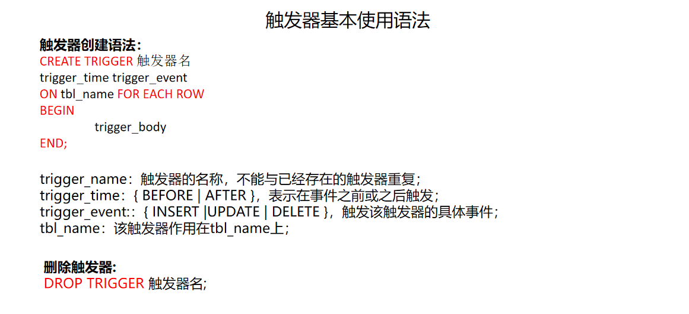

### 案例

```sql
-- 触发器创建
-- 当对emp表做更新操作时，将操作记录保存在日志表中
--当触发器启动时，将部分信息保存到日志表中
create TRIGGER emp_trigger BEFORE insert ON emp for each row
BEGIN
		insert into logs (id,createTime,exquet) values (null,now(),'inset');
		end;
-- 操作emp表，对emp表中使用更新
update emp set ename = '天蓬元帅' where eno=11;

-- 将数据插入到复制表中
create trigger emp_trigger2 after update on emp for each row
BEGIN
	INSERT into empcopy (eno,ename,job,hiredate,age,sex,sal,dno) values (old.eno,old.ename,old.job,old.hiredate,old.age,old.sex,old.sal,old.dno);
end;
--当员工表的dno和部门表dno是主外建关系，那么当删除部门表信息时，就需要先将员工表中该部门的dno更新为null，才可以删除部门信息
create trigger emp_trigger2 BEFORE delete on dept for each row
BEGIN
	UPDATE emp set dno = null where dno = old.dno;
end;
```

### 触发器的应用：

触发器针对的是数据库中的每一行记录，每行数据在操作前后都会有一个对应的状态，触发器将没有操作之前的状态保存到 old 关键字中，将操作后的状态保存到 new 中

| 触发器类型      | new 和 old 的使用                                                    |
| --------------- | -------------------------------------------------------------------- |
| INSERT 型触发器 | 没有 old，只有 new，b(插入后)的数据                                  |
| UPDATE 型触发器 | 既有 old 也有 new，old 表示更新之前的数据，new 表示更新之后的数据    |
| DELETE 型触发器 | 没有 new，只有 old，old 表示将要(删除前)或者已经被删除(删除后)的数据 |

--BEFORE 和 old old 使用的没更新之前的数据源
--BEFORE 和 new new 使用的是更新之后的数据源
--after 和 old old 使用的没更新之前的数据源
--after 和 new new 使用的是更新之后的数据源

## 数据库优化

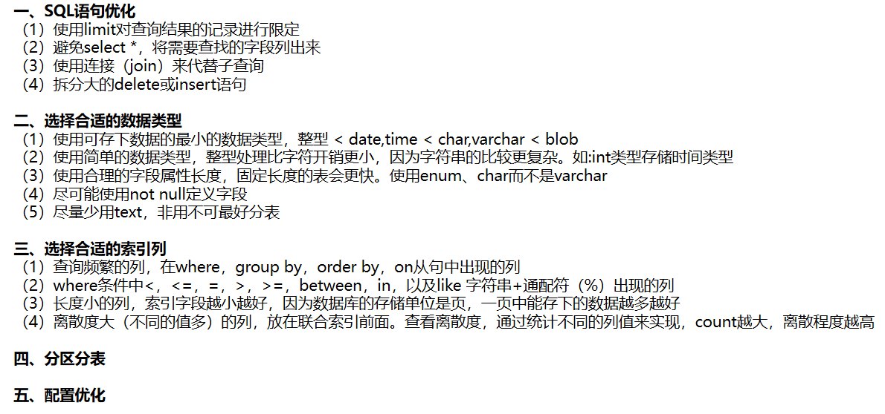

​ 数据库的分库分表

## 数据库设计

​ 目前所有的主流 DBMS 都是关系型数据库。通过二维表表示数据本身，另外表中存在一些关联列实现表和表之间的关系。

### 表之间关系

- 一对一（人对应一个身份证）
- 一对多/多对一（一个部门包含多个员工）
- 多对多（学生选课，用户和商品）

一对一：

#### 一对一

一张表中的一条数据，对应另外一张表中的一条数据，而且这些数据在表里都是唯一存在的

实际开发中一对一的关系并不常见，大多数时候一对一的关系其实可以建立成为一张表；如果需要建立一对一的关系，实现方式有两种：

1. **唯一外键关联(在其中一张表建立外键，同时设置外键列唯一 unique)**

2. 主键关联（两个表的主键列一致）

   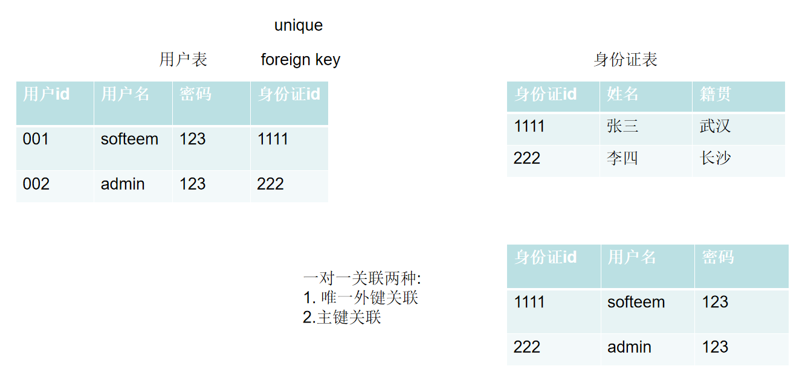

#### 一对多/多对一

一对多：一张表的一条数据，可以对应到另外一张表的很多条数据

一对多/多对一关系在开发中十分常见，大多数时候表之间的关系都是一对多/多对一的，比如：员工和部门，学生和班级，老师和学生，商品类别和商品，实现方式：

- 在多的一方表中新增外键列，关联一的一方的主键列

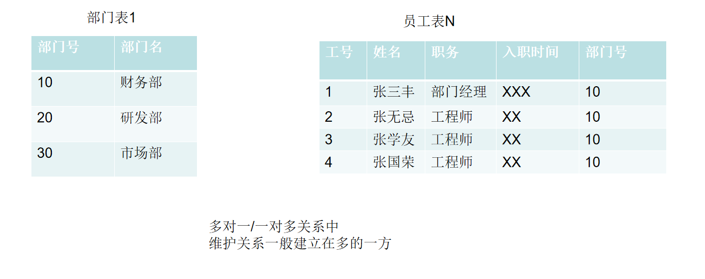

#### 多对多

多对多:

多对多的关系在开发中也是很常见的，比如说：学生和课程关系，用户和商品的，实现关联的方式如下：

- 通过第三张表维护两个表的关系

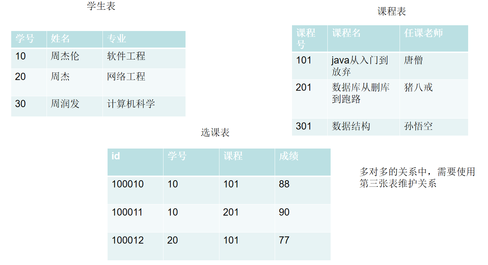

### 数据库设计范式

​ 在进行数据库设计的时候需要满足的一些规范形式，称之为数据库范式，满足范式的数据库设计是合理的，数据冗余小的，并且不会引起数据更新的异常。

​ 目前[关系数据库](https://baike.baidu.com/item/%E5%85%B3%E7%B3%BB%E6%95%B0%E6%8D%AE%E5%BA%93/1237340)有六种范式：**第一范式（1NF）、第二范式（2NF）、第三范式（3NF）**、巴斯-科德范式（BCNF）、[第四范式](https://baike.baidu.com/item/%E7%AC%AC%E5%9B%9B%E8%8C%83%E5%BC%8F/3193985)(4NF）和[第五范式](https://baike.baidu.com/item/%E7%AC%AC%E4%BA%94%E8%8C%83%E5%BC%8F/5025271)（5NF，又称完美范式）。

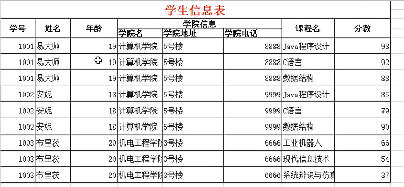

#### 第一范式

要求建立的数据库表中所有的列是原子的，每一列不可再拆分；目前的关系型数据库默认都是满足第一范式（不可能创建出不满足第一范式的数据表）20

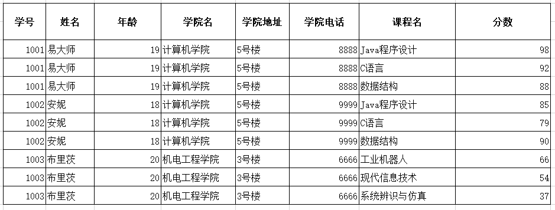

### **第一范式：列不可再分**

~属性不可分割，每个字段都应该是不可再拆分的。~

保证每列的原子性，原子性的意思就是每列不可以再次被拆分，并保持独立且唯一

### **第二范式：表中的每一列都必须完全依赖主键 **

可以去除部分的数据冗余

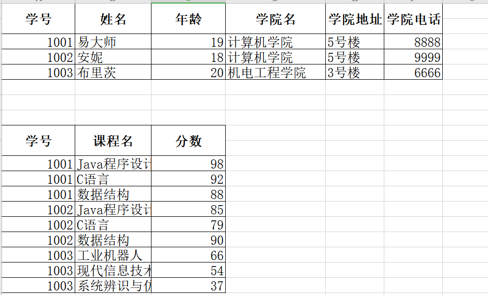

### 第三范式 需要确保数据表中的每一列都和主键有直接关系 而不能是间接关系

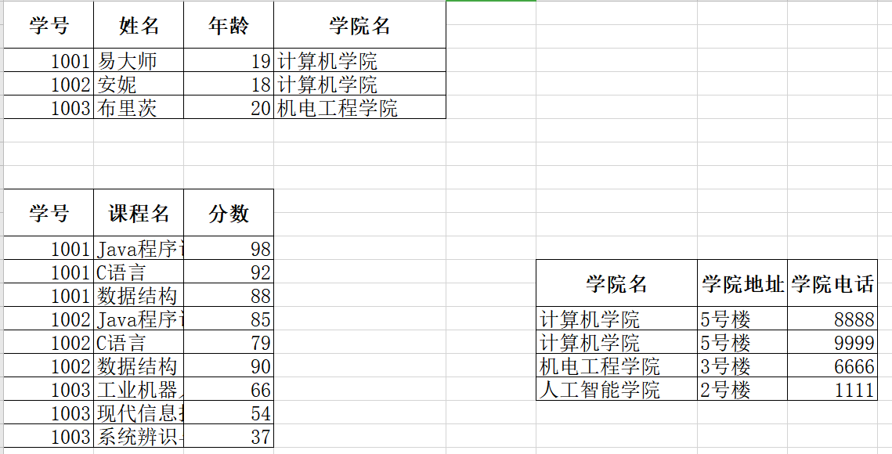

#### 范式总结

​ 在实际开发中，一般情况只要满足三大范式即可；另外，由于程序对查询的需求(处于便捷性考虑)可能会出现违背三大范式的情况；因此三大范式只是设计数据时候的一种参考，并不是定律。

范式的存在主要解决了：

1. **数据冗余**
2. **更新(insert,delete)操作异常**

### 数据库设计案例分析

#### 概念模型设计（ER 图）

​ E-R 图也称实体-联系图(Entity Relationship Diagram)，提供了表示实体类型、属性和联系的方法，用来描述现实世界的概念模型


实体(表)，关系理解为表之间的联系；在数据库设计阶段，实体关系图的建立位于概念模型设计阶段，这一阶段主要用于进行实体之间的关系建立

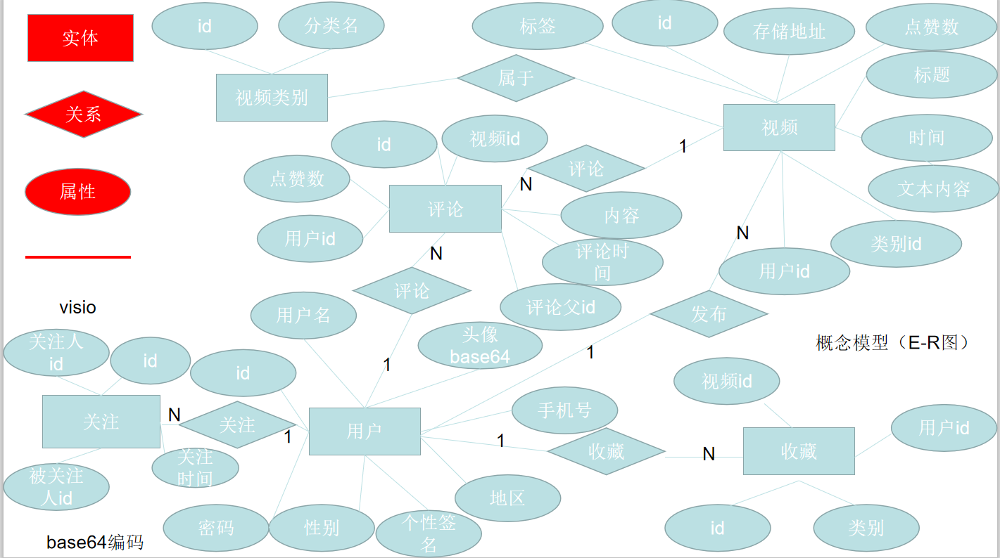

#### 物理模型设计（建表)

数据库设计一般使用一些专业设计工具，其中最常见以 sybase(SAP)的数据库建模工具 PowerDesigner 最为常见，还有一些其他数据库图形工具，比如 navcat 的模型

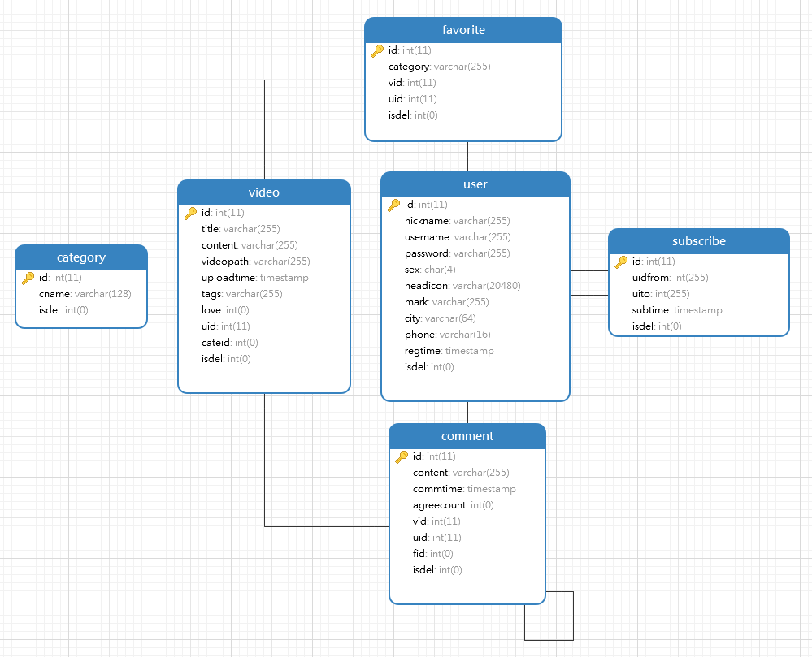

## 练习

1. 将以下数据库表重新设计，要求满足三大范式规范

   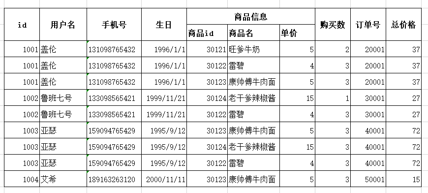

2. 找一个网站，分析网站中包含的实体以及实体之间的关系，要求:

   1. 设计概念模型（画 E-R 图）
   2. 将概念模型转换为物理模型（建表）
