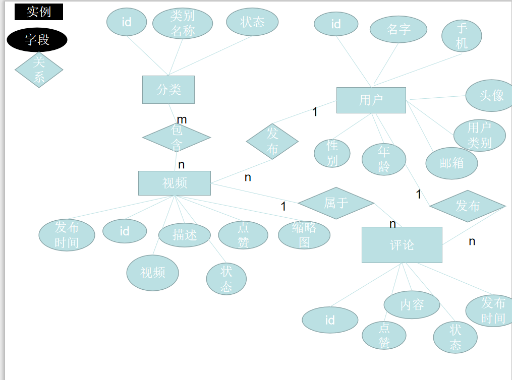
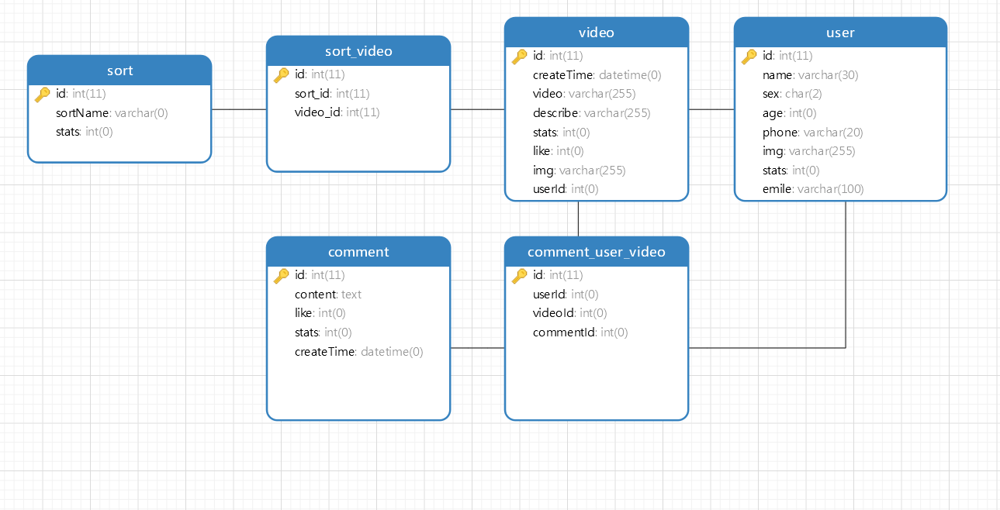

# 05 - 补充笔记(加餐) :fortune_cookie:

[[TOC]]

## 主键

数据库对表的约束

保证数据库中数据的完整性，唯一性，不能为 null;

## 外键

A 表与 B 表之间的关联字段，A 表中的某一个字段通过 B 表中的主键进行关联

外键可以重复，也可以为 null

## 函数额外补充

```mysql
一、数学函数
　　数学函数主要用于处理数字，包括整型、浮点数等。

**ABS(x)**
返回x的绝对值　　不区分大小写

**SELECT ABS(-1)** -- 返回1

**CEIL(x),CEILING(x)**
返回大于或等于x的最小整数　　

**SELECT CEIL(1.5)** -- 返回2

**FLOOR(x)**
返回小于或等于x的最大整数　　

**SELECT FLOOR(1.5)** -- 返回1

**RAND()**
返回0->1的随机数　　

**SELECT RAND() --0.93099315644334**

**RAND(x)**
返回0->1的随机数，x值相同时返回的随机数相同　　

**SELECT RAND(2) --1.5865798029924**

**PI()**
返回圆周率(3.141593）　　

**SELECT PI() --3.141593**

**TRUNCATE(x,y)**
返回数值x保留到小数点后y位的值（与ROUND最大的区别是不会进行四舍五入）　　

**SELECT TRUNCATE(1.23456,3) -- 1.234**

**ROUND(x,y)**
保留x小数点后y位的值，但截断时要进行四舍五入　　

**SELECT ROUND(1.23456,3) -- 1.235**

**POW(x,y).POWER(x,y)**
返回x的y次方　　

**SELECT POW(2,3) -- 8**

**SQRT(x)**
返回x的平方根　　

**SELECT SQRT(25) -- 5**

**EXP(x)**
返回e的x次方　　

**SELECT EXP(3) -- 20.085536923188**

**MOD(x,y)**
返回x除以y以后的余数　　

**SELECT MOD(5,2) -- 1**


二、字符串函数
　　字符串函数是MySQL中最常用的一类函数，字符串函数主要用于处理表中的字符串。

函数 说明

**CHAR_LENGTH(s)**
返回字符串s的字符数

**SELECT CHAR_LENGTH('你好123') -- 5**

**CONCAT(s1,s2,...)**
将字符串s1,s2等多个字符串合并为一个字符串

**SELECT CONCAT('12','34') -- 1234**

**CONCAT_WS(x,s1,s2,...)**
同CONCAT(s1,s2,...)函数，但是每个字符串直接要加上x

**SELECT CONCAT_WS('@','12','34') -- 12@34**

**INSERT(s1,x,len,s2)**
将字符串s2替换s1的x位置开始长度为len的字符串 x从1开始

**SELECT INSERT('12345',1,3,'abc') -- abc45**

**UPPER(s),UCAASE(S)**
将字符串s的所有字母变成大写字母

**SELECT UPPER('abc') -- ABC**

**LOWER(s),LCASE(s)**
将字符串s的所有字母变成小写字母

**SELECT LOWER('ABC') -- abc**

**LEFT(s,n)**
返回字符串s的前n个字符

**SELECT LEFT('abcde',2) -- ab**

**RIGHT(s,n)**
返回字符串s的后n个字符

**SELECT RIGHT('abcde',2) -- de**

**LTRIM(s)** 去掉字符串s开始处的空格
**RTRIM(s)** 去掉字符串s结尾处的空格
**TRIM(s)** 去掉字符串s开始和结尾处的空格
**SELECT TRIM('@' FROM '@@abc@@') -- abc**

**REPEAT(s,n)**
将字符串s重复n次

**SELECT REPEAT('ab',3) -- ababab**

**SPACE(n)** 返回n个空格

**REPLACE(s,s1,s2)**
将字符串s2替代字符串s中的字符串s1

**SELECT REPLACE('abca','a','x') --xbcx**

**STRCMP(s1,s2)** 比较字符串s1和s2

**SUBSTRING(s,n,len)** 获取从字符串s中的第n个位置开始长度为len的字符串

**LOCATE(s1,s),POSITION(s1 IN s)**
从字符串s中获取s1的开始位置

**SELECT LOCATE('b', 'abc') -- 2**

**REVERSE(s)**
将字符串s的顺序反过来

**SELECT REVERSE('abc') -- cba**

**FIELD(s,s1,s2...)**
返回第一个与字符串s匹配的字符串位置

**SELECT FIELD('c','a','b','c') -- 3**

 --replace(源字符,需要替换的字符，替换的字符)
SELECT REPLACE("abcd        ",' ','#')


三、日期时间函数
　　MySQL的日期和时间函数主要用于处理日期时间。

函数 说明

**CURDATE(),CURRENT_DATE()**
返回当前日期

**SELECT CURDATE()**
**->2014-12-17**

**CURTIME(),CURRENT_TIME**
返回当前时间

**SELECT CURTIME()**
**->15:59:02**


**NOW(),CURRENT_TIMESTAMP(),LOCALTIME(),**

**SYSDATE(),LOCALTIMESTAMP()**

返回当前日期和时间

**SELECT NOW()**
**->2014-12-17 15:59:02**

**YEAR(d),**
**MONTH(d)**
**DAY(d)**
返回日期d中的月份值，1->12

**SELECT MONTH('2011-11-11 11:11:11')**
**->11**

**MONTHNAME(d)**
返回日期当中的月份名称，如Janyary

**SELECT MONTHNAME('2011-11-11 11:11:11')**
**->November**

**DAYNAME(d)**
返回日期d是星期几，如Monday,Tuesday

**SELECT DAYNAME('2011-11-11 11:11:11')**
**->Friday**

**DAYOFWEEK(d)**
日期d今天是星期几，1星期日，2星期一

**SELECT DAYOFWEEK('2011-11-11 11:11:11')**
**->6**

**WEEKDAY(d)**
日期d今天是星期几，

0表示星期一，1表示星期二

**WEEK(d)，WEEKOFYEAR(d)**
计算日期d是本年的第几个星期，范围是0->53

**SELECT WEEK('2011-11-11 11:11:11')**
**->45**

**DAYOFYEAR(d)**
计算日期d是本年的第几天

**SELECT DAYOFYEAR('2011-11-11 11:11:11')**
**->315**

DAYOFMONTH(d)
计算日期d是本月的第几天

**SELECT DAYOFMONTH('2011-11-11 11:11:11')**
**->11**

**QUARTER(d)**
返回日期d是第几季节，返回1->4

**SELECT QUARTER('2011-11-11 11:11:11')**
**->4**

**HOUR(t)**
返回t中的小时值

**SELECT HOUR('1:2:3')**
**->1**

**MINUTE(t)**
返回t中的分钟值

**SELECT MINUTE('1:2:3')**
**->2**

**SECOND(t)**
返回t中的秒钟值

**SELECT SECOND('1:2:3')**
**->3**
```

## 联表查询 having

等值连接

查询两张表或者两张以上的表时，为了消除可能存在的数据重复（笛卡尔积）所以在语句的后面加上了等值条件

```mysql
-- 获取员工信息和员工的部门信息
SELECT * from emp,dept where emp.dno = dept.dno

--内连接

SELECT * from emp INNER JOIN dept on emp.dno = dept.dno

内连接和等值连接的查询结果是一样的，只是在语法上有些区别


-- 左连接
SELECT * from emp LEFT JOIN dept on emp.dno = dept.dno


左连接以左边的表为主表：emp    dept表为副表
当主表在副表中没有找到对应的数据时，副表中的字段将默认填充为null


-- 右连接
SELECT * from emp RIGHT JOIN dept on emp.dno = dept.dno

右连接以右边的表为主表：dept    emp表为副表
当主表在副表中没有找到对应的数据时，副表中的字段将默认填充为null
```

## 三大范式：数据库设计的基本规则

表与表之间的关系：

学生信息表和学生档案表 一对一

A 表中的一条信息只对应 B 表中的一条信息

设计一种学生表，和一张学生档案表，这两张表中通过外键档案 id 进行关联

学生信息表和学生寝室表 一对多

一条寝室信息对应多个学生信息

设计一张学生表，一张班级表，学生和班级通过班级的编号进行关联

学生信息表和老师表 多对多

一个老师可有多个学生，一个学生可以有多个老师

一个商品在多条订单中，同一个订单可以存着多个商品

### 第一范式：

​ 数据库表中，每一列都遵循原子性，就是每一列都不可再拆分

## 第二范式：

​ 表中的每一列都和主键有直接相关，而不是和主键的部分信息相关

解决的问题主要是：

​ 1.如果将成绩信息和科目信息放在同一张表中：那么当对科目进行新添科目和删除科目是，会出现科目数据的异常问题，这个异常问题就是科目没有办法和成绩表的主键进行对应

​ 2.解决数据冗余（重复）

## 第三范式：

​ 表中没一个字段，都比较和主键有之间关系而不是间接或者关系转移

比如成绩表要和学生表关联，然后学生表再和学院表关联，这样成绩才能和学院进行关联

a>b,b>c a 和 c 就通过 b 进行了依赖传递

## 正则

模糊查询

使用 like 关键字对 sql 语句中的查询条件做限制

```mysql
SELECT * FROM emp where ename like '%卡%'
只要ename中，包含的有'卡'这个字段，全部都符合查询调教


SELECT * FROM emp where ename like '卡%'
查询所有名字以‘卡’开头的名字

SELECT * FROM emp where ename like '%卡'
查询所有名字以‘卡’结尾的字符

SELECT * from emp where ename like '卡__'
查询所有以‘卡’字符开始，并且卡后面只有两个字符的名字

```

| ^          | 匹配输入字符串的开始位置                                                                                |
| ---------- | ------------------------------------------------------------------------------------------------------- |
| $          | 匹配输入字符串的结束位置                                                                                |
| .          | 匹配除 "\n" 之外的任何单个字符                                                                          |
| [...]      | 字符集合。匹配所包含的任意一个字符。例如， '[abc]' 可以匹配 "plain" 中的 'a'。                          |
| [^...]     | 负值字符集合。匹配未包含的任意字符。例如， '[^admin]' 可以匹配 "plain" 中的'p'。                        |
| p1\|p2\|p3 | 匹配 p1 或 p2 或 p3。例如，'z\|food' 能匹配 "z" 或 "food"。'(z\|f)ood' 则匹配 "zood" 或 "food"。        |
| \*         | 匹配前面的子表达式零次或多次。例如，a\*匹配 0 个或多个 a,包括空                                         |
| +          | 匹配前面的子表达式一次或多次。例如，a+匹配一个或多个 a,不包括空                                         |
| {n}        | n 是一个非负整数。匹配确定的 n 次。例如，'a{2}' 配备连续出现 aa, [a-z]{1}匹配出现 a-z 任意一处          |
| {n,m}      | m 和 n 均为非负整数，其中 n <= m。最少匹配 n 次且最多匹配 m 次。比如匹配 a{1,2}匹配至少一处最多两次的 a |

```mysql
SELECT * from emp where ename regexp '^天'
查询所有以‘天’字开头的名字


SELECT * from emp where ename REGEXP '师$'
查询所有以'师'字结尾的名字

SELECT * from emp where ename REGEXP '.'
匹配出'\n'以外的所有字符，就理解为没有加任何匹配条件的查询

SELECT * from emp where ename REGEXP '[ab]'
名字里包含的有a或者b的，都满足查询条件


SELECT * from emp where ename REGEXP '[^李白]'
名字里面没有‘李白’

SELECT * from emp where ename REGEXP 'a|b|天'
名字里面包含的有a或者b或者天，满足任意一个条件即可

SELECT * from  emp where ename REGEXP 'a+'
名字里面包含有一个a或者是多个a，但是最少要有一个a，不包括空值(Null)

SELECT * from  emp where ename REGEXP 'a*'
名字里面包好0个或者多个a，包括空值，包括空值

SELECT * from emp where ename REGEXP 'a{2}'
名字里面连续出现了两个a的字符，比如‘aabdsds’就满足，但是'afdfafds'只包含了2个a，所以不满足查询条件

SELECT * from emp where ename REGEXP 'e{1,3}'
名字里至少出现1次e，最多出现3次e


100.用正则表达式在学生信息表中找出手机号有11位数字的学生的所有信息。
SELECT * from emp where tel REGEXP '[0-9]{11}'

101----，用正则表达式在学生信息表中找出手机号以12开头以34结尾的学生的姓名和手机号。
SELECT * from emp where tel REGEXP '^12.*34$'
'.*'表示不管匹配次数和内容

SELECT * from emp where tel REGEXP '^12[0-9]{7}34$'
[0-9]{7} 内容在0-9这些自然数中，并且出现了7次，也就是7位

102，用正则表达式在学生信息表中找出英文名字不含有l-p之间字母的学生的姓名和英文名字，并按照分数的降序排列。
select * from emp where ename not REGEXP'[l-p]' order by sal desc

103，用正则表达式在学生信息表中找出手机号含有三个3且含有2个5的学生的姓名和手机号。
SELECT * FROM emp where LENGTH(tel) - length(REPLACE(tel,'3','')) = 3 and LENGTH(tel) - length(REPLACE(tel,'5',''))=2
使用的技巧是：length()是获取字符串的长度
			replace()是字符串中某个字符的替换
	思路是：将原字符串的长度减去通过replace()替换后的字符串的长度，就得到所包含的特定字符串的个数
正则：


104，用正则表达式在学生信息表中找出英文名字中含有特殊字符的学生。
SELECT * from  emp where ename REGEXP '[^a-zA-Z0-9]'

105，用正则表达式在学生信息表中找出英文名字中含有空格的学生。
SELECT * FROM emp WHERE ename REGEXP ' '

106，用正则表达式在学生信息表中找出英文名字中含有“.”或“\”的学生。
SELECT * from  emp where ename REGEXP '[a-z.\\\]'

107，用正则表达式在学生信息表中找英文名中含有连续的2个“a”或者连续的3个“e”的学生。
select * from emp where tel REGEXP 'a{2}|e{3}'

108，用正则表达式在学生信息表中找出英文名字以“A”开头的学生的姓名和学号。
select * from emp where ename '^A'

109，用正则表达式在学生信息表中找出英文名字以“e”结尾的学生的信息。
select * from emp where ename 'e$'
```

## 数据库原型设计

ER 图



物理模型图：


