# Reggie 开发笔记 一

[[TOC]]

## 1、软件开发整体介绍

### 软件开发流程

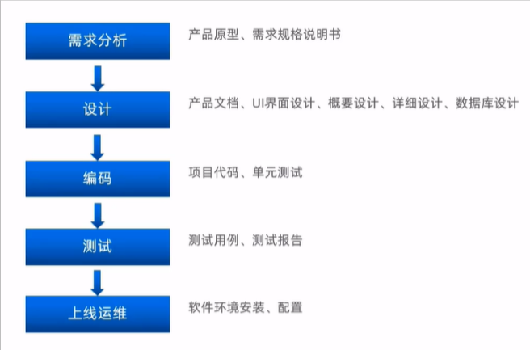

### 角色分工


### 软件环境

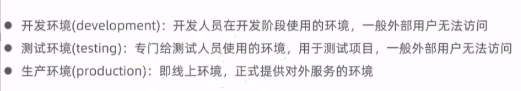

## 2、Reggie 外卖项目介绍

### 项目介绍


### 产品原型展示

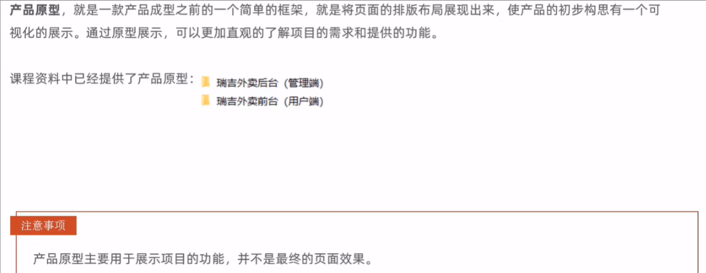

### 技术选型

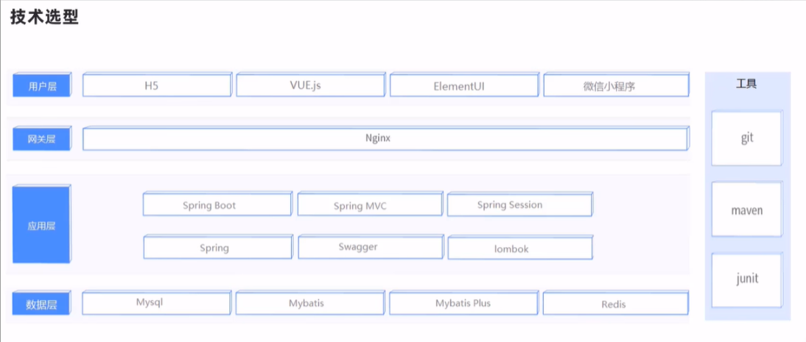

### 功能架构

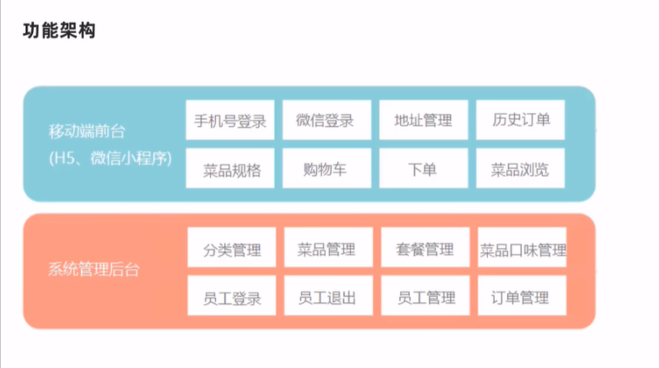

### 角色


## 3、环境搭建

### 数据库环境搭建

- **创建数据库**
  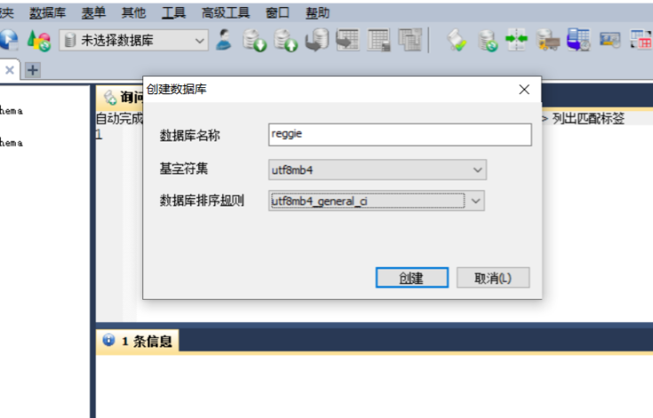
- **执行 SQL 脚本**
  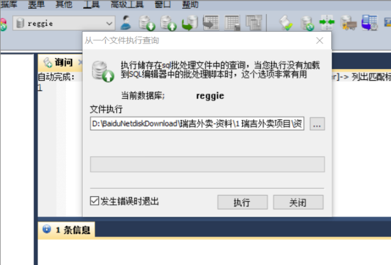
- **数据表**
  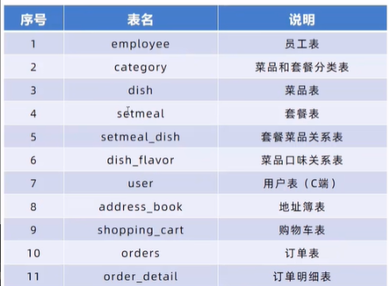

### maven 项目搭建

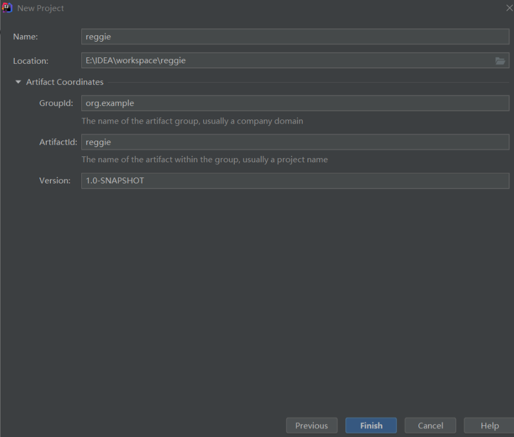

**解决 IDEA 加载 maven 工程缓慢**
VM Options:-DarchetypeCatalog=local

**添加依赖:**

```xml
    <parent>
        <groupId>org.springframework.boot</groupId>
        <artifactId>spring-boot-starter-parent</artifactId>
        <version>2.4.5</version>
        <relativePath/> <!-- lookup parent from repository -->
    </parent>
    <groupId>com.ka</groupId>
    <artifactId>reggie</artifactId>
    <version>1.0-SNAPSHOT</version>
    <properties>
        <java.version>1.8</java.version>
    </properties>
    <dependencies>

        <dependency>
            <groupId>org.springframework.boot</groupId>
            <artifactId>spring-boot-starter</artifactId>
        </dependency>

        <dependency>
            <groupId>org.springframework.boot</groupId>
            <artifactId>spring-boot-starter-test</artifactId>
            <scope>test</scope>
        </dependency>

        <dependency>
            <groupId>org.springframework.boot</groupId>
            <artifactId>spring-boot-starter-web</artifactId>
            <scope>compile</scope>
        </dependency>

        <dependency>
            <groupId>com.baomidou</groupId>
            <artifactId>mybatis-plus-boot-starter</artifactId>
            <version>3.4.2</version>
        </dependency>

        <dependency>
            <groupId>org.projectlombok</groupId>
            <artifactId>lombok</artifactId>
            <version>1.18.20</version>
        </dependency>

        <dependency>
            <groupId>com.alibaba</groupId>
            <artifactId>fastjson</artifactId>
            <version>1.2.76</version>
        </dependency>

        <dependency>
            <groupId>commons-lang</groupId>
            <artifactId>commons-lang</artifactId>
            <version>2.6</version>
        </dependency>

        <dependency>
            <groupId>mysql</groupId>
            <artifactId>mysql-connector-java</artifactId>
            <scope>runtime</scope>
        </dependency>

        <dependency>
            <groupId>com.alibaba</groupId>
            <artifactId>druid-spring-boot-starter</artifactId>
            <version>1.1.23</version>
        </dependency>

    </dependencies>

    <build>
        <plugins>
            <plugin>
                <groupId>org.springframework.boot</groupId>
                <artifactId>spring-boot-maven-plugin</artifactId>
                <version>2.4.5</version>
            </plugin>
        </plugins>
    </build>
```

**application.yml**

```yaml
server:
  port: 8080
spring:
  application:
    #应用名称
    name: reggie_take_out
  datasource:
    druid:
      driver-class-name: com.mysql.cj.jdbc.Driver
      url: jdbc:mysql://localhost:3306/reggie?serverTimezone=Asia/Shanghai&useUnicode=true&characterEncoding=utf-8&zeroDateTimeBehavior=convertToNull&useSSL=false&allowPublicKeyRetrieval=true
      username: root
      password: 1234
mybatis-plus:
  configuration:
    #address_book->AddressBook
    #在映射实体或者属性时，将数据库中表名和字段名中的下划线去掉，按照驼峰命名法映射
    map-underscore-to-camel-case: true
    log-impl: org.apache.ibatis.logging.stdout.StdOutImpl
  global-config:
    db-config:
      id-type: ASSIGN_ID
```

**配置 application 启动类**

```java
@Slf4j
@SpringBootApplication
public class ReggieApplication {
    public static void main(String[] args) {
        SpringApplication.run(ReggieApplication.class,args);
        log.info("项目启动成功！！！");
    }
}
```

把前端的静态资源放在 resource 目录
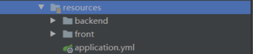

设置静态资源映射

```java
@Slf4j
@Configuration
public class WebMvcConfig extends WebMvcConfigurationSupport {
    @Override
    protected void addResourceHandlers(ResourceHandlerRegistry registry) {
        log.info("开始静态资源映射");
        registry.addResourceHandler("/backend/**").addResourceLocations("classpath:/backend/");
        registry.addResourceHandler("/front/**").addResourceLocations("classpath:/front/");
    }
}
```

启动项目，访问 http://localhost:8080/backend/index.html
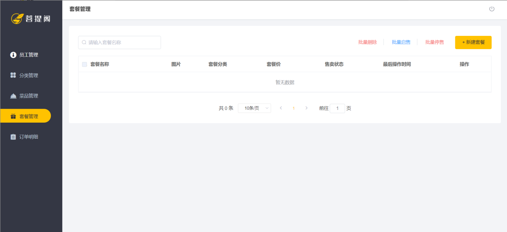

## 4、后台登录功能开发

### 需求分析

- 登录页面展示(<http://localhost:8080/backend/page/login/login.html>)
  
- 查看登录请求信息
  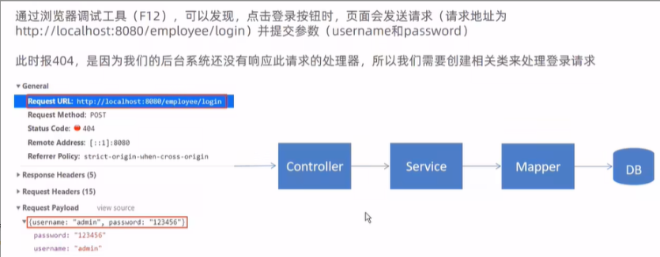
- 数据模型（employee 表）
  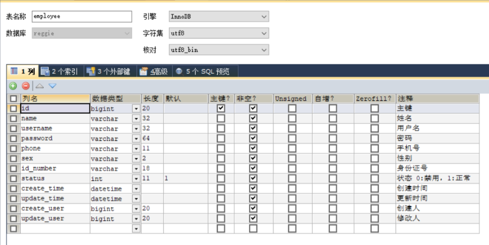

### 代码开发

- 创建实体类 Employee，和 employee 表进行映射

```java
@Data
public class Employee implements Serializable {

    private static final long serialVersionUID = 1L;

    private Long id;

    private String username;

    private String name;

    private String password;

    private String phone;

    private String sex;

    private String idNumber;//身份证号码

    private Integer status;

    private LocalDateTime createTime;

    private LocalDateTime updateTime;

    @TableField(fill = FieldFill.INSERT)
    private Long createUser;

    @TableField(fill = FieldFill.INSERT_UPDATE)
    private Long updateUser;

}
```

- 创建 Controller，Service，Mapper

EmployeeMapper

```java
@Mapper
public interface EmployeeMapper extends BaseMapper<Employee> {
}
```

EmployeeService

```java
public interface EmployeeService extends IService<Employee> {
}
```

EmployeeServiceImpl

```java
@Service
public class EmployeeServiceImpl extends ServiceImpl<EmployeeMapper, Employee> implements EmployeeService {
}
```

EmployeeController

```java
@Slf4j
@RestController
@RequestMapping("/employee")
public class EmployeeController {
    @Autowired
    private EmployeeServiceImpl employeeService;
}
```

- 导入返回结果类 R
  - 此类是一个通用结果类，服务端响应的所有结果最终都会包装成此种类型返回给前端页面

```java
@Data
public class R<T> {

    private Integer code; //编码：1成功，0和其它数字为失败

    private String msg; //错误信息

    private T data; //数据

    private Map map = new HashMap(); //动态数据

    public static <T> R<T> success(T object) {
        R<T> r = new R<T>();
        r.data = object;
        r.code = 1;
        return r;
    }

    public static <T> R<T> error(String msg) {
        R r = new R();
        r.msg = msg;
        r.code = 0;
        return r;
    }

    public R<T> add(String key, Object value) {
        this.map.put(key, value);
        return this;
    }

}
```

- 在 Controller 中创建登录方法
  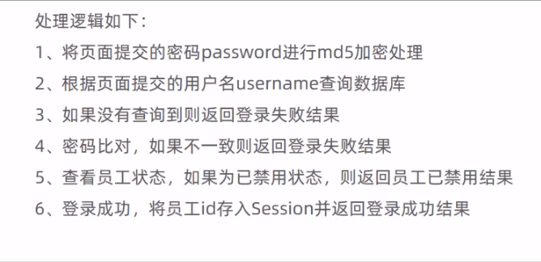
  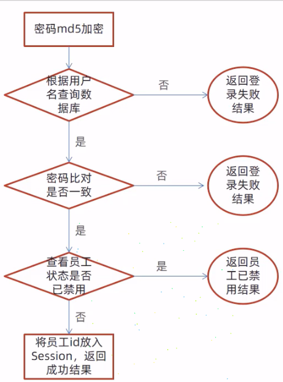

```java
@Slf4j
@RestController
@RequestMapping("/employee")
public class EmployeeController {
    @Autowired
    private EmployeeServiceImpl employeeService;

    @PostMapping("/login")
    public R<Employee> logib(HttpServletRequest request, @RequestBody Employee employee) {

        //1、将页面提交的密码进行md5加密处理
        String password = employee.getPassword();
        password = DigestUtils.md5DigestAsHex(password.getBytes());

        //2、根据页面提交的用户名来查数据库
        LambdaQueryWrapper<Employee> queryWrapper = new LambdaQueryWrapper<>();
        queryWrapper.eq(Employee::getUsername, employee.getUsername());
        Employee emp = employeeService.getOne(queryWrapper);

        //3、如果没有查询到则返回失败结果
        if (emp == null) {
            return R.error("登录失败");
        }

        //4、比对密码，如果不一致则返回失败结果
        if (!emp.getPassword().equals(password)) {
            return R.error("密码错误");
        }

        //5、查看员工状态，如果已禁用状态，则返回员工已禁用结果
        if (emp.getStatus() == 0) {
            return R.error("账号已禁用");
        }

        //6、登录成功，将用户id存入Session并返回成功结果
        request.getSession().setAttribute("employee", emp.getId());
        return R.success(emp);
    }
}
```

## 5、后台退出功能开发

**需求分析**


**代码实现**

在 Controller 中创建退出方法

```java
    //员工退出
    @PostMapping("/logout")
    public R<String> logout(HttpServletRequest request){
        //清理Session中保存的当前员工登录的id
        request.getSession().removeAttribute("employee");
        return R.success("退出成功");
    }
```
