# Reggie 开发笔记 二

[[TOC]]

## 1、完善登录功能

### 问题分析

前面我们已经完成了后台系统的员工登录功能开发，但是还存在一个问题:用户如果不登录，直接访问系统首页面，照样可以正常访问。

这种设计并不合理，我们希望看到的效果应该是，**只有登录成功后才可以访问系统中的页面**，如果没有登录则跳转到登录页面。

那么，具体应该怎么实现呢?

答案就是使用**过滤器或者拦截器**，在过滤器或者拦截器中**判断用户是否已经完成登录**，如果没有登录则跳转到登录页面

### 代码实现

实现步骤:

- **创建自定义过滤器 LoginCheckFilter**

```java
@WebFilter(filterName = "LoginCheckFilter",urlPatterns = "/*")
@Slf4j
public class LoginCheckFilter implements Filter {
    @Override
    public void doFilter(ServletRequest servletRequest, ServletResponse servletResponse, FilterChain filterChain) throws IOException, ServletException {
        HttpServletRequest request=(HttpServletRequest) servletRequest;
        HttpServletResponse response=(HttpServletResponse) servletResponse;
        log.info("拦截到请求：{}",request.getRequestURI());
        filterChain.doFilter(request,response);
    }
}
```

- **在启动类上加入注解@ServletComponentScan**

```java
@Slf4j
@SpringBootApplication
@ServletComponentScan
public class ReggieApplication {
    public static void main(String[] args) {
        SpringApplication.run(ReggieApplication.class,args);
        log.info("项目启动成功！！！");
    }
}
```

- **完善过滤器的处理逻辑**

过滤器具体的处理逻辑如下:

1、获取本次请求的 URI

2、判断本次请求是否需要处理

3、如果不需要处理，则直接放行

4、判断登录状态，如果已登录，则直接放行

5、如果未登录则返回未登录结果
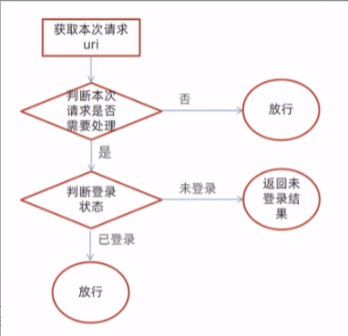

```java
/**
 * @ClassName: LoginCheckFilter
 * @Description: 检查用户是否已经完成登录
 * @author: 名字
 * @date: 2022/5/10  15:57
 */
@WebFilter(filterName = "LoginCheckFilter",urlPatterns = "/*")
@Slf4j
public class LoginCheckFilter implements Filter {
    //路径匹配器，支持通配符
    public static final AntPathMatcher PATH_MATCHER=new AntPathMatcher();

    @Override
    public void doFilter(ServletRequest servletRequest, ServletResponse servletResponse, FilterChain filterChain) throws IOException, ServletException {
        HttpServletRequest request=(HttpServletRequest) servletRequest;
        HttpServletResponse response=(HttpServletResponse) servletResponse;

//        1、获取本次请求的URI
        String requestURI = request.getRequestURI();

        log.info("拦截到请求：{}",requestURI);

//        定义不需要处理的请求路径
        String[] urls=new String[]{
                "/employee/login",
                "/employee/logout",
                "/backend/**",
                "/front/**"
        };
//        2、判断本次请求是否需要处理
        boolean check = check(urls, requestURI);
//        3、如果不需要处理，则直接放行
        if(check){
            log.info("本次请求{}不需要处理",requestURI);
            filterChain.doFilter(request,response);
            return;
        }
//        4、判断登录状态，如果已登录，则直接放行
        if(request.getSession().getAttribute("employee")!=null){
            log.info("用户已登录，用户id为：{}",request.getSession().getAttribute("employee"));
            filterChain.doFilter(request,response);
            return;
        }
        log.info("用户未登录");
//        5、如果未登录则返回未登录结果,通过输出流向客户端页面响应数据
        response.getWriter().write(JSON.toJSONString(R.error("NOTLOGIN")));
        return;
    }
    //路径匹配，检查本次请求是否需要放行
    public boolean check(String[] urls,String requestURI){
        for (String url : urls) {
            boolean match = PATH_MATCHER.match(url, requestURI);
            if(match==true){
                return true;
            }
        }
        return  false;
    }
}
```

## 2、新增员工

### 需求分析

后台系统中可以管理员工信息，通过新增员工来添加后台系统用户。点击 **添加员工** 按钮跳转到新增页面，如下:
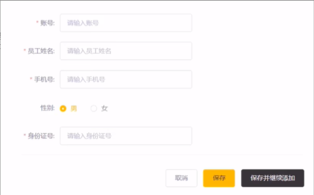

### 数据模型

新增员工，其实就是将我们新增页面录入的员工数据插入到 employee 表。需要注意，employee 表中对 username 字段加入了唯一约束，因为 username 是员工的登录账号，必须是**唯一**的

### 代码开发

在开发代码之前，需要梳理一下整个程序的执行过程:

- 页面发送 ajax 请求，将新增员工页面中输入的数据以 json 的形式提交到服务端
- 服务端 Controller 接收页面提交的数据并调用 Service 将数据进行保存
- Service 调用 Mapper 操作数据库，保存数据
  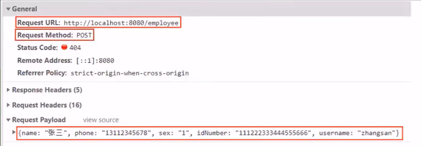

```java
    //新增员工
    @PostMapping
    public R<String> save(HttpServletRequest request, @RequestBody Employee employee){
        log.info("新增员工，员工信息：{}",employee.toString());
        //设置初始密码，需要进行md5加密处理
        employee.setPassword(DigestUtils.md5DigestAsHex("123456".getBytes()));

        employee.setCreateTime(LocalDateTime.now());
        employee.setUpdateTime(LocalDateTime.now());

        Long empId = (Long) request.getSession().getAttribute("employee");

        employee.setCreateUser(empId);
        employee.setUpdateUser(empId);

        employeeService.save(employee);

        return R.success("新增员工成功");
    }
```

前面的程序还存在一个问题，就是当我们在新增员工时输入的账号已经存在，由于 employee 表中对该字段加入了唯一约束，此时程序会抛出异常:
`java.sql.SQLIntegrityConstraintViolationException: Duplicate entry 'heniang' for key 'idx_username'`

此时需要我们的程序进行异常捕获，通常有两种处理方式:

1、在 Controller 方法中加入 try.catch 进行异常捕获

2、使用异常处理器进行全局异常捕获

```java
@ControllerAdvice(annotations = {RestController.class, Controller.class})
@ResponseBody
@Slf4j
public class GlobalExceptionHandler {

    //进行异常处理方法
    @ExceptionHandler(SQLIntegrityConstraintViolationException.class)
    public R<String> exceptionHandler(SQLIntegrityConstraintViolationException ex){
        log.error(ex.getMessage());

        if(ex.getMessage().contains("Duplicate entry")){
            String[] split = ex.getMessage().split(" ");
            String msg=split[2]+"已存在";
            return R.error(msg);
        }

        return R.error("未知错误");
    }
}
```

**总结**

1、根据产品原型明确业务需求

2、重点分析数据的流转过程和数据格式

3、通过 debug 断点调试跟踪程序执行过程

## 3、员工信息分页查询

### 需求分析

系统中的员工很多的时候，如果在一个页面中全部展示出来会显得比较乱，不便于查看，所以一般的系统中都会以分页的方式来展示列表数据。

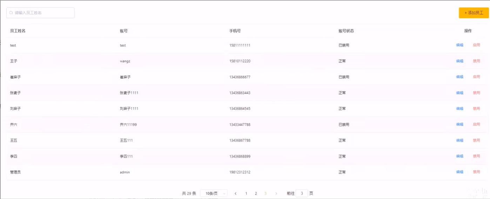

### 代码开发

在开发代码之前，需要梳理一下整个程序的执行过程:

- 页面发送 ajax 请求，将分页查询参数(page.pageSize、name)提交到服务端
- 服务端 Controller 接收页面提交的数据并调用 Service 查询数据
- Service 调用 Mapper 操作数据库，查询分页数据
- Controller 将查询到的分页数据响应给页面
- 页面接收到分页数据并通过 ElementUI 的 Table 组件展示到页面上

配置 MP 分页插件

```java
@Configuration
public class MybatisPlusConfig {
    @Bean
    public MybatisPlusInterceptor mybatisPlusInterceptor(){
        MybatisPlusInterceptor mybatisPlusInterceptor = new MybatisPlusInterceptor();
        mybatisPlusInterceptor.addInnerInterceptor(new PaginationInnerInterceptor());
        return  mybatisPlusInterceptor;
    }
}
```

员工信息分页查询

```java
@GetMapping("/page")
public R<Page> page(int page, int pageSize, String name) {
    log.info("page={},pageSize={},name={}", page, pageSize, name);

    //构造分页构造器
    Page pageInfo=new Page(page,pageSize);

    //构造条件构造器
    LambdaQueryWrapper<Employee> queryWrapper=new LambdaQueryWrapper();
    //添加过滤条件
    queryWrapper.like(!StringUtils.isEmpty(name),Employee::getName,name);
    //添加排序条件
    queryWrapper.orderByDesc(Employee::getUpdateTime);

    //执行查询
    employeeService.page(pageInfo,queryWrapper);

    return R.success(pageInfo);
}
```

### 功能测试

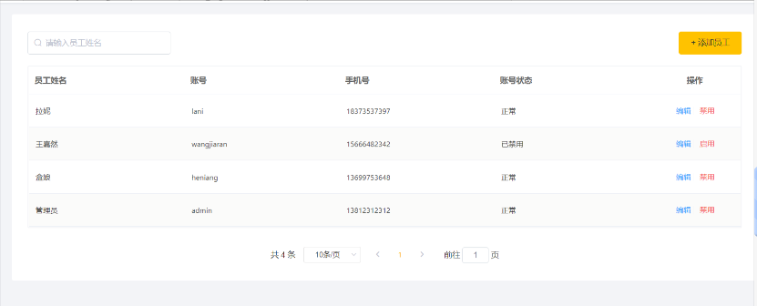

## 4、启用/禁用员工账号

### 需求分析

在员工管理列表页面，可以对某个员工账号进行启用或者禁用操作。账号禁用的员工不能登录系统，启用后的员工可以正常登录。

需要注意，只有管理员（admin 用户）可以对其他普通用户进行启用、禁用操作，所以普通用户登录系统后启用、禁用按钮不显示。

### 代码开发

页面中是怎么做到只有管理员 admin 能够看到启用、禁用按钮的？

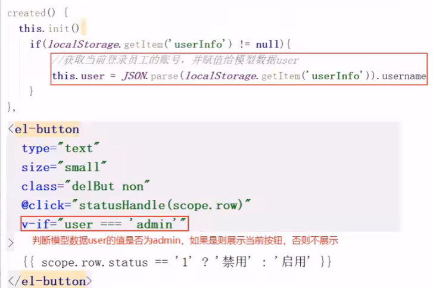

在开发代码之前，需要梳理一下整个程序的执行过程:

1、页面发送 ajax 请求，将参数(id、 status)提交到服务端

2、服务端 Controller 接收页面提交的数据并调用 Service 更新数据

3、Service 调用 Mapper 操作数据库

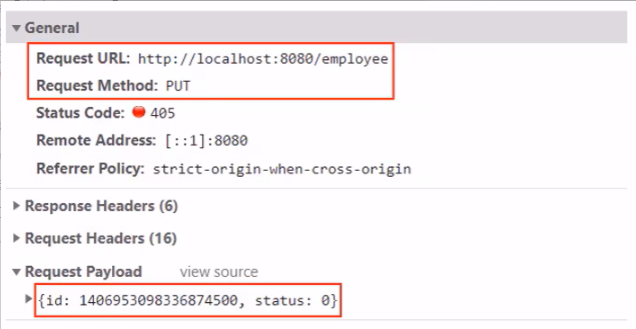

页面中的 ajax 请求是如何发送的？
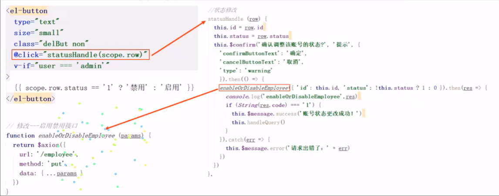

根据 id 修改员工信息

```java
@PutMapping
public R<String> update(HttpServletRequest request,@RequestBody Employee employee){
    log.info(employee.toString());

    Long empId = (Long) request.getSession().getAttribute("employee");
    employee.setUpdateTime(LocalDateTime.now());
    employee.setUpdateUser(empId);
    employeeService.updateById(employee);

    return R.success("员工信息修改成功");
}
```

测试过程中没有报错，但是功能并没有实现，查看数据库中的数据也没有变化。观察控制台输出的 SQL:
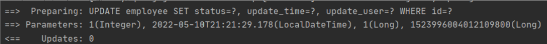

SQL 执行的结果是更新的数据行数为 0，仔细观察 id 的值，和数据库中对应记录的 id 值并不相同
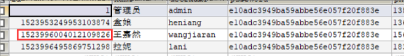

### 代码修复

通过观察控制台输出的 SQL 发现页面传递过来的员工 id 的值和数据库中的 id 值不一致，这是怎么回事呢?

分页查询时服务端响应给页面的数据中 id 的值为 19 位数字，类型为 long

页面中 js 处理 long 型数字只能精确到**前 16 位**，所以最终通过 ajax 请求提交给服务端的时候 id 就改变了

前面我们已经发现了问题的原因，即 js 对 long 型数据进行处理时**丢失精度**，导致提交的 id 和数据库中的 id 不一致。

如何解决这个问题?

我们可以在**服务端**给页面**响应 json 数据时进行处理**，**将 long 型数据统一转为 String 字符串**。

**具体实现步骤:**

**1)** 提供对象转换器 JacksonobjectMapper，基于 Jackson 进行 Java 对象到 json 数据的转换（资料中已经提供，直接复制到项目中使用)

```java
/**
 * 对象映射器:基于jackson将Java对象转为json，或者将json转为Java对象
 * 将JSON解析为Java对象的过程称为 [从JSON反序列化Java对象]
 * 从Java对象生成JSON的过程称为 [序列化Java对象到JSON]
 */
public class JacksonObjectMapper extends ObjectMapper {

    public static final String DEFAULT_DATE_FORMAT = "yyyy-MM-dd";
    public static final String DEFAULT_DATE_TIME_FORMAT = "yyyy-MM-dd HH:mm:ss";
    public static final String DEFAULT_TIME_FORMAT = "HH:mm:ss";

    public JacksonObjectMapper() {
        super();
        //收到未知属性时不报异常
        this.configure(FAIL_ON_UNKNOWN_PROPERTIES, false);

        //反序列化时，属性不存在的兼容处理
        this.getDeserializationConfig().withoutFeatures(DeserializationFeature.FAIL_ON_UNKNOWN_PROPERTIES);


        SimpleModule simpleModule = new SimpleModule()
                .addDeserializer(LocalDateTime.class, new LocalDateTimeDeserializer(DateTimeFormatter.ofPattern(DEFAULT_DATE_TIME_FORMAT)))
                .addDeserializer(LocalDate.class, new LocalDateDeserializer(DateTimeFormatter.ofPattern(DEFAULT_DATE_FORMAT)))
                .addDeserializer(LocalTime.class, new LocalTimeDeserializer(DateTimeFormatter.ofPattern(DEFAULT_TIME_FORMAT)))

                .addSerializer(BigInteger.class, ToStringSerializer.instance)
                .addSerializer(Long.class, ToStringSerializer.instance)
                .addSerializer(LocalDateTime.class, new LocalDateTimeSerializer(DateTimeFormatter.ofPattern(DEFAULT_DATE_TIME_FORMAT)))
                .addSerializer(LocalDate.class, new LocalDateSerializer(DateTimeFormatter.ofPattern(DEFAULT_DATE_FORMAT)))
                .addSerializer(LocalTime.class, new LocalTimeSerializer(DateTimeFormatter.ofPattern(DEFAULT_TIME_FORMAT)));

        //注册功能模块 例如，可以添加自定义序列化器和反序列化器
        this.registerModule(simpleModule);
    }
}
```

**2)** 在 WebMvcConfig 配置类中扩展 Spring mvc 的消息转换器，在此消息转换器中使用提供的对象转换器进行 Java 对象到 json 数据的转换

```java
@Override
protected void extendMessageConverters(List<HttpMessageConverter<?>> converters) {
    //创建消息转换器
    MappingJackson2HttpMessageConverter messageConverter = new MappingJackson2HttpMessageConverter();
    //设置对象转换器，底层使用Jackson将Java转换为json
    messageConverter.setObjectMapper(new JacksonObjectMapper());
    //将上面的消息转换器对象追加到mvc框架的转换器集合中
    converters.add(0,messageConverter);
    super.extendMessageConverters(converters);
}
```

## 5、编辑员工信息

### 需求分析

在员工管理列表页面点击编辑按钮，跳转到编辑页面，在编辑页面回显员工信息并进行修改，最后点击保存按钮完成编辑操作

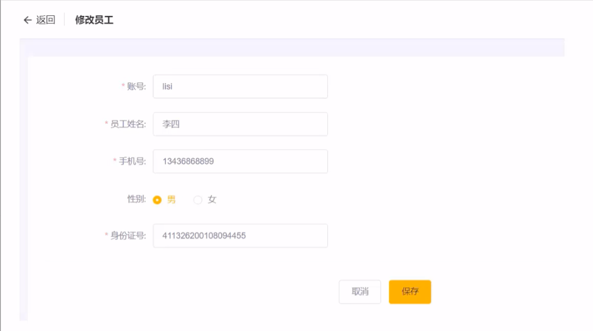

### 代码开发

在开发代码之前需要梳理一下操作过程和对应的程序的执行流程:

1、点击编辑按钮时，页面跳转到 add.html，并在 url 中携带参数[员工 id]

2、在 add.html 页面获取 url 中的参数[员工 id]

3、发送 ajax 请求，请求服务端，同时提交员工 id 参数

4、服务端接收请求，根据员工 id 查询员工信息，将员工信息以 json 形式响应给页面

```java
//根据id查询员工信息
@GetMapping("/{id}")
public R<Employee> getById(@PathVariable String id){
    log.info("根据id查对象");
    Employee emp = employeeService.getById(id);
    if(emp!=null){
        return R.success(emp);
    }
    return R.error("没有查询到该用户信息");
}
```

5、页面接收服务端响应的 json 数据，通过 VUE 的数据绑定进行员工信息回显

6、点击保存按钮，发送 ajax 请求，将页面中的员工信息以 json 方式提交给服务端

7、服务端接收员工信息，并进行处理，完成后给页面响应

8、页面接收到服务端响应信息后进行相应处理

**注意**:add.html 页面为公共页面，**新增员工和编辑员工都是在此页面操作**，所以该代码部分与之前添加员工代码对应，不需要重写。
