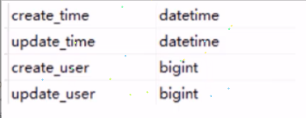
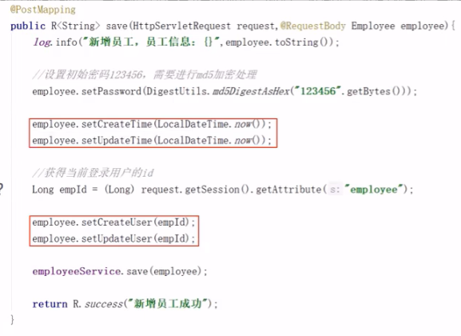
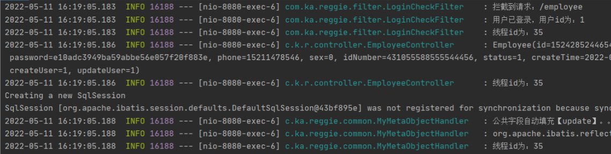
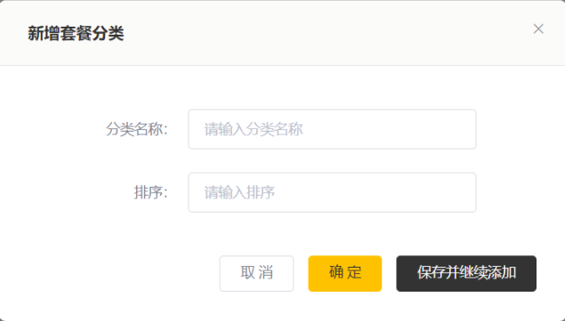
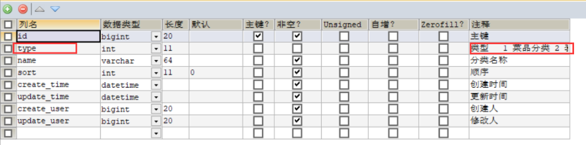
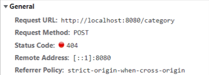
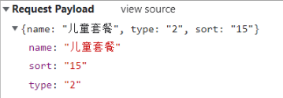
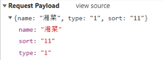
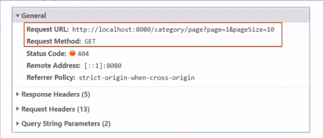
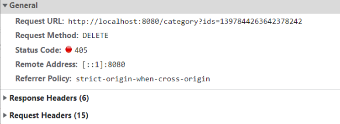

# Reggie 开发笔记 三

[[TOC]]

## 分类管理业务开发

### 公共字段自动填充

#### 问题分析

前面我们已经完成了后台系统的员工管理功能开发，在新增员工时需要设置创建时间、创建人、修改时间、修改人等字段，在编辑员工时需要设置修改时间和修改人等字段。这些字段属于公共字段，也就是很多表中都有这些字段，如下:



能不能对于这些公共字段在某个地方统一处理，来简化开发呢?答案就是使用 Mybatis Plus 提供的**公共字段自动填充**功能。

#### 代码实现

Mybatis Plus 公共字段自动填充，也就是在插入或者更新的时候为指定字段赋予指定的值，使用它的好处就是可以统一对这些字段进行处理，避免了重复代码。

实现步骤:

1、在实体类的属性上加入@TableField 注解，指定自动填充的策略

```java
@TableField(fill = FieldFill.INSERT)//插入时填充字段
private LocalDateTime createTime;

@TableField(fill = FieldFill.INSERT_UPDATE)//插入和更新时填充字段
private LocalDateTime updateTime;

@TableField(fill = FieldFill.INSERT)
private Long createUser;

@TableField(fill = FieldFill.INSERT_UPDATE)
private Long updateUser;
```

2、按照框架要求编写元数据对象处理器，在此类中统一为公共字段赋值，此类需要实现 MetaObjectHandler 接口

```java
@Component
@Slf4j
public class MyMetaObjectHandler implements MetaObjectHandler {
    //插入时自动填充
    @Override
    public void insertFill(MetaObject metaObject) {
        log.info("公共字段自动填充【insert】。。。");
        log.info(metaObject.toString());
        metaObject.setValue("createTime", LocalDateTime.now());
        metaObject.setValue("updateTime", LocalDateTime.now());
        metaObject.setValue("createUser",new Long(1));
        metaObject.setValue("updateUser",new Long(1));
    }
    //更新时自动填充
    @Override
    public void updateFill(MetaObject metaObject) {
        log.info("公共字段自动填充【update】。。。");
        log.info(metaObject.toString());
        metaObject.setValue("updateTime",LocalDateTime.now());
        metaObject.setValue("updateUser",new Long(1));
    }
}
```

#### 功能完善

前面我们已经完成了公共字段自动填充功能的代码开发，但是还有一个问题没有解决，就是我们在自动填充 createUser 和 updateUser 时设置的用户 id 是固定值，现在我们需要改造成动态获取当前登录用户的 id。

有的同学可能想到，用户登录成功后我们将用户 id 存入了 HttpSession 中，现在我从 HttpSession 中获取不就行了?

**注意**，我们在 MyMetaObjectHandler 类中是不能获得 HttpSession 对象的，所以我们需要通过其他方式来获取登录用户 id。

可以使用**ThreadLocal**来解决此问题,它是 JDK 中提供的一个类。

在学习 ThreadLocal 之前，我们需要先确认一个事情，**就是客户端发送的每次 http 请求，对应的在服务端都会分配一个新的线程来处理**，在处理过程中涉及到下面类中的方法**都属于相同的一个线程**:

1、LoginCheckFilter 的 doFilter 方法

2、EmployeeContraller 的 update 方法

3、MyMetaObjectHandler 的 updateFill 方法

可以在上面的三个方法中分别加入下面代码（获取当前线程 id):

```java
long id = Thread.currentThread().getId() ;
log.info("线程id:{}" ,id);
```

执行编辑员工功能进行验证，通过观察控制台输出可以发现，一次请求对应的线程 id 是相同的:



**什么是 ThreadLocal?**

ThreadLocal 并不是一个 Thread，而是 Thread 的局部变量。当使用 ThreadLocal 维护变量时，ThreadLocal 为每个使用该变量的线程提供独立的变量副本，所以每一个线程都可以独立地改变自己的副本，而不会影响其它线程所对应的副本。
ThreadLocal 为每个线程提供单独一份存储空间，具有线程隔离的效果，只有在线程内才能获取到对应的值，线程外则不能访问。

ThreadLocal 常用方法：

- public void set(T value) 设置当前线程局部变量的值
- public T get() 返回当前线程所对应的线程局部变量的值

我们可以在 LoginCheckFilter 的 doFilter 方法中获取当前登录用户 id，并调用 ThreadLocal 的 set 方法来设置当前线程的线程局部变量的值（用户 id)，然后在 MyMetaObjectHandler 的 updateFill 方法中调用 ThreadLocal 的 get 方法来获得当前线程所对应的线程局部变量的值(用户 id)。

**实现步骤:**

1、编写 BaseContext 工具类，基于 ThreadLocal 封装的工具类

```csharp
/**
 * 基于ThreadLocal封装的工具类，用于保存和获取当前登录用户的id
 */
public class BaseContext {
    private static ThreadLocal<Long> threadLocal=new ThreadLocal<>();

    public static void setCurrentId(Long id){
        threadLocal.set(id);
    }

    public static Long getCurrentId(){
        return threadLocal.get();
    }
}
```

2、在 LogincheckFilter 的 doFilter 方法中调用 BaseContext 来设置当前登录用户的 id

```java
if (request.getSession().getAttribute("employee") != null) {
    log.info("用户已登录，用户id为：{}", request.getSession().getAttribute("employee"));

    Long empId= (Long) request.getSession().getAttribute("employee");

    BaseContext.setCurrentId(empId);

    filterChain.doFilter(request, response);
    return;
}
```

3、在 MyMeta0bjectHandler 的方法中调用 BaseContext 获取登录用户的 id

```java
@Component
@Slf4j
public class MyMetaObjectHandler implements MetaObjectHandler {
    //插入时自动填充
    @Override
    public void insertFill(MetaObject metaObject) {
        log.info("公共字段自动填充【insert】。。。");
        log.info(metaObject.toString());
        metaObject.setValue("createTime", LocalDateTime.now());
        metaObject.setValue("updateTime", LocalDateTime.now());
        metaObject.setValue("createUser",BaseContext.getCurrentId());
        metaObject.setValue("updateUser",BaseContext.getCurrentId());
    }
    //更新时自动填充
    @Override
    public void updateFill(MetaObject metaObject) {
        log.info("公共字段自动填充【update】。。。");
        log.info(metaObject.toString());

        metaObject.setValue("updateTime",LocalDateTime.now());
        metaObject.setValue("updateUser",BaseContext.getCurrentId());
    }
}
```

### 新增分类

#### 需求分析

后台系统中可以管理分类信息，分类包括两种类型，分别是菜品分类和套餐分类。当我们在后台系统中添加菜品时需要选择一个菜品分类，当我们在后台系统中添加一个套餐时需要选择一个套餐分类，在移动端也会按照菜品分类和套餐分类来展示对应的菜品和套餐。




#### 数据模型

新增分类，其实就是将我们新增窗口录入的分类数据插入到 category 表，表结构如下:



#### 代码开发

在开发业务功能前，先将需要用到的类和接口基本结构创建好:

- 实体类 Category(直接从课程资料中导入即可)

```java
@Data
public class Category implements Serializable {

    private static final long serialVersionUID = 1L;

    private Long id;


    //类型 1 菜品分类 2 套餐分类
    private Integer type;


    //分类名称
    private String name;


    //顺序
    private Integer sort;


    //创建时间
    @TableField(fill = FieldFill.INSERT)
    private LocalDateTime createTime;


    //更新时间
    @TableField(fill = FieldFill.INSERT_UPDATE)
    private LocalDateTime updateTime;


    //创建人
    @TableField(fill = FieldFill.INSERT)
    private Long createUser;


    //修改人
    @TableField(fill = FieldFill.INSERT_UPDATE)
    private Long updateUser;


    //是否删除
    private Integer isDeleted;

}
```

- Mapper 接口 CategoryMapper

```java
@Mapper
public interface CategoryMapper extends BaseMapper<Category> {
}
```

- 业务层接口 CategoryService

```java
public interface CategoryService extends IService<Category> {
}
```

- 业务层实现类 CategoryServicelmpl

```java
@Service
public class CategoryServicelmpl extends ServiceImpl<CategoryMapper, Category> implements CategoryService {
}
```

- 控制层 CategoryController

```java
@Slf4j
@RestController
@RequestMapping("/category")
public class CategoryController {
    @Autowired
    private CategoryService categoryService;
}
```

在开发代码之前，需要梳理一下整个程序的执行过程:

1、页面(backend/page/category/list.html)发送 ajax 请求，将新增分类窗口输入的数据以 json 形式提交到服务端

2、服务端 Controller 接收页面提交的数据并调用 Service 将数据进行保存

3、Service 调用 Mapper 操作数据库，保存数据

可以看到新增菜品分类和新增套餐分类请求的服务端地址和提交的 json 数据结构相同，所以服务端只需要提供一个方法统一处理即可




```java
//新增分类
@PostMapping
public R<String> save(@RequestBody Category category){
    log.info("category:{}",category);
    categoryService.save(category);
    return R.success("新增分类成功");
}
```

### 分类信息分页查询

#### 需求分析

系统中的分类很多的时候，如果在一个页面中全部展示出来会显得比较乱，不便于查看，所以一般的系统中都会以分页的方式来展示列表数据。

#### 代码开发

在开发代码之前，需要梳理一下整个程序的执行过程:

1、页面发送 ajax 请求，将分页查询参数(page.pageSize)提交到服务端

2、服务端 Controller 接收页面提交的数据并调用 Service 查询数据

3、Service 调用 Mapper 操作数据库，查询分页数据

4、Controller 将查询到的分页数据响应给页面

5、页面接收到分页数据并通过 ElementUI 的 Table 组件展示到页面上


```java
@GetMapping("/page")
public R<Page> page(int page, int pageSize) {
    //构造分页构造器
    Page<Category> pageInfo=new Page<>(page,pageSize);
    //构造条件构造器
    LambdaQueryWrapper<Category> queryWrapper=new LambdaQueryWrapper<>();
    //添加排序条件，根据sort进行排序
    queryWrapper.orderByAsc(Category::getSort);
    //进行分页查询
    categoryService.page(pageInfo,queryWrapper);

    return R.success(pageInfo);
}
```

**注意**：要把 Category 中的`private Integer isDeleted;`注释掉才能查询到数据

### 删除分类

#### 需求分析

在分类管理列表页面，可以对某个分类进行删除操作。需要注意的是当分类关联了菜品或者套餐时，此分类不允许删除。

#### 代码开发

在开发代码之前，需要梳理一下整个程序的执行过程:

1、页面发送 ajax 请求，将参数(id)提交到服务端


2、服务端 Controller 接收页面提交的数据并调用 Service 删除数据

3、Service 调用 Mapper 操作数据库

```java
//根据id删除分类
@DeleteMapping
public R<String> delete(Long ids){
    log.info("删除分类，id为{}",ids);
    categoryService.removeById(ids);
    //代码完善之后categoryService.remove(ids);
    return R.success("分类信息删除成功");
}
```

#### 代码完善

前面我们已经实现了根据 id 删除分类的功能，但是并没有检查删除的分类是否关联了菜品或者套餐，所以我们需要进行功能完善。

要完善分类删除功能，需要先准备基础的类和接口:

1、实体类 Dish 和 Setmeal （从课程资料中复制即可)

```java
@Data
public class Dish implements Serializable {

    private static final long serialVersionUID = 1L;

    private Long id;


    //菜品名称
    private String name;


    //菜品分类id
    private Long categoryId;


    //菜品价格
    private BigDecimal price;


    //商品码
    private String code;


    //图片
    private String image;


    //描述信息
    private String description;


    //0 停售 1 起售
    private Integer status;


    //顺序
    private Integer sort;


    @TableField(fill = FieldFill.INSERT)
    private LocalDateTime createTime;


    @TableField(fill = FieldFill.INSERT_UPDATE)
    private LocalDateTime updateTime;


    @TableField(fill = FieldFill.INSERT)
    private Long createUser;


    @TableField(fill = FieldFill.INSERT_UPDATE)
    private Long updateUser;


    //是否删除
    private Integer isDeleted;

}
@Data
public class Setmeal implements Serializable {

    private static final long serialVersionUID = 1L;

    private Long id;


    //分类id
    private Long categoryId;


    //套餐名称
    private String name;


    //套餐价格
    private BigDecimal price;


    //状态 0:停用 1:启用
    private Integer status;


    //编码
    private String code;


    //描述信息
    private String description;


    //图片
    private String image;


    @TableField(fill = FieldFill.INSERT)
    private LocalDateTime createTime;


    @TableField(fill = FieldFill.INSERT_UPDATE)
    private LocalDateTime updateTime;


    @TableField(fill = FieldFill.INSERT)
    private Long createUser;


    @TableField(fill = FieldFill.INSERT_UPDATE)
    private Long updateUser;


    //是否删除
    private Integer isDeleted;
}
```

2、Mapper 接口 DishMapper 和 SetmealMapper

```java
@Mapper
public interface DishMapper extends BaseMapper<Dish> {
}
@Mapper
public interface SetmealMapper extends BaseMapper<Setmeal> {
}
```

3、Service 接口 DishService 和 SetmealService

```java
public interface DishService extends IService<Dish> {
}
public interface SetmealService extends IService<Setmeal> {
}
```

4、Service 实现类 DishServicelmpl 和 SetmealServicelmpl

```java
@Service
public class DishServiceImpl extends ServiceImpl<DishMapper, Dish> implements DishService {
}
@Service
public class SetmealServiceImpl extends ServiceImpl<SetmealMapper, Setmeal> implements SetmealService{
}
```

#### 关键代码

- 在 CategoryService 添加 remove 方法

```java
public interface CategoryService extends IService<Category> {
    public void remove(Long id);
}
```

- 在 CategoryServicelmpl 实现 remove 方法

```java
@Service
public class CategoryServicelmpl extends ServiceImpl<CategoryMapper, Category> implements CategoryService {

    @Autowired
    private DishService dishService;

    @Autowired
    private SetmealService setmealService;

    @Override
    public void remove(Long id) {
        LambdaQueryWrapper<Dish> dishLambdaQueryWrapper=new LambdaQueryWrapper<>();
        //添加查询条件，根据分类id进行查询
        dishLambdaQueryWrapper.eq(Dish::getCategoryId,id);
        int count1 = dishService.count(dishLambdaQueryWrapper);

        //查询当前分类是否关联菜品,如果已经关联，抛出业务异常
        if(count1>0){
            //已经关联菜品，抛出业务异常
            throw new CustomException("已经关联菜品，不能删除");
        }

        //查询当前分类是否关联了套餐，如果已经关联，抛出业务异常
        LambdaQueryWrapper<Setmeal> setmealLambdaQueryWrapper=new LambdaQueryWrapper<>();
        //添加查询条件，根据分类id进行查询
        setmealLambdaQueryWrapper.eq(Setmeal::getCategoryId,id);
        int count2 = setmealService.count(setmealLambdaQueryWrapper);

        if(count2>0){
            //已经关联套餐，抛出业务异常
            throw new CustomException("已经关联套餐，不能删除");
        }
        //正常删除分类
        super.removeById(id);
    }
}
```

- 定义异常类 CustomException

```java
public class CustomException extends RuntimeException{
    public CustomException(String message){
        super(message);
    }
}
```

- 在全局异常处理器**GlobalExceptionHandler**添加

```java
//进行异常处理方法
@ExceptionHandler(CustomException.class)
public R<String> exceptionHandler(CustomException ex){
    log.error(ex.getMessage());

    return R.error(ex.getMessage());
}
```

### 修改分类

#### 需求分析

在分类管理列表页面点击修改按钮，弹出修改窗口，在修改窗口回显分类信息并进行修改，最后点击确定按钮完成修改操作

#### 代码实现

```java
//修改分类
@PutMapping
public R<String> update(@RequestBody Category category){
    categoryService.updateById(category);
    return R.success("分类修改成功");
```
